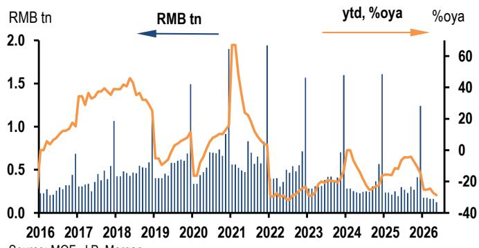
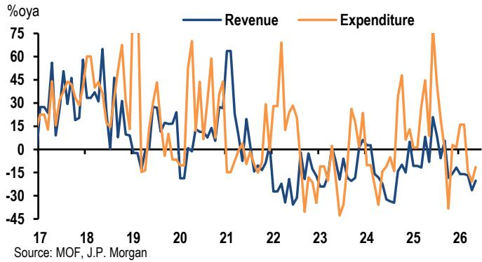
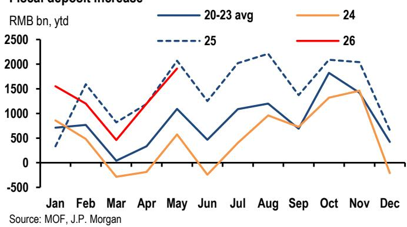

# China's Fiscal Slowdown Is a Strategic Pause, Not a Policy Failure

The narrative that China's fiscal machinery is broken misses the point. Through May, the government's fiscal deposits rose to the second-highest level for that month in over a decade, while general budget expenditure remained in contraction and infrastructure outlays fell by 12% year-on-year. This is not evidence of paralysis. It is evidence of deliberate sequencing. The data reveals a government that front-loaded little, saved its powder, and is now preparing a two-stage fiscal deployment that will define the second half of the year. The critical question is not whether Beijing will spend, but under what conditions it will spend more than already budgeted.

The pattern through May is unambiguous. Revenue has been resilient, with headline general budget revenue growing 6.6% in May and tax revenue rising 6.8%, led by a surge in securities trading stamp duty. Yet expenditure has stayed in contraction for two consecutive months. This disconnect is the defining feature of the current fiscal stance. It reflects a deliberate choice: maintain revenue collection, hold spending in reserve, and wait for the right moment to deploy. The result is a growing stock of fiscal deposits that provides ample ammunition for the second half of the year.

Why now matters is because the market is misreading the signal. The continued decline in fixed asset investment and the sharp contraction in land sales have led many to conclude that fiscal policy is ineffective or constrained. The reality is more strategic. The government is conserving its fiscal space precisely because it anticipates a growth slowdown in the current quarter. The strong first-quarter GDP print, boosted by energy sector dynamics, gave policymakers room to be patient. That patience is now ending.

## The Infrastructure Spending Gap Reveals a Project Pipeline Problem, Not a Lack of Fiscal Will

The most striking data point in the May fiscal report is the 12% year-on-year decline in infrastructure-related expenditure. This is not a small miss. It is a deep contraction that directly explains the weakness in infrastructure fixed asset investment, which fell 9.4% year-on-year, and public fixed asset investment, which dropped 8.9%. When the government is not spending on infrastructure, the economy feels it immediately.

The instinct is to blame fiscal conservatism or bureaucratic inertia. But the pattern suggests a more structural bottleneck. The government has the money. Fiscal deposits are high. Special local government bond issuance rebounded to nearly 500 billion yuan month-to-date in June, signaling a reactive acceleration. The problem is the lag between bond issuance and the deployment of proceeds to actual projects. This lag is not new. It reflects a limited pipeline of eligible projects, a greater priority on debt repayment at the local level, and the slow rollout of policy-bank tools as seed capital for new initiatives.

The implication is straightforward: the infrastructure spending gap will not close simply because the government decides to spend more. It will close only when the project pipeline is rebuilt and local governments shift their priority from debt reduction to investment. That shift is underway, but it is happening more slowly than the macro data would suggest is necessary. The second-half recovery in infrastructure investment depends on whether this pipeline problem is resolved in the coming weeks, not whether the government has the fiscal room to act.

## Land Sales Contraction Is Deepening, and the Fiscal Drag Is Now Structural, Not Cyclical

Outside the general budget, the government-managed funds account tells a bleaker story. Fund revenue dropped 20.3% year-on-year in May, as the decline in land sales deepened further to 35.8%. This is an acceleration from the 14.7% decline recorded for the full year of 2025. The land market is not stabilizing. It is deteriorating.

The significance of this goes beyond the property sector. Government-managed funds are now the largest financing source among fund accounts, and they remain heavily dependent on land-sale revenue. When land sales contract, local government revenue contracts with them. This creates a direct constraint on local spending capacity, even if the central government is willing to provide support. The expenditure side of the fund account fell 11.5% in May, reflecting this revenue constraint.

This is not a cyclical downturn that will reverse with a policy tweak. The housing and land downturn has fundamentally altered the local government financing model. The old system, in which land sales provided a reliable and growing revenue stream, is broken. The new system, which would rely more on general budget transfers, local taxes, and special bond proceeds, is still being built. In the transition period, local governments are caught between declining land revenue and the need to maintain spending. The result is a structural drag on fiscal capacity that will persist even as the central government accelerates its own spending.

The question this raises is whether the central government will need to provide direct fiscal transfers to local governments to compensate for the land revenue shortfall. The current budget assumes a certain level of land-sale revenue, but that assumption is proving increasingly unrealistic. If the shortfall is large enough, the central government may need to revise its budget mid-year or provide supplementary funding. This is one of the key unresolved questions that the May data raises but does not answer.

## The Two-Stage Fiscal Path Means the First Half Is About Execution, the Second Half About Conditionality

The most useful framework for understanding the current fiscal stance is the two-stage path that the report outlines. Stage one is about execution. The government has already received approval from the National People's Congress for its budget. The task now is to deploy those approved funds. This means accelerating government bond issuance, speeding up the deployment of proceeds to projects, and drawing down the fiscal deposits that have accumulated. The June pickup in special local government bond issuance is a sign that stage one is beginning in earnest.

Stage two is conditional. If the second-quarter growth slowdown persists and the economy undershoots the 4.5 to 5 percent full-year target range, the case for additional fiscal support in the second half strengthens significantly. This is where the policy patience of the first half becomes strategically valuable. By conserving fiscal space now, the government has given itself the option to provide additional stimulus later, precisely when it may be most needed.

The conditionality is important because it changes the risk assessment for investors. The base case is that the government executes its approved budget and that growth stabilizes in the second half. In this scenario, no additional stimulus is needed, and fiscal deposits will be drawn down gradually. The upside case is that growth weakens further and the government provides additional support, which would be positive for risk assets but negative for bond yields. The downside case is that growth weakens and the government does not provide additional support, either because the target range gives it flexibility or because it judges the slowdown to be temporary.

Investors should not assume that additional stimulus is automatic. The 4.5 to 5 percent target range is wider than in prior years, giving policymakers more discretion. They may choose to tolerate a temporary undershoot rather than commit to further fiscal expansion. This is the analytical tension at the heart of the current outlook.

## What the Report Does Not Fully Answer: The Interaction Between Fiscal and Monetary Policy

The report is clear on the fiscal data and the likely path of fiscal deployment. It is less clear on how fiscal policy will interact with monetary policy in the second half. This is a critical gap because the effectiveness of fiscal stimulus depends heavily on the monetary conditions under which it is deployed.

If the government accelerates bond issuance and draws down fiscal deposits, this will inject liquidity into the banking system. The central bank will need to decide whether to offset this liquidity injection or allow it to pass through to lower funding costs. If it chooses to offset, the fiscal stimulus may be neutralized by tighter monetary conditions. If it allows the liquidity to flow through, the combined effect could be significantly more expansionary.

The report also does not address the exchange rate implications of a large fiscal expansion. If the government provides additional stimulus and the economy stabilizes, the renminbi could strengthen. But if the stimulus is seen as a sign of underlying weakness, the currency could come under pressure. The interaction between fiscal expansion, monetary policy, and the exchange rate is one of the most important variables for global investors, and it remains under-analyzed in the current data.

## A Decision Framework for Investors: Three Questions to Determine the Fiscal Outlook

For investors trying to position for the second half, the fiscal data points to three questions that will determine the outcome.

First, is the project pipeline improving? The infrastructure spending gap will not close unless local governments have projects ready to go. Watch for announcements of new project approvals and for the pace at which special bond proceeds are deployed to actual construction. If the pipeline remains thin, the spending recovery will be slow regardless of how much fiscal space the government has.

Second, is the land sales contraction accelerating or stabilizing? If land sales continue to decline at a 30 to 40 percent annual rate, local government revenue will remain under severe pressure, and the central government may need to provide direct transfers. If the decline stabilizes, the pressure on local finances will ease, and the current budget may be sufficient.

Third, what is the central bank doing? The fiscal data is only half the story. The other half is whether monetary policy is accommodative enough to allow fiscal stimulus to work. Watch for changes in reserve requirements, policy rates, and the central bank's approach to managing the government bond yield curve. If monetary policy is tightening, even aggressive fiscal spending may not generate the growth impulse that the data suggests.

These three questions provide a framework for assessing the fiscal outlook without relying on a single data point or a single forecast. They allow investors to update their views as new information becomes available.

Join the community to read the full report and review the original charts.

*This article is for learning and discussion only and does not constitute investment advice.*

Personal reading notes and learning share only. Not investment advice.

