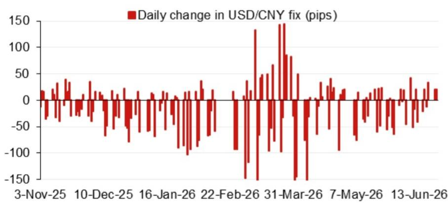
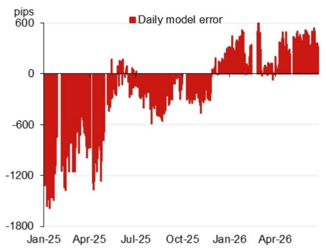

# NOM：人民币中间价模型释放了一个被忽视的鸽派信号

市场对人民币汇率的讨论，大多集中在央行意图、中美利差和出口表现上。但一份来自NOM亚洲外汇策略团队的模型报告，提供了一个更底层、更量化的观察视角：人民币每日中间价的定价机制本身，正在发出值得关注的信号。

这份报告的核心判断是：**NOM的人民币中间价模型显示，当前中间价的设定存在系统性偏低，且逆周期因子已显著收窄。** 这并不意味着央行在主动引导贬值，而是意味着在当前的定价框架下，市场力量正在发挥更大作用，而政策干预的边际成本正在上升。

对于关注宏观对冲、跨境资产配置和汇率风险管理的读者来说，理解这个“模型信号”比猜测“央行意图”更具实际意义。因为前者是可量化、可追踪的，后者则往往被噪音覆盖。

## 1. 模型投影的“意外下修”，暗示了中间价形成机制的变化

NOM模型在6月24日的最新投影为6.7910，较前值6.8171低了261个基点。这一数字本身并非关键，关键在于它与官方实际中间价之间的差距，以及这种差距的演变趋势。

模型投影是NOM基于其预设的定价因子（包括前日收盘价、一篮子货币变动、央行政策倾向等）计算出的“理论中间价”。当实际中间价显著低于模型投影时，通常意味着央行在主动引导汇率走弱；反之，则意味着央行在支撑汇率。

但报告提供的图2（模型误差走势图）显示，近期的模型误差正在收窄，甚至出现方向性逆转。这指向一个更值得关注的结论：**央行对中间价的干预力度在减弱，市场化的定价因子权重在上升。**

> **KC评论：** 很多市场参与者过度关注“央行是否在引导贬值”这个模糊问题。NOM模型提供了一个更精确的观察框架：不是看央行“想”做什么，而是看“实际”中间价与“模型”中间价的偏差。偏差缩小，意味着市场定价权在回归。完整报告中包含了模型误差的历史走势图，能清晰看到这种结构性变化是从何时开始的，以及背后的驱动因子是什么。

## 2. 逆周期因子显著收窄，政策工具箱的优先级正在改变

报告特别指出，当加入逆周期因子后，模型投影变为6.8025，仅比前值低146个基点。这意味着，逆周期因子本身起到了显著的“缓冲”作用，但其调整幅度本身也在收窄。

逆周期因子是央行用来对冲市场顺周期行为、稳定汇率预期的重要工具。当该因子数值较大时，说明央行在主动干预；当它收窄时，说明央行对市场波动的容忍度在提高。

这份报告传递的信号是：**央行正在从“强力干预”模式转向“有限干预、更多依靠市场”的模式。** 这背后的逻辑可能包括：外部压力（如中美关系）阶段性缓和、内部经济复苏需要更灵活的汇率环境，以及央行对人民币汇率弹性的信心增强。

对于投资者而言，这意味着未来人民币汇率的波动性可能加大，但方向性趋势将更多由经济基本面而非政策指令决定。

## 3. 报告没有完全回答的关键问题：这种“干预退坡”是主动选择还是被动接受？

这是整份报告最值得追问的地方，也是NOM模型无法直接回答的问题。

一种可能是，央行主动选择减少干预，以换取更灵活的货币政策空间，或者为即将到来的政治议程（如7月政治局会议、APEC峰会）营造更平稳的宏观环境。另一种可能是，央行正在被动接受市场力量，因为干预的成本（如外汇储备消耗、利率传导效率损失）已经超过了收益。

模型本身只能描述“发生了什么”，无法解释“为什么发生”。但这个问题的答案，直接决定了未来人民币汇率的走势路径。如果是前者，汇率可能在可控范围内双向波动；如果是后者，一旦市场形成单边预期，央行可能被迫重新加大干预。

> **KC评论：** 这是所有量化模型的天花板——它告诉你“是什么”，但无法告诉你“为什么”。要回答这个问题，需要结合中国的内部经济数据（如信贷脉冲、通胀压力）和外部地缘政治环境（如中美会谈进展）。报告中的日历（图4）列出了7月政治局会议、APEC峰会等关键事件，这些时点可能是判断央行意图的重要窗口。完整报告对这些事件与汇率政策联动性的分析，值得仔细研读。

## 4. 对资产定价的隐含含义：汇率弹性上升，可能改变所有人民币资产的定价逻辑

如果NOM模型的判断成立——即人民币中间价的定价机制正在向市场化倾斜——那么这一变化的影响将远超外汇市场本身。

首先，对于A股和港股投资者，汇率弹性上升意味着外资流动的波动性可能加大。过去，稳定的汇率预期是外资配置中国资产的重要前提。一旦汇率波动加剧，外资的流入节奏和规模都可能受到影响。

其次，对于跨境贸易企业，汇率风险管理的重要性将进一步提升。过去依赖央行“维稳”的套利策略可能失效，企业需要更主动地进行对冲。

最后，对于宏观策略投资者，人民币汇率与中美利差、出口竞争力的关系将变得更加复杂。市场化定价意味着汇率将更灵敏地反映经济基本面，而不是政策意图。

## 5. 一个值得持续跟踪的观察框架：如何利用模型误差判断市场情绪

这份报告提供了一个实用的工具：关注“模型误差”的连续变化。

- 如果模型误差持续为正且扩大，说明央行在主动引导汇率走弱，市场情绪可能偏悲观。
- 如果模型误差持续为负且扩大，说明央行在支撑汇率，市场情绪可能过度悲观。
- 如果模型误差收窄或转正，说明央行干预减弱，市场定价权回归。

当前，模型误差的收窄暗示了央行对市场力量的认可。但这一趋势能否持续，取决于后续的经济数据和外部事件。投资者可以将这个框架纳入自己的宏观监测体系，每周或每月追踪一次，比单纯猜测“央行意图”更具操作性。

## 6. 报告尚未展开的更深层问题：人民币汇率定价机制改革的长期方向

NOM的这份模型报告聚焦于短期定价，但它触及了一个更根本的问题：人民币汇率形成机制的市场化改革，到底走到了哪一步？

从2015年“8·11汇改”至今，人民币汇率定价机制经历了多次调整。每一次调整都伴随着市场波动和政策博弈。当前，中间价定价机制中“逆周期因子”的权重下降，是否意味着改革正在重启？还是说，这只是特定外部环境下的权宜之计？

这个问题没有标准答案，但它是所有长期投资者必须思考的。如果改革方向是坚定的，那么当前的市场化定价就是长期趋势的预演；如果只是权宜之计，那么一旦外部环境恶化，干预可能随时回归。

这份NOM报告的价值，恰恰在于它用模型和数据，为这个宏大问题提供了一个具体的、可验证的观测点。

---

关于人民币汇率定价机制的更多细节，包括模型误差的历史走势图、逆周期因子的具体计算方法，以及NOM对下半年关键事件（7月政治局会议、APEC峰会、中央经济工作会议）的汇率政策推演，都在完整报告中。

我们每天会由AI agent与人工review，生成国际投行中文摘要与KC评论，daily更新约10-40页，并整理当天最新数据图表合集，方便喂给AI，也方便人工快速把握market dynamics。欢迎来星球微信群里继续讨论。

Personal reading notes and learning share only. Not investment advice.

