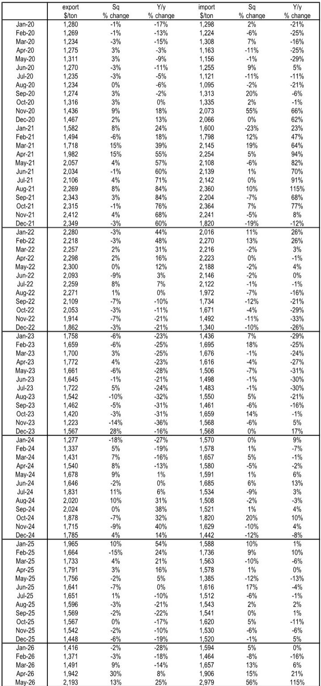
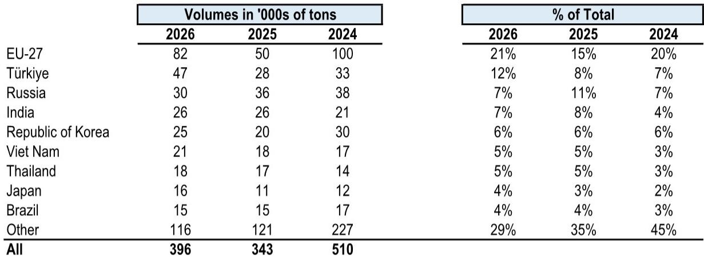
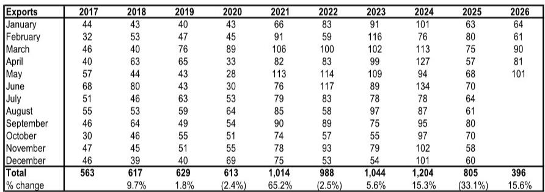

# JPM：中国MDI出口量价齐升，欧洲市场正成为新的定价锚

中国化工品出口正在经历一场静悄悄的结构性转变。JPM最新发布的MDI（二苯基甲烷二异氰酸酯）贸易数据显示，2026年5月中国MDI出口量达到10.1万吨，同比飙升49%，出口均价环比上涨13%、同比上涨25%。这不是一次简单的周期性反弹——出口流向的重新布局和定价能力的恢复，正在改写全球MDI的竞争规则。

这份由Jeffrey J. Zekauskas领衔的研报揭示了一个关键信号：在中国出口总量尚未恢复到2024年峰值水平的情况下，出口价格已经率先突破。5月MDI出口均价达到2193美元/吨，不仅是近两年来的最高水平，更意味着中国供应商正在从“以量换价”转向“以价换量”的新阶段。

对于关注化工板块的投资者而言，这份数据最重要的判断是：全球MDI的供需再平衡正在加速，而定价权正在向供给端倾斜。2025年全年中国MDI净出口仅为40万吨，较2024年大幅下降49.6万吨，但进入2026年，前五个月净出口已达到25.8万吨，同比增长5.5万吨。这个拐点意味着什么？中国MDI出口的“量价双杀”阶段已经结束，取而代之的是“量价齐升”的新周期。

> **KC评论：** 这份报告的核心价值不在于告诉你5月数据好，而在于揭示了一个关键转折——中国MDI出口价格连续两个月大幅回升，而同期出口量也在加速。这说明下游需求确实在恢复，而不仅仅是供给端的主动收缩。完整报告中的Table 4提供了长达六年的月度价格序列，值得仔细对比。

---

## 1. 欧洲正取代美国成为中国MDI出口的第一增量市场

2025年，中国对美国的MDI出口同比下降了83%，这是一个几乎断崖式的下滑。但与此同时，对欧盟27国的出口却在快速回升。2026年前五个月，中国对欧盟的MDI出口量达到8.2万吨，占出口总量的21%，较2025年同期的5万吨增长了63%。

这一结构性变化并非偶然。2025年中国MDI出口总量仅为80.5万吨，较2024年的120.4万吨下降了33%，其中对美国和荷兰的出口降幅最为显著。但进入2026年，出口恢复的路径清晰指向了欧洲市场。除欧盟外，对土耳其的出口也从2.8万吨增长至4.7万吨，增幅达68%。

这意味着什么？全球MDI的贸易流向正在被地缘政治和供应链重组重新定义。美国市场的大门在收窄，但欧洲市场正在为中国供应商打开一扇更大的窗。

> **KC评论：** 需要关注的是，中国对欧洲的出口增长是否可持续。欧洲本土MDI产能的开工率、能源成本以及反倾销政策风险，都是影响这一趋势的关键变量。完整报告的Table 3按目的地拆分了出口数据，可以清楚看到每个市场的份额变化，这是判断趋势可持续性的基础。

---

## 2. 出口均价回升25%，定价权的转移才刚刚开始

5月MDI出口均价2193美元/吨，环比上涨13%，同比上涨25%。更值得关注的是进口价格的变化——5月中国MDI进口均价达到2979美元/吨，环比暴涨56%，同比飙升115%。

进出口价差的扩大是一个极其重要的信号。通常，中国作为全球最大的MDI生产国，出口价格低于进口价格是常态，但5月两者之间的价差扩大到786美元/吨，这是近年来罕见的水平。这说明全球高端MDI市场仍然供不应求，而中国供应商正在利用这一价差获取更高的出口利润。

回顾2024年，中国MDI出口均价从年初的1277美元/吨一路攀升至8月的2020美元/吨，随后有所回落。进入2025年，均价一度跌至1416美元/吨的低点，但自2026年3月以来连续三个月大幅反弹。这种V型反转的背后，是全球MDI产能投放节奏放缓和下游需求复苏的双重驱动。

---

## 3. 2025年的出口收缩并非需求问题，而是供给端的主动调整

2025年中国MDI出口量同比下降33%，净出口从2024年的89.6万吨骤降至40万吨。乍看之下，这似乎是需求疲软的信号。但结合2026年以来的数据，JPM的分析指向了另一种解释：2025年的收缩更多是供给端主动调整的结果。

从历史数据看，2025年的出口量（80.5万吨）甚至低于2021年（101.4万吨）和2022年（98.8万吨）的水平，但2026年前五个月的出口量（39.6万吨）已经同比恢复15.6%。如果这一趋势持续，2026年全年出口量有望回到100万吨以上。

值得注意的是，2025年进口量反而增长了31.4%，达到40.5万吨。这意味着国内需求并未大幅萎缩，而是国内供应商在2025年主动减少了出口，以应对价格低迷和贸易摩擦。进入2026年，随着价格回升，出口动力重新被激活。

> **KC评论：** 报告没有直接讨论的另一个维度是，2025年出口收缩是否与国内MDI企业的检修周期有关。完整报告中的Table 1提供了2017年以来的完整月度出口数据，可以结合产能利用率数据做更深入的交叉验证。这也是为什么我们建议读者仔细阅读原始图表——很多关键判断需要自己从数据中推导。

---

## 4. 报告尚未完全回答的关键问题：欧洲市场的承接能力能持续多久？

尽管5月数据亮眼，但JPM这份报告并未对欧洲市场的可持续性给出明确判断。这恰恰是当前最大的不确定性。

一方面，欧洲本土MDI产能受能源成本高企和环保政策收紧的影响，开工率长期偏低，为中国出口提供了替代空间。另一方面，欧盟对中国化工品的反倾销调查从未停止。2025年中国对欧洲的MDI出口一度大幅下滑，部分原因正是贸易摩擦的干扰。

另一个未解的问题是：中国MDI出口均价的上涨是否已经充分反映了成本端的推动？5月出口均价2193美元/吨，虽然较2024年低点大幅回升，但仍远低于2021年9月2343美元/吨的历史高点。如果下游需求持续恢复，价格仍有上行空间；但如果欧洲经济出现超预期下行，价格可能再次承压。

---

## 5. 对投资者的观察框架：关注三个核心指标

基于这份报告的数据，我们建议投资者建立以下观察框架：

第一，关注中国MDI出口均价与进口均价的价差。如果价差持续扩大，意味着中国供应商在全球定价体系中的地位在提升，这对国内龙头企业是明确的利好。

第二，关注对欧洲出口占比的变化。21%的占比是否能够维持甚至提升，将直接决定中国MDI出口的长期增长空间。如果欧洲市场占比继续上升，说明中国供应商正在成功实现市场多元化。

第三，关注月度出口量的环比趋势。5月10.1万吨的出口量是2026年以来的最高水平，但能否在6月、7月保持这一量级，才是判断需求真实强度的关键。季节性因素和下游补库节奏都会影响月度数据，需要连续观察。

---

上述三个指标中，任何一个出现超预期变化，都可能改变当前的定价逻辑。JPM这份报告提供了详实的基础数据，但真正有价值的判断往往来自于对这些数据的持续追踪和交叉验证。

我们每天会由AI agent和人工review生成国际投行中文摘要与KC评论，daily更新约10-40页，并整理当天最新数据图表合集。这些内容既方便喂给AI进行深度分析，也方便人工快速把握market dynamics。如果你对MDI产业链或化工板块的全球竞争格局有进一步兴趣，欢迎来星球和微信群里继续讨论，我们会在第一时间分享最新的数据变化和解读。

Personal reading notes and learning share only. Not investment advice.

