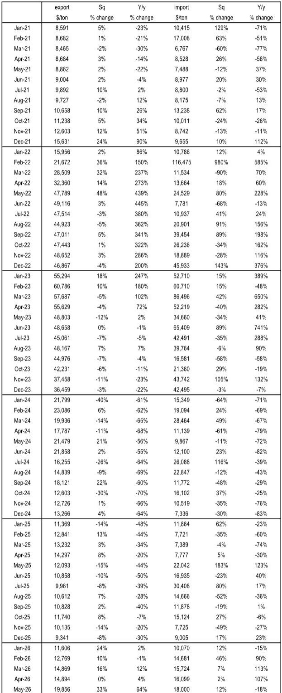
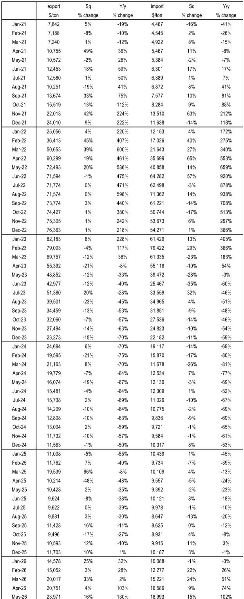
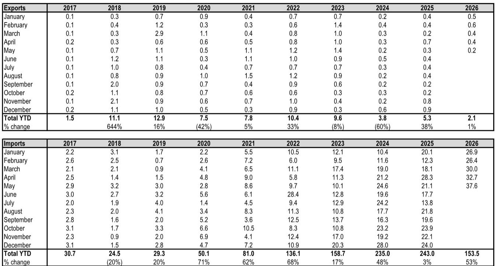

# China’s Lithium Trade Reversal Signals a Structural Shift in Global Battery Supply Chains

The global lithium market is undergoing a quiet but profound realignment, and the latest trade data from China reveals a pattern that should command the attention of every strategist, investor, and supply chain executive in the battery and electric vehicle ecosystem. In May 2026, China imported 37.6 kilotonnes of lithium carbonate, a staggering 78% increase year-over-year, while its exports of lithium hydroxide collapsed by 36% to just 3.5 kilotonnes. These are not merely monthly fluctuations. They represent the culmination of a multi-year trend that has fundamentally inverted China’s position in the lithium trade. For the first time in modern history, China has become a net importer of lithium hydroxide on a year-to-date basis, with net imports reaching 10.5 kilotonnes through May 2026. This is a structural break from a decade of consistent net export surpluses.

The immediate implication is clear: China’s downstream battery production capacity has outstripped its domestic upstream lithium conversion capability, forcing the world’s largest battery manufacturer to increasingly rely on imported feedstock. But the deeper story is about pricing power, competitive dynamics, and the shifting geography of value capture in the lithium supply chain. The price data accompanying these trade flows amplifies the signal. Lithium carbonate import prices surged 102% year-over-year to an average of $18,993 per tonne in May 2026, while lithium hydroxide export prices rose 64% year-over-year to $19,856 per tonne. These price movements are not symmetrical, and they reveal a market that is rebalancing in ways that favor producers with low-cost brine assets and penalize those dependent on Chinese conversion tolling.

This analysis draws on proprietary trade flow and pricing data from a leading global investment bank’s May 2026 China lithium import/export report. The data is granular, covering monthly and year-to-date volumes for lithium carbonate and lithium hydroxide from 2017 through May 2026. What follows is a strategic interpretation of these numbers, structured to help decision-makers understand the forces at work, the questions that remain unanswered, and the frameworks needed to navigate the uncertainty ahead.

## China’s Transition from Net Exporter to Net Importer of Lithium Hydroxide Marks an Inflection Point in Battery Supply Chain Geography

The most striking data point in the report is not the absolute volume of imports or exports, but the net trade balance for lithium hydroxide. From 2017 through 2023, China’s net exports of lithium hydroxide grew every single year, from 18.1 kilotonnes to a peak of 126.2 kilotonnes. That was a compound annual growth rate of 38%. Then came 2024, when net exports dropped to 112.6 kilotonnes, a 10.8% decline. In 2025, the collapse accelerated to just 35.4 kilotonnes net exports, a 68.5% decline. And now, through the first five months of 2026, China is a net importer of 10.5 kilotonnes. The trajectory is unambiguous: China has gone from being the world’s dominant supplier of lithium hydroxide to a net consumer.

This shift matters because lithium hydroxide is the preferred feedstock for high-nickel cathode chemistries like NMC 811 and NCA, which are critical for long-range electric vehicles. China’s domestic battery manufacturers have been rapidly scaling production of these advanced cathodes, and they are consuming the hydroxide that would previously have been exported to Japan, South Korea, and Europe. The data shows that China’s lithium hydroxide exports in May 2026 were 3.5 kilotonnes, compared to 5.6 kilotonnes in May 2025. That 36% year-over-year decline is not a one-off; it is the continuation of a pattern that began in late 2024. Meanwhile, lithium hydroxide imports into China have exploded, from negligible levels in 2021 to 27.3 kilotonnes year-to-date through May 2026, a 321% increase over the same period in 2025.

The strategic consequence is that non-Chinese lithium hydroxide producers, particularly those in Australia, Chile, and North America, now have a direct demand channel into China’s battery supply chain. Previously, these producers had to compete with Chinese converters for market share in downstream markets. Now, they can sell directly into the world’s largest battery manufacturing ecosystem. This is a fundamental shift in market structure, and it has implications for pricing, contract structures, and investment decisions across the lithium value chain.

## Lithium Carbonate Imports Are Surging at Prices That Signal a Tightening Market, Not a Glut

The lithium carbonate side of the trade data tells a complementary but distinct story. China’s lithium carbonate imports in May 2026 reached 37.6 kilotonnes, up from 21.1 kilotonnes in May 2025, a 78% increase. Year-to-date net imports of lithium carbonate are 151.4 kilotonnes, 54.5% higher than the same period in 2025. This is not a market awash in oversupply. The import price data makes that clear. The average lithium carbonate import price in May 2026 was $18,993 per tonne, up 15% month-over-month and 102% year-over-year. Prices in April 2026 were $16,586 per tonne, and in May 2025 they were just $9,392 per tonne.

The doubling of import prices over the past twelve months indicates that demand is absorbing supply faster than new production can come online. This is particularly significant because lithium carbonate is the primary feedstock for LFP (lithium iron phosphate) batteries, which have been gaining market share in the electric vehicle industry due to their lower cost and improved energy density. China is the dominant producer of LFP batteries, and the surge in carbonate imports suggests that domestic production of LFP cathode material is accelerating faster than domestic carbonate supply can support.

The price dynamics also reveal a market that is pricing in scarcity premiums for prompt delivery. The month-over-month increase of 15% in May is especially notable because it came during a period when many analysts were forecasting a seasonal slowdown in battery production. Instead, the data suggests that battery manufacturers are restocking aggressively, possibly in anticipation of further price increases or supply disruptions. The year-over-year comparison is even more stark: import prices in May 2026 are more than double what they were in May 2025. This is not a market that is correcting a glut; it is a market that is repricing for structural tightness.

## The Divergence Between Carbonate and Hydroxide Price Dynamics Reveals a Market That Is Segmenting by Chemistry and Geography

One of the most analytically valuable observations from the data is the divergence in price behavior between lithium carbonate and lithium hydroxide. While both products have seen significant year-over-year price increases, the patterns are different. Lithium carbonate import prices have doubled year-over-year, while lithium hydroxide export prices have risen 64% year-over-year. More importantly, the month-over-month changes tell different stories. Carbonate import prices rose 15% in May, while hydroxide export prices rose 33% month-over-month. The hydroxide price increase is sharper, but it is coming off a lower base and is being driven by a different set of supply-demand dynamics.

This divergence matters because it signals that the market is segmenting by chemistry and application. Carbonate prices are being driven by LFP battery demand, which is heavily concentrated in China and is growing rapidly as automakers adopt LFP for entry-level and mid-range EVs. Hydroxide prices are being driven by high-nickel cathode demand, which is more global and is facing headwinds from the shift toward LFP in some segments. The fact that hydroxide export prices are rising faster month-over-month suggests that the supply squeeze for high-nickel feedstock is actually more acute than for LFP feedstock, at least in the short term.

For investors and strategists, this segmentation means that a single view of the lithium market is no longer sufficient. The carbonate market and the hydroxide market are becoming distinct sub-markets with their own supply-demand balances, price drivers, and risk profiles. A portfolio that treats all lithium exposure as fungible is missing critical nuances. Companies that produce both carbonate and hydroxide will need to manage their product mix strategically, and investors will need to assess which chemistry is likely to see tighter supply over their investment horizon.

## The Report Leaves Critical Questions Unanswered About the Sustainability of China’s Import Dependence and the Role of Non-Chinese Supply

While the trade data provides a clear picture of what is happening, it raises as many questions as it answers. The most important unresolved question is whether China’s shift to net imports of lithium hydroxide is a permanent structural change or a temporary phenomenon driven by inventory cycles and capacity additions that have not yet come online. China has been investing heavily in domestic lithium conversion capacity, including new hydroxide plants in Sichuan and Jiangxi provinces. If these plants ramp up as planned, China could once again become a net exporter of hydroxide. But if they face delays due to environmental permitting, power shortages, or technical challenges, the import dependence could deepen.

A second unanswered question concerns the source of China’s rising lithium imports. The report does not break down imports by country of origin, but the data on pricing offers clues. The fact that import prices are rising rapidly suggests that China is sourcing from higher-cost producers, possibly in Africa or South America, rather than from low-cost brine operations in Chile or Argentina. This could indicate that traditional low-cost supply is constrained or that Chinese buyers are being forced to pay premiums for prompt delivery. Understanding the geographic composition of China’s import sources would be critical for assessing the sustainability of current price levels.

A third question relates to the role of non-Chinese battery supply chains. If China is importing more lithium to feed its domestic battery production, what does that mean for battery manufacturers in the United States, Europe, and South Korea? They are competing for the same feedstock, but they do not have the same access to Chinese conversion capacity. The data suggests that non-Chinese battery makers may face a structural disadvantage in securing lithium hydroxide supply, which could accelerate the push for alternative chemistries or for vertical integration into upstream mining and conversion.

## A Decision Framework for Navigating the Lithium Trade Reversal: Focus on Chemistry, Geography, and Contract Structure

For readers who need to translate these insights into actionable decisions, the following framework organizes the key variables into three dimensions: chemistry, geography, and contract structure.

First, chemistry. The divergence between carbonate and hydroxide markets means that exposure to lithium must be assessed by product type. Investors in lithium producers should evaluate whether a company’s production mix aligns with the fastest-growing demand segment. Producers with flexibility to swing between carbonate and hydroxide production have a strategic advantage. Battery manufacturers should evaluate whether their cathode chemistry roadmap is resilient to potential supply constraints in either carbonate or hydroxide. The data suggests that hydroxide supply is tightening faster, which could favor LFP chemistry in the near term.

Second, geography. China’s shift to net imports creates opportunities for non-Chinese lithium producers, but the opportunity is not uniform. Producers in jurisdictions with free trade agreements with the United States or Europe may command a premium if their customers are seeking to diversify away from Chinese supply chains. Producers in high-cost jurisdictions may struggle to compete with Chinese imports if prices decline. The geographic dimension also includes logistics and processing. Companies that can process lithium closer to the mine, rather than shipping raw ore to China for conversion, may capture more value.

Third, contract structure. The price volatility evident in the data underscores the importance of contract terms. Spot market exposure is risky in a market where prices can double year-over-year. Long-term offtake agreements with price floors and ceilings can provide stability, but they may also limit upside. Tolling arrangements, where a producer pays a converter to process feedstock, are becoming less attractive as conversion capacity in China tightens. The most resilient companies will be those that have secured long-term access to both feedstock and conversion capacity, ideally in multiple geographies.

## The Full Report Contains Granular Data That Reveals Which Companies and Chemistries Are Best Positioned for the Coming Cycle

The analysis presented here is based on the headline numbers from the May 2026 China lithium trade data, but the full report contains significantly more detail. It includes monthly price series for both lithium carbonate and lithium hydroxide going back to 2021, allowing readers to identify seasonal patterns and trend changes with precision. It also includes annual trade balance data that shows the full trajectory of China’s shift from net exporter to net importer. For investors and strategists who need to make capital allocation decisions based on this data, the full report provides the granularity necessary to assess which producers, converters, and battery manufacturers are gaining or losing market share.

The report also includes analysis of the implications for specific companies and chemistries, based on the proprietary models of the investment bank’s research team. This analysis is not available in the public domain, and it offers a level of insight that goes beyond what can be inferred from trade data alone. For readers who want to understand which lithium producers are best positioned to benefit from China’s import dependence, and which battery manufacturers are most exposed to the tightening hydroxide market, the full report is essential reading.

Join the community to read the full report and review the original charts.

*This article is for learning and discussion only and does not constitute investment advice.*

Personal reading notes and learning share only. Not investment advice.

