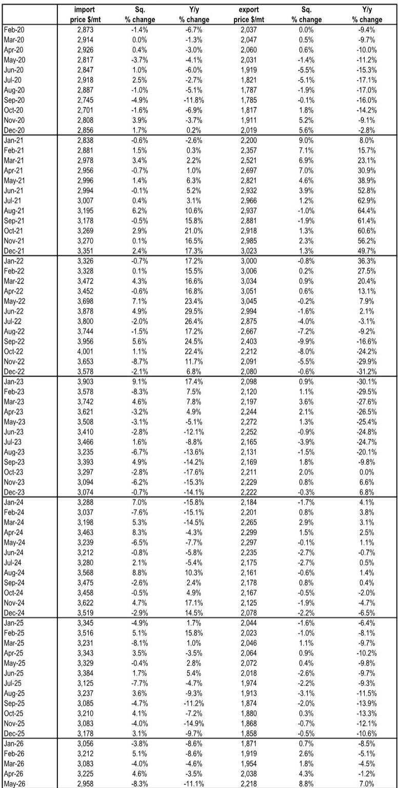
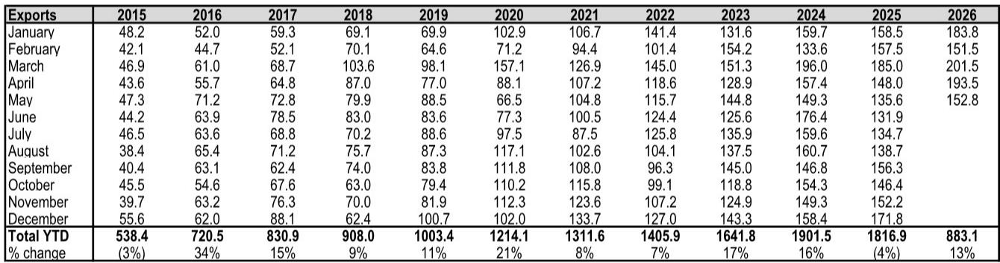
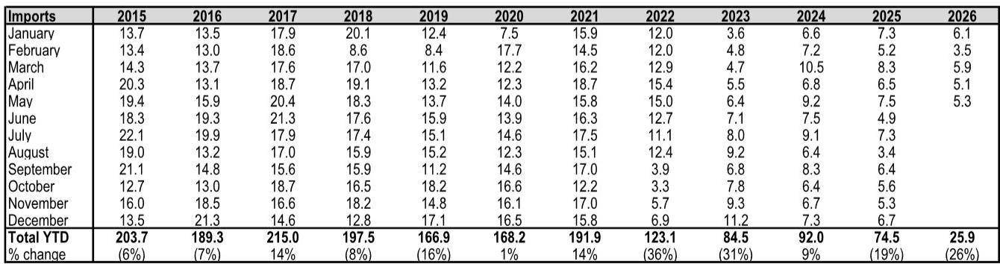

# China's Titanium Dioxide Export Machine Is Not Slowing Down — And That Changes the Global Competitive Landscape

Global chemical investors have spent the past year debating whether Chinese titanium dioxide exports would finally moderate. The data from May 2026 provides a definitive answer: they have not. China exported 152.8 kilotons of TiO2 in May, a 13% year-over-year increase that extends a multi-year trend of aggressive volume growth. The more important story, however, is not the headline number. It is the composition of those exports and what it signals about the structural transformation of the global TiO2 industry.

The conventional narrative has been that Chinese TiO2 producers compete primarily on price, flooding global markets with low-cost sulfate-grade material. That narrative is becoming dangerously incomplete. The May data reveals a surge in chloride-based TiO2 exports, which were up 39% year-to-date compared to the same period last year. Chloride-process TiO2 is higher quality, more environmentally complex to produce, and historically dominated by Western producers. China is moving up the value chain faster than many market participants have anticipated.

This is not a cyclical story about inventory destocking or temporary demand pull-forward. The data reflects a structural shift in both China's production capability and its export strategy. For investors in global chemical companies, coatings manufacturers, and downstream industrial users, the implications are profound. The question is no longer whether China will be a dominant exporter of TiO2. The question is what the next phase of that dominance looks like — and who will bear the cost.

## Chinese TiO2 Export Volumes Are Accelerating, Not Peaking, Driven by a Shift Toward Higher-Value Chloride-Grade Material

The year-to-date net export figure of 857.2 kilotons through May 2026 represents a 14% increase over the same period in 2025. This acceleration comes after a year in which full-year net exports actually declined by 3.7% in 2025, leading some to believe that Chinese export growth had peaked. The 2026 data decisively refutes that thesis. The monthly export trajectory shows sustained strength, with March reaching 201.5 kilotons — the highest monthly figure on record.

What makes this growth particularly significant is its composition. Chloride-grade exports have grown at nearly seven times the rate of sulfate-grade exports. In May 2026 alone, chloride exports reached 34.4 kilotons, compared to 24.9 kilotons in May 2025. The year-to-date chloride export total of 212.9 kilotons is 39% higher than the same period in 2025. This is not marginal growth at the high end; it is a step-change in volume.

The strategic logic is clear. Chloride-process TiO2 commands higher prices and faces fewer regulatory barriers in developed markets. It also requires more sophisticated production technology and higher capital investment. By scaling chloride capacity, Chinese producers are not merely increasing volume — they are repositioning themselves to compete directly with Western incumbents in premium market segments. The data suggests this strategy is working.

## The Geographic Diversification of Chinese TiO2 Exports Reduces Dependency on Any Single Market and Creates Asymmetric Risk for Regional Producers

A decade ago, Chinese TiO2 exports were heavily concentrated in a handful of markets. The 2026 year-to-date data reveals a far more diversified export footprint. India has emerged as the single largest destination, accounting for 19% of total exports at 166 kilotons, up 32% year-over-year. The EU-27, despite ongoing anti-dumping discussions, has grown to 97 kilotons, a 29% increase. Turkey, Indonesia, Vietnam, and South Korea each absorb significant volumes.

This diversification matters for two reasons. First, it reduces the effectiveness of any single market's trade remedy actions. If the EU imposes additional tariffs, Chinese producers can redirect volumes to India, Southeast Asia, or the Middle East without suffering a catastrophic decline in total shipments. Second, it creates asymmetric risk for regional producers who lack China's scale and cost advantages. Indian TiO2 producers, for example, now face a 32% surge in Chinese imports into their home market. European producers see Chinese exports to the EU rising even as they argue for trade protection.

The data also reveals a notable shift in the top ten destination markets between 2025 and 2026. Brazil has dropped out of the top ten, while Russia has entered. The UAE has remained a consistent top-ten destination. These shifts suggest that Chinese exporters are actively managing their geographic portfolio, increasing exposure to markets with growing industrial demand and reducing exposure to markets where trade friction is highest.

## China's Declining Imports of High-Grade TiO2 Signal That Domestic Substitution Is Accelerating

Perhaps the most underappreciated data point in the May report is the collapse of Chinese TiO2 imports. Year-to-date imports through May 2026 stand at just 25.9 kilotons, a 26% decline from the already depressed 2025 level of 74.5 kilotons. This is not a temporary fluctuation. Chinese TiO2 imports have been in structural decline since 2021, when full-year imports were 191.9 kilotons. By 2025, they had fallen to 74.5 kilotons. The 2026 pace suggests another year of double-digit decline.

The import decline is concentrated in chloride-grade material, which has traditionally been the category where Chinese producers lagged. Chloride imports fell 22% year-to-date, while sulfate imports fell 30%. These declines indicate that Chinese producers are not only exporting more high-grade material but also replacing imports that previously served domestic demand for premium TiO2.

For Western producers who have relied on the Chinese market as an outlet for high-value chloride-grade TiO2, this is a double blow. They lose export volume to China at the same time as Chinese producers gain share in their home markets. The net effect is a compression of the premium that chloride-grade TiO2 has historically commanded in global markets.

## One Critical Question the Data Does Not Fully Answer: Is This Export Growth Profitable for Chinese Producers?

The May data shows average export prices of $2,218 per ton, up 8.8% sequentially and 7.0% year-over-year. This price recovery is encouraging for Chinese producers, but it raises an important question that the trade data alone cannot resolve. Are these prices sufficient to generate positive economic returns, given the rising costs of raw materials, energy, and environmental compliance in China?

The sequential price increase from $2,038 in April to $2,218 in May is notable, but it follows a period of significant price weakness. In 2025, export prices averaged roughly $2,000 per ton, well below the levels seen in 2022 and 2023. The May 2026 price is still below the $2,431 per ton that Chinese exports to the EU commanded in the same month, suggesting that Chinese producers are pricing aggressively in non-EU markets to gain share.

The profitability question is further complicated by the rapid growth of chloride-grade exports. Chloride production requires higher capital investment and more expensive raw materials. If Chinese producers are selling chloride-grade TiO2 at prices that barely cover costs, the volume growth may be value-destructive. Conversely, if they are achieving cost advantages through scale, vertical integration, or technology improvements, the export surge could be highly profitable.

Without access to company-level cost data and margin analysis, investors must treat the volume growth as a signal of market share expansion, not necessarily value creation. The full report contains detailed pricing tables that allow for a more granular analysis of margin trends by product grade and destination market.

## A Decision Framework for Investors: How to Interpret Chinese TiO2 Export Data as a Leading Indicator

For investors attempting to position in TiO2-exposed equities or commodities, the monthly Chinese trade data offers a high-frequency signal that should be interpreted through a structured framework. The following four-quadrant analysis can help distinguish between noise and signal.

The first dimension is volume trajectory. Sustained year-over-year export growth above 10% indicates that Chinese producers are gaining global share, which is bearish for non-Chinese producers and bullish for downstream users of TiO2. Volume growth below 5% or declining suggests that global demand is weak or that trade barriers are beginning to bite.

The second dimension is product mix. A rising share of chloride-grade exports signals that Chinese producers are moving up the value chain, which threatens the premium pricing power of Western incumbents. A stable or declining chloride share suggests that Chinese producers remain confined to the commodity end of the market.

The third dimension is pricing. Rising export prices combined with rising volumes indicate strong global demand and rational pricing behavior by Chinese producers. Rising prices with declining volumes suggest that Chinese producers are prioritizing margins over market share. Falling prices with rising volumes is the most aggressive competitive scenario and the most negative for industry profitability.

The fourth dimension is import substitution. Declining Chinese imports of TiO2, particularly chloride-grade, confirm that domestic production is displacing foreign supply. This reduces the addressable market for non-Chinese producers and should be treated as a structural headwind.

Applying this framework to the May 2026 data yields a clear reading: volumes are accelerating, product mix is improving toward chloride, prices are recovering, and import substitution is deepening. This combination is unambiguously negative for non-Chinese TiO2 producers and suggests that the competitive pressure will intensify in the second half of 2026.

## The Next Phase of Competition Will Be Defined by Environmental Regulation, Not Just Price

The data in this report tells a story about volume and price, but the next chapter of the TiO2 industry will be written in regulatory frameworks. Chinese sulfate-process TiO2 production generates significant waste byproducts, including ferrous sulfate and dilute sulfuric acid. Environmental enforcement in China has historically been uneven, but there are signs that regulatory pressure is increasing.

If Chinese producers face rising environmental compliance costs, their cost advantage could narrow. Conversely, if Western regulators impose carbon border adjustment mechanisms that apply to TiO2 imports, Chinese producers could face additional costs that reduce their competitiveness in premium markets like the EU.

The May data shows Chinese exports to the EU rising 29% year-to-date, even as the EU considers new trade measures. This suggests that either Chinese producers are confident in their ability to navigate regulatory hurdles, or they are front-loading shipments before new restrictions take effect. The distinction matters enormously for investment positioning.

The full report includes historical trade data by destination and product grade that allows for a more detailed analysis of these regulatory dynamics. Investors who want to understand which markets are most exposed to Chinese export growth, and which trade policy scenarios would most disrupt the current trajectory, will find the underlying data essential for scenario analysis.

The Chinese TiO2 export machine shows no signs of slowing. The May 2026 data confirms that the volume growth is real, the product mix is improving, and the geographic diversification is deepening. For investors who have been waiting for a peak in Chinese TiO2 exports, the data suggests that peak may still be years away. The more pressing question is what happens when the rest of the world fully adjusts to this new reality.

Join the community to read the full report and review the original charts.

*This article is for learning and discussion only and does not constitute investment advice.*

Personal reading notes and learning share only. Not investment advice.

