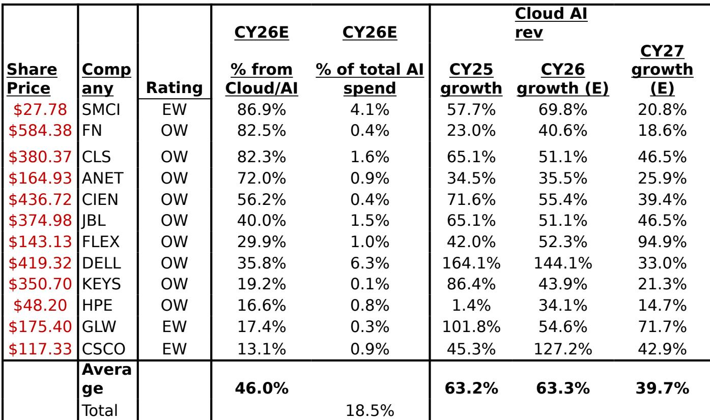
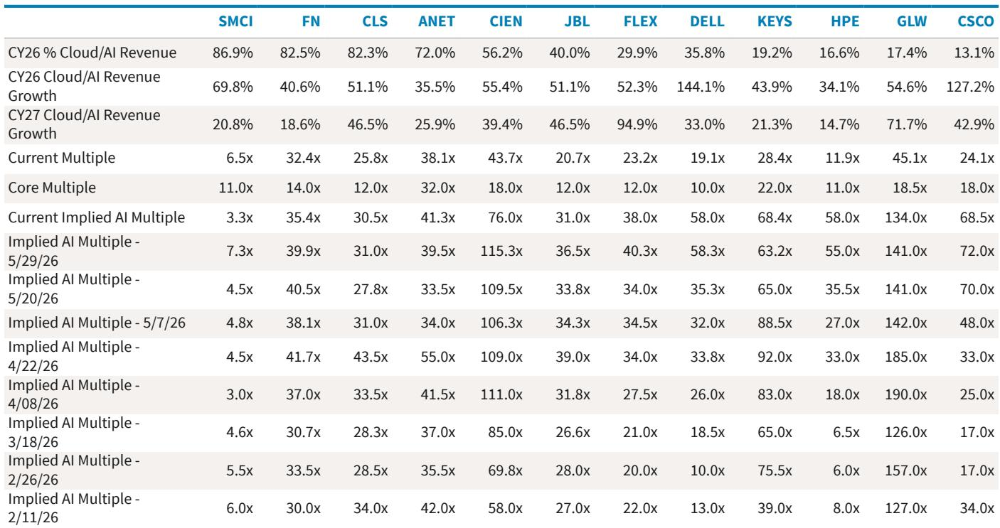
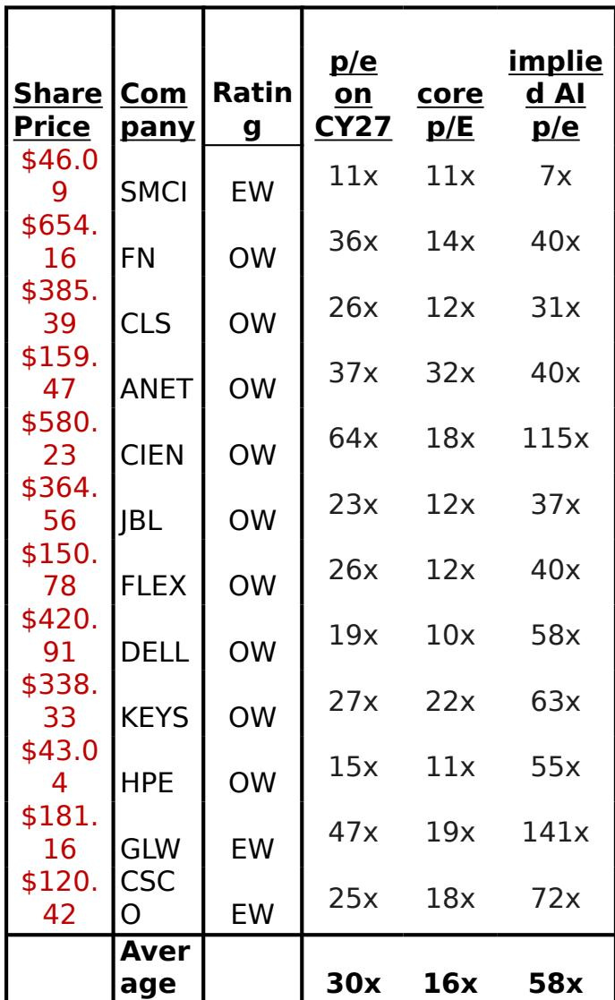

# Implied AI Multiples Are Compressing, But the Signal Is Not a Slowdown — It Is a Rotation

The market is beginning to price AI infrastructure stocks with greater discrimination, and the recent compression in implied AI multiples is not a sign that the thesis is breaking. It is a sign that the market is moving from a phase of indiscriminate re-rating to one of selective fundamental scrutiny. Over the past two weeks, the average implied AI multiple across a basket of hardware and communications equipment stocks has contracted, driven primarily by sharp drawdowns in optical names and a single large financing event. Yet the underlying revenue growth estimates for cloud AI exposure have actually been revised upward. This divergence between price action and fundamental trajectory creates a strategic opening for investors who can separate company-specific noise from structural demand signals.

The key insight from the latest biweekly data is this: the market is no longer willing to pay a premium simply for AI exposure. It is now demanding proof of execution, visibility into order fulfillment, and clarity on competitive positioning. The names that have held or increased their implied AI multiples are those with demonstrable momentum in legacy business performance or credible scaling narratives. Those that have compressed are not necessarily impaired — they are simply being repriced to reflect execution risk rather than thematic enthusiasm. For serious investors, this is precisely the environment in which alpha is generated.

## The Optical Pullback Reflects a High Bar, Not a Broken Demand Story

The most visible movement in the latest data is the compression in implied AI multiples for optical networking names, particularly CIEN and FN. CIEN's implied AI multiple dropped from 115x to 76x, while FN's fell from 40x to 35x. On the surface, this looks like a sector-wide de-rating. But the underlying driver is not a deterioration in cloud AI demand for optical connectivity. It is a classic case of expectations running ahead of reality.

CIEN reported earnings that were strong in absolute terms, but the stock had already run up 107% in the three months prior. The earnings print was simply not enough to sustain that valuation. This is a critical distinction. When a stock's price has already discounted a perfect outcome, even a good report can trigger a selloff. The optical networking thesis remains intact — hyperscaler capex continues to expand, and the need for high-speed interconnectivity is only growing as AI clusters scale. But the market is now asking a harder question: at what multiple should a company with 55% revenue growth in cloud AI trade when it has already been priced for perfection?

FN's decline is a second-order effect. As the report notes, FN's downward pressure came from its customer-manufacturing relationship to CIEN. This is a reminder that in the AI supply chain, sentiment contagion can be as powerful as fundamental contagion. Investors need to distinguish between companies that are directly exposed to a demand slowdown and those that are merely correlated by proximity. FN's own cloud AI revenue growth estimates remain robust at 40.6% for CY26. The multiple compression may create an entry point for those who can look through the noise.

## Financing Events Create Valuation Dislocations That Reward Patience

The most dramatic single-stock move in the basket was SMCI, whose share price fell 40% since the prior reading, driving its implied AI multiple from 7x to 3x. The trigger was a $7 billion equity and equity-linked financing announcement to fund AI orders. The market interpreted this as dilution risk, and the stock was punished accordingly.

But here is where the data tells a more nuanced story. SMCI simultaneously announced it had received approximately $39 billion in incremental AI orders since quarter-end, to be fulfilled over the next two to three quarters. Even if one applies a conservative discount to that figure — given the company's historical challenges with hitting top-line expectations due to customer readiness — the implied revenue trajectory is enormous. The company's cloud AI revenue is estimated to grow 69.8% in CY26 and 20.8% in CY27. At a 3x implied AI multiple, the market is essentially assigning zero value to that growth and instead pricing in significant execution failure.

The strategic question is whether the financing overhang is temporary or structural. If the orders are real and the capacity buildout is credible, the dilution is a near-term cost for long-term capacity. If the orders prove to be overstated or delayed, the stock could remain under pressure. The report leaves this question open, and it is precisely the kind of ambiguity that creates opportunity for investors with differentiated access to supply chain intelligence. For now, SMCI represents the most extreme divergence between implied valuation and stated order flow in the entire basket.

## The Re-Rating of Legacy-Plus-AI Names Signals a Broader Shift

Perhaps the most strategically significant pattern in the data is the sustained upward movement in the implied AI multiples of HPE, DELL, and CSCO. HPE's implied AI multiple has risen from 6x in February to 58x currently, despite the company deriving only 16.6% of its revenue from cloud AI. DELL's multiple has moved from 13x to 58x over the same period. CSCO's has moved from 34x to 69x.

This is not a story of AI revenue growth alone. It is a story of legacy business outperformance being recognized and then layered with AI optionality. The report notes that the core business multiples for these names were moved up by a turn in the last update, reflecting better-than-expected on-premise demand and the ability to navigate a constrained component environment. The market is effectively saying: these companies have stable, cash-generating core businesses that are worth more than previously assumed, and their AI exposure is a free call option on top.

This has implications for how investors should think about the AI infrastructure opportunity set. The pure-play AI names with high revenue exposure but low core business stability are being priced with more scrutiny. The diversified names with moderate AI exposure but strong core franchises are being re-rated upward. The market is rewarding resilience and penalizing fragility, even within the same thematic bucket. For portfolio construction, this suggests that a barbell approach — combining high-exposure, high-risk names with lower-exposure, higher-stability names — may be more resilient than a concentrated bet on the highest-growth names alone.

## What the Report Does Not Fully Answer: The Sustainability of 60%+ Revenue Growth

The report provides an updated estimate that average cloud AI revenue growth CAGR for 2023-2027E is now approximately 62%, up from an initial estimate of 53%. This upward revision is driven by hyperscaler capex guidance and the sheer scale of AI infrastructure buildout. But the report does not attempt to answer a critical question: how long can this growth rate persist before it begins to decelerate meaningfully?

Consider the data. The average CY27 cloud AI revenue growth estimate across the basket is 39.7%, down from 63.3% in CY26. This implies a natural deceleration, but 39.7% is still an extraordinarily high growth rate for a hardware and infrastructure sector. The question is whether that deceleration is a smooth glide path or a cliff. If hyperscalers begin to optimize their existing AI clusters rather than build new ones, or if the next generation of AI models requires less compute per parameter, the revenue growth for these suppliers could compress faster than current estimates reflect.

The report's framework does not model this scenario. It assumes the current capex trajectory extends through CY27, which may be reasonable but is not guaranteed. Investors who want to stress-test their positions should ask: what happens to implied AI multiples if CY27 growth comes in at 20% instead of 40%? For names like GLW, which trades at 134x implied AI multiple on CY27 earnings, the answer is not comforting. This is the unresolved analytical gap that makes the full report worth reading — the data is rich, but the scenario analysis is left to the reader.

## A Decision Framework for Positioning in the Current Regime

For investors trying to act on this data, the following framework may help structure the decision process. It is built around three dimensions: revenue exposure to cloud AI, implied AI multiple, and core business stability.

First, identify names where the implied AI multiple has compressed but the underlying revenue growth estimates have not changed. These are potential value opportunities, assuming no company-specific impairment. CIEN and FN fall into this category after the optical pullback. The key question is whether the multiple compression is mean-reverting or structural. If optical demand remains strong, the multiples should recover.

Second, identify names where the implied AI multiple has expanded significantly but the revenue exposure is still moderate. These names — HPE, DELL, CSCO — require a different kind of analysis. The question is not whether AI revenue will grow, but whether the core business can sustain its current valuation support. If on-premise demand softens or component availability improves and margins compress, the core multiple could revert, pulling the implied AI multiple down with it.

Third, identify names where the implied AI multiple is extremely high relative to the growth rate. GLW at 134x implied AI multiple on CY27 earnings is the standout. The company's cloud AI revenue growth is 54.6% in CY26 and 71.7% in CY27, which justifies some premium. But 134x is pricing in perfection and then some. For these names, the risk is not that the thesis is wrong, but that the market has already fully discounted the best possible outcome.

Finally, for names like SMCI where the implied multiple has collapsed to single digits, the decision hinges on order fulfillment credibility. If the $39 billion order pipeline is real and executable, the current valuation is deeply attractive. If it is overstated or delayed, the stock could remain under pressure. This is a bet on management credibility and operational execution, not on thematic demand.

## Join the Community to Read the Full Report and Review the Original Charts

The biweekly data on implied AI multiples is one of the most useful tools for tracking how the market is pricing AI infrastructure exposure in real time. But the raw numbers only tell part of the story. The full report contains the detailed breakdowns of revenue growth estimates, core versus implied multiples, and the timeline of multiple evolution since February. It also includes the original charts that show how each stock has moved through successive readings, which is essential for understanding momentum and inflection points. Join the community to read the full report and review the original charts.

*This article is for learning and discussion only and does not constitute investment advice.*

Personal reading notes and learning share only. Not investment advice.

