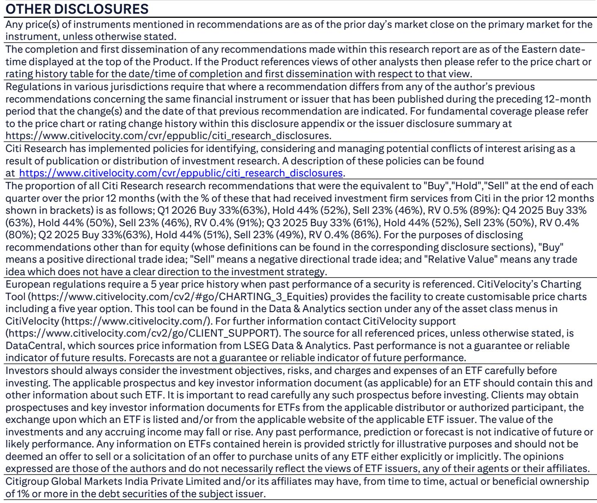
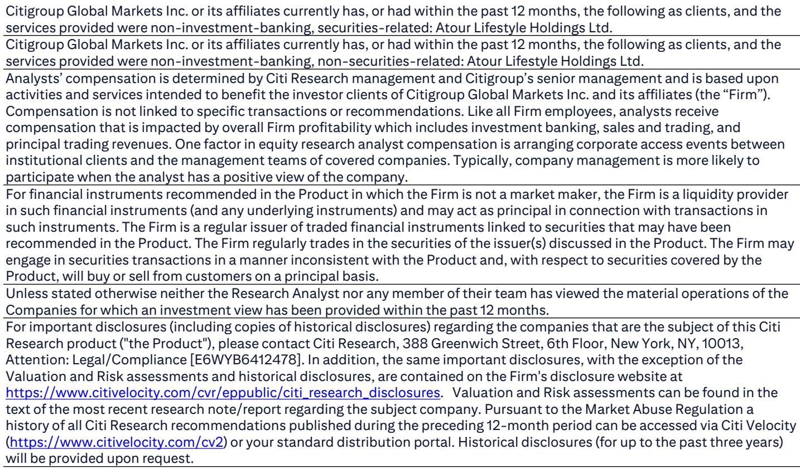
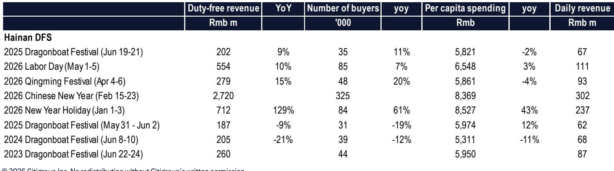

# Citi：端午出游数据背后，中国消费韧性比想象中更“挑”

当宏观数据与微观体感出现背离时，市场往往倾向于相信悲观的一面。但2026年端午假期的中国旅游数据，却讲述了一个更精细的故事。

根据中国文化和旅游部最新数据，端午三天假期（6月19-21日），国内旅游人次同比增长4.4%，旅游收入同比增长4.0%。在同期全国交通客运量同比下降0.9%的背景下，这份成绩单显得尤为突出。

Citi团队在最新发布的报告中明确指出，这一数据“超出了我们的预期”。他们的核心判断是：中国休闲旅游需求依然坚韧，而出行结构正在发生深刻分化——非旅游目的的出行在减少，但休闲度假的意愿并未消退。

对于关注中国消费市场的决策者而言，这份报告的真正价值不在于确认“旅游复苏”，而在于揭示了一个更关键的变化：消费的韧性正在从“总量驱动”转向“场景驱动”，而能够识别并服务于特定场景的企业，正在获得定价权。

## 1. 交通数据与旅游数据的背离，恰恰证明休闲消费的韧性

端午假期，全国交通客运总量同比下降0.9%，其中占主导地位的自驾出行下降2.1%。这一数字很容易被解读为“消费意愿不足”。但Citi分析指出，这种背离恰恰说明了问题的另一面。

雨天减少了非旅游目的的出行需求——通勤、探亲、短途办事等被压缩，但休闲旅游需求保持了韧性。换句话说，人们不是不出门了，而是“不出无意义的门”。当出行被赋予明确的“休闲度假”目的时，消费者的决策并未动摇。

这意味着什么？对于旅游、酒店、免税等行业的观察者而言，判断消费趋势的指标需要从“人流量”转向“人均消费意愿”和“有效出行目的”。宏观交通数据可能掩盖了结构性的消费韧性。

> **KC评论：** Citi这个观察非常关键。市场习惯用“出行人数”来推断消费景气度，但这份报告提醒我们，出行结构比出行总量更能揭示真实需求。当你看到交通数据走弱时，不妨追问一句：是所有人都不走了，还是只有“非必要出行”在减少？完整报告中，Citi对比了不同出行方式的增速差异，并给出了更精细的拆分逻辑——这份图表对于理解中国消费的真实底色很有价值。

## 2. 酒店业正在经历“区域分化”，头部连锁的ADR定价权成为关键胜负手

Citi研报中一个值得关注的细节是，不同区域的酒店RevPAR表现出现了显著分化。以上海为例，端午期间酒店入住率同比增长了1.6个百分点。

这一分化背后，是酒店行业竞争逻辑的转变。在行业供给经历多年调整后，市场已从“数量扩张”进入“品质竞争”阶段。对于亚朵这类聚焦中高端市场、拥有强品牌溢价和管理能力的连锁酒店，其优势正在被重新定价。

Citi在报告中特别指出，亚朵在端午假期实现了正向RevPAR增长，入住率和平均房价均有改善。这正是Citi将其列为行业首选买入标的的核心逻辑——在RevPAR波动的环境下，亚朵的盈利韧性被市场低估，而其零售业务的持续增长又构成了第二增长曲线。

> **KC评论：** 酒店业的区域分化，本质上是对“品牌溢价能力”的一次压力测试。当整体客流承压时，头部品牌反而能通过定价权维持甚至提升业绩。Citi报告中对亚朵的估值框架（14倍2026年EV/EBITDA，较行业平均溢价10%）值得细读——它不只是数字，更是对“品牌护城河”的一种量化表达。完整报告中的估值模型和风险分析，可以帮助你理解这个溢价是否合理。

## 3. 出境游恢复正增长，但真正的增量来自“政策红利”驱动的入境游

端午期间，中国出入境日均流量同比增长12.9%。其中中国大陆居民出境增长5.5%，港澳台居民增长18.4%，而外国人入境增长高达23.3%。更值得注意的是，免签政策下的外国人入境人数同比增长15.2%。

这组数据揭示了一个被市场低估的趋势：中国入境旅游市场正在经历一轮结构性增长，其动力并非来自自然恢复，而是来自签证便利化等政策红利的持续释放。

对于免税、酒店、高端零售等行业而言，这是一个重要的增量来源。海南离岛免税在端午期间销售额同比增长8.6%，主要由购买人数增长11.2%驱动，而人均消费下降2.3%。这意味着客流在扩大，但客单价承压——这正是入境游增量与内需消费结构变化共同作用的结果。

Citi报告没有展开讨论的是，这种“政策驱动型”增长是否可持续，以及入境游的增长能否抵消国内消费升级放缓的拖累。这是投资者需要自己追问的问题。

## 4. 报告尚未完全回答的关键问题：客单价承压是暂时波动还是长期趋势？

尽管旅游人次和收入均实现正增长，但端午期间人均旅游消费同比微降0.4%。海南离岛免税的人均消费也下降了2.3%。这与2026年春节和元旦期间人均消费大幅增长形成了鲜明对比。

Citi在报告中客观呈现了这一数据，但并未给出明确归因。这可能是天气因素导致的短期波动，也可能是消费结构变化的早期信号——当更多中低收入群体加入旅游大军时，人均消费自然会承压。

这里存在一个关键假设：如果人均消费持续承压，那么旅游行业的增长将更多依赖“量”而非“价”。这意味着，那些能够通过规模效应和成本控制维持利润率的企业将受益，而依赖高客单价和品牌溢价的企业可能面临压力。

报告没有给出这个问题的答案，但提出了一个值得持续跟踪的框架。对于投资者而言，未来几个假期的数据（特别是即将到来的国庆黄金周）将是验证这一趋势的关键窗口。

## 5. 对产业决策者的观察框架：从“总量”到“结构”的思维转换

综合Citi这份报告，我们可以提炼出一个观察中国消费市场的分析框架，它包含三个层次：

第一，区分“出行”与“消费”。交通客运量下降不代表消费意愿下降，关键在于区分“非必要出行”和“休闲度假出行”。后者才是消费的真实驱动力。

第二，关注“场景”而非“行业”。同样是酒店业，不同区域、不同品牌的表现天差地别。判断景气度时，需要下沉到具体的消费场景和品牌定位。

第三，警惕“政策红利”的可持续性。入境游的增长令人鼓舞，但它高度依赖签证政策等行政手段。一旦政策转向或外部环境变化，这部分增量可能迅速消退。

这份报告的价值不在于告诉你“旅游复苏了”，而在于帮你建立一套更精细的观察指标。当市场情绪随宏观数据起伏时，这套框架可以帮助你识别出真正值得关注的信号。

---

Citi报告在最后部分留下了两个值得继续探讨的问题：一是亚朵的估值溢价能否持续，二是酒店行业供给正常化后的竞争格局演变。这些问题的答案，需要结合更多数据点和行业调研才能形成判断。

每天，我们的AI agent和人工团队会从国际投行报告中提炼关键信号，生成约10-40页的中文摘要与KC评论，并整理当天最新的数据图表合集。这套内容既方便直接喂给AI模型进行深度分析，也适合人工快速把握全球市场的核心动态。如果你对Citi这份报告中的完整估值模型、区域RevPAR拆分，或者亚朵的零售业务增长细节感兴趣，欢迎来我们的微信群继续讨论。那里会有更深入的交流，也有更多来自一线从业者的实战视角。

Personal reading notes and learning share only. Not investment advice.

