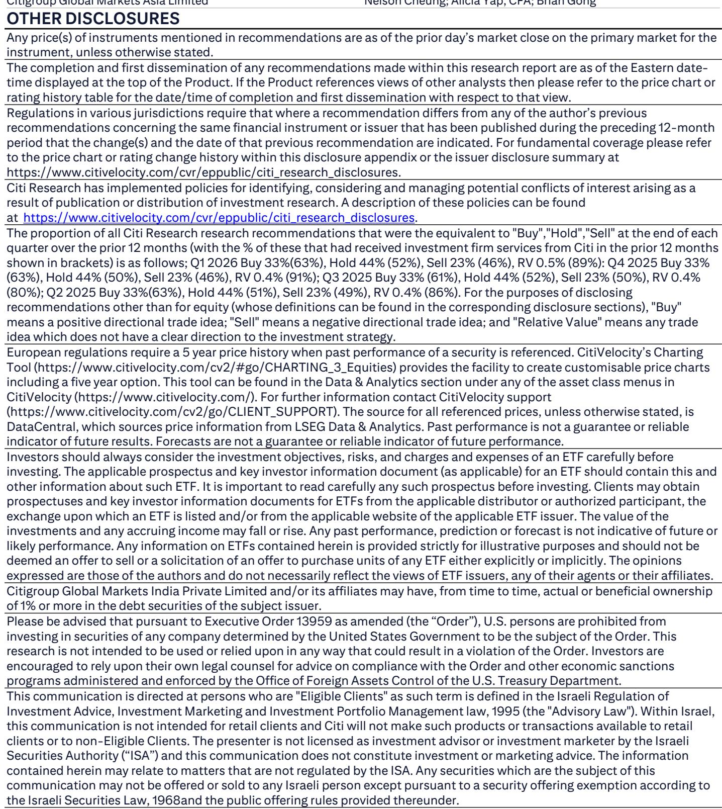
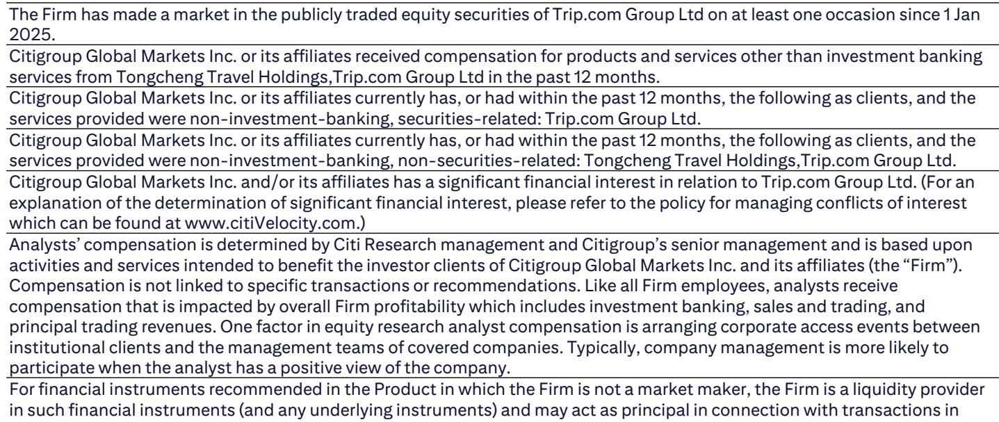
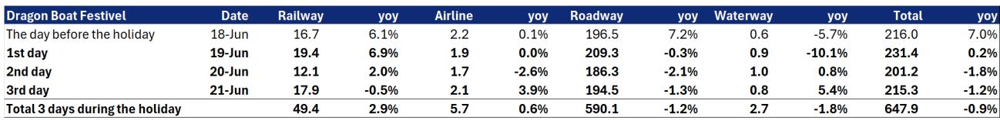

# China's OTA Sector Shows Resilience Despite Headwinds — But the Real Question Is How Long Spending Patterns Can Hold

The Dragon Boat Festival data just released tells a story that is far more nuanced than the headline numbers suggest. China's online travel sector demonstrated measurable resilience during the three-day holiday, with 124 million domestic visitors generating RMB 44.5 billion in tourism revenue, representing year-over-year growth of 4.4 percent and 4.0 percent respectively. On the surface, these figures appear to validate the thesis that Chinese consumers remain willing to travel. But a deeper look reveals a pattern that should give even the most bullish investor pause: average spending per traveler declined by 0.4 percent year over year, continuing a trend that has now persisted across multiple holiday periods in 2026. The OTA sector is not facing a demand problem. It is facing a value problem.

This distinction matters because it shifts the analytical focus from top-line volume to the sustainability of revenue per user. During the Dragon Boat Festival, total passenger throughput across all transport modes actually declined by 0.9 percent year over year, with roadway traffic falling 1.2 percent and waterway traffic dropping 1.8 percent. The positive headline figures were driven almost entirely by railway and airline growth of 2.9 percent and 0.6 percent respectively. This modal shift suggests that travelers are making deliberate trade-offs, choosing faster and more reliable transport options even as overall mobility contracts slightly. The question for OTA platforms is whether they can capture enough of this premium segment to offset the broader pressure on per-trip spending.

The cross-border data adds another layer of complexity. Total cross-border visitor volume rose 12.9 percent year over year, with Chinese citizen outbound travel increasing 5.5 percent. Foreigner arrivals surged 23.3 percent. These numbers are impressive, particularly given the headwinds from elevated oil prices that affect international airfares. But they also raise the question of whether the recovery in outbound travel is cannibalizing domestic demand. If Chinese consumers are increasingly choosing overseas destinations for their holidays, domestic OTAs may face a structural shift in their addressable market rather than a temporary compression in spending.

## The Dragon Boat Festival Data Confirms a Pattern of Volume Growth Outpacing Revenue Growth, and That Gap Is the Central Risk for OTA Valuations

The most instructive way to read the Dragon Boat Festival numbers is not in isolation but as part of a sequence. Comparing the 2026 holiday data to the 2025 equivalents reveals a consistent pattern across five consecutive holiday periods. During the 2026 New Year holiday, domestic visitor volume grew 2.6 percent year over year while revenue grew 3.1 percent, but average spending declined 1.0 percent. For Chinese New Year, volume surged 19.0 percent while revenue grew 18.7 percent, yet average spending still fell 0.2 percent. The Qingming and Labour Day holidays showed similar dynamics: volume growth of 6.8 percent and 3.6 percent respectively, revenue growth of 6.6 percent and 2.9 percent, and average spending declines of 0.2 percent and 0.7 percent.

The Dragon Boat Festival data fits squarely within this trajectory. Volume growth of 4.4 percent, revenue growth of 4.0 percent, and average spending down 0.4 percent. The pattern is now so consistent that it can no longer be dismissed as noise or seasonal variation. Chinese travelers are taking more trips, but they are spending less per trip. This is not a cyclical phenomenon tied to any single holiday's weather conditions or flight pricing dynamics. It is a structural shift in consumer behavior that has persisted across winter, spring, and summer holidays in 2026.

For OTA platforms, the implication is straightforward. Their revenue models depend on either transaction volume or transaction value. If value per transaction is declining, they must drive ever-higher volumes to maintain revenue growth. This creates a dependency that becomes increasingly fragile as the base expands. The Dragon Boat Festival data suggests that volume growth itself may be decelerating. The 4.4 percent increase in visitors is the second-lowest growth rate among the five holidays in 2026, trailing only the 2.6 percent growth during New Year. If the deceleration in volume growth continues while average spending remains under pressure, the sector faces a genuine revenue growth challenge in the second half of the year.

## The Shift Toward Short-Distance and "Hidden Gem" Destinations Signals a Fundamental Change in Consumer Preferences That OTAs Must Address

The operational data from the major OTA platforms provides critical color on what is driving these aggregate trends. Trip.com reported that popular major cities and so-called "hidden gem" small towns were the top destinations during the Dragon Boat Festival, with female travelers and the post-90s generation leading the trend, predominantly opting for inter-provincial short trips. Tongcheng's data corroborates this picture, indicating that short-distance "micro-vacations" remained popular, particularly in the Jiangsu, Zhejiang, and Shanghai region, with a growing trend toward "hidden gem" small towns and "village-drifting" tourism.

This behavioral shift is not a temporary fad. It reflects a deeper change in how Chinese consumers think about travel. The post-90s generation, which now represents the largest demographic cohort of travelers, prioritizes experience over distance. They are willing to trade the prestige of a long-haul vacation for the convenience and lower cost of a short-distance trip. The "hidden gem" phenomenon, where travelers seek out lesser-known destinations rather than crowded tourist hotspots, suggests that the value proposition of travel has shifted from status signaling to personal enrichment.

For OTAs, this creates both opportunity and risk. The opportunity lies in the fact that these travelers are still booking through digital platforms. Trip.com, Tongcheng, and Fliggy all reported strong booking activity during the holiday. Fliggy specifically noted a significant increase in per capita booking value and hotel stays, driven by consumers' preference for quality travel and a surge in demand for summer escape and grassland tours in Northwest and Northeast regions. This suggests that while average spending across all travelers is declining, there is a premium segment within the market that is spending more.

The risk is that the OTA platforms are currently structured to serve a travel market that is rapidly changing. Their revenue models, supplier relationships, and marketing strategies are optimized for a world where travelers take fewer but longer and more expensive trips. If the market is moving toward more frequent, shorter, and cheaper trips, the entire cost structure of the OTA business model may need to be rethought. The platforms that can successfully pivot to serve the micro-vacation and hidden-gem segments will be the winners. Those that remain anchored to the traditional model may find themselves losing relevance.

## The Cross-Border Recovery Is Real but Creates a Strategic Dilemma for Domestic-Focused OTAs

The cross-border visitor data from the Dragon Boat Festival is genuinely encouraging. Total cross-border visitor volume increased 12.9 percent year over year, with Chinese citizen outbound volume up 5.5 percent, Hong Kong, Macau, and Taiwan residents up 18.4 percent, and foreigners up 23.3 percent. These figures are particularly notable given that they were achieved against the headwind of elevated oil prices, which increase the cost of international air travel.

The resilience of outbound demand suggests that Chinese consumers' appetite for international travel remains strong, even as domestic spending per trip declines. This creates a strategic dilemma for OTAs that are primarily focused on the domestic market. Tongcheng, for example, derives the vast majority of its revenue from domestic travel. If the most valuable and fastest-growing segment of Chinese travel demand is shifting toward outbound, domestic-focused platforms risk being left behind.

Trip.com is better positioned to capture this trend given its international expansion strategy. The investment bank report values Trip.com's core business at approximately US$76 per share based on a 2026 estimated price-to-earnings ratio of 20x, applying a 20 percent premium to the average P/E of other vertical leaders specifically because of Trip.com's structural overseas expansion story. This premium reflects the market's expectation that Trip.com can successfully capture a meaningful share of the outbound travel market.

But the cross-border recovery also introduces new risks. Outbound travel is more sensitive to macroeconomic conditions, currency fluctuations, and geopolitical tensions than domestic travel. The report explicitly notes that a further softening of the China macro environment could affect travel demand, and that travel demand could take longer than expected to recover. If the outbound recovery falters, the premium valuation that Trip.com currently enjoys could come under pressure.

## What the Report Does Not Fully Answer: The Sustainability of Average Spending and the Impact of Platform Competition on Margins

For all its useful data, the report leaves several critical questions unresolved. The most important is whether the decline in average spending per traveler is a temporary phenomenon driven by specific holiday conditions or a permanent shift in consumer behavior. The report attributes some of the Dragon Boat Festival weakness to heavy rain across China and surging airline ticket prices, both of which could be transitory. But the pattern of declining average spending has now persisted across five consecutive holidays in 2026, suggesting something more structural is at work.

A second unresolved question is the impact of competition among OTA platforms on margins. The report notes that Tongcheng faces risks from "greater-than-expected competition from OTA peers or other traveling booking channels" and that it has a "heavy reliance on hotel supply from Trip.com" and a "heavy reliance on Tencent's platforms." These dependencies create vulnerabilities that are not fully explored in the report. If competition intensifies, platforms may be forced to sacrifice margins to maintain market share, further compressing profitability.

A third question concerns the relationship between volume and value. The report maintains a Buy rating on both Trip.com and Tongcheng, suggesting that the analysts believe volume growth will be sufficient to offset the decline in average spending. But the data from the Dragon Boat Festival shows volume growth decelerating. If this deceleration continues, the entire bull case for the sector rests on a reversal of the average spending trend, which has shown no signs of turning around.

## A Decision Framework for Investors: Four Conditions That Must Hold for OTA Valuations to Be Sustained

For investors trying to make sense of the Dragon Boat Festival data and its implications for OTA stocks, a structured decision framework is more useful than any single data point. The following four conditions must all hold for current OTA valuations to be justified.

First, volume growth must stabilize or accelerate. The deceleration from 19.0 percent growth during Chinese New Year to 4.4 percent during Dragon Boat Festival is concerning. If the next holiday period, National Day, shows further deceleration, the volume-driven growth thesis will be undermined.

Second, average spending must stop declining. The fact that average spending has declined in every holiday period in 2026 is the most troubling data point in the report. A stabilization, let alone a recovery, would be a significant positive signal. But if the next holiday shows a further decline, it would confirm that the spending compression is structural.

Third, the shift toward short-distance and hidden-gem travel must be a net positive for OTA platforms. This is not yet clear. Short-distance trips generate lower absolute transaction values, and hidden-gem destinations may have less developed supplier ecosystems, potentially reducing commission rates. The platforms that can demonstrate that they can maintain or improve margins on these types of trips will be the winners.

Fourth, the cross-border recovery must continue without triggering a cannibalization of domestic demand. If outbound travel growth comes at the expense of domestic travel, the net effect on OTAs could be negative, particularly for those with limited international exposure.

These four conditions create a clear set of milestones that investors can track through the second half of 2026. The National Day holiday data will be the most important test yet of whether the Dragon Boat Festival pattern is a continuation of a trend or a turning point.

## Join the Community to Read the Full Report and Review the Original Charts

The Dragon Boat Festival data provides a snapshot of where the Chinese OTA sector stands midway through 2026. But a snapshot is not a diagnosis. The full report from which this analysis is drawn contains detailed historical comparisons, modal breakdowns, and valuation frameworks that cannot be fully captured in a single article. The original charts, including the year-over-year comparisons across all 2025 and 2026 holidays and the daily passenger throughput data during the Dragon Boat Festival, are essential for any serious investor trying to form their own view. Join the community to read the full report and review the original charts.

*This article is for learning and discussion only and does not constitute investment advice.*

Personal reading notes and learning share only. Not investment advice.

