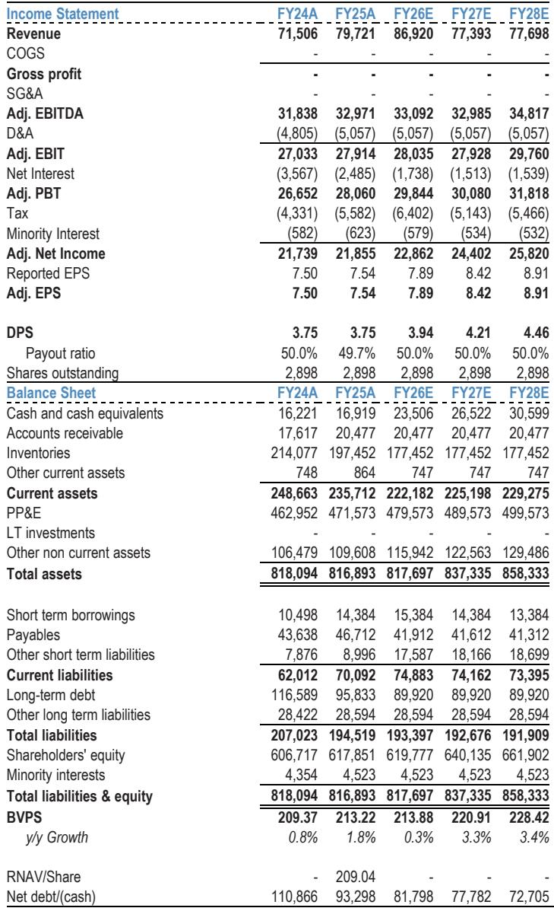
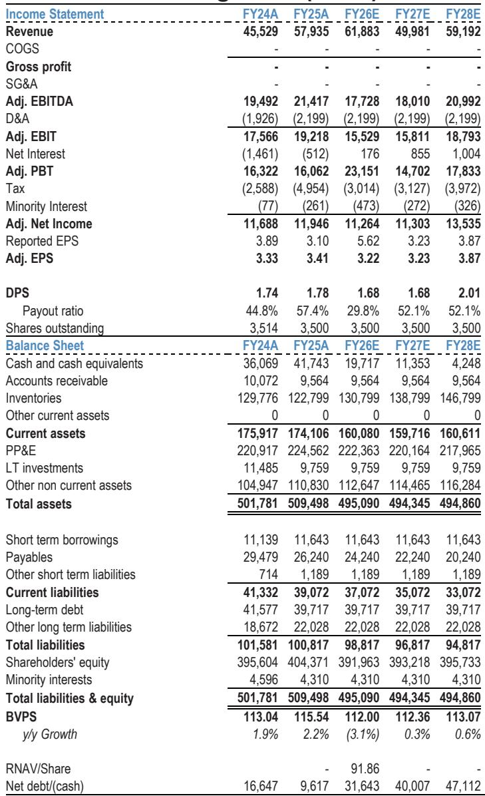
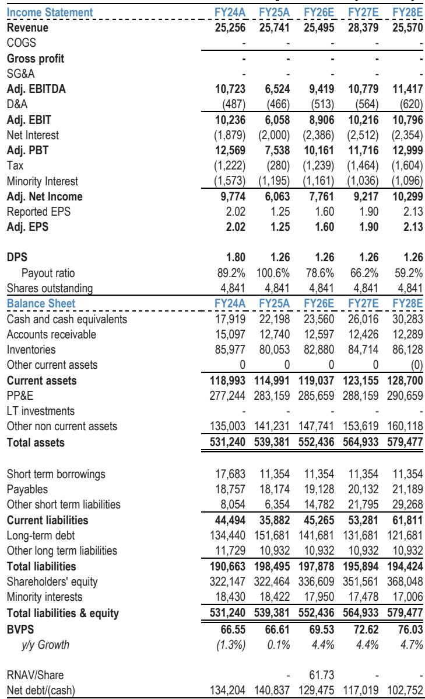

# Hong Kong Home Prices Have Already Hit Our Full-Year Target. The Real Risk to the Upcycle Is Not What You Think.

The secondary home price index in Hong Kong has rebounded 10.4% year-to-date, reaching the upper end of the full-year forecast of 10-15% for 2026. This rally, which represents a 17.9% recovery from the trough, has been stronger and faster than most analysts anticipated. The market has effectively front-loaded the entire expected gain for the year in just six months. The implication is straightforward: home price growth will likely slow to less than 5% in the second half of 2026, and the momentum that carried the market through the first half is already showing signs of fatigue.

This is not a bearish call. It is a recognition that the easy gains have been made, and the second half of the year will test the durability of the recovery. The question every investor should be asking is not whether the upcycle will continue, but what could break it. The two most discussed overhangs—potential tightening of capital outflow controls from Mainland China and rising expectations of a rate hike—are real but manageable. They have been well debated, and the market has largely priced them in. The bigger risk, and the one that receives far less attention, is a prolonged weakness in the Hang Seng Index.

History shows that Hong Kong home prices have a strong correlation with the stock market, typically with a three-to-six-month lag. From its peak in January 2026, the Hang Seng Index has already dropped 15%. If this weakness persists for another quarter or two, the housing market will feel the pressure. The stock market is not just a sentiment indicator; it is a wealth effect channel that directly influences homebuyer confidence and purchasing power. A sustained equity downturn would be far more damaging to the housing upcycle than a modest rate hike or tighter capital controls.

The good news is that the fundamental drivers of the housing market remain intact. Inventory is at an optimal level. Rental growth is positive. Population trends are supportive. Vacancy rates are low. The upcycle is not over, but it is entering a more fragile phase where the margin of safety is thinner and the tolerance for negative shocks is lower. Investors need to recalibrate their expectations and position defensively.

## The Two Well-Known Overhangs Are Directionally Negative but Unlikely to Derail the Upcycle Alone

The market has spent the past month fixated on two specific risks: the potential tightening of capital outflow controls under Document 837, and the rising probability of a US Fed rate hike that would push up Hong Kong's prime rate. Both are legitimate concerns, but neither is likely to be the decisive factor that ends the housing recovery.

On capital controls, the reality is more nuanced than the headlines suggest. Real estate is not explicitly mentioned in Document 837, and the remittance of funds from Mainland China to Hong Kong for the purpose of homebuying has never been permitted under the existing US$50,000 annual quota. Mainland Chinese buyers who purchase Hong Kong properties typically use offshore funding sources, which are not affected by these controls. The more relevant risk is the potential for stricter checks on Mainland Chinese tax residents' offshore assets, including Hong Kong property, which could be subject to a 20% tax on rental income and capital gains. However, the estimated share of transactions from non-HK-based Mainland Chinese buyers is only 5-10% by volume and 10-15% by value. This is a meaningful but not dominant segment of demand. Even a complete cessation of this buyer group would not single-handedly collapse the market, though it would remove a marginal source of price support.

On rate hikes, the consensus view from a global investment bank report maintains a "no rate hike" baseline for 2026. But even if the Fed does raise rates and Hong Kong follows, history provides some comfort. The periods of 2004-2006 and 2016-2018 both saw rate hikes alongside rising home prices. The key variable is not the direction of rates but the broader economic and credit environment. When other factors are supportive, the housing market can absorb higher mortgage costs. The current mortgage rate of 3.25% is only modestly above the net rental yield of 2.9%, and many banks offer fixed-rate plans at 2.73% or cash rebates that effectively lower the carrying cost. The carry is broadly neutral, not punitive.

The real impact of a rate hike would be on developer financing costs, particularly for leveraged names. New World Development and Henderson Land would see higher earnings sensitivity to rising rates, while net-cash developers like CK Asset Holdings and Sino Land would be relatively insulated. But for the housing market as a whole, rate hikes alone are not the primary threat.

## The Biggest Downside Risk Is a Prolonged Weakness in the Hang Seng Index, Not Capital Controls or Rates

This is the critical insight that separates a nuanced view from a simplistic one. The correlation between the Hang Seng Index and Hong Kong home prices is well established, with the stock market typically leading by three to six months. The mechanism is intuitive: equity wealth directly affects household balance sheets, consumer confidence, and the willingness to make large discretionary purchases like property. When stocks fall, the wealth effect is negative, and homebuyers become more cautious.

Since January 2026, the Hang Seng Index has declined 15%. The housing market has not yet felt the full impact because of the lag effect, but the clock is ticking. If the stock market remains weak for another three to six months, the pressure on home prices will become visible. The weekly secondary home price index, which has been solid with a 1.0% gain over the past four weeks, has a three-week reporting lag. The data we are seeing now reflects conditions before the recent equity selloff. The true test will come in the next two months, when the lagged effect of the stock market weakness begins to show up in the price data.

There are historical exceptions to this correlation. In 1999-2000, home prices did not rebound despite a strong stock market because inventory was extremely high. In 2011, home prices barely declined despite a weak stock market because other fundamentals were supportive. These exceptions are instructive: they tell us that the stock market is not a perfect predictor, but it is a powerful one. When the stock market is weak and other factors are also deteriorating, the housing market is vulnerable. When other factors are strong, the housing market can withstand a mild equity downturn.

The current situation falls into the latter category for now. Inventory is at an optimal level of nine months in the primary market and seven months in the secondary market. Population growth is positive. Rental growth is intact. Vacancy rates are below 5%. These are the factors that have historically shown the strongest correlation with home prices—stronger even than the stock market. The base case is not a crash, but a slowdown. However, the margin for error is narrowing. If the stock market weakness persists, it will test the resilience of these fundamentals.

## High-Frequency Data Is Already Flashing Mixed Signals, Pointing to a Shift from Momentum to Caution

The aggregate numbers still look strong, but the high-frequency data tells a more complicated story. This is typical of a market transitioning from a strong uptrend to a more uncertain phase. The leading indicators are diverging, and the pattern suggests that homebuyer interest remains intact, but execution is slowing.

First-day sell-through rates for primary launches have declined from over 70% to 64% over the past month. This is partly a function of developer pricing strategy: developers have been pricing new projects at an average 23% premium to secondary market prices, prioritizing margin over velocity. When you charge a premium, you should expect lower sell-through rates. But the decline is also a signal that buyers are becoming more selective. They are willing to look, but less willing to commit at elevated prices.

Secondary market sales volume among 35 major estates has dropped to below 60 units per week for two consecutive weeks, compared to 60-100 units earlier this year. Adverse weather has been a factor, but the trend is clear: transaction velocity is slowing. This is consistent with a market that has already priced in the good news and is now waiting for clarity on the next catalyst.

The most interesting data point is weekend viewing appointments, which have actually strengthened over the past three weeks, reaching over 570 groups across 15 housing estates—the strongest level year-to-date. This is a leading indicator, and it shows that homebuyer interest is not fading. People are still coming to see properties. But they are not buying at the same rate. This suggests a shift into "wait-and-see" mode, where buyers are gathering information but deferring decisions until the outlook becomes clearer.

The interpretation is strategic, not alarming. The market is not in distress. It is in a period of adjustment. The easy gains from the post-trough recovery have been captured. The next leg of the upcycle will require a new catalyst—either a sustained rebound in the stock market, a clearer resolution of the rate hike narrative, or evidence that the housing market can maintain momentum even without strong Mainland Chinese buyer participation. Until one of these catalysts emerges, the market will likely trade sideways with a modest upward bias.

## The Report Leaves a Critical Open Question: What Happens If Mainland Chinese Buyer Demand Actually Declines?

This is the analytical gap that the report identifies but does not fully resolve. The data on Mainland Chinese buyer participation is inherently noisy. The official data from the Inland Revenue Department shows that only 5.5% of transactions by volume and 7.2% by value came from buyers who do not hold a Hong Kong Identity Card in FY24/25. But property agents using Mandarin pinyin surname analysis estimate the figure is much higher, though this methodology includes many Mainland Chinese who already reside in Hong Kong and some Hong Kong locals with Mandarin surnames.

The report estimates that non-HK-based Mainland Chinese account for 5-10% of transactions by volume and 10-15% by value. This is a meaningful but not dominant share. However, the trend is what matters. The share of non-HKID buyers has risen sharply from 0.1% in FY20/21 to 5.5% in FY24/25. If capital controls are tightened or enforcement becomes more stringent, this growth trend could reverse. The question is whether the market can absorb a decline in this demand segment without significant price disruption.

The report does not provide a definitive answer because the data does not yet exist. The most recent official data only covers through 1Q25, and the environment has changed significantly since then. What we do know is that the market has historically been resilient to shifts in buyer composition. Hong Kong's housing market is driven primarily by local demand, and the fundamentals of population, income, and supply are supportive. But if Mainland Chinese buyer demand were to decline sharply at the same time that the stock market remains weak and rate hike expectations persist, the combination of headwinds could be more than the market can absorb.

This is the scenario that keeps defensive positioning prudent. It is not the base case, but it is a risk that cannot be dismissed.

## A Decision Framework for Investors: Three Scenarios and How to Position

The report's analysis can be distilled into a simple decision framework with three scenarios. Each scenario has a distinct probability and a corresponding investment strategy.

Scenario One: The Bull Case. The Hang Seng Index stabilizes and rebounds. The rate hike narrative fades. High-frequency data improves as wait-and-see buyers return to the market. In this scenario, home price growth accelerates again in the second half of the year, and the upcycle continues with full force. The appropriate strategy is to accumulate high-quality names on dips, particularly Sun Hung Kai Properties, which has strong fundamentals but has outperformed year-to-date by 21% and may offer better entry points after near-term profit-taking. CK Asset Holdings and Sino Land also benefit from this scenario given their net cash positions and defensive balance sheets.

Scenario Two: The Base Case. The Hang Seng Index remains weak but does not deteriorate further. Rate hike expectations remain elevated but do not materialize. High-frequency data continues to show mixed signals, with viewing appointments strong but transaction volumes moderate. In this scenario, home price growth slows to less than 5% in the second half, but the upcycle continues at a more modest pace. The appropriate strategy is to stay defensive, favoring net-cash developers like CK Asset Holdings and Sino Land, which are less sensitive to rate hikes and can sustain dividends even in a slower market. Avoid highly leveraged names like New World Development and Henderson Land, which have higher earnings sensitivity to rising rates and may underperform.

Scenario Three: The Bear Case. The Hang Seng Index continues to decline, triggering a negative wealth effect that spills over into the housing market. Capital controls are tightened more than expected. Rate hikes materialize. In this scenario, home prices could come under significant pressure, and the upcycle could stall. The appropriate strategy is to reduce exposure to Hong Kong property stocks entirely and wait for a better entry point. The current 50% NAV discount and 4.7% dividend yield provide a valuation floor, but if fundamentals deteriorate, those metrics can overshoot to the downside.

The report's analysis suggests that Scenario Two is the most likely outcome, but the probability of Scenario Three has increased relative to three months ago. The key variable to watch is the Hang Seng Index. If it stabilizes, the base case holds. If it continues to decline, the bear case becomes more probable. Investors should monitor the stock market as a leading indicator and adjust their positioning accordingly.

## The Full Report Contains the Charts and Data That Make These Arguments Actionable

The analysis presented here is based on a detailed research report that includes original charts on the secondary home price index, transaction volumes, sell-through rates, inventory months, and the correlation between the Hang Seng Index and home prices. These charts are essential for understanding the precise timing and magnitude of the relationships described in this article. The report also includes a full table of stock ratings and price targets, as well as sensitivity analyses for interest rate impacts on individual developers.

Join the community to read the full report and review the original charts. The data behind these arguments is what separates informed positioning from guesswork.

*This article is for learning and discussion only and does not constitute investment advice.*

Personal reading notes and learning share only. Not investment advice.

