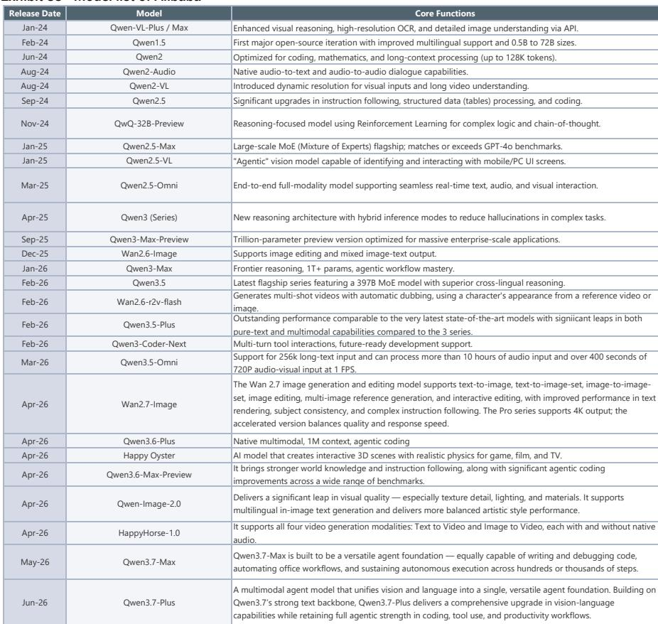
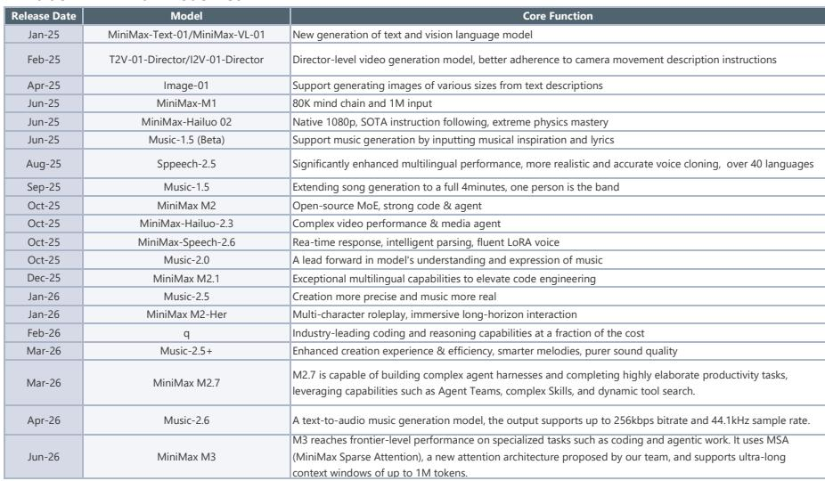
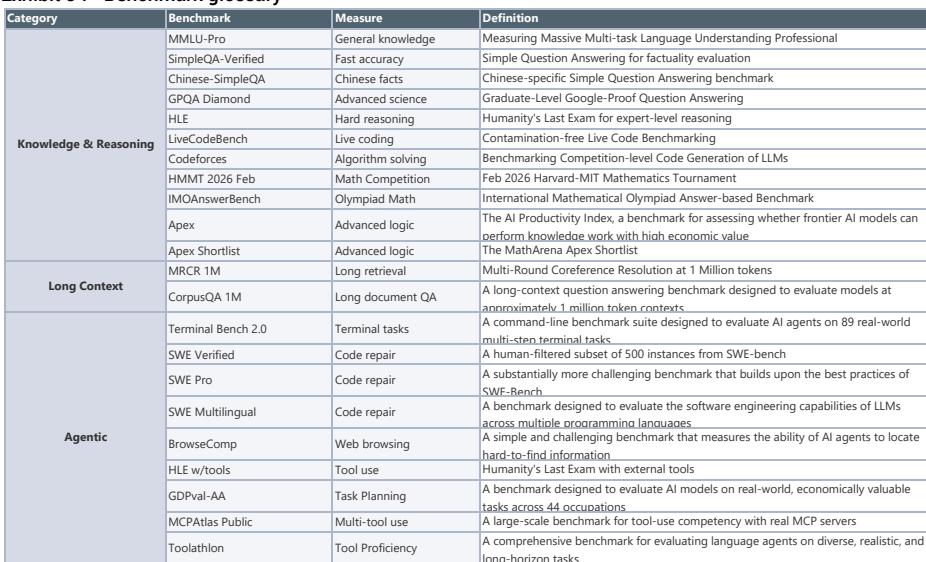

# JEF：中国大模型正在用“成本-智能”剪刀差改写全球AI竞争格局

当市场还在争论AI泡沫何时破裂时，一份来自JEF的研报揭示了一个正在发生的结构性变化：中国大模型在智能水平上已接近美国同级产品，但API成本仅为后者的一个零头。这个“成本-智能”剪刀差的持续扩大，正在从根本上改变全球AI产业的价值分配逻辑。

这不是一个关于“追赶”的故事，而是一个关于“重新定义竞争规则”的故事。

这份长达50多页的研报通过追踪OpenRouter、Artificial Analysis等多个数据源的Token消耗、模型定价和智能指数，给出了一个清晰但尚未被市场充分定价的判断：中国AI产业链正从“成本优势”向“规模优势”切换，而字节跳动的火山引擎大会、腾讯的微信AI内测、以及阿里巴巴蔡崇信在VivaTech上释放的信号，都在指向同一个方向——2026年下半年可能是中国AI商业化的关键拐点。

## 1. 中国模型在Token消耗上已反超美国，但更关键的是“效率优势”而非“规模优势”

根据OpenRouter在6月15日至21日当周的数据，中国模型Token消耗量达到18.8万亿，而美国模型为5.8万亿。DeepSeek V4 Flash以4.94万亿的周消耗量位居榜首，小米MiMo-V2.5和MiniMax M3紧随其后。

这个数字本身并不令人意外——中国拥有更大的用户基数和更低的使用成本。真正值得关注的不是消耗量，而是这个消耗量背后的“效率逻辑”。

JEF的Silicon Data LLM Token Expenditure Index在6月14日至19日期间维持在1.64至1.68之间，较5月31日的2.04有明显下降。这个指数衡量的是Token消耗的“质量”——当用户向高成本模型迁移时指数上升，反之下降。指数的下降意味着用户正在大规模转向低成本模型，而中国模型恰恰是这个趋势的最大受益者。

> **KC评论：** 这个指数下降的信号比Token总量增长更重要。它说明AI使用正在从“尝鲜性消费”转向“实用性消费”——用户不再盲目追求最强模型，而是选择“够用且便宜”的模型。这对中国AI公司是结构性利好，因为他们在这个象限的竞争力远超美国同行。完整报告中有超过50个数据点追踪这个趋势，包括按子行业拆分的用户行为变化，值得细看。

## 2. 智能差距已缩小到2.7%，但成本差距是“数量级”级的

2026年斯坦福AI指数报告显示，美国顶级模型领先中国模型仅2.7%。在Arena Elo评分中，Anthropic（1503）、xAI（1495）、Google（1494）、OpenAI（1481）位居前列，而阿里巴巴（1449）和DeepSeek（1424）已经进入第一梯队。

然而，在API定价上，差距是数量级的。以输入价格为例，阿里巴巴Qwen3.7-Max的推广价为每百万Token 6元人民币，而同类美国模型的定价远高于此。这种“智能接近、成本悬殊”的组合，正在重塑企业客户的采购决策逻辑。

JEF的研报明确指出，中国模型的成本优势源于架构创新：MoE（混合专家模型）、GQA（分组查询注意力）、稀疏注意力以及更高的MFU（模型算力利用率）。这些不是简单的“复制降本”，而是从底层架构出发的效率革命。

## 3. 火山引擎大会的三个关键信号：商业化正在从“讲故事”进入“算账”阶段

6月23-24日，火山引擎FORCE大会即将召开。JEF列出了五个关注点，其中三个最具商业含义：

第一，豆包大模型的日Token消耗量。3月26日披露的数字是120万亿，这个数字在三个月后的变化直接反映用户粘性和使用深度。

第二，商业化计划的更新，包括各种订阅套餐的定价。这是字节跳动从“烧钱获客”转向“回收成本”的关键信号。

第三，视频生成模型Seedance 2.0的ARR趋势。视频生成是AI应用中算力消耗最高、商业价值最大的场景之一，其ARR增长情况将验证“AI视频”是否真的能成为独立商业模式。

> **KC评论：** 火山引擎是理解中国AI商业化最关键的观察窗口，因为它是唯一一个同时拥有“模型能力”和“广告变现闭环”的平台。豆包的日消耗量如果从120万亿继续快速增长，意味着字节跳动的AI战略已经从“工具”升级为“基础设施”。报告中对字节跳动MaaS收入目标的拆解没有完全展开，这部分数据在完整研报中有更详细的测算。

## 4. 微信AI内测：腾讯在A2A赛道上的“暗棋”比想象中更重要

腾讯正在小范围测试微信AI“小微”，入口位于微信主页面左上角和消息功能内，基于微信团队自研的WeLM模型。测试覆盖社交沟通、信息搜索、生产力、娱乐购物和工具生成等多个场景。

JEF将微信AI称为腾讯在A2A（Agent-to-Agent）领域的重要一步，并预计正式发布可能在2026年第四季度。

这个判断值得重视。微信拥有超过13亿月活用户，是中文互联网最大的“场景入口”。如果微信AI能够自然嵌入用户的日常沟通、信息获取和任务执行中，它可能成为A2A时代最大的“Agent分发平台”之一。

但这里有一个尚未被充分讨论的问题：微信AI的商业模式是什么？是订阅制、广告驱动，还是通过Agent调用抽成？JEF的研报没有给出明确答案，这部分需要从完整报告中的定价表和相关讨论中进一步推导。

## 5. 阿里巴巴的50万亿美元TAM：是“宏大叙事”还是“可操作的路径”？

蔡崇信在VivaTech 2026上抛出了一个惊人的数字：AI的TAM是50万亿美元，相当于全球GDP的一半。他认为中国在AI供应端投资不足，而阿里巴巴凭借其自由现金流和全栈能力（芯片、基础设施、Qwen模型、应用）处于有利位置。

这个数字需要拆解来看。50万亿美元TAM的前提是“AI生产人类智能和生产力单元”——这本质上是在说AI将从“工具”变成“生产要素”。如果这个判断成立，那么阿里巴巴的“全栈策略”就不仅仅是防守，而是进攻。

但问题在于：阿里巴巴的全栈能力是否真的能形成竞争壁垒？芯片层面倚赖外部供应商，模型层面面临DeepSeek和小米的竞争，应用层面又与字节跳动、腾讯正面交锋。蔡崇信的“全栈”更像是一个“整合者”的故事，而非“原创者”的故事。

> **KC评论：** 阿里巴巴的“全栈”策略能否成功，取决于一个关键假设：企业客户是否愿意为“一站式AI解决方案”支付溢价。如果答案是肯定的，阿里巴巴的云业务将获得估值重估；如果答案是否定的，那么全栈可能变成“全负担”。报告中对阿里巴巴欧洲代理服务计划的细节没有完全展开，这部分在完整研报中有更具体的落地时间表和客户案例。

## 6. 报告尚未完全回答的关键问题：当“成本优势”变成“价格战”，谁会是赢家？

JEF的研报清晰地展示了中国模型的成本优势，但没有充分讨论一个风险：当所有中国模型都具备成本优势时，成本本身就不再是竞争优势。

从定价表可以看出，阿里巴巴、腾讯、百度、字节跳动、MiniMax、智谱、Kimi等厂商的API定价已经非常接近。在输入价格上，豆包seed-2.0-mini甚至低至每百万Token 0.2元。这种价格水平意味着利润空间极小，除非Token消耗量达到指数级增长。

真正的问题在于：在成本优势被拉平后，竞争将转向什么？是模型智能的持续提升？是应用场景的深度绑定？还是数据飞轮效应带来的用户粘性？

JEF的研报提到了“编码、工作场景和中长内容”是未来机会最大的三个方向，但没有量化这些场景对Token消耗的拉动作用。这恰恰是投资者最需要的数据——因为只有知道“场景深度”才能判断“商业化天花板”。

## 沿着这些未解问题继续

这份研报的价值不在于它给出了多少结论，而在于它提供了一个“数据驱动的观察框架”。Token消耗指数、智能指数、成本曲线、用户行为变化——这些指标组合在一起，比任何单一判断都更有说服力。

但正如我们看到的，报告中有大量关键细节没有在摘要中展开：火山引擎的MaaS收入目标具体是多少？微信AI的测试数据如何？阿里巴巴欧洲代理服务的商业模式是什么？不同场景下的Token消耗弹性有多大？

这些问题在完整研报中都有更详细的拆解。我们每天会由AI agent加人工review生成国际投行中文摘要与KC评论，daily更新约10-40页，并整理当天最新数据图表合集，既方便喂给AI做进一步分析，也方便人工快速把握market dynamics。欢迎来星球微信群里继续讨论，一起跟踪这些关键变量的变化。

Personal reading notes and learning share only. Not investment advice.

