June 23, 2026 12:31 AM GMT

China Consumer | Asia Pacific

# Risk/Reward Update: HPC and Beauty

This report covers our changes for Hengan, C&S Paper, and Shanghai Jahwa.

Hengan (1044.HK; EW): Tissue should remain Hengan's key growth driver, supported by volume growth and share gains, but revenue growth is likely to stay moderate due to ASP pressure from online and new retail channels. Tissue margin should be stable in 2026 due to favorable pulp prices, while sanitary napkins and diapers are still under pressure from intense competition and weak demand. Overall margins may edge down as the company invests more in branding and channel expansion. Despite lukewarm earnings trends and a lack of upside catalysts in the near term, Hengan's commitment to Rmb1.4+/share annual payout, equivalent to \~6% dividend yield now, supports its share price, leading to our EW rating.

C&S Paper (002511.SZ; UW): C&S Paper's revenue growth should remain mostly volume- and share-gain-driven, as smaller players exit, but pricing power remains limited. Online and new retail channels should support volume growth, but higher promotion and sharper pricing may continue to dilute ASP and limit margin upside. Gross margin should stay broadly stable, helped by product premiumization and efficiency gains, though pulp costs and channel competition constrain further GPM upside. Earnings recovery is visible but still moderate, as operating leverage is limited by continued investment in branding, e-commerce, and new retail. We cut earnings estimates by 20%/27% for 2026/27 to reflect slower-than-expected earnings recovery. Given its still-demanding valuation (trading at 24x 2026E P/E) with limited pricing power, low ROE and only modest margin upside, risk-reward is not compelling, and we remain UW.

Shanghai Jahwa (600315.SS; UW): Jahwa is back to growth, driven by online strength and beauty segment recovery, while the recovery remains largely brand-investment led. Beauty brands such as Herborist and Dr. Yu should remain the key growth drivers, while Liushen's offline business is expected to stabilize from the pressure last year. The rising online and Douyin mix is strategically positive, but it also requires continued investment in content, traffic and brand building, limiting near-term operating leverage. Gross margin should improve gradually with a better category mix, but selling expenses are likely to stay high as the company rebuilds brand equity. We cut earnings estimates by 35%/39% for 2026/27 to reflect slower-than-expected earnings recovery, as selling expenses are likely to stay high. With the stock trading at over 35x 2026E P/E, valuation looks demanding relative to limited profit visibility, so we remain UW.

MS ASIA LIMITED+

Dustin Wei

Equity Analyst

Dustin.Wei@morganstanley.com +852 2239-7823

Research Associate

Jenny.Yu1@morganstanley.com +852 3963-1925

Lillian Lou

Equity Analyst

Lillian.Lou@morganstanley.com +852 2848-6502

Asia Summer School 2026

<table><tr><td colspan="3">CHINA/HONG KONG CONSUMER</td></tr><tr><td>Asia Pacific Industry View</td><td></td><td>In-Line</td></tr><tr><td colspan="3">WHAT&#x27;S CHANGED</td></tr><tr><td>C&amp;S Paper Co Ltd (002511.SZ)</td><td>From</td><td>To</td></tr><tr><td>Price Target</td><td>Rmb5.60</td><td>Rmb5.70</td></tr><tr><td>Shanghai Jahwa United Co. Ltd. (600315.SS)</td><td>From</td><td>To</td></tr><tr><td>Price Target</td><td>Rmb16.00</td><td>Rmb14.00</td></tr><tr><td>Hengan International Group (1044.HK)</td><td>From</td><td>To</td></tr><tr><td>Price Target</td><td>HK$24.00</td><td>HK$23.00</td></tr></table>

MS does and seeks to do business with companies covered in MS. As a result, investors should be aware that the firm may have a conflict of interest that could affect the objectivity of MS. Investors should consider MS as only a single factor in making their investment decision.

## For analyst certification and other important disclosures, refer to the Disclosure Section, located at the end of this report.

+= Analysts employed by non-U.S. affiliates are not registered with FINRA, may not be associated persons of the member and may not be subject to FINRA restrictions on communications with a subject company, public appearances and trading securities held by a research analyst account.

## What's Changed

Exhibit 1: What's changed - Price targets and ratings

<table><tr><td rowspan="2">Company</td><td rowspan="2">Ticker</td><td rowspan="2">Rating</td><td colspan="2">PT</td><td rowspan="2">Last closing</td><td rowspan="2">Up/downside to PT (%)</td><td rowspan="2">Currency</td></tr><tr><td>New</td><td>Old</td></tr><tr><td>Hengan</td><td>1044.HK</td><td>EW</td><td>23</td><td>24</td><td>23</td><td>-0.9%</td><td>HKD</td></tr><tr><td>C&amp;S Paper</td><td>002511.SZ</td><td>UW</td><td>5.7</td><td>5.6</td><td>7</td><td>-16.5%</td><td>Rmb</td></tr><tr><td>Shanghai Jahwa</td><td>600315.SS</td><td>UW</td><td>14</td><td>16</td><td>18</td><td>-20.4%</td><td>Rmb</td></tr></table>

Source: MS estimates

Exhibit 2: What's changed - Revenue and net profit estimates (Rmb mn)

<table><tr><td rowspan="3">Company</td><td rowspan="3">Ticker</td><td rowspan="3">Currency</td><td colspan="6">Revenue</td><td colspan="6">Net profit</td></tr><tr><td colspan="3">2026E</td><td colspan="3">2027E</td><td colspan="3">2026E</td><td colspan="3">2027E</td></tr><tr><td>New</td><td>Old</td><td>% chg</td><td>New</td><td>Old</td><td>% chg</td><td>New</td><td>Old</td><td>% chg</td><td>New</td><td>Old</td><td>% chg</td></tr><tr><td>Hengan</td><td>1044.HK</td><td>Rmb</td><td>23,967</td><td>23,952</td><td>0%</td><td>24,695</td><td>24,549</td><td>1%</td><td>2,449</td><td>2,393</td><td>2%</td><td>2,491</td><td>2,438</td><td>2%</td></tr><tr><td>C&amp;S Paper</td><td>002511.SZ</td><td>Rmb</td><td>9,646</td><td>9,842</td><td>-2%</td><td>10,410</td><td>10,334</td><td>1%</td><td>365</td><td>456</td><td>-20%</td><td>436</td><td>593</td><td>-27%</td></tr><tr><td>Shanghai Jahwa</td><td>600315.SS</td><td>Rmb</td><td>7,031</td><td>6,725</td><td>5%</td><td>7,735</td><td>7,371</td><td>5%</td><td>330</td><td>505</td><td>-35%</td><td>385</td><td>628</td><td>-39%</td></tr></table>

Source: MS estimates

## Hengan (EW, New Price Target HK\$23.0)

\- Tissue should remain the key growth driver, but quality of growth is mixed. We expect tissue sales to grow 5.0%/3.5%/4.0% in 2026/27/28. The driver is mainly volume growth, as some small and mid-sized manufacturers exit the market and Hengan, as a leading player, should continue to gain share. However, the rising mix of online and new retail channels is likely to remain a drag on ASP. As a result, tissue revenue growth should stay at MSD% rather than accelerate meaningfully, even though volume growth remains healthy.

\- Tissue GPM should stay broadly stable, but 2025's strong margin improvement is unlikely to repeat. Tissue GPM improved to $23.0\%$ in 2025, helped by relatively low pulp prices, less promotional pressure and better product mix. Looking into 2026, pulp cost is still manageable but has seen small increases. We therefore do not expect a major margin squeeze, but also do not assume further meaningful upside. We forecast tissue GPM to be $22.5\% / 23.0\% / 23.0\%$ in 2026/27/28.

\- Sanitary napkins remain the most challenging part of the business. Although hygiene products showed some improvement in 2H25, we think this was more due to a low base rather than easing competition. Competition in sanitary napkins remains intense, with both domestic and overseas brands still using aggressive promotions to gain share. We therefore think flat sanitary napkin sales in 2026 would already be a decent outcome. We estimate sales will be down 0.5% y/y in 2026, followed by only 1.5%/2.0% growth in 2027/28. Margin-wise, sanitary napkin GPM above 60% in 2025 was high, and we expect it to normalize to around 59-60% in 2026-28.

\- Diapers are also under pressure, despite mix upgrade. Premium QMo and adult diapers should still grow, but growth has slowed. Anerle remains in decline due to weak demand and competition. ASP may improve as the mix shifts toward higher-end and adult products, but volume decline is likely to more than offset ASP improvement. We expect diaper sales to decline 1.0% in 2026, stay flattish in 2027 and grow only 1.0% in 2028. Overall, diapers should not be a major earnings driver in the near term.

\- Operating margin is likely to edge down as the company invests more in channels and branding. Although gross margin should remain in a stable range, Hengan is likely to increase spending on brand investment, online channels, and new retail expansion. These channels can help defend market share and reach younger consumers, but they also bring additional promotional and platform costs. We forecast the opex ratio to rise from 23.2% in 2025 to 23.3%/23.5%/23.4% in 2026/27/28, driving OPM down from 10.6% in 2025 to around 9.5-9.6% in 2026-28.

\- Net, earnings in 2026 are still under pressure. We now forecast net profit to decline in 2026, before only a modest recovery in 2027/28. The 2026 earnings decline is mainly driven by lower GPM and a higher opex ratio. NPM is likely to step down from $11.0\%$ in 2025 and stay at $10.1 - 10.2\%$ in 2026-28. We think Hengan's earnings are still relatively defensive, supported by its strong tissue franchise, stable pulp cost and high hygiene margin. However, we do not see strong earnings acceleration, given continued competition in sanitary napkins, and channel mix dilution from higher online / new retail penetration.

\- Valuation-wise, Hengan is not expensive, but rerating catalysts are limited. The stock is trading at around 10x 2026 P/E, with a dividend yield of around $6\%$ . We think the valuation is undemanding and the dividend yield should provide downside support, especially given the company's stable cash generation. However, without stronger revenue acceleration or clearer evidence that hygiene products can return to sustainable growth, we think a higher multiple is hard to justify. Remain EW.

## Estimate changes

We slightly revise up our revenue forecasts by 0.1% and 0.6% for 2026 and 2027, mainly due to higher revenue forecasts for all three main products. We introduce our 2028 forecasts and now expect revenue growth to be 4%/3%/4% in 2026/27/28, respectively.

We increase our GPM assumptions by 0.7ppt and 0.6ppt for 2026 and 2027 on lower raw material prices. We expect blended GPM to be 32.8%/32.9%/33.0% in 2026/27/28.

We raise the opex ratio forecasts by 0.6ppt and 0.7ppt for 2026 and 2027, reflecting increasing penetration in online and new retail channels, and heavier investment for branding. We now estimate the opex ratio to be 23.3%/23.5%/23.4% in 2026/27/28, respectively.

As a result, we revise up our net profit forecasts by 2.4% and 2.2% for 2026 and 2027, mainly driven by higher GPM. We estimate NPM will be 10.2%, 10.1%, and 10.1% in 2026, 2027, and 2028, respectively.

Exhibit 3: Hengan: Summary of changes

<table><tr><td rowspan="2">(Rmb mn)</td><td colspan="3">New</td><td colspan="4">Old</td></tr><tr><td>2026e</td><td>2027e</td><td>2028e</td><td>2026e</td><td>2027e</td><td>2026e</td><td>2027e</td></tr><tr><td>Sales</td><td>23,967</td><td>24,695</td><td>25,570</td><td>23,952</td><td>24,549</td><td>0.1%</td><td>0.6%</td></tr><tr><td>Core Products</td><td>21,405</td><td>22,005</td><td>22,745</td><td>21,244</td><td>21,787</td><td>0.8%</td><td>1.0%</td></tr><tr><td>- Sanitary napkins</td><td>5,185</td><td>5,263</td><td>5,369</td><td>5,151</td><td>5,229</td><td>0.7%</td><td>0.7%</td></tr><tr><td>- Disposable diapers</td><td>1,347</td><td>1,347</td><td>1,360</td><td>1,286</td><td>1,304</td><td>4.7%</td><td>3.3%</td></tr><tr><td>- Tissue paper</td><td>14,873</td><td>15,396</td><td>16,016</td><td>14,807</td><td>15,254</td><td>0.4%</td><td>0.9%</td></tr><tr><td>Skincare and others</td><td>2,562</td><td>2,690</td><td>2,824</td><td>2,707</td><td>2,762</td><td>-5.4%</td><td>-2.6%</td></tr><tr><td>Gross Profit</td><td>7,863</td><td>8,134</td><td>8,432</td><td>7,686</td><td>7,946</td><td>2.3%</td><td>2.4%</td></tr><tr><td>Operating Expenses</td><td>(5,583)</td><td>(5,793)</td><td>(5,983)</td><td>(5,432)</td><td>(5,589)</td><td>2.8%</td><td>3.6%</td></tr><tr><td>Operating Income excl Others</td><td>2,280</td><td>2,341</td><td>2,448</td><td>2,254</td><td>2,356</td><td>1.2%</td><td>-0.7%</td></tr><tr><td>Net Profit</td><td>2,449</td><td>2,491</td><td>2,582</td><td>2,393</td><td>2,438</td><td>2.4%</td><td>2.2%</td></tr><tr><td>EPS (basic; Rmb)</td><td>2.15</td><td>2.19</td><td>2.27</td><td>2.10</td><td>2.14</td><td>2.6%</td><td>2.4%</td></tr><tr><td>EPS (diluted; Rmb)</td><td>2.15</td><td>2.19</td><td>2.27</td><td>2.10</td><td>2.14</td><td>2.6%</td><td>2.4%</td></tr><tr><td>Gross Margin</td><td>32.8%</td><td>32.9%</td><td>33.0%</td><td>32.1%</td><td>32.4%</td><td>0.7%</td><td>0.6%</td></tr><tr><td>SG&amp;A to Sales</td><td>23.3%</td><td>23.5%</td><td>23.4%</td><td>22.7%</td><td>22.8%</td><td>0.6%</td><td>0.7%</td></tr><tr><td>Operating Margin</td><td>9.5%</td><td>9.5%</td><td>9.6%</td><td>9.4%</td><td>9.6%</td><td>0.1%</td><td>-0.1%</td></tr><tr><td>Net Margin</td><td>10.2%</td><td>10.1%</td><td>10.1%</td><td>10.0%</td><td>9.9%</td><td>0.2%</td><td>0.2%</td></tr><tr><td>Tax Rate</td><td>22.0%</td><td>22.0%</td><td>22.0%</td><td>22.7%</td><td>22.7%</td><td>-0.7%</td><td>-0.7%</td></tr></table>

Source: MS, E=MS estimates

Our PT falls by 4% from HK\$24.0 to HK\$23.0 on lower government grants/tax refunds and more conservative working capital assumptions. We derive our PT from a DCF valuation methodology using a 14% WACC and 1% terminal growth (both unchanged).

We cut our bull and bear case values accordingly. Our bull case value of HK\$31.5 is derived from a target P/E of 13x 2026e, and our bear case value of HK\$17.6 is derived from a target P/E of 9x 2026e.

Exhibit 4: Hengan: DCF Valuation

<table><tr><td>DCF</td><td>2026</td><td>2027</td><td>2028</td><td>2029</td><td>2030</td><td></td></tr><tr><td></td><td>2026E</td><td>2027E</td><td>2028E</td><td>2029E</td><td>2030E</td><td>Term Val</td></tr><tr><td>Operating Income (EBIT)</td><td>2,280</td><td>2,341</td><td>2,448</td><td>2,827</td><td>3,207</td><td>3,239</td></tr><tr><td>Tax</td><td>(570)</td><td>(585)</td><td>(612)</td><td>(707)</td><td>(802)</td><td>(810)</td></tr><tr><td>Government Grants (tax return)</td><td>227</td><td>227</td><td>227</td><td>227</td><td>227</td><td>227</td></tr><tr><td>Depreciation/Amortization (excl g/w)</td><td>1,010</td><td>1,004</td><td>1,001</td><td>998</td><td>996</td><td>996</td></tr><tr><td>Changes in Net Working Capital</td><td>(269)</td><td>(53)</td><td>(167)</td><td>(185)</td><td>(186)</td><td>(186)</td></tr><tr><td>Capex and Investment</td><td>(1,012)</td><td>(1,012)</td><td>(1,012)</td><td>(1,012)</td><td>(1,012)</td><td>(1,012)</td></tr><tr><td>Free Cash Flow</td><td>1,666</td><td>1,921</td><td>1,886</td><td>2,149</td><td>2,430</td><td>2,454</td></tr><tr><td colspan="7">Discount Rate = 14%Long-term growth rate=1%</td></tr><tr><td>Discount Factor</td><td></td><td>0.88</td><td>0.77</td><td>0.67</td><td>0.59</td><td>4.55</td></tr><tr><td>PV FCF</td><td></td><td>1,685</td><td>1,451</td><td>1,450</td><td>1,439</td><td>11,178</td></tr><tr><td>Sum of PV FCF</td><td>17,203</td><td></td><td></td><td></td><td></td><td></td></tr><tr><td>Less Net Debt</td><td>(7,577)</td><td></td><td></td><td></td><td></td><td></td></tr><tr><td>Equity Value</td><td>24,781</td><td></td><td></td><td></td><td></td><td></td></tr><tr><td>Per Share Value - Rmb</td><td>21.8</td><td></td><td></td><td></td><td></td><td></td></tr><tr><td>Per Share Value - HK$</td><td>23.0</td><td></td><td></td><td></td><td></td><td></td></tr><tr><td>WACC</td><td>14.0%</td><td></td><td></td><td></td><td></td><td></td></tr><tr><td>Terminal Growth</td><td>1.0%</td><td></td><td></td><td></td><td></td><td></td></tr></table>

Source: MS, E=MS estimates

Exhibit 5: Hengan: Bull/Base/Bear Cases

<table><tr><td>Hengan</td><td>2021</td><td>2022</td><td>2023</td><td>2024</td><td>2025</td><td>2026e</td><td>2027e</td><td>2028e</td><td>2024-26e CAGR</td><td>2025-27e CAGR</td></tr><tr><td colspan="11">Base Case Scenario</td></tr><tr><td>Sales</td><td>20,790</td><td>22,616</td><td>23,768</td><td>22,669</td><td>23,069</td><td>23,967</td><td>24,695</td><td>25,570</td><td>3%</td><td>3%</td></tr><tr><td>% YoY</td><td>-7%</td><td>9%</td><td>5%</td><td>-5%</td><td>2%</td><td>4%</td><td>3%</td><td>4%</td><td></td><td></td></tr><tr><td>Net Profit</td><td>3,274</td><td>1,925</td><td>2,801</td><td>2,298</td><td>2,535</td><td>2,449</td><td>2,491</td><td>2,582</td><td>3%</td><td>-1%</td></tr><tr><td>% YoY</td><td>-29%</td><td>-41%</td><td>45%</td><td>-18%</td><td>10%</td><td>-3%</td><td>2%</td><td>4%</td><td></td><td></td></tr><tr><td>EPS - Rmb</td><td>2.79</td><td>1.66</td><td>2.41</td><td>2.02</td><td>2.23</td><td>2.15</td><td>2.19</td><td>2.27</td><td>3%</td><td>-1%</td></tr><tr><td>EPS - HKD</td><td>3.31</td><td>1.97</td><td>2.77</td><td>2.16</td><td>2.39</td><td>2.31</td><td>2.35</td><td>2.43</td><td></td><td></td></tr><tr><td>Implied Target P/E</td><td></td><td>12</td><td>8</td><td>11</td><td>10</td><td>10</td><td>10</td><td>9</td><td></td><td></td></tr><tr><td>Base Value</td><td></td><td></td><td></td><td></td><td>HKD</td><td>23.0</td><td></td><td></td><td></td><td></td></tr><tr><td colspan="11">Bull Case Scenario</td></tr><tr><td>Sales</td><td>20,790</td><td>22,616</td><td>23,768</td><td>22,669</td><td>23,069</td><td>25,165</td><td>27,165</td><td>28,127</td><td>5%</td><td>9%</td></tr><tr><td>% YoY</td><td>-7%</td><td>9%</td><td>5%</td><td>-5%</td><td>2%</td><td>9%</td><td>8%</td><td>4%</td><td></td><td></td></tr><tr><td>% Higher than Base</td><td></td><td></td><td></td><td></td><td></td><td>5%</td><td>10%</td><td>10%</td><td></td><td></td></tr><tr><td>Net Profit</td><td>3,274</td><td>1,925</td><td>2,801</td><td>2,298</td><td>2,535</td><td>2,572</td><td>2,740</td><td>2,840</td><td>6%</td><td>4%</td></tr><tr><td>% YoY</td><td>-29%</td><td>-41%</td><td>45%</td><td>-18%</td><td>10%</td><td>1%</td><td>7%</td><td>4%</td><td></td><td></td></tr><tr><td>% Higher than Base</td><td></td><td></td><td></td><td></td><td></td><td>5%</td><td>10%</td><td>10%</td><td></td><td></td></tr><tr><td>EPS - HKD</td><td>3.31</td><td>1.97</td><td>2.77</td><td>2.16</td><td>2.39</td><td>2.42</td><td>2.58</td><td>2.67</td><td></td><td></td></tr><tr><td>Target P/E</td><td></td><td>16</td><td>11</td><td>15</td><td>13</td><td>13</td><td>12</td><td>12</td><td></td><td></td></tr><tr><td>Bull Value</td><td></td><td></td><td></td><td></td><td>HKD</td><td>31.5</td><td></td><td></td><td></td><td></td></tr><tr><td colspan="11">Bear Case Scenario</td></tr><tr><td>Sales</td><td>20,790</td><td>22,616</td><td>23,768</td><td>22,669</td><td>23,069</td><td>21,570</td><td>23,461</td><td>24,291</td><td>-2%</td><td>1%</td></tr><tr><td>% YoY</td><td>-7%</td><td>9%</td><td>5%</td><td>-5%</td><td>2%</td><td>-6%</td><td>9%</td><td>4%</td><td></td><td></td></tr><tr><td>% Lower than Base</td><td></td><td></td><td></td><td></td><td></td><td>10%</td><td>5%</td><td>5%</td><td></td><td></td></tr><tr><td>Net Profit</td><td>3,274</td><td>1,925</td><td>2,801</td><td>2,298</td><td>2,535</td><td>2,082</td><td>2,242</td><td>2,324</td><td>-5%</td><td>-6%</td></tr><tr><td>% YoY</td><td>-29%</td><td>-41%</td><td>45%</td><td>-18%</td><td>10%</td><td>-18%</td><td>8%</td><td>4%</td><td></td><td></td></tr><tr><td>% Lower than Base</td><td></td><td></td><td></td><td></td><td></td><td>15%</td><td>10%</td><td>10%</td><td></td><td></td></tr><tr><td>EPS - HKD</td><td>3.31</td><td>1.97</td><td>2.77</td><td>2.16</td><td>2.39</td><td>1.96</td><td>2.11</td><td>2.19</td><td></td><td></td></tr><tr><td>Target P/E</td><td></td><td>9</td><td>6</td><td>8</td><td>7</td><td>9</td><td>8</td><td>8</td><td></td><td></td></tr><tr><td>Bear Value</td><td></td><td></td><td></td><td></td><td>HKD</td><td>17.6</td><td></td><td></td><td></td><td></td></tr></table>

Source: Company data, MS, E=MS estimates

# Hengan: Financial Summary

Exhibit 6: Hengan: Financial summary

<table><tr><td>RMB millions; YE December</td><td>2024</td><td>2025</td><td>2026E</td><td>2027E</td><td>2028E</td></tr><tr><td colspan="6">Income Statement</td></tr><tr><td>Revenue</td><td>22,669</td><td>23,069</td><td>23,967</td><td>24,695</td><td>25,570</td></tr><tr><td>- Sanitary Napkins</td><td>5,678</td><td>5,211</td><td>5,185</td><td>5,263</td><td>5,369</td></tr><tr><td>- Disposable Diapers</td><td>1,261</td><td>1,360</td><td>1,347</td><td>1,347</td><td>1,360</td></tr><tr><td>- Tissue Paper</td><td>13,422</td><td>14,169</td><td>14,873</td><td>15,396</td><td>16,016</td></tr><tr><td>- Skincare and Others</td><td>2,308</td><td>2,329</td><td>2,562</td><td>2,690</td><td>2,824</td></tr><tr><td>Cost of Goods Sold</td><td>(15,344)</td><td>(15,263)</td><td>(16,104)</td><td>(16,562)</td><td>(17,138)</td></tr><tr><td>Gross Profit</td><td>7,325</td><td>7,806</td><td>7,863</td><td>8,134</td><td>8,432</td></tr><tr><td>Operating Expenses</td><td>(5,110)</td><td>(5,362)</td><td>(5,583)</td><td>(5,793)</td><td>(5,983)</td></tr><tr><td>Operating Income-b/f Others</td><td>2,214</td><td>2,444</td><td>2,280</td><td>2,341</td><td>2,448</td></tr><tr><td>Other Income (Expense)</td><td>1,140</td><td>1,041</td><td>1,137</td><td>1,132</td><td>1,132</td></tr><tr><td>Operating Income</td><td>3,355</td><td>3,484</td><td>3,417</td><td>3,472</td><td>3,580</td></tr><tr><td>Net Interest Income (Expense)</td><td>(383)</td><td>(279)</td><td>(279)</td><td>(281)</td><td>(272)</td></tr><tr><td>Income Before Tax</td><td>2,972</td><td>3,205</td><td>3,138</td><td>3,191</td><td>3,308</td></tr><tr><td>Provision for Income Tax</td><td>(675)</td><td>(672)</td><td>(690)</td><td>(702)</td><td>(728)</td></tr><tr><td>Minority Interest</td><td>2</td><td>2</td><td>2</td><td>2</td><td>2</td></tr><tr><td>Net Income</td><td>2,298</td><td>2,535</td><td>2,449</td><td>2,491</td><td>2,582</td></tr><tr><td>Net Income (Recur)</td><td>2,024</td><td>2,389</td><td>2,275</td><td>2,321</td><td>2,412</td></tr><tr><td>EBITDA</td><td>3,193</td><td>3,485</td><td>3,290</td><td>3,345</td><td>3,450</td></tr><tr><td>Fully Diluted S/O (mn)</td><td>1,141</td><td>1,138</td><td>1,138</td><td>1,138</td><td>1,138</td></tr><tr><td>EPS - basic</td><td>2.02</td><td>2.23</td><td>2.15</td><td>2.19</td><td>2.27</td></tr><tr><td>EPS - fully diluted</td><td>2.02</td><td>2.23</td><td>2.15</td><td>2.19</td><td>2.27</td></tr><tr><td>Payout Ratio</td><td>70.8%</td><td>64.2%</td><td>66.4%</td><td>65.3%</td><td>63.0%</td></tr><tr><td>Effective Tax Rate</td><td>22.7%</td><td>21.0%</td><td>22.0%</td><td>22.0%</td><td>22.0%</td></tr></table>

<table><tr><td>RMB millions; YE December</td><td>2024</td><td>2025</td><td>2026E</td><td>2027E</td><td>2028E</td></tr><tr><td colspan="6">Cash Flow Statement</td></tr><tr><td>Net Income</td><td>2,298</td><td>2,535</td><td>2,449</td><td>2,491</td><td>2,582</td></tr><tr><td>Depreciation &amp; Amortization</td><td>978</td><td>1,041</td><td>1,010</td><td>1,004</td><td>1,001</td></tr><tr><td>Other Non-Cash Items</td><td>(514)</td><td>176</td><td>(2)</td><td>(2)</td><td>(2)</td></tr><tr><td>Change in Net Working Capital</td><td>310</td><td>54</td><td>(269)</td><td>(53)</td><td>(167)</td></tr><tr><td>Operating Cash Flow</td><td>3,072</td><td>3,806</td><td>3,188</td><td>3,440</td><td>3,414</td></tr><tr><td>Capital Expenditure</td><td>(1,015)</td><td>(1,012)</td><td>(1,012)</td><td>(1,012)</td><td>(1,012)</td></tr><tr><td>Other</td><td>905</td><td>(2,383)</td><td>(740)</td><td>77</td><td>77</td></tr><tr><td>Net Cash Used in Investing</td><td>(110)</td><td>(3,395)</td><td>(1,753)</td><td>(936)</td><td>(936)</td></tr><tr><td>Loans Borrowed/ Repaid</td><td>0</td><td>0</td><td>0</td><td>0</td><td>0</td></tr><tr><td>Share Repurchase/ Issue</td><td>0</td><td>0</td><td>0</td><td>0</td><td>0</td></tr><tr><td>Dividends - Minority &amp; Ordinary</td><td>(1,627)</td><td>(1,627)</td><td>(1,627)</td><td>(1,627)</td><td>(1,627)</td></tr><tr><td>Other</td><td>(1,965)</td><td>0</td><td>0</td><td>0</td><td>0</td></tr><tr><td>Net Cash from Financing</td><td>(3,592)</td><td>(1,627)</td><td>(1,627)</td><td>(1,627)</td><td>(1,627)</td></tr><tr><td>Change in Cash</td><td>(630)</td><td>(1,217)</td><td>(191)</td><td>877</td><td>852</td></tr><tr><td>Effect of FX</td><td>54</td><td>2,571</td><td>0</td><td>0</td><td>0</td></tr><tr><td>Prior Yr Balance</td><td>8,022</td><td>7,446</td><td>8,800</td><td>8,609</td><td>9,486</td></tr><tr><td>Ending Balance</td><td>7,446</td><td>8,800</td><td>8,609</td><td>9,486</td><td>10,338</td></tr></table>

<table><tr><td>RMB millions; YE December</td><td>2024</td><td>2025</td><td>2026E</td><td>2027E</td><td>2028E</td></tr><tr><td colspan="6">Balance Sheet</td></tr><tr><td>Cash &amp; Cash Equivalent</td><td>7,446</td><td>8,800</td><td>8,609</td><td>9,486</td><td>10,338</td></tr><tr><td>Other Short Term Deposits</td><td>6,816</td><td>6,816</td><td>6,816</td><td>6,816</td><td>6,816</td></tr><tr><td>Trade and Other Receivables</td><td>2,254</td><td>2,320</td><td>2,437</td><td>2,540</td><td>2,658</td></tr><tr><td>Inventories - Net</td><td>4,798</td><td>4,464</td><td>4,665</td><td>4,753</td><td>4,871</td></tr><tr><td>Other Current Assets</td><td>1,626</td><td>1,674</td><td>1,789</td><td>1,895</td><td>2,016</td></tr><tr><td>Total Current Assets</td><td>22,940</td><td>24,073</td><td>24,316</td><td>25,490</td><td>26,699</td></tr><tr><td>PP&amp;E</td><td>8,320</td><td>9,098</td><td>9,585</td><td>9,479</td><td>9,337</td></tr><tr><td>Construction-In-Progress</td><td>1,287</td><td>446</td><td>614</td><td>580</td><td>587</td></tr><tr><td>Other Intangible Assets</td><td>1,784</td><td>1,827</td><td>1,914</td><td>1,986</td><td>2,055</td></tr><tr><td>Other Long Term Assets</td><td>5,474</td><td>7,738</td><td>7,738</td><td>7,738</td><td>7,738</td></tr><tr><td>Total Assets</td><td>39,804</td><td>43,182</td><td>44,167</td><td>45,272</td><td>46,417</td></tr><tr><td>Short Term Loans</td><td>10,670</td><td>15,618</td><td>15,618</td><td>15,618</td><td>15,618</td></tr><tr><td>Trade and Other Payables</td><td>5,230</td><td>5,093</td><td>5,258</td><td>5,501</td><td>5,693</td></tr><tr><td>Other Current Liabilities</td><td>177</td><td>203</td><td>203</td><td>203</td><td>203</td></tr><tr><td>Total Current Liabilities</td><td>16,077</td><td>20,914</td><td>21,079</td><td>21,322</td><td>21,514</td></tr><tr><td>Long Term Debt</td><td>2,420</td><td>116</td><td>116</td><td>116</td><td>116</td></tr><tr><td>Convertible Bonds</td><td>0</td><td>0</td><td>0</td><td>0</td><td>0</td></tr><tr><td>Other Long Term Liabilities</td><td>162</td><td>178</td><td>178</td><td>178</td><td>178</td></tr><tr><td>Total Liabilities</td><td>18,659</td><td>21,209</td><td>21,374</td><td>21,617</td><td>21,808</td></tr><tr><td>Common Stock</td><td>3,026</td><td>3,091</td><td>3,091</td><td>3,091</td><td>3,091</td></tr><tr><td>Retained Earnings</td><td>17,895</td><td>18,661</td><td>19,483</td><td>20,347</td><td>21,302</td></tr><tr><td>Minority Interest</td><td>225</td><td>221</td><td>219</td><td>217</td><td>215</td></tr><tr><td>Total Stockholders&#x27; Equity</td><td>21,146</td><td>21,973</td><td>22,793</td><td>23,656</td><td>24,609</td></tr><tr><td>Total Liabilities &amp; SE</td><td>39,804</td><td>43,182</td><td>44,167</td><td>45,272</td><td>46,417</td></tr></table>

Source: Company data, MS (e) estimates

<table><tr><td>RMB millions; YE December</td><td>2024</td><td>2025</td><td>2026E</td><td>2027E</td><td>2028E</td></tr><tr><td colspan="6">Ratio Analysis</td></tr><tr><td colspan="6">YoY Change</td></tr><tr><td>Revenue</td><td>-5%</td><td>2%</td><td>4%</td><td>3%</td><td>4%</td></tr><tr><td>Gross Profit</td><td>-9%</td><td>7%</td><td>1%</td><td>3%</td><td>4%</td></tr><tr><td>Operating Profit (B/f Others)</td><td>-25%</td><td>10%</td><td>-7%</td><td>3%</td><td>5%</td></tr><tr><td>Operating Income</td><td>-16%</td><td>4%</td><td>-2%</td><td>2%</td><td>3%</td></tr><tr><td>EBITDA</td><td>-17%</td><td>9%</td><td>-6%</td><td>2%</td><td>3%</td></tr><tr><td>Net Income</td><td>-18%</td><td>10%</td><td>-3%</td><td>2%</td><td>4%</td></tr><tr><td>Net Income (ex. FX &amp; Govt grants)</td><td>-20%</td><td>18%</td><td>-5%</td><td>2%</td><td>4%</td></tr><tr><td colspan="6">Margins</td></tr><tr><td>Gross Margin</td><td>32.3%</td><td>33.8%</td><td>32.8%</td><td>32.9%</td><td>33.0%</td></tr><tr><td>Opex/ Sales</td><td>22.5%</td><td>23.2%</td><td>23.3%</td><td>23.5%</td><td>23.4%</td></tr><tr><td>Operating Margin (B/f Others)</td><td>9.8%</td><td>10.6%</td><td>9.5%</td><td>9.5%</td><td>9.6%</td></tr><tr><td>Operating Margin</td><td>14.8%</td><td>15.1%</td><td>14.3%</td><td>14.1%</td><td>14.0%</td></tr><tr><td>EBITDA Margin</td><td>14.1%</td><td>15.1%</td><td>13.7%</td><td>13.5%</td><td>13.5%</td></tr><tr><td>Net Margin</td><td>10.1%</td><td>11.0%</td><td>10.2%</td><td>10.1%</td><td>10.1%</td></tr><tr><td>Net Margin (ex. FX &amp; Govt grants)</td><td>8.9%</td><td>10.4%</td><td>9.5%</td><td>9.4%</td><td>9.4%</td></tr><tr><td colspan="6">Returns</td></tr><tr><td>ROE - EOP</td><td>11%</td><td>12%</td><td>11%</td><td>11%</td><td>11%</td></tr><tr><td>ROIC - EOP</td><td>11%</td><td>13%</td><td>11%</td><td>11%</td><td>12%</td></tr><tr><td colspan="6">Efficiency</td></tr><tr><td>Day&#x27;s Receivables - EOP</td><td>61</td><td>63</td><td>63</td><td>65</td><td>66</td></tr><tr><td>Day&#x27;s Inventory - EOP</td><td>114</td><td>107</td><td>106</td><td>105</td><td>104</td></tr><tr><td>Day&#x27;s Payables - EOP</td><td>124</td><td>122</td><td>119</td><td>121</td><td>121</td></tr><tr><td colspan="6">Gearing</td></tr><tr><td>Current Ratio</td><td>1.43</td><td>1.15</td><td>1.15</td><td>1.20</td><td>1.24</td></tr><tr><td>Net Debt to Equity</td><td>-28%</td><td>-32%</td><td>-30%</td><td>-32%</td><td>-35%</td></tr><tr><td colspan="6">Valuation</td></tr><tr><td>P/E (x)</td><td>11</td><td>10</td><td>10</td><td>10</td><td>10</td></tr><tr><td>PEG</td><td>(5.9)</td><td>1.6</td><td>(6.9)</td><td>3.3</td><td>1.2</td></tr><tr><td>P/Sales</td><td>1.2</td><td>1.1</td><td>1.1</td><td>1.1</td><td>1.0</td></tr><tr><td>EV/EBITDA</td><td>7</td><td>6</td><td>6</td><td>6</td><td>5</td></tr><tr><td>Dividend Yield (%)</td><td>6.2%</td><td>6.2%</td><td>6.2%</td><td>6.2%</td><td>6.2%</td></tr></table>

## Risk Reward – Hengan International Group (1044.HK)

Tissue gains share, while hygiene recovery remains weak

## PRICE TARGET HK\$23.00

Base case, discounted cash flow model. Key assumptions: 14% WACC and 1% terminal growth rate.

Consensus Price Target Distribution

Source: Refinitiv, MS

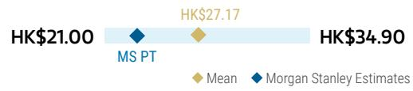

## RISK REWARD CHART

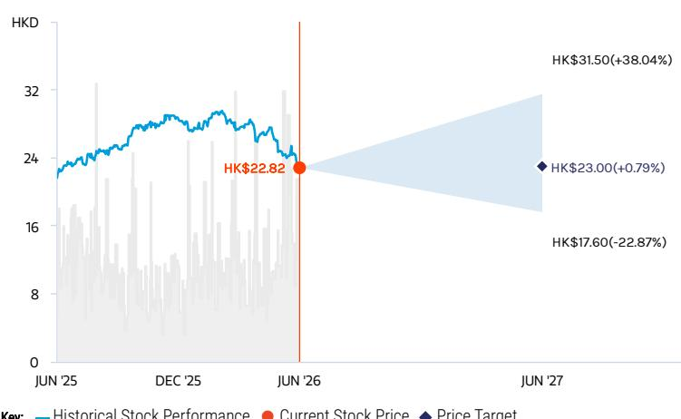  
Source: Refinitiv, MS

## EQUAL-WEIGHT THESIS

■ The company will keep gaining volume share in the tissue industry, while margin still depends on the industry competitive landscape.

\- Its GPM will likely stay broadly stable to slightly lower, as stable raw material cost supports margins, while rising online/new retail mix caps further upside.

■ The company's sanitary napkins business is still under pressure given intensified market competition.

■ EW, given fair valuation and stable DPS commitment.

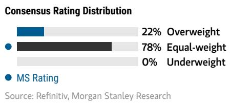

## Risk Reward Themes

Pricing Power: Negative
Self-help: Positive

View descriptions of Risk Rewards Themes here

## BULL CASE

## 13x bull-case 2026e EPS

HK\$31.50

Launch of new products and new A&P investments enhance pricing power and sales trend: 1) Sales growth to be faster in 2026-27, as Hengan is able to gain more market share from peers. 2) Price of key raw materials like pulp to drop more significantly than expected.

## BASE CASE

## HK\$23.00

## 10x base-case 2026e EPS

Tissues to lead sales growth: We estimate sales CAGR of 3% in 2025-27e. Pulp prices drop from 3Q24 to benefit gross margin but offset by increasing promotions and higher penetration in online and new retail channels. Dividend yield to stay at \~5-6% in 2026 and beyond.

## BEAR CASE

HK\$17.60

## 9x bear-case 2026e EPS

Growth limited amid intensifying industry competition: 1) More time is needed to re-energize top-line growth while tissue growth is decelerating. 2) Pulp prices to stay at high levels, resulting in slower-than-expected profitability recovery. 3) Industry to remain promotional and further dampen margin.

## Risk Reward – Hengan International Group (1044.HK)

## KEY EARNINGS INPUTS

<table><tr><td>Drivers</td><td>Dec 2025</td><td>Dec 2026e</td><td>Dec 2027e</td><td>Dec 2028e</td></tr><tr><td>Core HPC Categories Growth (%)</td><td>1.9</td><td>3.2</td><td>2.8</td><td>3.4</td></tr><tr><td>Sanitary Napkins Sales Growth (%)</td><td>(8.2)</td><td>(0.5)</td><td>1.5</td><td>2.0</td></tr><tr><td>Diapers Sales Growth (%)</td><td>7.9</td><td>(1.0)</td><td>(0.0)</td><td>1.0</td></tr><tr><td>Tissue Paper Sales Growth (%)</td><td>5.6</td><td>5.0</td><td>3.5</td><td>4.0</td></tr></table>

## INVESTMENT DRIVERS

• Successful rollout of new products

\- Upgrades to management guidance

• Potential price hikes in HPC categories

## GLOBAL REVENUE EXPOSURE

  
Source: MS Estimate View explanation of regional hierarchies here

## MS ALPHA MODELS

Source: Refinitiv, FactSet, MS; 1 is the highest favored Quintile and 5 is the least favored Quintile

## RISKS TO PT/RATING

## RISKS TO UPSIDE

• Sales turnaround in sanitary napkin

• Successful launch of new products

• Market share gain in tissue

• Significant drop in raw material prices

\- Effective price increase to offset pulp price pressure

## RISKS TO DOWNSIDE

• Unfavorable raw material prices

\- Increasing competition from e-commerce and emerging brands in sanitary napkin

\- Unable to pass through cost pressure to consumers

\- Ineffective business restructuring

## OWNERSHIP POSITIONING

<table><tr><td>Inst. Owners, % Active</td><td>43%</td></tr></table>

Source: Refinitiv, MS

MS ESTIMATES VS. CONSENSUS  
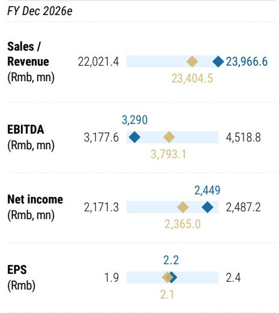  
Mean MS Estimates Source: Refinitiv, MS

# C&S Paper (UW, New Price Target Rmb5.7)

\- Revenue growth should be mostly volume / share-gain driven, rather than pricing driven. In 2025, C&S Paper's tissue revenue grew 8% y/y, while tissue sales volume grew 11%, suggesting ASP / mix was still a drag. We think the company can continue to gain share as some smaller players exit and it leverages its national production base and multi-channel network, but we do not see strong pricing power yet. In our model, tissue revenue grows 10.0%/8.0%/5.0% in 2026/27/28, driving total revenue growth of 9.9%/7.9%/5.0%. We think the growth is still more volume-led than price-led, and revenue momentum may moderate as the base gets higher.

\- Online and new retail channels help drive volume, but may continue to dilute pricing. The company has built a six-channel sales system across traditional distributors, KA (key account), AFH (away-from-home), e-commerce, new retail and export channels, while online channels focus on high-margin products, new products, and trend products. However, higher online / new retail penetration usually requires more promotion and sharper pricing, which can offset part of the volume growth benefit. We therefore think channel expansion can support volume and market share, but may not translate into meaningful ASP or margin upside.

\- GPM should stay broadly stable, but upside looks limited. C&S Paper's tissue GPM improved to 34.0% in 2025, up 3ppt y/y, helped by raw material prices, product mix and channel optimization. In our model, overall GPM stays largely stable at 33.8%/33.9%/34.0% in 2026/27/28, vs. 34.0% in 2025. We think this is reasonable because pulp prices are not likely to remain as favorable as in 2025, while channel competition and promotional intensity remain constraints. Although product premiumization and efficiency improvement can help offset cost pressure, we do not assume meaningful GPM upside from here.

\- Operating leverage is limited, despite some mild expense ratio improvement. We project the selling expense ratio to edge down from 21.4% in 2025 to 21.3%/21.0%/21.0% in 2026/27/28, while the admin expense ratio stays broadly stable at 6.6-6.7%. As a result, OPM is likely to stay almost flat at 5.0% in 2026, before gradually recovering to 5.5%/5.6% in 2027/28. We think the company still needs to spend on branding, e-commerce / new retail expansion and product innovation, so operating leverage should be gradual rather than strong.

\- Net, earnings recovery is visible but still not exciting. We forecast net profit to grow 14% in 2026, followed by 20%/7% growth in 2027/28, reaching Rmb365mn/Rmb436mn/Rmb468mn. Net margin should remain low at 3.8%/4.2%/4.3% in 2026/27/28. We acknowledge the company's tissue share-gain potential and product upgrade efforts, but we think the earnings recovery is still not strong enough given the lack of meaningful pricing power, small contribution from non-tissue categories, and ongoing channel investment needs.

\- Valuation-wise, the stock does not look attractive enough, especially given its low ROE profile. While C&S Paper is a leading tissue brand with stable share-gain potential, we think the current valuation already prices in a fair amount of earnings recovery. More importantly, ROE was only 5.8% in 2025 and is expected to recover to only 6.5% in 2026E. Given limited margin upside, weak pricing power and only moderate earnings recovery from a low base, we think risk-reward is not

compelling. Remain UW.

## Estimate changes

We revise down our revenue forecast for 2026 by 2% based on 2025 below-expectation performance, while we raise our forecast for 2027 by 1% reflecting continuous share gains. We introduce our 2028 forecasts and now expect revenue growth to be 10%/8%/5% during 2026/27/28 respectively.

We revise up our gross margin assumption by 0.2ppt for 2026 on high GPM in 2025, but we trim GPM by 0.7ppt in 2027, considering pressure from new retail channel expansion. We now estimate GPM to be 33.8%/33.9%/34.0% in 2026/27/28, respectively.

We cut our net profit forecasts by 20% and 27% for 2026 and 2027, mainly driven by lower other income. We estimate NPM will be 3.8%/4.2%/4.3% in 2026/27/28, respectively.

Exhibit 7: C&S Paper: Earnings Estimate Revisions

<table><tr><td rowspan="2">Rmb mn; YE December</td><td colspan="3">New</td><td colspan="2">Old</td><td colspan="2">New vs. Old</td></tr><tr><td>2026E</td><td>2027E</td><td>2028E</td><td>2026E</td><td>2027E</td><td>2026E</td><td>2027E</td></tr><tr><td>Net Sales</td><td>9,646</td><td>10,410</td><td>10,926</td><td>9,842</td><td>10,334</td><td>-2%</td><td>1%</td></tr><tr><td>Cost of Goods Sold</td><td>(6,389)</td><td>(6,876)</td><td>(7,207)</td><td>(6,534)</td><td>(6,758)</td><td>-2%</td><td>2%</td></tr><tr><td>Gross Profit</td><td>3,257</td><td>3,534</td><td>3,719</td><td>3,307</td><td>3,576</td><td>-2%</td><td>-1%</td></tr><tr><td>Operating Expenses</td><td>(2,772)</td><td>(2,961)</td><td>(3,110)</td><td>(2,826)</td><td>(2,936)</td><td>-2%</td><td>1%</td></tr><tr><td>Business tax &amp; Surcharges</td><td>(73)</td><td>(78)</td><td>(82)</td><td>(64)</td><td>(67)</td><td>13%</td><td>17%</td></tr><tr><td>Selling &amp; Distribution Expenses</td><td>(2,059)</td><td>(2,191)</td><td>(2,300)</td><td>(1,978)</td><td>(2,046)</td><td>4%</td><td>7%</td></tr><tr><td>Administrative Expenses</td><td>(640)</td><td>(692)</td><td>(727)</td><td>(784)</td><td>(823)</td><td>-18%</td><td>-16%</td></tr><tr><td>Operating Profit</td><td>485</td><td>572</td><td>610</td><td>482</td><td>639</td><td>1%</td><td>-10%</td></tr><tr><td>Finance Expense</td><td>(11)</td><td>(3)</td><td>2</td><td>(15)</td><td>(12)</td><td>-25%</td><td>-71%</td></tr><tr><td>Other Income, Net</td><td>12</td><td>12</td><td>13</td><td>69</td><td>71</td><td>-83%</td><td>-83%</td></tr><tr><td>Profit Before Tax</td><td>486</td><td>581</td><td>624</td><td>537</td><td>698</td><td>-9%</td><td>-17%</td></tr><tr><td>Income Tax Expenses</td><td>(122)</td><td>(145)</td><td>(156)</td><td>(80)</td><td>(105)</td><td>51%</td><td>39%</td></tr><tr><td>Net Profit</td><td>365</td><td>436</td><td>468</td><td>456</td><td>593</td><td>-20%</td><td>-27%</td></tr><tr><td>Recurring Net Profit</td><td>350</td><td>421</td><td>453</td><td>387</td><td>523</td><td>-10%</td><td>-20%</td></tr><tr><td>EBITDA</td><td>742</td><td>824</td><td>857</td><td>511</td><td>668</td><td>45%</td><td>23%</td></tr><tr><td>Earnings per share (Rmb)</td><td></td><td></td><td></td><td></td><td></td><td></td><td></td></tr><tr><td>EPS - Reported</td><td>0.28</td><td>0.34</td><td>0.36</td><td>0.35</td><td>0.46</td><td>-20%</td><td>-26%</td></tr><tr><td>EPS - Recurring</td><td>0.27</td><td>0.33</td><td>0.35</td><td>0.30</td><td>0.40</td><td>-9%</td><td>-19%</td></tr><tr><td>Growth (% yoy)</td><td></td><td></td><td></td><td></td><td></td><td></td><td></td></tr><tr><td>Sales</td><td>9.9%</td><td>7.9%</td><td>5.0%</td><td>8.0%</td><td>5.0%</td><td>1.9%</td><td>2.9%</td></tr><tr><td>Cost of Sales</td><td>10.2%</td><td>7.6%</td><td>4.8%</td><td>6.4%</td><td>3.4%</td><td>3.9%</td><td>4.2%</td></tr><tr><td>Gross Profit</td><td>9.1%</td><td>8.5%</td><td>5.2%</td><td>11.2%</td><td>8.1%</td><td>-2.1%</td><td>0.4%</td></tr><tr><td>Selling and Distribution Expense</td><td>9.4%</td><td>6.4%</td><td>5.0%</td><td>8.0%</td><td>3.4%</td><td>1.4%</td><td>3.0%</td></tr><tr><td>Administrative Expense</td><td>11.2%</td><td>8.2%</td><td>5.1%</td><td>7.9%</td><td>5.1%</td><td>3.3%</td><td>3.1%</td></tr><tr><td>Profit Before Tax</td><td>13.1%</td><td>19.5%</td><td>7.4%</td><td>38.3%</td><td>30.1%</td><td>-25.3%</td><td>-10.6%</td></tr><tr><td>Net Profit</td><td>14.4%</td><td>19.5%</td><td>7.4%</td><td>38.3%</td><td>30.1%</td><td>-23.9%</td><td>-10.6%</td></tr><tr><td>Recurring Net Income</td><td>12.1%</td><td>20.2%</td><td>7.6%</td><td>48.1%</td><td>35.1%</td><td>-36.0%</td><td>-14.8%</td></tr><tr><td>EPS - Reported</td><td>13.3%</td><td>19.5%</td><td>7.4%</td><td>38.3%</td><td>30.1%</td><td>-25.0%</td><td>-10.6%</td></tr><tr><td>Margins (%)</td><td></td><td></td><td></td><td></td><td></td><td></td><td></td></tr><tr><td>Gross Margin</td><td>33.8%</td><td>33.9%</td><td>34.0%</td><td>33.6%</td><td>34.6%</td><td>0.2%</td><td>-0.7%</td></tr><tr><td>Opex/sales</td><td>28.7%</td><td>28.4%</td><td>28.5%</td><td>28.7%</td><td>28.4%</td><td>0.0%</td><td>0.0%</td></tr><tr><td>Business tax &amp; Surcharges</td><td>0.8%</td><td>0.8%</td><td>0.8%</td><td>0.7%</td><td>0.7%</td><td>0.1%</td><td>0.1%</td></tr><tr><td>Selling &amp; Distribution Expenses</td><td>21.3%</td><td>21.0%</td><td>21.0%</td><td>20.1%</td><td>19.8%</td><td>1.3%</td><td>1.3%</td></tr><tr><td>Administrative Expenses</td><td>6.6%</td><td>6.6%</td><td>6.7%</td><td>8.0%</td><td>8.0%</td><td>-1.3%</td><td>-1.3%</td></tr><tr><td>Operating Margin</td><td>5.0%</td><td>5.5%</td><td>5.6%</td><td>4.9%</td><td>6.2%</td><td>0.1%</td><td>-0.7%</td></tr><tr><td>EBITDA Margin</td><td>7.7%</td><td>7.9%</td><td>7.8%</td><td>5.2%</td><td>6.5%</td><td>2.5%</td><td>1.4%</td></tr><tr><td>Profit Before Tax Margin</td><td>5.0%</td><td>5.6%</td><td>5.7%</td><td>5.5%</td><td>6.8%</td><td>-0.4%</td><td>-1.2%</td></tr><tr><td>Net Profit Margin</td><td>3.8%</td><td>4.2%</td><td>4.3%</td><td>4.6%</td><td>5.7%</td><td>-0.9%</td><td>-1.6%</td></tr><tr><td>ROE</td><td>6.3%</td><td>7.1%</td><td>7.3%</td><td>7.5%</td><td>9.1%</td><td>-1.2%</td><td>-1.9%</td></tr></table>

Source: MS, E=MS estimates

## Valuation

to Rmb5.7, based on 20x 2026e P/E (decreased from 22x previously). Compared with its 5-year average P/E multiple of 24x NTM, we expect C&S to trade lower for the next 12 months, given the ongoing intensified competition in the industry.

We adjust our bull and bear case values by similar magnitudes accordingly. Our new bull case value of Rmb10.2 is derived from a target P/E of 30x 2026e, while our bear case value of Rmb3.6 is derived from a target P/E of 17x 2026e.

Exhibit 8: C&S Paper: P/E Valuation

<table><tr><td>C&amp;S Paper - P/E valuation</td><td>2021</td><td>2022</td><td>2023</td><td>2024</td><td>2025</td><td>2026e</td><td>2027e</td><td>2028e</td><td>2024-26e CAGR</td><td>2025-27e CAGR</td></tr><tr><td colspan="11">Base Case Scenario</td></tr><tr><td>Revenue</td><td>9,150</td><td>8,570</td><td>9,801</td><td>8,151</td><td>8,780</td><td>9,646</td><td>10,410</td><td>10,926</td><td>9%</td><td>9%</td></tr><tr><td>Net Income</td><td>581</td><td>350</td><td>333</td><td>77</td><td>319</td><td>365</td><td>436</td><td>468</td><td>117%</td><td>17%</td></tr><tr><td>% YoY</td><td>-36%</td><td>-40%</td><td>-5%</td><td>-77%</td><td>313%</td><td>14%</td><td>20%</td><td>7%</td><td></td><td></td></tr><tr><td>EPS - Rmb</td><td>0.44</td><td>0.27</td><td>0.26</td><td>0.06</td><td>0.25</td><td>0.28</td><td>0.34</td><td>0.36</td><td></td><td></td></tr><tr><td>P/E (PT Implied)</td><td>13</td><td>21</td><td>22</td><td>95</td><td>23</td><td>20</td><td>17</td><td>16</td><td></td><td></td></tr><tr><td>Base Value</td><td></td><td></td><td></td><td></td><td>Rmb</td><td>5.7</td><td></td><td></td><td></td><td></td></tr><tr><td colspan="11">Bull Case Scenario</td></tr><tr><td>Net Income</td><td>581</td><td>350</td><td>333</td><td>77</td><td>319</td><td>437</td><td>501</td><td>538</td><td>138%</td><td>25%</td></tr><tr><td>% YoY</td><td>-36%</td><td>-40%</td><td>-5%</td><td>-77%</td><td>313%</td><td>37%</td><td>15%</td><td>7%</td><td></td><td></td></tr><tr><td>% Higher than Base</td><td></td><td></td><td></td><td></td><td></td><td>20%</td><td>15%</td><td>15%</td><td></td><td></td></tr><tr><td>EPS - Rmb</td><td>0.44</td><td>0.27</td><td>0.25</td><td>0.06</td><td>0.25</td><td>0.34</td><td>0.39</td><td>0.42</td><td></td><td></td></tr><tr><td>P/E (PT Implied)</td><td>23</td><td>38</td><td>41</td><td>174</td><td>41</td><td>30</td><td>26</td><td>24</td><td></td><td></td></tr><tr><td>Bull Value</td><td></td><td></td><td></td><td></td><td>Rmb</td><td>10.2</td><td></td><td></td><td></td><td></td></tr><tr><td colspan="11">Bear Case Scenario</td></tr><tr><td>Net Income</td><td>581</td><td>350</td><td>333</td><td>77</td><td>319</td><td>273</td><td>349</td><td>375</td><td>88%</td><td>5%</td></tr><tr><td>% YoY</td><td>-36%</td><td>-40%</td><td>-5%</td><td>-77%</td><td>313%</td><td>-14%</td><td>28%</td><td>7%</td><td></td><td></td></tr><tr><td>% Lower than Base</td><td></td><td></td><td></td><td></td><td></td><td>-25%</td><td>-20%</td><td>-20%</td><td></td><td></td></tr><tr><td>EPS - Rmb</td><td>0.44</td><td>0.27</td><td>0.25</td><td>0.06</td><td>0.25</td><td>0.21</td><td>0.27</td><td>0.29</td><td></td><td></td></tr><tr><td>P/E (PT Implied)</td><td>8</td><td>14</td><td>14</td><td>61</td><td>15</td><td>17</td><td>13</td><td>12</td><td></td><td></td></tr><tr><td>Bear Value</td><td></td><td></td><td></td><td></td><td>Rmb</td><td>3.6</td><td></td><td></td><td></td><td></td></tr></table>

Source: Company data, MS, E=MS estimates

# C&S Paper: Financial Summary

Exhibit 9: C&S Paper: Financial summary

<table><tr><td>Income Statement</td><td>2024</td><td>2025</td><td>2026e</td><td>2027e</td><td>2028e</td></tr><tr><td>Rmbmn, YE Dec</td><td></td><td></td><td></td><td></td><td></td></tr><tr><td>Revenue</td><td>8,151</td><td>8,780</td><td>9,646</td><td>10,410</td><td>10,926</td></tr><tr><td>Cost of Sales</td><td>5,648</td><td>5,795</td><td>6,389</td><td>6,876</td><td>7,207</td></tr><tr><td>Gross Profit</td><td>2,502</td><td>2,985</td><td>3,257</td><td>3,534</td><td>3,719</td></tr><tr><td>Business tax &amp; Surcharges</td><td>53</td><td>75</td><td>73</td><td>78</td><td>82</td></tr><tr><td>Selling &amp; Distribution Exp.</td><td>1,760</td><td>1,883</td><td>2,059</td><td>2,191</td><td>2,300</td></tr><tr><td>Admin Exp.</td><td>642</td><td>575</td><td>640</td><td>692</td><td>727</td></tr><tr><td>Operating Profit</td><td>47</td><td>451</td><td>485</td><td>572</td><td>610</td></tr><tr><td>Net Financial Income</td><td>(17)</td><td>(33)</td><td>(11)</td><td>(3)</td><td>2</td></tr><tr><td>Other Income, Gains</td><td>68</td><td>11</td><td>12</td><td>12</td><td>13</td></tr><tr><td>Profit Before Tax</td><td>98</td><td>430</td><td>486</td><td>581</td><td>624</td></tr><tr><td>Income Tax Expenses</td><td>22</td><td>114</td><td>122</td><td>145</td><td>156</td></tr><tr><td>Minority interest</td><td>(1)</td><td>(2)</td><td>-</td><td>-</td><td>-</td></tr><tr><td>Net Profit</td><td>77</td><td>319</td><td>365</td><td>436</td><td>468</td></tr><tr><td>EBIT</td><td>47</td><td>451</td><td>485</td><td>572</td><td>610</td></tr><tr><td>EBITDA</td><td>459</td><td>871</td><td>742</td><td>824</td><td>857</td></tr><tr><td>EPS - basic (Rmb)</td><td>0.06</td><td>0.25</td><td>0.28</td><td>0.34</td><td>0.36</td></tr><tr><td>EPS - diluted (Rmb)</td><td>0.06</td><td>0.25</td><td>0.28</td><td>0.34</td><td>0.36</td></tr></table>

<table><tr><td>Cash Flow</td><td>2024</td><td>2025</td><td>2026</td><td>2027</td><td>2028</td></tr><tr><td>Rmbmn, YE Dec</td><td></td><td></td><td></td><td></td><td></td></tr><tr><td>Profit After Tax</td><td>76</td><td>316</td><td>365</td><td>436</td><td>468</td></tr><tr><td>Depre. &amp; Amort.</td><td>412</td><td>420</td><td>257</td><td>251</td><td>247</td></tr><tr><td>Finance cost</td><td>40</td><td>66</td><td>31</td><td>31</td><td>31</td></tr><tr><td>Change in W/C</td><td>(881)</td><td>511</td><td>97</td><td>(42)</td><td>(35)</td></tr><tr><td>Others</td><td>4</td><td>26</td><td>28</td><td>29</td><td>29</td></tr><tr><td>Operating Cash Flow</td><td>(349)</td><td>1,340</td><td>777</td><td>704</td><td>741</td></tr><tr><td>Capex</td><td>(428)</td><td>(284)</td><td>(294)</td><td>(305)</td><td>(310)</td></tr><tr><td>investments income</td><td>17</td><td>20</td><td>-</td><td>-</td><td>-</td></tr><tr><td>Others</td><td>(24)</td><td>385</td><td>(21)</td><td>-</td><td>-</td></tr><tr><td>Investing Cash Flow</td><td>(435)</td><td>121</td><td>(315)</td><td>(305)</td><td>(310)</td></tr><tr><td>Net borrowings</td><td>438</td><td>(315)</td><td>-</td><td>-</td><td>-</td></tr><tr><td>Equity financing</td><td>(108)</td><td>(92)</td><td>(53)</td><td>(109)</td><td>(131)</td></tr><tr><td>Financing Cash Flow</td><td>201</td><td>(562)</td><td>(83)</td><td>(140)</td><td>(161)</td></tr><tr><td>Fx/Others</td><td>2</td><td>(31)</td><td>-</td><td>-</td><td>-</td></tr><tr><td>Net Change in Cash</td><td>(580)</td><td>868</td><td>379</td><td>259</td><td>270</td></tr><tr><td>Cash at year beginning</td><td>2,068</td><td>1,488</td><td>2,355</td><td>2,734</td><td>2,993</td></tr><tr><td>Cash at end of year end</td><td>1,488</td><td>2,355</td><td>2,734</td><td>2,993</td><td>3,263</td></tr></table>

<table><tr><td>Balance Sheet</td><td>2024</td><td>2025</td><td>2026e</td><td>2027e</td><td>2028e</td></tr><tr><td>Cash</td><td>1,581</td><td>2,436</td><td>2,815</td><td>3,074</td><td>3,344</td></tr><tr><td>Inventories</td><td>2,059</td><td>1,464</td><td>1,750</td><td>1,884</td><td>1,975</td></tr><tr><td>Trade Receivables</td><td>-</td><td>-</td><td>-</td><td>-</td><td>-</td></tr><tr><td>Other Receivables</td><td>462</td><td>21</td><td>37</td><td>40</td><td>41</td></tr><tr><td>Other Current Assets</td><td>377</td><td>352</td><td>352</td><td>352</td><td>352</td></tr><tr><td>Total Current Assets</td><td>5,485</td><td>5,306</td><td>6,062</td><td>6,530</td><td>6,937</td></tr><tr><td>Investment Property</td><td>29</td><td>27</td><td>27</td><td>27</td><td>27</td></tr><tr><td>PP&amp;E</td><td>3,031</td><td>2,859</td><td>2,794</td><td>2,748</td><td>2,714</td></tr><tr><td>Construction in progress</td><td>90</td><td>42</td><td>92</td><td>142</td><td>192</td></tr><tr><td>Intangible assets</td><td>312</td><td>336</td><td>360</td><td>381</td><td>398</td></tr><tr><td>Other Non-Currents</td><td>62</td><td>69</td><td>69</td><td>69</td><td>69</td></tr><tr><td>Total Non-Current Assets</td><td>3,851</td><td>3,651</td><td>3,660</td><td>3,685</td><td>3,718</td></tr><tr><td>Total Assets</td><td>9,336</td><td>8,957</td><td>9,722</td><td>10,215</td><td>10,655</td></tr><tr><td>Short Term Borrowings</td><td>1,348</td><td>1,098</td><td>1,098</td><td>1,098</td><td>1,098</td></tr><tr><td>Trade Payables</td><td>1,014</td><td>739</td><td>1,138</td><td>1,243</td><td>1,303</td></tr><tr><td>Tax Payable</td><td>44</td><td>96</td><td>96</td><td>96</td><td>96</td></tr><tr><td>Other Payables</td><td>694</td><td>734</td><td>810</td><td>871</td><td>913</td></tr><tr><td>Total Current Liabilities</td><td>3,720</td><td>3,353</td><td>3,827</td><td>3,995</td><td>4,096</td></tr><tr><td>Long term debt</td><td>62</td><td>-</td><td>-</td><td>-</td><td>-</td></tr><tr><td>Deferred income</td><td>123</td><td>114</td><td>114</td><td>114</td><td>114</td></tr><tr><td>Total Non-Current Liabilities</td><td>193</td><td>122</td><td>122</td><td>122</td><td>122</td></tr><tr><td>Total Liabilities</td><td>3,913</td><td>3,475</td><td>3,949</td><td>4,116</td><td>4,218</td></tr><tr><td>Share Capital</td><td>1,294</td><td>1,286</td><td>1,286</td><td>1,286</td><td>1,286</td></tr><tr><td>Reserves</td><td>573</td><td>551</td><td>551</td><td>551</td><td>551</td></tr><tr><td>Minority Interest</td><td>9</td><td>21</td><td>-</td><td>-</td><td>-</td></tr><tr><td>Total Equity</td><td>5,423</td><td>5,482</td><td>5,773</td><td>6,099</td><td>6,436</td></tr><tr><td>Total Equity and Liabilities</td><td>9,336</td><td>8,957</td><td>9,722</td><td>10,215</td><td>10,655</td></tr></table>

Source: Company data, MS (e) estimates

<table><tr><td>Ratio Analysis</td><td>2024</td><td>2025e</td><td>2026e</td><td>2027e</td><td>2028e</td></tr><tr><td colspan="6">Growth (%)</td></tr><tr><td>Sales</td><td>-17%</td><td>8%</td><td>10%</td><td>8%</td><td>5%</td></tr><tr><td>Gross Profit</td><td>-23%</td><td>19%</td><td>9%</td><td>8%</td><td>5%</td></tr><tr><td>EBIT</td><td>-83%</td><td>854%</td><td>8%</td><td>18%</td><td>7%</td></tr><tr><td>EBITDA</td><td>-34%</td><td>90%</td><td>-15%</td><td>11%</td><td>4%</td></tr><tr><td>Net Profit</td><td>-77%</td><td>313%</td><td>14%</td><td>20%</td><td>7%</td></tr><tr><td colspan="6">Margins (%)</td></tr><tr><td>Gross Margin</td><td>30.7%</td><td>34.0%</td><td>33.8%</td><td>33.9%</td><td>34.0%</td></tr><tr><td>Opex</td><td>30.1%</td><td>28.9%</td><td>28.7%</td><td>28.4%</td><td>28.5%</td></tr><tr><td>EBIT</td><td>0.6%</td><td>5.1%</td><td>5.0%</td><td>5.5%</td><td>5.6%</td></tr><tr><td>EBITDA</td><td>5.6%</td><td>9.9%</td><td>7.7%</td><td>7.9%</td><td>7.8%</td></tr><tr><td>Net Profit</td><td>0.9%</td><td>3.6%</td><td>3.8%</td><td>4.2%</td><td>4.3%</td></tr><tr><td colspan="6">Return (%)</td></tr><tr><td>Average ROA</td><td>1%</td><td>4%</td><td>4%</td><td>4%</td><td>4%</td></tr><tr><td>Average ROE</td><td>1%</td><td>6%</td><td>6%</td><td>7%</td><td>7%</td></tr><tr><td>ROA Ending</td><td>1%</td><td>4%</td><td>4%</td><td>4%</td><td>4%</td></tr><tr><td>ROE Ending</td><td>1%</td><td>6%</td><td>6%</td><td>7%</td><td>7%</td></tr><tr><td colspan="6">Efficiency</td></tr><tr><td>Days Inventory</td><td>133</td><td>92</td><td>100</td><td>100</td><td>100</td></tr><tr><td>Days Trade Receivable</td><td>44</td><td>40</td><td>39</td><td>38</td><td>38</td></tr><tr><td>Days Trade Payable</td><td>66</td><td>47</td><td>65</td><td>66</td><td>66</td></tr><tr><td>Cash Cycle</td><td>111</td><td>86</td><td>74</td><td>72</td><td>72</td></tr><tr><td>Asset Turnover (x)</td><td>0.9</td><td>1.0</td><td>1.0</td><td>1.0</td><td>1.0</td></tr><tr><td colspan="6">Valuation</td></tr><tr><td>P/E</td><td>118.3</td><td>28.4</td><td>25.1</td><td>21.0</td><td>19.5</td></tr><tr><td>P/BV</td><td>1.7</td><td>1.7</td><td>1.7</td><td>1.6</td><td>1.5</td></tr><tr><td>EV/EBITDA</td><td>19.7</td><td>9.0</td><td>10.0</td><td>8.7</td><td>8.0</td></tr><tr><td>EPS</td><td>0.06</td><td>0.25</td><td>0.28</td><td>0.34</td><td>0.36</td></tr><tr><td>DPS</td><td>-</td><td>0.04</td><td>0.09</td><td>0.10</td><td>0.11</td></tr><tr><td>FCF Yield</td><td>-9%</td><td>11%</td><td>5%</td><td>4%</td><td>4%</td></tr><tr><td>Div yield</td><td>0.0%</td><td>0.6%</td><td>1.2%</td><td>1.4%</td><td>1.5%</td></tr><tr><td>Shr Out - weighted avg (mn)</td><td>1,294</td><td>1,286</td><td>1,286</td><td>1,286</td><td>1,286</td></tr></table>

## Risk Reward – C&S Paper Co Ltd (002511.SZ)

Less Pressure from Pulp Prices, But Harder to Balance Sales and Margins

## PRICE TARGET Rmb5.70

Base case, derived by applying a target 2026e P/E of 20x, Compared with its 5-year average P/E multiple of 24x NTM, we expect C&S to trade lower for the next 12 months, given the ongoing intensified competition in the industry.

## RISK REWARD CHART

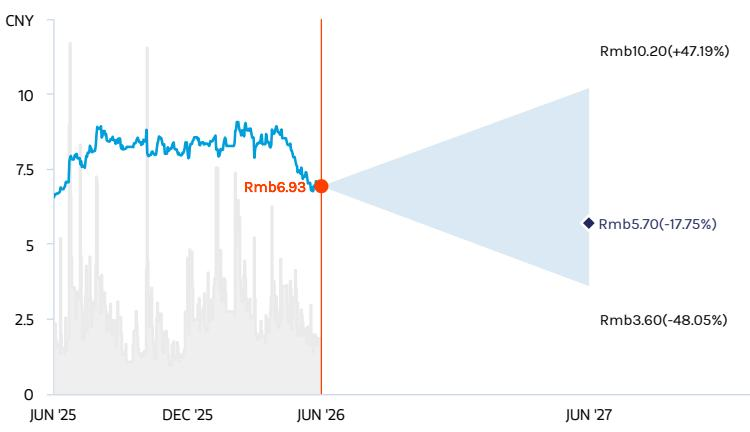  
Key: — Historical Stock Performance ● Current Stock Price ◆ Price Target  
Source: Refinitiv, MS

## UNDERWEIGHT THESIS

\- We forecast a $9\%$ sales CAGR over 2025-27 with a relatively stable GPM.
- But market competition could intensify, given key peers' market share-oriented strategies. Moreover, C&S's future growth could come from products and channels that are margin-dilutive. Thus, profitability going forward could be structurally lower than during previous raw material downcycles.

## Risk Reward Themes

Pricing Power: Negative
View descriptions of Risk Rewards Themes here

## BULL CASE

## Rmb10.20

## 30x 2026e bull-case EPS

Sales and profitability recover better than expected: We assume NPM recovers to mid-to-high single digit in 2026-28, thanks to faster-than-expected top-line growth, more significant drop in pulp price, and more stringent control on expenses.

## BASE CASE

## 20x 2026e base-case EPS

## Rmb5.70

Sales to meet company targets and NPM to gradually recover: We expect 9% sales and 17% NP CAGRs, 2025-27e, with NPM recovering to 3-4% in 2025-27, lower than 2019-20 level of low-teens% NPM.

## BEAR CASE

## Rmb3.60

## 17x 2026e bear-case EPS

Sales growth slows while pulp price stays high, continuing to weigh on profitability: We assume slower than expected recovery of NPM as 1) margin pressure persists as pulp price stays high; 2) higher opex ratio required to defend market share; 3) weak company execution. We assume NPM stays at low-single-digit% level in the next three years.

## Risk Reward – C&S Paper Co Ltd (002511.SZ)

## KEY EARNINGS INPUTS

<table><tr><td>Drivers</td><td>Dec 2025</td><td>Dec 2026e</td><td>Dec 2027e</td><td>Dec 2028e</td></tr><tr><td>Tissue Paper Sales Growth (%)</td><td>8.2</td><td>10.0</td><td>8.0</td><td>5.0</td></tr><tr><td>Sales Volume Growth (%)</td><td>6.2</td><td>2.0</td><td>2.0</td><td>2.0</td></tr><tr><td>ASP Growth (%)</td><td>1.9</td><td>7.8</td><td>5.9</td><td>2.9</td></tr></table>

## INVESTMENT DRIVERS

\- Margin erosion

\- Ineffective price hike

\- Trend of pulp price

\- Industry competition

## GLOBAL REVENUE EXPOSURE

90-100% Mainland China

Source: MS Estimate View explanation of regional hierarchies here

## RISKS TO PT/RATING

RISKS TO UPSIDE

\- Successful price hike.

\- More significant pulp price drop.

\- Faster recovery of demand.

## RISKS TO DOWNSIDE

• Intensified industry competition.

\- Slower-than-expected pulp price drop.

\- More expenses required to sustain top-line growth.

## OWNERSHIP POSITIONING

Source: Refinitiv, MS

## MS ESTIMATES VS. CONSENSUS

FY Dec 2026e

Sales / Revenue 9,646.1
Note: There are not sufficient brokers supplying consensus data for this metric

EBITDA (Rmb, mn) 752 Note: There are not sufficient brokers supplying consensus data for this metric

Net income (Rmb, mn) 365 Note: There are not sufficient brokers supplying consensus data for this metric

EPS (Rmb) 0.3 Note: There are not sufficient brokers supplying consensus data for this metric

◆ Mean ◆ MS Estimates
Source: Refinitiv, MS

## Shanghai Jahwa(UW, New Price Target Rmb14.0)

\- Jahwa is back to growth, but recovery is still brand-investment led. 2025 revenue grew 11% y/y to Rmb6.3bn, driven by domestic online growth and beauty category recovery. We forecast revenue to grow 11%/10%/10% in 2026/27/28, broadly in line with its double-digit revenue growth target for 2026. However, we think this is still more of a brand recovery and channel execution, rather than a strong margin expansion.

\- Liushen offline sales should return to growth, online momentum continues. Liushen's online business delivered strong growth in 2025, while offline decline narrowed to LSD%. Management expects offline to turn positive in 2026, supported by packaging upgrade, channel inventory cleanup, and new retail channel penetration. Product-wise, Liushen will continue to push the upgraded Mosquito Repellent Egg, fragrance shower gel and the new Liushen baby-care line. We think this should stabilize the personal care business, and model personal care revenue growth of $6\% /7\% /7\%$ for 2026/27/28. That said, Liushen is still a relatively mature category, so we do not expect it to be the main source of group-level growth acceleration.

\- Beauty brands are the key growth engine, led by Herborist and Dr. Yu. Beauty revenue grew 54% y/y in 2025, mainly driven by Herborist and Dr. Yu. Herborist's Advanced Whitening Revitalizing Mask already reached over Rmb200 mn GMV in 2025, with 2026 target above Rmb300 mn. Dr. Yu continues to benefit from rapid growth on Douyin and new product launch including Skin Barrier Recovery Moisturizing Cream and Skin Barrier Recovery Oil-Control Moisturizing Gel. Management expects Herborist and Dr. Yu to maintain high DD% online growth in 2026, and each to achieve Rmb1 bn revenue. We expect beauty revenue growth at 30%/20%/18% in 2026/27/28, making it the biggest driver of Jahwa's top-line growth.

\- Online and Douyin remain important growth drivers, but also raise the execution bar. Domestic online mix has increased meaningfully, and Douyin is now one of the fastest-growing channels. The company also builds in-house content teams for Herborist, Dr. Yu and Liushen to improve content quality, conversion and long-term ROI. We think this is strategically positive, but the channel mix also means Jahwa needs to keep investing in content, traffic and brand building, which limits near-term operating leverage.

\- GPM should improve only gradually despite a better category mix. Jahwa's GPM improved by 5ppt y/y to $62.6\%$ in 2025, mainly driven by higher beauty mix, higher-margin new products, and efficiency gains from cost optimization. We forecast GPM to edge up to $63.5\% / 64.1\% / 64.5\%$ in 2026/27/28. However, upside is likely limited, as raw material cost volatility and industry competition remain key headwinds.

\- 2026 will still be a heavy spending year. The 2025 selling expense ratio rose to 48.0%, mainly due to higher brand investment, celebrity endorsement and marketing campaigns. Management expects the 2026 A&P expense ratio to stay broadly flat vs. 2025, but with spending tilted more toward core brands such as Liushen and marketing investment front-loaded into 1H26. Channel fees should be optimized within each platform, but the rising Douyin mix will keep the overall selling expense ratio high. We forecast the selling expense ratio to be 48.0%/47.7%/47.5% in 2026/27/28, and the admin and R&D expense ratio at 12.4%/12.3%/12.2%. This means operating leverage should only come through gradually.

\- Net, we expect earnings to recover, but not as fast as revenue. We forecast net profit to grow 23% in 2026, then 17%/15% in 2027/28, reaching Rmb330 mn/Rmb385 mn/Rmb444 mn. Net margin stays at only 4.7%/5.0%/5.2% in 2026/27/28, still below historical highs. The key reason is that Jahwa is still rebuilding brand equity and consumer engagement, especially in beauty and online channels. We like the direction of brand recovery, but think the market needs more evidence that Herborist and Dr. Yu can scale profitably while Liushen offline stabilizes.

\- Valuation-wise, we think the current valuation is too demanding. Jahwa is trading at >35x 2026P/E on our estimates, which looks expensive given limited earnings visibility. The stock already prices in a meaningful recovery in core brands. We apply 28x 2026E P/E to derive target price of Rmb14, which we think already gives credit to beauty brand acceleration and Liushen stabilization. Given the expensive valuation and ongoing profit pressure, we remain UW.

## Estimate changes

We revise up revenue forecast by 5% for both 2026 and 2027, mainly due to quicker-than-expected revenue growth from the beauty segment. We introduce our 2028 forecast, and now expect revenue growth to be 11%/10%/10% during 2026/27/28 respectively.

We raise our gross margin assumption by 0.3ppt and 0.2ppt for 2026 and 2027, reflecting better revenue mix. We now estimate GPM to be 63.5%/64.1%/64.5% in 2026/27/28, respectively.

Our opex ratio estimate increases by 4.7ppt and 4.9ppt for 2026 and 2027, due to higher A&P expenses. We now estimate the opex ratio to be 61.1%/60.7%/60.4% in 2026/27/28, respectively.

As a result, we cut our net profit forecasts by 35% and 39% for 2026 and 2027, mainly driven by the higher opex ratio. We estimate NPM will be 4.7%, 5.0%, and 5.2% in 2026, 2027, and 2028, respectively.

Exhibit 10: Shanghai Jahwa: Summary of changes

<table><tr><td rowspan="2">(Rmb mn)</td><td colspan="3">New</td><td colspan="2">Old</td><td colspan="2">Change</td></tr><tr><td>2026e</td><td>2027e</td><td>2028e</td><td>2026e</td><td>2027e</td><td>2026e</td><td>2027e</td></tr><tr><td>Sales</td><td>7,031</td><td>7,735</td><td>8,518</td><td>6,725</td><td>7,371</td><td>5%</td><td>5%</td></tr><tr><td>Gross Profit</td><td>4,467</td><td>4,957</td><td>5,490</td><td>4,251</td><td>4,707</td><td>5%</td><td>5%</td></tr><tr><td>Operating Expenses</td><td>(4,298)</td><td>(4,696)</td><td>(5,145)</td><td>(3,796)</td><td>(4,116)</td><td>13%</td><td>14%</td></tr><tr><td>Operating Income</td><td>169</td><td>261</td><td>345</td><td>455</td><td>591</td><td>-63%</td><td>-56%</td></tr><tr><td>Net Profit</td><td>330</td><td>385</td><td>444</td><td>505</td><td>628</td><td>-35%</td><td>-39%</td></tr><tr><td>EPS (basic; Rmb)</td><td>0.49</td><td>0.57</td><td>0.66</td><td>0.75</td><td>0.93</td><td>-35%</td><td>-39%</td></tr><tr><td>Gross Margin</td><td>63.5%</td><td>64.1%</td><td>64.5%</td><td>63.2%</td><td>63.9%</td><td>0.3%</td><td>0.2%</td></tr><tr><td>SG&amp;A to Sales</td><td>61.1%</td><td>60.7%</td><td>60.4%</td><td>56.4%</td><td>55.8%</td><td>4.7%</td><td>4.9%</td></tr><tr><td>Operating Margin</td><td>2.4%</td><td>3.4%</td><td>4.1%</td><td>6.8%</td><td>8.0%</td><td>-4.4%</td><td>-4.6%</td></tr><tr><td>Net Margin</td><td>4.7%</td><td>5.0%</td><td>5.2%</td><td>7.5%</td><td>8.5%</td><td>-2.8%</td><td>-3.5%</td></tr><tr><td>Tax Rate</td><td>15.0%</td><td>15.0%</td><td>15.0%</td><td>11.3%</td><td>11.3%</td><td>3.8%</td><td>3.8%</td></tr></table>

Source: MS, E=MS estimates

## Valuation

We roll our valuation forward to 2026 from 2025, our price target decreases from Rmb16 to Rmb14, based on 28x 2026e P/E (unchanged).

We trim our bull and bear case values by similar magnitudes accordingly. Our new bull case value of Rmb24 is derived from a target P/E of 38x 2026e, while our bear case value of Rmb10 is derived from a target P/E of 25x 2026e.

Exhibit 11: Shanghai Jahwa: P/E Valuation

<table><tr><td>Shanghai Jahwa - P/E valuation</td><td>2022</td><td>2023</td><td>2024</td><td>2025</td><td>2026e</td><td>2027e</td><td>2028e</td><td>2023-25e CAGR</td><td>2024-26e CAGR</td><td>2025-27e CAGR</td></tr><tr><td colspan="11">Base Case Scenario</td></tr><tr><td>Revenue</td><td>7,106</td><td>6,598</td><td>5,679</td><td>6,317</td><td>7,031</td><td>7,735</td><td>8,518</td><td>-2%</td><td>11%</td><td>11%</td></tr><tr><td>% YoY</td><td>-7%</td><td>-7%</td><td>-14%</td><td>11%</td><td>11%</td><td>10%</td><td>10%</td><td></td><td></td><td></td></tr><tr><td>Net Income</td><td>472</td><td>500</td><td>(833)</td><td>268</td><td>330</td><td>385</td><td>444</td><td>-27%</td><td>nm</td><td>20%</td></tr><tr><td>% YoY</td><td>-27%</td><td>6%</td><td>-267%</td><td>-132%</td><td>23%</td><td>17%</td><td>15%</td><td></td><td></td><td></td></tr><tr><td>EPS - Rmb</td><td>0.70</td><td>0.74</td><td>-1.24</td><td>0.40</td><td>0.49</td><td>0.57</td><td>0.66</td><td></td><td></td><td></td></tr><tr><td>NPM</td><td>6.6%</td><td>7.6%</td><td>-14.7%</td><td>4.2%</td><td>4.7%</td><td>5.0%</td><td>5.2%</td><td></td><td></td><td></td></tr><tr><td>Implied P/E</td><td>20</td><td>19</td><td>-11</td><td>35</td><td>29</td><td>24</td><td>21</td><td></td><td></td><td></td></tr><tr><td>Target P/E</td><td></td><td></td><td></td><td></td><td>28</td><td></td><td></td><td></td><td></td><td></td></tr><tr><td>Implied P/S</td><td></td><td>1.3</td><td>1.4</td><td>1.7</td><td>1.5</td><td></td><td></td><td></td><td></td><td></td></tr><tr><td>Base Value</td><td></td><td></td><td></td><td>Rmb</td><td>14.0</td><td></td><td></td><td></td><td></td><td></td></tr><tr><td colspan="11">Bull Case Scenario</td></tr><tr><td>Revenue</td><td>7,106</td><td>6,598</td><td>5,679</td><td>6,317</td><td>7,734</td><td>8,895</td><td>10,222</td><td>-2%</td><td>17%</td><td>19%</td></tr><tr><td>% YoY</td><td>-7%</td><td>-7%</td><td>-14%</td><td>11%</td><td>22%</td><td>15%</td><td>15%</td><td></td><td></td><td></td></tr><tr><td>% Higher than Base</td><td></td><td></td><td></td><td></td><td>10%</td><td>15%</td><td>20%</td><td></td><td></td><td></td></tr><tr><td>Net Income</td><td>472</td><td>500</td><td>(833)</td><td>268</td><td>429</td><td>501</td><td>577</td><td>-27%</td><td>nm</td><td>37%</td></tr><tr><td>% YoY</td><td>-27%</td><td>6%</td><td>-267%</td><td>-132%</td><td>60%</td><td>17%</td><td>15%</td><td></td><td></td><td></td></tr><tr><td>% Higher than Base</td><td></td><td></td><td></td><td></td><td>30%</td><td>30%</td><td>30%</td><td></td><td></td><td></td></tr><tr><td>EPS - Rmb</td><td>0.69</td><td>0.74</td><td>-1.23</td><td>0.40</td><td>0.64</td><td>0.75</td><td>0.86</td><td></td><td></td><td></td></tr><tr><td>Implied P/E</td><td>35</td><td>33</td><td>-19</td><td>60</td><td>38</td><td>32</td><td>28</td><td></td><td></td><td></td></tr><tr><td>Target P/E</td><td></td><td></td><td></td><td></td><td>38</td><td></td><td></td><td></td><td></td><td></td></tr><tr><td>Bull Value</td><td></td><td></td><td></td><td>Rmb</td><td>24.0</td><td></td><td></td><td></td><td></td><td></td></tr><tr><td colspan="11">Bear Case Scenario</td></tr><tr><td>Revenue</td><td>7,106</td><td>6,598</td><td>5,679</td><td>6,317</td><td>6,398</td><td>6,962</td><td>7,240</td><td>-2%</td><td>6%</td><td>5%</td></tr><tr><td>% YoY</td><td>-7%</td><td>-7%</td><td>-14%</td><td>11%</td><td>1%</td><td>9%</td><td>4%</td><td></td><td></td><td></td></tr><tr><td>% Lower than Base</td><td></td><td></td><td></td><td></td><td>-9%</td><td>-10%</td><td>-15%</td><td></td><td></td><td></td></tr><tr><td>Net Income</td><td>472</td><td>500</td><td>(833)</td><td>268</td><td>280</td><td>328</td><td>377</td><td>-27%</td><td>nm</td><td>11%</td></tr><tr><td>% YoY</td><td>-27%</td><td>6%</td><td>-267%</td><td>-132%</td><td>5%</td><td>17%</td><td>15%</td><td></td><td></td><td></td></tr><tr><td>% Lower than Base</td><td></td><td></td><td></td><td></td><td>-15%</td><td>-15%</td><td>-15%</td><td></td><td></td><td></td></tr><tr><td>EPS - Rmb</td><td>0.69</td><td>0.74</td><td>-1.23</td><td>0.40</td><td>0.42</td><td>0.49</td><td>0.56</td><td></td><td></td><td></td></tr><tr><td>Implied P/E</td><td>14</td><td>14</td><td>-8</td><td>25</td><td>24</td><td>21</td><td>18</td><td></td><td></td><td></td></tr><tr><td>Target P/E</td><td></td><td></td><td></td><td></td><td>25</td><td></td><td></td><td></td><td></td><td></td></tr><tr><td>Bear Value</td><td></td><td></td><td></td><td>Rmb</td><td>10.0</td><td></td><td></td><td></td><td></td><td></td></tr></table>

Source: Company data, MS estimates

## Shanghai Jahwa: Financial Summary

Exhibit 12: Shanghai Jahwa: Financial Summary

<table><tr><td>Income Statement</td><td>2024</td><td>2025</td><td>2026e</td><td>2027e</td><td>2028e</td></tr><tr><td colspan="6">Rmbmn, YE Dec</td></tr><tr><td>Revenue</td><td>5,679</td><td>6,317</td><td>7,031</td><td>7,735</td><td>8,518</td></tr><tr><td>Cost of Sales</td><td>(2,408)</td><td>(2,363)</td><td>(2,564)</td><td>(2,778)</td><td>(3,028)</td></tr><tr><td>Gross Profit</td><td>3,271</td><td>3,954</td><td>4,467</td><td>4,957</td><td>5,490</td></tr><tr><td>Selling &amp; Distribution Exp.</td><td>(2,652)</td><td>(3,032)</td><td>(3,374)</td><td>(3,687)</td><td>(4,042)</td></tr><tr><td>Admin Exp.</td><td>(761)</td><td>(789)</td><td>(871)</td><td>(951)</td><td>(1,039)</td></tr><tr><td>Business tax &amp; Surcharges</td><td>(43)</td><td>(50)</td><td>(53)</td><td>(58)</td><td>(64)</td></tr><tr><td>Operating Profit</td><td>(184)</td><td>83</td><td>169</td><td>261</td><td>345</td></tr><tr><td>Net Financial Income</td><td>(31)</td><td>(7)</td><td>(7)</td><td>(5)</td><td>(3)</td></tr><tr><td>Other Income, Gains</td><td>(615)</td><td>239</td><td>226</td><td>199</td><td>181</td></tr><tr><td>Profit Before Tax</td><td>(830)</td><td>315</td><td>388</td><td>454</td><td>523</td></tr><tr><td>Income Tax Expenses</td><td>(3)</td><td>(47)</td><td>(58)</td><td>(68)</td><td>(79)</td></tr><tr><td>Net Profit</td><td>(833)</td><td>268</td><td>330</td><td>385</td><td>444</td></tr><tr><td>EBIT</td><td>(184)</td><td>83</td><td>169</td><td>261</td><td>345</td></tr><tr><td>EBITDA</td><td>37</td><td>311</td><td>261</td><td>359</td><td>451</td></tr><tr><td>EPS - basic (Rmb)</td><td>-1.24</td><td>0.40</td><td>0.49</td><td>0.57</td><td>0.66</td></tr><tr><td>EPS - diluted (Rmb)</td><td>-1.24</td><td>0.40</td><td>0.49</td><td>0.57</td><td>0.66</td></tr></table>

<table><tr><td>Cash Flow</td><td>2024</td><td>2025</td><td>2026e</td><td>2027e</td><td>2028e</td></tr><tr><td>Rmbmn, YE Dec</td><td></td><td></td><td></td><td></td><td></td></tr><tr><td>Profit After Tax</td><td>(833)</td><td>268</td><td>330</td><td>385</td><td>444</td></tr><tr><td>Depreciation and Amortisation</td><td>222</td><td>227</td><td>92</td><td>99</td><td>105</td></tr><tr><td>Finance cost</td><td>36</td><td>11</td><td>45</td><td>45</td><td>45</td></tr><tr><td>Change in W/C</td><td>137</td><td>408</td><td>200</td><td>78</td><td>95</td></tr><tr><td>Other Operating Activities</td><td>712</td><td>(113)</td><td>(19)</td><td>(27)</td><td>(31)</td></tr><tr><td>Operating Cash Flow</td><td>273</td><td>801</td><td>648</td><td>580</td><td>659</td></tr><tr><td>Capex</td><td>(96)</td><td>(77)</td><td>(178)</td><td>(178)</td><td>(178)</td></tr><tr><td>investments income</td><td>84</td><td>177</td><td>43</td><td>45</td><td>48</td></tr><tr><td>Other Investing Activities</td><td>(94)</td><td>(639)</td><td>(19)</td><td>(26)</td><td>(26)</td></tr><tr><td>Investing Cash Flow</td><td>(106)</td><td>(538)</td><td>(154)</td><td>(158)</td><td>(156)</td></tr><tr><td>Net borrowings</td><td>145</td><td>522</td><td>-</td><td>-</td><td>-</td></tr><tr><td>Other Financing Activities</td><td>(691)</td><td>(761)</td><td>(179)</td><td>(210)</td><td>(238)</td></tr><tr><td>Financing Cash Flow</td><td>(545)</td><td>(240)</td><td>(179)</td><td>(210)</td><td>(238)</td></tr><tr><td>FX Gain / (Loss)</td><td>(8)</td><td>(31)</td><td>-</td><td>-</td><td>-</td></tr><tr><td>Net Change in Cash</td><td>(387)</td><td>(7)</td><td>315</td><td>211</td><td>265</td></tr><tr><td>Cash at Beginning of Year</td><td>929</td><td>542</td><td>535</td><td>851</td><td>1,062</td></tr><tr><td>Cash at End of Year</td><td>542</td><td>535</td><td>851</td><td>1,062</td><td>1,327</td></tr></table>

<table><tr><td>Balance Sheet</td><td>2024</td><td>2025</td><td>2026e</td><td>2027e</td><td>2028e</td></tr><tr><td>Cash and Cash Equivalents</td><td>550</td><td>543</td><td>859</td><td>1,070</td><td>1,335</td></tr><tr><td>Inventories</td><td>673</td><td>622</td><td>675</td><td>731</td><td>797</td></tr><tr><td>Account Receivables</td><td>771</td><td>566</td><td>630</td><td>693</td><td>764</td></tr><tr><td>Other Receivables</td><td>34</td><td>45</td><td>50</td><td>55</td><td>61</td></tr><tr><td>Other Current Assets</td><td>3,234</td><td>3,026</td><td>3,028</td><td>3,035</td><td>3,044</td></tr><tr><td>Total Current Assets</td><td>5,262</td><td>4,803</td><td>5,241</td><td>5,585</td><td>6,000</td></tr><tr><td>Fixed Assets</td><td>751</td><td>684</td><td>754</td><td>826</td><td>895</td></tr><tr><td>Long-term Equity Investment</td><td>256</td><td>160</td><td>160</td><td>160</td><td>160</td></tr><tr><td>Intangible assets</td><td>768</td><td>757</td><td>767</td><td>773</td><td>777</td></tr><tr><td>Other Non-Current Assets</td><td>2,908</td><td>3,852</td><td>3,852</td><td>3,852</td><td>3,852</td></tr><tr><td>Total Non-Current Assets</td><td>4,683</td><td>5,453</td><td>5,532</td><td>5,612</td><td>5,684</td></tr><tr><td>Total Assets</td><td>9,944</td><td>10,256</td><td>10,774</td><td>11,197</td><td>11,684</td></tr><tr><td>Account Payables</td><td>500</td><td>575</td><td>770</td><td>834</td><td>909</td></tr><tr><td>Tax Payables</td><td>52</td><td>65</td><td>65</td><td>65</td><td>65</td></tr><tr><td>Other Payables</td><td>1,188</td><td>1,197</td><td>1,325</td><td>1,463</td><td>1,625</td></tr><tr><td>Other Current Liabilities</td><td>943</td><td>1,010</td><td>1,010</td><td>1,010</td><td>1,010</td></tr><tr><td>Total Current Liabilities</td><td>2,682</td><td>2,848</td><td>3,170</td><td>3,372</td><td>3,609</td></tr><tr><td>Long-term Borrowings</td><td>-</td><td>-</td><td>-</td><td>-</td><td>-</td></tr><tr><td>Deferred Revenue</td><td>411</td><td>382</td><td>382</td><td>382</td><td>382</td></tr><tr><td>Other LT Liabilities</td><td>159</td><td>130</td><td>130</td><td>130</td><td>130</td></tr><tr><td>Total Non-Current Liabilities</td><td>570</td><td>512</td><td>512</td><td>512</td><td>512</td></tr><tr><td>Total Liabilities</td><td>3,253</td><td>3,359</td><td>3,682</td><td>3,884</td><td>4,121</td></tr><tr><td>Share Capital</td><td>672</td><td>672</td><td>672</td><td>672</td><td>672</td></tr><tr><td>Reserves</td><td>1,273</td><td>1,292</td><td>1,292</td><td>1,292</td><td>1,292</td></tr><tr><td>Retained Earnings</td><td>4,721</td><td>4,963</td><td>5,158</td><td>5,379</td><td>5,629</td></tr><tr><td>Others</td><td>25</td><td>(31)</td><td>(31)</td><td>(31)</td><td>(31)</td></tr><tr><td>Total Equity</td><td>6,692</td><td>6,897</td><td>7,092</td><td>7,312</td><td>7,563</td></tr><tr><td>Total Equity and Liabilities</td><td>9,944</td><td>10,256</td><td>10,774</td><td>11,197</td><td>11,684</td></tr></table>

Source: Company data, MS, E=MS estimates

<table><tr><td>Ratio Analysis</td><td>2024</td><td>2025</td><td>2026e</td><td>2027e</td><td>2028e</td></tr><tr><td colspan="6">Growth (%)</td></tr><tr><td>Sales</td><td>-14%</td><td>11%</td><td>11%</td><td>10%</td><td>10%</td></tr><tr><td>Gross Profit</td><td>-16%</td><td>21%</td><td>13%</td><td>11%</td><td>11%</td></tr><tr><td>EBIT</td><td>-159%</td><td>-145%</td><td>103%</td><td>54%</td><td>32%</td></tr><tr><td>EBITDA</td><td>-93%</td><td>734%</td><td>-16%</td><td>38%</td><td>25%</td></tr><tr><td>Net Profit</td><td>-267%</td><td>-132%</td><td>23%</td><td>17%</td><td>15%</td></tr><tr><td colspan="6">Margins (%)</td></tr><tr><td>Gross Margin</td><td>57.6%</td><td>62.6%</td><td>63.5%</td><td>64.1%</td><td>64.5%</td></tr><tr><td>Opex</td><td>-60.8%</td><td>-61.3%</td><td>-61.1%</td><td>-60.7%</td><td>-60.4%</td></tr><tr><td>EBIT</td><td>-3.2%</td><td>1.3%</td><td>2.4%</td><td>3.4%</td><td>4.1%</td></tr><tr><td>EBITDA</td><td>0.7%</td><td>4.9%</td><td>3.7%</td><td>4.6%</td><td>5.3%</td></tr><tr><td>Net Profit</td><td>-14.7%</td><td>4.2%</td><td>4.7%</td><td>5.0%</td><td>5.2%</td></tr><tr><td colspan="6">Return (%)</td></tr><tr><td>Average ROA</td><td>-8%</td><td>3%</td><td>3%</td><td>4%</td><td>4%</td></tr><tr><td>Average ROE</td><td>-12%</td><td>4%</td><td>5%</td><td>5%</td><td>6%</td></tr><tr><td>ROA (Period End)</td><td>-8%</td><td>3%</td><td>3%</td><td>3%</td><td>4%</td></tr><tr><td>ROE (Period End)</td><td>-12%</td><td>4%</td><td>5%</td><td>5%</td><td>6%</td></tr><tr><td colspan="6">Efficiency</td></tr><tr><td>Inventory Days</td><td>102</td><td>96</td><td>96</td><td>96</td><td>96</td></tr><tr><td>A/R Days</td><td>50</td><td>33</td><td>33</td><td>33</td><td>33</td></tr><tr><td>A/P Days</td><td>76</td><td>89</td><td>110</td><td>110</td><td>110</td></tr><tr><td>Cash Cycle</td><td>76</td><td>40</td><td>19</td><td>19</td><td>19</td></tr><tr><td>Asset Turnover (x)</td><td>0.6</td><td>0.6</td><td>0.7</td><td>0.7</td><td>0.7</td></tr><tr><td colspan="6">Valuation</td></tr><tr><td>P/E</td><td>-18.9</td><td>58.8</td><td>35.9</td><td>30.7</td><td>26.6</td></tr><tr><td>P/BV</td><td>2.4</td><td>2.3</td><td>1.7</td><td>1.6</td><td>1.6</td></tr><tr><td>EV/EBITDA</td><td>409.9</td><td>50.7</td><td>44.1</td><td>31.5</td><td>24.5</td></tr><tr><td>EPS</td><td>(1.24)</td><td>0.40</td><td>0.49</td><td>0.57</td><td>0.66</td></tr><tr><td>DPS</td><td>-</td><td>0.20</td><td>0.25</td><td>0.29</td><td>0.33</td></tr><tr><td>Div yield</td><td>0.0%</td><td>0.9%</td><td>1.4%</td><td>1.6%</td><td>1.9%</td></tr></table>

## Risk Reward – Shanghai Jahwa United Co. Ltd. (600315.SS)

Turnaround takes time

## PRICE TARGET Rmb14.00

Rmb14: base case, 28x 2026 EPS estimate, below its 5Y average. We forecast 11% sales growth on a compounding basis in 2025-27e.

Consensus Price Target Distribution

Source: Refinitiv, MS

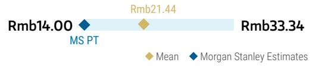

## RISK REWARD CHART

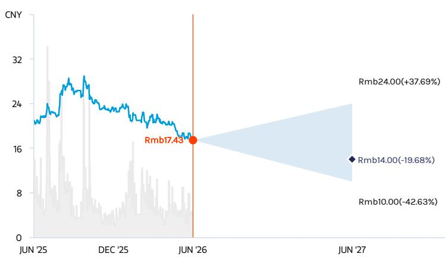  
Source: Refinitiv, MS

## UNDERWEIGHT THESIS

■ For a turnaround, we think Jahwa's team and execution are more important than its strategy

■ We think its renewed focus on brands, products and online channels is reasonable, while we think the key will be its new executives, BU heads and their execution. The scope of personnel replacement this time appears to be larger than prior rounds, suggesting a higher chance of a different result.

■ We see progress in Jahwa after the management transition, but also think it's too early to call an inflection, especially given that the beauty industry remains highly competitive and promotional.

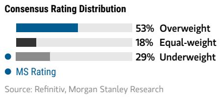

## Risk Reward Themes

Pricing Power: Negative
Secular Growth: Negative
View descriptions of Risk Rewards Themes here

## BULL CASE

## 38x 2026e bull case EPS

Rmb24.00

Faster growth of skincare brands and e-com channel: We assume 1) an overall sales CAGR of 19%, 2025-27, supported by stronger growth of skincare and online channel; 2) gross margin continues to trend up, supported by a higher contribution from high-margin skincare brands, and 3) a net income rebound from 2026, driven mainly by the turnaround and continued mix upgrades in 2026

## BASE CASE

## Rmb14.00

## 28x 2026e base case EPS

Skincare business grows below its target trajectory: We assume 1) 11% sales growth in 2026. 2) NPM remain relatively stable in 2026. As the competition becomes more intense, it might be hard for the company to achieve its desired growth for the skincare.

## BEAR CASE

Rmb10.00

## 25x 2026e bear case EPS

Recovery of skincare brands takes longer than expected: We assume 1) a limited sales recovery in 2026 despite low base as its skincare brands might grow slower amid lukewarm industry demand and intensified competition; and 2) net margin to stay at the low level, despite modest NPM recovery, limited by higher marketing expenses and lower profitability from emerging channels.

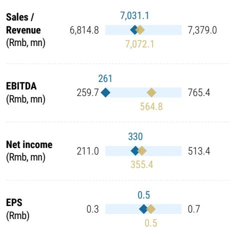

## Risk Reward – Shanghai Jahwa United Co. Ltd. (600315.SS)

## KEY EARNINGS INPUTS

<table><tr><td>Drivers</td><td>Dec 2025</td><td>Dec 2026e</td><td>Dec 2027e</td><td>Dec 2028e</td></tr><tr><td>Skincare Sales Growth (%)</td><td>NA</td><td>NA</td><td>NA</td><td>(2.0)</td></tr><tr><td>Personal Care and Home Care Sales Growth (%)</td><td>NA</td><td>NA</td><td>NA</td><td>3.0</td></tr><tr><td>Baby and Maternity Products Sales Growth (%)</td><td>NA</td><td>NA</td><td>NA</td><td>(2.0)</td></tr><tr><td>JV and Agent Brands Sales Growth (%)</td><td>NA</td><td>NA</td><td>NA</td><td>0.0</td></tr></table>

## INVESTMENT DRIVERS

\- Success of restructuring.

\- Operating margin improvement.

\- New product launches.

\- The pace of recovery for the Herborist brand.

## GLOBAL REVENUE EXPOSURE

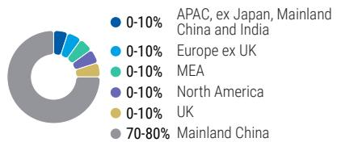  
Source: MS Estimate View explanation of regional hierarchies here

## RISKS TO PT/RATING

## RISKS TO UPSIDE

\- Successful product rollouts.

\- Faster-than-expected online expansion.

\- Faster-than-expected skincare growth.

## RISKS TO DOWNSIDE

\- Slowdown in beauty products spending growth.

\- Weaker-than-expected online sales growth.

\- Unsuccessful product rollouts.

## OWNERSHIP POSITIONING

<table><tr><td>Inst. Owners, % Active</td><td>95%</td></tr></table>

Source: Refinitiv, MS  
FY Dec 2026e  
◆ Mean ◆ MS Estimates
Source: Refinitiv, MS

## MS ESTIMATES VS. CONSENSUS

## Risk Reward Reference links

1. View explanation of Options Probabilities methodology -

Options\_Probabilities\_Exhibit\_Link.pdf

2. View descriptions of Risk Rewards Themes - RR\_Themes\_Exhibit\_Link.pdf

3. View explanation of regional hierarchies - GEG\_Exhibit\_Link.pdf

4. View explanation of Theme/Exposure methodology -

ESG\_Sustainable\_Solutions\_External\_Link.pdf

5. View explanation of HERS methodology - ESG\_HERS\_External\_Link.pdf

## Disclosure Section

The information and opinions in MS were prepared or are disseminated by MS Asia Limited (which accepts the responsibility for its contents) and/or MS Asia (Singapore) Pte. (Registration number 199206298Z) and/or MS Asia (Singapore) Securities Pte Ltd (Registration number 200008434H), regulated by the Monetary Authority of Singapore (which accepts legal responsibility for its contents and should be contacted with respect to any matters arising from, or in connection with, MS), and/or MS Taiwan Limited and/or MS & Co International plc, Seoul Branch, and/or MS Australia Limited (A.B.N. 67 003 734 576, holder of Australian financial services license No. 233742, which accepts responsibility for its contents), and/or MS Wealth Management Australia Pty Ltd (A.B.N. 19 009 145 555, holder of Australian financial services license No. 240813, which accepts responsibility for its contents), and/or MS India Company Private Limited having Corporate Identification No (CIN) U22990MH1998PTC115305, regulated by the Securities and Exchange Board of India ("SEBI") and holder of licenses as a Research Analyst (SEBI Registration No. INH000001105); Stock Broker (SEBI Stock Broker Registration No. INZ000244438), Merchant Banker (SEBI Registration No. INM000011203), and depository participant with National Securities Depository Limited (SEBI Registration No. IN-DP-NSDL-567-2021) having registered office at Altimus, Level 39 & 40, Pandurang Budhkar Marg, Worli, Mumbai 400018, India; Telephone no. +91-22-61181000; Compliance Officer Details: Mr. Tejarshi Hardas, Tel. No.: +91-22-61181000 or Email: tejarshi.hardas@morganstanley.com; Grievance officer details: Mr. Tejarshi Hardas, Tel. No.: +91-22-61181000 or Email: msic-compliance@morganstanley.com which accepts the responsibility for its contents and should be contacted with respect to any matters arising from, or in connection with, MS, and their affiliates (collectively, "MS"). MS India Company Private Limited (MSICPL) may use AI tools in providing research services. All recommendations contained herein are made by the duly qualified research analysts.

For important disclosures, stock price charts and equity rating histories regarding companies that are the subject of this report, please see the MS Disclosure Website at www.morganstanley.com/eqr/disclosures/webapp/generalresearch, or contact your investment representative or MS at 1585 Broadway, (Attention: Research Management), New York, NY, 10036 USA.

For valuation methodology and risks associated with any recommendation, rating or price target referenced in this research report, please contact the Client Support Team as follows: US/Canada +1 800 303-2495; Hong Kong +852 2848-5999; Latin America +1 718 754-5444 (U.S.); London +44 (0)20-7425-8169; Singapore +65 6834-6860; Sydney +61 (0)2-9770-1505; Tokyo +81 (0)3-6836-9000. Alternatively you may contact your investment representative or MS at 1585 Broadway, (Attention: Research Management), New York, NY 10036 USA.

## Analyst Certification

The following analysts hereby certify that their views about the companies and their securities discussed in this report are accurately expressed and that they have not received and will not receive direct or indirect compensation in exchange for expressing specific recommendations or views in this report: Lillian Lou; Dustin Wei.

## Global Research Conflict Management Policy

MS has been published in accordance with our conflict management policy, which is available at www.morganstanley.com/institutional/research/conflictpolicies. A Portuguese version of the policy can be found at www.morganstanley.com.br

## Important Regulatory Disclosures on Subject Companies

As of May 29, 2026, MS beneficially owned 1% or more of a class of common equity securities of the following companies covered in MS: Anhui Gujing Distillery Company Limited, Chacha Food Co Ltd, Chagee Holdings Ltd, China Mengniu Dairy, China Tourism Group Duty Free, Foshan Haitian Flavouring and Food, Hangzhou Greatstar Industrial Co Ltd, Li Ning, Muyuan Foodstuff Co. Ltd, Samsonite Group.

Within the last 12 months, MS managed or co-managed a public offering (or 144A offering) of securities of Eastroc Beverages, Foshan Haitian Flavouring and Food, Laopu Gold, Muyuan Foodstuff Co. Ltd, WH Group.

Within the last 12 months, MS has received compensation for investment banking services from Eastroc Beverages, Health and Happiness (H&H), Laopu Gold, Midea Group Co Ltd., Samsonite Group, WH Group.

In the next 3 months, MS expects to receive or intends to seek compensation for investment banking services from ANTA Sports Products, Chagee Holdings Ltd, Crystal International Group Ltd., Eastroc Beverages, Foshan Haitian Flavouring and Food, Giant Biogene Holding Co Ltd, Gongniu Group Co Ltd, Gree Electric Appliances Inc of Zhuhai, Haidilao International Holding Ltd, Haier Smart Home Co Ltd, Health and Happiness (H&H), Hengan International Group, Laopu Gold, Midea Group Co Ltd., Muyuan Foodstuff Co. Ltd, Nongfu Spring Co Ltd, Pop Mart International Group, Proya Cosmetics Co. Ltd., Samsonite Group, Sun Art Retail Group Limited, Super Hi, Techtronic Industries Co Ltd, Topsports International Holdings Ltd, Weilong Delicious Global Holdings Ltd, WH Group, Yili Industrial, ZJLD Group.

Within the last 12 months, MS has received compensation for products and services other than investment banking services from ANTA Sports Products, Bosideng International Holdings Limited, Chow Tai Fook Jewellery Group Ltd, Gree Electric Appliances Inc of Zhuhai, Haidilao International Holding Ltd, Haier Smart Home Co Ltd, Health and Happiness (H&H), Midea Group Co Ltd., Pop Mart International Group, Samsonite Group, Stella International Holdings Ltd, Techtronic Industries Co Ltd, Topsports International Holdings Ltd, Uni-President China, WH Group, Yanjing Brewery, Yue Yuen Industrial Hldg, Yum China Holdings Inc..

Within the last 12 months, MS has provided or is providing investment banking services to, or has an investment banking client relationship with, the following company: ANTA Sports Products, Chagee Holdings Ltd, Crystal International Group Ltd., Eastroc Beverages, Foshan Haitian Flavouring and Food, Giant Biogene Holding Co Ltd, Gongniu Group Co Ltd, Gree Electric Appliances Inc of Zhuhai, Haidilao International Holding Ltd, Haier Smart Home Co Ltd, Health and Happiness (H&H), Hengan International Group, Laopu Gold, Midea Group Co Ltd., Muyuan Foodstuff Co. Ltd, Nongfu Spring Co Ltd, Pop Mart International Group, Proya Cosmetics Co. Ltd., Samsonite Group, Sun Art Retail Group Limited, Super Hi, Techtronic Industries Co Ltd, Topsports International Holdings Ltd, Weilong Delicious Global Holdings Ltd, WH Group, Yili Industrial, ZJLD Group.

Within the last 12 months, MS has either provided or is providing non-investment banking, securities-related services to and/or in the past has entered into an agreement to provide services or has a client relationship with the following company: ANTA Sports Products, Bosideng International Holdings Limited, Chow Tai Fook Jewellery Group Ltd, Eastroc Beverages, Gree Electric Appliances Inc of Zhuhai, Haidilao International Holding Ltd, Haier Smart Home Co Ltd, Health and Happiness (H&H), Hengan International Group, Laopu Gold, Midea Group Co Ltd., Nongfu Spring Co Ltd, Pop Mart International Group, Samsonite Group, Stella International Holdings Ltd, Techtronic Industries Co Ltd, Topsports International Holdings Ltd, Uni-President China, WH Group, Yanjing Brewery, Yue Yuen Industrial Hldg, Yum China Holdings Inc..

MS & Co. LLC makes a market in the securities of Super Hi.

The equity research analysts or strategists principally responsible for the preparation of MS have received compensation based upon various factors, including quality of research, investor client feedback, stock picking, competitive factors, firm revenues and overall investment banking revenues. Equity Research analysts' or strategists' compensation is not linked to investment banking or capital markets transactions performed by MS or the profitability or revenues of particular trading desks.

MS and its affiliates do business that relates to companies/instruments covered in MS, including market making, providing liquidity, fund management, commercial banking, extension of credit, investment services and investment banking. MS sells to and buys from customers the securities/instruments of companies covered in MS on a principal basis. MS may have a position in the debt of the Company or instruments discussed in this report. MS trades or may trade as principal in the debt securities (or in related derivatives) that are the subject of the debt research report.
Certain disclosures listed above are also for compliance with applicable regulations in non-US jurisdictions.

## STOCK RATINGS

MS uses a relative rating system using terms such as Overweight, Equal-weight, Not-Rated or Underweight (see definitions below). MS does not assign ratings of Buy, Hold or Sell to the stocks we cover. Overweight, Equal-weight, Not-Rated and Underweight are not the equivalent of buy, hold and sell. Investors should carefully read the definitions of all ratings used in MS. In addition, since MS contains more complete information concerning the analyst's views, investors should carefully read MS, in its entirety, and not infer the contents from the rating alone. In any case, ratings (or research) should not be used or relied upon as investment advice. An investor's decision to buy or sell a stock should depend on individual circumstances (such as the investor's existing holdings) and other considerations.

## Global Stock Ratings Distribution

## (as of May 31, 2026)

The Stock Ratings described below apply to MS's Fundamental Equity Research and do not apply to Debt Research produced by the Firm.

For disclosure purposes only (in accordance with FINRA requirements), we include the category headings of Buy, Hold, and Sell alongside our ratings of Overweight, Equal-weight, Not-Rated and Underweight. MS does not assign ratings of Buy, Hold or Sell to the stocks we cover. Overweight, Equal-weight, Not-Rated and Underweight are not the equivalent of buy, hold, and sell but represent recommended relative weightings (see definitions below). To satisfy regulatory requirements, we correspond Overweight, our most positive stock rating, with a buy recommendation; we correspond Equal-weight and Not-Rated to hold and Underweight to sell recommendations, respectively.

<table><tr><td></td><td colspan="2">Coverage Universe</td><td colspan="3">Investment Banking Clients (IBC)</td><td colspan="2">Other Material Investment ServicesClients (MISC)</td></tr><tr><td>Stock RatingCategory</td><td>Count</td><td>% of Total</td><td>Count</td><td>% of Total IBC</td><td>% of RatingCategory</td><td>Count</td><td>% of Total OtherMISC</td></tr><tr><td>Overweight/Buy</td><td>1542</td><td>42%</td><td>465</td><td>51%</td><td>30%</td><td>707</td><td>43%</td></tr><tr><td>Equal-weight/Hold</td><td>1571</td><td>43%</td><td>369</td><td>40%</td><td>23%</td><td>723</td><td>44%</td></tr><tr><td>Not-Rated/Hold</td><td>3</td><td>0%</td><td>0</td><td>0%</td><td>0%</td><td>1</td><td>0%</td></tr><tr><td>Underweight/Sell</td><td>551</td><td>15%</td><td>86</td><td>9%</td><td>16%</td><td>201</td><td>12%</td></tr><tr><td>Total</td><td>3,667</td><td></td><td>920</td><td></td><td></td><td>1632</td><td></td></tr></table>

Data include common stock and ADRs currently assigned ratings. Investment Banking Clients are companies from whom MS received investment banking compensation in the last 12 months. Due to rounding off of decimals, the percentages provided in the "% of total" column may not add up to exactly 100 percent.

## Analyst Stock Ratings

Overweight (O). The stock's total return is expected to exceed the average total return of the analyst's industry (or industry team's) coverage universe, on a risk-adjusted basis, over the next 12-18 months.

Equal-weight (E). The stock's total return is expected to be in line with the average total return of the analyst's industry (or industry team's) coverage universe, on a risk-adjusted basis, over the next 12-18 months.

Not-Rated (NR). Currently the analyst does not have adequate conviction about the stock's total return relative to the average total return of the analyst's industry (or industry team's) coverage universe, on a risk-adjusted basis, over the next 12-18 months.

Underweight (U). The stock's total return is expected to be below the average total return of the analyst's industry (or industry team's) coverage universe, on a risk-adjusted basis, over the next 12-18 months.

Unless otherwise specified, the time frame for price targets included in MS is 12 to 18 months.

## Analyst Industry Views

Attractive (A): The analyst expects the performance of his or her industry coverage universe over the next 12-18 months to be attractive vs. the relevant broad market benchmark, as indicated below.

In-Line (I): The analyst expects the performance of his or her industry coverage universe over the next 12-18 months to be in line with the relevant broad market benchmark, as indicated below. Cautious (C): The analyst views the performance of his or her industry coverage universe over the next 12-18 months with caution vs. the relevant broad market benchmark, as indicated below. Benchmarks for each region are as follows: North America - S&P 500; Latin America - relevant MSCI country index or MSCI Latin America Index; Europe - MSCI Europe; Japan - TOPIX; Asia - relevant MSCI country index or MSCI sub-regional index or MSCI AC Asia Pacific ex Japan Index.

## Stock Price, Price Target and Rating History (See Rating Definitions)

Industry View: Attractive (A) In-line (I) Cautious (C) No Rating (NR)

C&S Paper Co Ltd (002511.SZ) - As of 06/23/26 GMT in CNY Industry : China/Hong Kong Consumer  
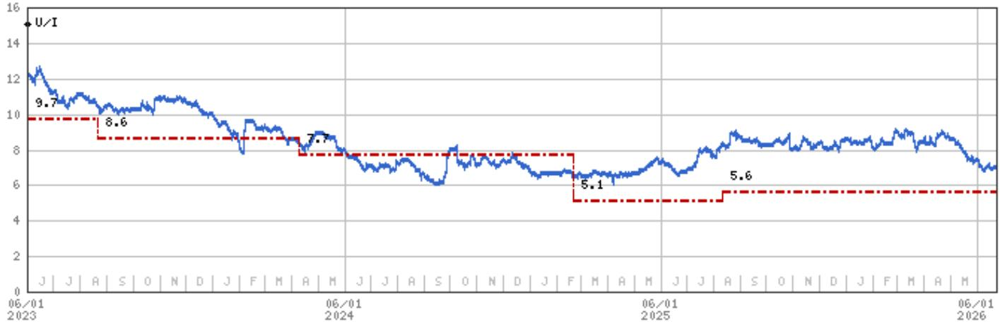  
Stock Rating History: 6/1/21 : E/I; 9/22/21 : U/I  
Price Target History: 5/6/21 : 29.5; 7/9/21 : 26.1; 9/22/21 : 13.8; 4/14/22 : 10.5; 10/21/22 : 8.3; 3/17/23 : 9.7; 8/21/23 : 8.6; 4/10/24 : 7.7; 2/20/25 : 5.1; 8/11/25 : 5.6

Source: MS Date Format : MM/DD/YY Price Target = No Price Target Assigned (NA)

Stock Price (Not Covered by Current Analyst) — Stock Price (Covered by Current Analyst)

Stock and Industry Ratings (abbreviations below) appear as ♦ Stock Rating/Industry View

Stock Ratings: Overweight (O) Equal-weight (E) Underweight (U) Not-Rated (NR) No Rating Available (NA)

Industry View: Attractive (A) In-line (I) Cautious (C) No Rating (NR)

Effective January 13, 2014, the stocks covered by MS Asia Pacific will be rated relative to the analyst's industry (or industry team's) coverage.

Effective January 13, 2014, the industry view benchmarks for MS Asia Pacific are as follows: relevant MSCI country index or MSCI sub-regional index or MSCI AC Asia Pacific ex Japan Index.

Hengan International Group (1044.HK) - As of 06/23/26 GMT in HKD
Industry : China/Hong Kong Consumer  
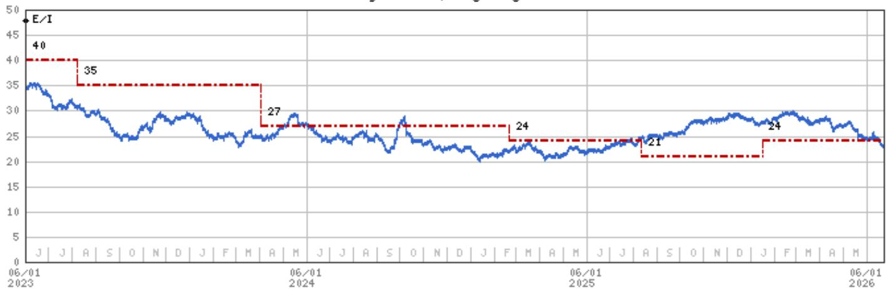  
Stock Rating History: 6/1/21 : E/I  
Price Target History: 5/6/21 : 57; 7/21/21 : 51; 9/16/21 : 46; 3/15/22 : 40; 8/2/22 : 37; 8/21/22 : 42; 3/17/23 : 40; 8/8/23 : 35; 4/2/24 : 27; 2/20/25 : 24; 8/11/25 : 21; 1/16/26 : 24  
Source: MS Date Format : MM/DD/YY Price Target = No Price Target Assigned (NA)  
Stock Price (Not Covered by Current Analyst) — Stock Price (Covered by Current Analyst)  
Stock and Industry Ratings (abbreviations below) appear as ♦ Stock Rating/Industry View  
Stock Ratings: Overweight (O) Equal-weight (E) Underweight (U) Not-Rated (NR) No Rating Available (NA)  
Effective January 13, 2014, the stocks covered by MS Asia Pacific will be rated relative to the analyst's industry (or industry team's) coverage.  
Effective January 13, 2014, the industry view benchmarks for MS Asia Pacific are as follows: relevant MSCI country index or MSCI sub-regional index or MSCI AC Asia Pacific ex Japan Index.

Shanghai Jahwa United Co. Ltd. (600315.SS) - As of 06/23/26 GMT in CNY  
Industry : China/Hong Kong Consumer  
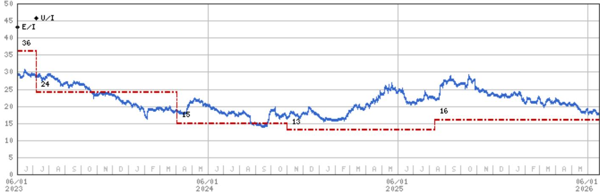  
Stock Rating History: 6/1/21 : E/I; 7/7/23 : U/I

Price Target History: 4/22/21 : 50; 4/14/22 : 35; 8/2/22 : 36; 7/7/23 : 24; 4/2/24 : 15; 11/1/24 : 13; 8/11/25 : 16

Source: MS Date Format : MM/DD/YY Price Target = No Price Target Assigned (NA)

Stock Price (Not Covered by Current Analyst) — Stock Price (Covered by Current Analyst)

Stock and Industry Ratings (abbreviations below) appear as ♦ Stock Rating/Industry View

Stock Ratings: Overweight (O) Equal-weight (E) Underweight (U) Not-Rated (NR) No Rating Available (NA)

Industry View: Attractive (A) In-line (I) Cautious (C) No Rating (NR)

Effective January 13, 2014, the stocks covered by MS Asia Pacific will be rated relative to the analyst's industry (or industry team's) coverage.

Effective January 13, 2014, the industry view benchmarks for MS Asia Pacific are as follows: relevant MSCI country index or MSCI sub-regional index or MSCI AC Asia Pacific ex Japan Index.

## Important Disclosures for MS Smith Barney LLC Customers

Important disclosures regarding any material conflict of interest that can reasonably be expected to have influenced MS Smith Barney LLC's choice of a third-party research provider or the subject company of a third-party research report, are available on the MS Wealth Management disclosure website at www.morganstanley.com/online/researchdisclosures. For MS specific disclosures, you may refer to https://www.morganstanley.com/eqr/disclosures/webapp/generalresearch.

Each MS report is reviewed and approved on behalf of MS Smith Barney LLC. This review and approval is conducted by the same person who reviews the research report on behalf of MS. This could create a conflict of interest.

## Other Important Disclosures

MS policy is to update research reports as and when the Research Analyst and Research Management deem appropriate, based on developments with the issuer, the sector, or the market that may have a material impact on the research views or opinions stated therein. In addition, certain Research publications are intended to be updated on a regular periodic basis (weekly/monthly/quarterly/annual) and will ordinarily be updated with that frequency, unless the Research Analyst and Research Management determine that a different publication schedule is appropriate based on current conditions.

MS is not acting as a municipal advisor and the opinions or views contained herein are not intended to be, and do not constitute, advice within the meaning of Section 975 of the Dodd-Frank Wall Street Reform and Consumer Protection Act.

MS produces an equity research product called a "Tactical Idea." Views contained in a "Tactical Idea" on a particular stock may be contrary to the recommendations or views expressed in research on the same stock. This may be the result of differing time horizons, methodologies, market events, or other factors. For all research available on a particular stock, please contact your sales representative or go to Matrix at http://www.morganstanley.com/matrix.

MS is provided to our clients through our proprietary research portal on Matrix and also distributed electronically by MS to clients. Certain, but not all, MS products are also made available to clients through third-party vendors or redistributed to clients through alternate electronic means as a convenience. For access to all available MS, please contact your sales representative or go to Matrix at http://www.morganstanley.com/matrix.

Any access and/or use of MS is subject to MS's Terms of Use (http://www.morganstanley.com/terms.html). By accessing and/or using MS, you are indicating that you have read and agree to be bound by our Terms of Use (http://www.morganstanley.com/terms.html). In addition you consent to MS processing your personal data and using cookies in accordance with our Privacy Policy and our Global Cookies Policy (http://www.morganstanley.com/privacy\_pledge.html), including for the purposes of setting your preferences and to collect readership data so that we can deliver better and more personalized service and products to you. To find out more information about how MS processes personal data, how we use cookies and how to reject cookies see our Privacy Policy and our Global Cookies Policy (http://www.morganstanley.com/privacy\_pledge.html). Please use the provided link to review the Terms and Conditions and Most Important Terms and Conditions for MS India Company Private Limited (https://www.morganstanley.com/assets/pdfs/about-us-global-offices/india/Terms\_and\_conditions.pdf) and the following link to review the audit report (https://ny.matrix.ms.com/eqr/research/webapp/researchdocs/MSICPL\_Morgan\_Stanley\_Research\_Audit\_Report.pdf).

If you do not agree to our Terms of Use and/or if you do not wish to provide your consent to MS processing your personal data or using cookies please do not access our research. MS does not provide individually tailored investment advice. MS has been prepared without regard to the circumstances and objectives of those who receive it. MS recommends that investors independently evaluate particular investments and strategies, and encourages investors to seek the advice of a financial adviser. The appropriateness of an investment or strategy will depend on an investor's circumstances and objectives. The securities, instruments, or strategies discussed in MS may not be suitable for all investors, and certain investors may not be eligible to purchase or participate in some or all of them. MS is not an offer to buy or sell or the solicitation of an offer to buy or sell any security/instrument or to participate in any particular trading strategy. The value of and income from your investments may vary because of changes in interest rates, foreign exchange rates, default rates, prepayment rates, securities/instruments prices, market indexes, operational or financial conditions of companies or other factors. There may be time limitations on the exercise of options or other rights in securities/instruments transactions. Past performance is not necessarily a guide to future performance. Estimates of future performance are based on assumptions that may not be realized. If provided, and unless otherwise stated, the closing price on the cover page is that of the primary exchange for the subject company's securities/instruments.

The fixed income research analysts, strategists or economists principally responsible for the preparation of MS have received compensation based upon various factors, including quality, accuracy and value of research, firm profitability or revenues (which include fixed income trading and capital markets profitability or revenues), client feedback and competitive factors. Fixed Income Research analysts', strategists' or economists' compensation is not linked to investment banking or capital markets transactions performed by MS or the profitability or revenues of particular trading desks.

The "Important Regulatory Disclosures on Subject Companies" section in MS lists all companies mentioned where MS owns 1% or more of a class of common equity securities of the companies. For all other companies mentioned in MS, MS may have an investment of less than 1% in securities/instruments or derivatives of securities/instruments of companies and may trade them in ways different from those discussed in MS. Employees of MS not involved in the preparation of MS may have investments in securities/instruments or derivatives of securities/instruments of companies mentioned and may trade them in ways different from those discussed in MS. Derivatives may be issued by MS or associated persons.

With the exception of information regarding MS, MS is based on public information. MS makes every effort to use reliable, comprehensive information, but we make no representation that it is accurate or complete. We have no obligation to tell you when opinions or information in MS change apart from when we intend to discontinue equity research coverage of a subject company. Facts and views presented in MS have not been reviewed by, and may not reflect information known to, professionals in other MS business areas, including investment banking personnel.

MS personnel may participate in company events such as site visits and are generally prohibited from accepting payment by the company of associated expenses unless pre-approved by authorized members of Research management.

MS may make investment decisions that are inconsistent with the recommendations or views in this report.

To our readers based in Taiwan or trading in Taiwan securities/instruments: Information on securities/instruments that trade in Taiwan is distributed by MS Taiwan Limited ("MSTL"). Such information is for your reference only. The reader should independently evaluate the investment risks and is solely responsible for their investment decisions. MS may not be distributed to the public media or quoted or used by the public media without the express written consent of MS. Any non-customer reader within the scope of Article 7-1 of the Taiwan Stock Exchange Recommendation Regulations accessing and/or receiving MS is not permitted to provide MS to any third party (including but not limited to related parties, affiliated companies and any other third parties) or engage in any activities regarding MS which may create or give the appearance of creating a conflict of interest. Information on securities/instruments that do not trade in Taiwan is for informational purposes only and is not to be construed as a recommendation or a solicitation to trade in such securities/instruments. MSTL may not execute transactions for clients in these securities/instruments.

Certain information in MS was sourced by employees of the Shanghai Representative Office of MS Asia Limited for the use of MS Asia Limited. MS is not incorporated under PRC law and the research in relation to this report is conducted outside the PRC. MS does not constitute an offer to sell or the solicitation of an offer to buy any securities in the PRC. PRC investors shall have the relevant qualifications to invest in such securities and shall be responsible for obtaining all relevant approvals, licenses, verifications and/or registrations from the relevant governmental authorities themselves. Neither this report nor any part of it is intended as, or shall constitute, provision of any consultancy or advisory service of securities investment as defined under PRC law. Such information is provided for your reference only.

MS is disseminated in Brazil by MS C.T.V.M. S.A. located at Av. Brigadeiro Faria Lima, 3600, 6th floor, São Paulo - SP, Brazil; and is regulated by the Comissão de Valores Mobiliários; in Mexico by MS México, Casa de Bolsa, S.A. de C.V which is regulated by Comision Nacional Bancaria y de Valores. Paseo de los Tamarindos 90, Torre 1, Col. Bosques de las Lomas Floor 29, 05120 Mexico City; in Japan by MS MUFG Securities Co., Ltd. and, for Commodities related research reports only, MS Capital Group Japan Co., Ltd; in Hong Kong by MS Asia Limited (which accepts responsibility for its contents) and by MS Bank Asia Limited; in Singapore by MS Asia (Singapore) Pte. (Registration number 199206298Z) and/or MS Asia (Singapore) Securities Pte Ltd (Registration number 200008434H), regulated by the Monetary Authority of Singapore (which accepts legal responsibility for its contents and should be contacted with respect to any matters arising from, or in connection with, MS) and by MS Bank Asia Limited, Singapore Branch (Registration number T14FC0118); in Australia to "wholesale clients" within the meaning of the Australian Corporations Act by MS Australia Limited A.B.N. 67 003 734 576, holder of Australian financial services license No. 233742, which accepts responsibility for its contents; in Australia to "wholesale clients" and "retail clients" within the meaning of the Australian Corporations Act by MS Wealth Management Australia Pty Ltd (A.B.N. 19 009 145 555, holder of Australian financial services license No. 240813, which accepts responsibility for its contents; in Korea by MS & Co International plc, Seoul Branch; in India by MS India Company Private Limited having Corporate Identification No (CIN) U22990MH1998PTC115305, regulated by the Securities and Exchange Board of India ("SEBI") and holder of licenses as a Research Analyst (SEBI Registration No. INH000001105); Stock Broker (SEBI Stock Broker Registration No. INZ000244438), Merchant Banker (SEBI Registration No. INM000011203), and depository participant with National Securities Depository Limited (SEBI Registration No. IN-DP-NSDL-567-2021) having registered office at Altimus, Level 39 & 40, Pandurang Budhkar Marg, Worli, Mumbai 400018, India; Telephone no. +91-22-61181000; Compliance Officer Details: Mr. Tejarshi Hardas, Tel. No.: +91-22-61181000 or Email: tejarshi.hardas@morganstanley.com; Grievance officer details: Mr. Tejarshi Hardas, Tel. No.: +91-22-61181000 or Email: msic-compliance@morganstanley.com. MS India Company Private Limited (MSICPL) may use AI tools in providing research services. All recommendations contained herein are made by the duly qualified research analysts; in Canada by MS Canada Limited; in Germany and the European Economic Area where required by MS Europe S.E., authorised and regulated by Bundesanstalt fuer Finanzdienstleistungsaufsicht (BaFin) under the reference number 149169; in the US by MS & Co. LLC, which accepts responsibility for its contents. MS & Co. International plc, authorized by the Prudential Regulation Authority and regulated by the Financial Conduct Authority and the Prudential Regulation Authority, disseminates in the UK research that it has prepared, and research which has been prepared by any of its affiliates, only to persons who (i) are investment professionals falling within Article 19(5) of the Financial Services and Markets Act 2000 (Financial Promotion) Order 2005 (as amended, the "Order"); (ii) are persons who are high net worth entities falling within Article 49(2)(a) to (d) of the Order; or (iii) are persons to whom an invitation or inducement to engage in investment activity (within the meaning of section 21 of the Financial Services and Markets Act 2000, as amended) may otherwise lawfully be communicated or caused to be communicated. RMB MS Proprietary Limited is a member of the JSE Limited and A2X (Pty) Ltd. RMB MS Proprietary Limited is a joint venture owned equally by MS International Holdings Inc. and RMB Investment Advisory (Proprietary) Limited, which is wholly owned by FirstRand Limited. The information in MS is being disseminated by MS Saudi Arabia, regulated by the Capital Market Authority in the Kingdom of Saudi Arabia, and is directed at Sophisticated investors only.

MS Hong Kong Securities Limited is the liquidity provider/market maker for securities of ANTA Sports Products, Budweiser Brewing Company APAC Ltd, China Mengniu Dairy, China Resources Beer Holdings Co Ltd, China Tourism Group Duty Free, Giant Biogene Holding Co Ltd, Haidilao International Holding Ltd, Laopu Gold, Li Ning, Mao Geping Cosmetics Co., Ltd, Midea

Group Co Ltd., Nongfu Spring Co Ltd, Pop Mart International Group, Shenzhou International Group Holdings, Techtronic Industries Co Ltd, Tsingtao Brewery Co Ltd listed on the Stock Exchange of Hong Kong Limited. An updated list can be found on HKEx website: http://www.hkex.com.hk.

The information in MS is being communicated by MS & Co. International plc (DIFC Branch), regulated by the Dubai Financial Services Authority (the DFSA) or by MS & Co. International plc (ADGM Branch), regulated by the Financial Services Regulatory Authority Abu Dhabi (the FSRA), and is directed at Professional Clients only, as defined by the DFSA or the FSRA, respectively. The financial products or financial services to which this research relates will only be made available to a customer who we are satisfied meets the regulatory criteria of a Professional Client. A distribution of the different MS Research ratings or recommendations, in percentage terms for Investments in each sector covered, is available upon request from your sales representative.

The information in MS is being communicated by MS & Co. International plc (QFC Branch), regulated by the Qatar Financial Centre Regulatory Authority (the QFCRA), and is directed at business customers and market counterparties only and is not intended for Retail Customers as defined by the QFCRA.

As required by the Capital Markets Board of Turkey, investment information, comments and recommendations stated here, are not within the scope of investment advisory activity. Investment advisory service is provided exclusively to persons based on their risk and income preferences by the authorized firms. Comments and recommendations stated here are general in nature. These opinions may not fit to your financial status, risk and return preferences. For this reason, to make an investment decision by relying solely to this information stated here may not bring about outcomes that fit your expectations.

The trademarks and service marks contained in MS are the property of their respective owners. Third-party data providers make no warranties or representations relating to the accuracy, completeness, or timeliness of the data they provide and shall not have liability for any damages relating to such data. The Global Industry Classification Standard (GICS) was developed by and is the exclusive property of MSCI and S&P.

MS, or any portion thereof may not be reprinted, sold or redistributed without the written consent of MS.

Indicators and trackers referenced in MS may not be used as, or treated as, a benchmark under Regulation EU 2016/1011, or any other similar framework.

The issuers and/or fixed income products recommended or discussed in certain fixed income research reports may not be continuously followed. Accordingly, investors should regard those fixed income research reports as providing stand-alone analysis and should not expect continuing analysis or additional reports relating to such issuers and/or individual fixed income products. MS may hold, from time to time, material financial and commercial interests regarding the company subject to the Research report.

Registration granted by SEBI and certification from the National Institute of Securities Markets (NISM) in no way guarantee performance of the intermediary or provide any assurance of returns to investors. Investment in securities market are subject to market risks. Read all the related documents carefully before investing.

INDUSTRY COVERAGE: China/Hong Kong Consumer

<table><tr><td>COMPANY (TICKER)</td><td>RATING (AS OF)</td><td>PRICE* (06/22/2026)</td></tr><tr><td colspan="3">Dustin Wei</td></tr><tr><td>ANTA Sports Products (2020.HK)</td><td>++</td><td>HK$69.50</td></tr><tr><td>Bosideng International Holdings Limited (3998.HK)</td><td>O (11/27/2024)</td><td>HK$3.85</td></tr><tr><td>C&amp;S Paper Co Ltd (002511.SZ)</td><td>U (09/22/2021)</td><td>Rmb6.93</td></tr><tr><td>Chacha Food Co Ltd (002557.SZ)</td><td>U (02/20/2025)</td><td>Rmb18.50</td></tr><tr><td>Giant Biogene Holding Co Ltd (2367.HK)</td><td>O (08/08/2024)</td><td>HK$24.70</td></tr><tr><td>Health and Happiness (H&amp;H) (1112.HK)</td><td>E (07/12/2021)</td><td>HK$10.74</td></tr><tr><td>Hengan International Group (1044.HK)</td><td>E (05/06/2021)</td><td>HK$22.82</td></tr><tr><td>Li Ning (2331.HK)</td><td>O (10/09/2019)</td><td>HK$15.76</td></tr><tr><td>Mao Geping Cosmetics Co., Ltd (1318.HK)</td><td>O (03/10/2026)</td><td>HK$54.50</td></tr><tr><td>Pop Mart International Group (9992.HK)</td><td>O (05/17/2021)</td><td>HK$160.00</td></tr><tr><td>Proya Cosmetics Co. Ltd. (603605.SS)</td><td>O (10/12/2021)</td><td>Rmb60.45</td></tr><tr><td>Samsonite Group (1910.HK)</td><td>O (06/15/2020)</td><td>HK$13.74</td></tr><tr><td>Shanghai Jahwa United Co. Ltd. (600315.SS)</td><td>U (07/07/2023)</td><td>Rmb17.43</td></tr><tr><td>Sun Art Retail Group Limited (6808.HK)</td><td>E (03/05/2019)</td><td>HK$1.02</td></tr><tr><td>Topsports International Holdings Ltd (6110.HK)</td><td>O (11/13/2019)</td><td>HK$2.51</td></tr><tr><td>Weilong Delicious Global Holdings Ltd (9985.HK)</td><td>O (06/11/2025)</td><td>HK$7.41</td></tr><tr><td>Yonghui Superstores (601933.SS)</td><td>U (05/18/2023)</td><td>Rmb3.08</td></tr><tr><td colspan="3">Hildy Ling</td></tr><tr><td>Angel Yeast Co. Ltd. (600298.SS)</td><td>E (05/21/2026)</td><td>Rmb35.69</td></tr><tr><td>Beijing Roborock Technology Co Ltd (688169.SS)</td><td>O (09/25/2024)</td><td>Rmb98.47</td></tr><tr><td>China Tourism Group Duty Free (1880.HK)</td><td>E (12/13/2023)</td><td>HK$52.95</td></tr><tr><td>China Tourism Group Duty Free (601888.SS)</td><td>E (12/13/2023)</td><td>Rmb56.79</td></tr><tr><td>Chow Tai Fook Jewellery Group Ltd (1929.HK)</td><td>O (03/04/2025)</td><td>HK$12.22</td></tr><tr><td>Chow Tai Seng Jewellery Co Ltd (002867.SZ)</td><td>U (03/04/2025)</td><td>Rmb11.74</td></tr><tr><td>Ecovacs Robotics Co Ltd (603486.SS)</td><td>E (10/30/2023)</td><td>Rmb53.80</td></tr><tr><td>Foshan Haitian Flavouring and Food (603288.SS)</td><td>E (07/28/2025)</td><td>Rmb33.04</td></tr><tr><td>Foshan Haitian Flavouring and Food (3288.HK)</td><td>E (05/21/2026)</td><td>HK$29.14</td></tr><tr><td>Haidilao International Holding Ltd (6862.HK)</td><td>O (05/26/2021)</td><td>HK$11.40</td></tr><tr><td>Hangzhou Robam Appliances Co Ltd (002508.SZ)</td><td>U (02/21/2024)</td><td>Rmb15.46</td></tr><tr><td>Laopu Gold (6181.HK)</td><td>O (10/20/2025)</td><td>HK$434.80</td></tr><tr><td>Super Hi (HDL.O)</td><td>E (01/14/2025)</td><td>US$12.58</td></tr><tr><td>Zhejiang Supor Co. Ltd. (002032.SZ)</td><td>E (01/17/2022)</td><td>Rmb40.59</td></tr><tr><td colspan="3">Lillian Lou</td></tr><tr><td>Anhui Gujing Distillery Company Limited (000596.SZ)</td><td>U (02/13/2026)</td><td>Rmb82.54</td></tr><tr><td>Budweiser Brewing Company APAC Ltd (1876.HK)</td><td>O (11/04/2019)</td><td>HK$6.46</td></tr><tr><td>Chagee Holdings Ltd (CHA.O)</td><td>O (06/02/2025)</td><td>US$11.22</td></tr><tr><td>China Mengniu Dairy (2319.HK)</td><td>O (09/14/2017)</td><td>HK$15.89</td></tr><tr><td>China Resources Beer Holdings Co Ltd (0291.HK)</td><td>O (12/11/2018)</td><td>HK$21.46</td></tr><tr><td>Chongqing Brewery Co. Ltd. (600132.SS)</td><td>U (07/30/2021)</td><td>Rmb44.22</td></tr><tr><td>Eastroc Beverages (605499.SS)</td><td>O (03/12/2026)</td><td>Rmb120.63</td></tr><tr><td>Eastroc Beverages (9980.HK)</td><td>O (03/12/2026)</td><td>HK$108.90</td></tr><tr><td>Gree Electric Appliances Inc of Zhuhai (000651.SZ)</td><td>O (04/14/2020)</td><td>Rmb36.99</td></tr><tr><td>Haier Smart Home Co Ltd (600690.SS)</td><td>E (01/17/2022)</td><td>Rmb19.98</td></tr><tr><td>Haier Smart Home Co Ltd (6690.HK)</td><td>E (01/17/2022)</td><td>HK$19.98</td></tr><tr><td>Kweichow Moutai Company Ltd. (600519.SS)</td><td>O (10/17/2014)</td><td>Rmb1,241.41</td></tr><tr><td>Luzhou Lao Jiao Co. Ltd (000568.SZ)</td><td>E (01/23/2019)</td><td>Rmb81.27</td></tr><tr><td>Midea Group Co Ltd. (0300.HK)</td><td>O (11/01/2024)</td><td>HK$82.65</td></tr><tr><td>Midea Group Co Ltd. (000333.SZ)</td><td>O (01/17/2022)</td><td>Rmb78.28</td></tr><tr><td>Muyuan Foodstuff Co. Ltd (2714.HK)</td><td>O (03/17/2026)</td><td>HK$29.62</td></tr><tr><td>Muyuan Foodstuff Co. Ltd (002714.SZ)</td><td>O (03/17/2026)</td><td>Rmb33.95</td></tr><tr><td>Nongfu Spring Co Ltd (9633.HK)</td><td>E (07/30/2021)</td><td>HK$41.72</td></tr><tr><td>Shanxi Xinghuacun Fen Wine Factory Co. (600809.SS)</td><td>O (10/28/2020)</td><td>Rmb113.61</td></tr><tr><td>Shuanghui Development (000895.SZ)</td><td>U (03/16/2021)</td><td>Rmb22.86</td></tr><tr><td>Tingyi (Cayman Islands) (0322.HK)</td><td>E (07/25/2025)</td><td>HK$9.99</td></tr><tr><td>Tsingtao Brewery Co Ltd (0168.HK)</td><td>E (11/01/2024)</td><td>HK$44.80</td></tr><tr><td>Tsingtao Brewery Co Ltd (600600.SS)</td><td>E (02/28/2024)</td><td>Rmb53.92</td></tr><tr><td>Uni-President China (0220.HK)</td><td>E (07/25/2025)</td><td>HK$6.84</td></tr><tr><td>Want Want China Holdings Ltd (0151.HK)</td><td>E (11/29/2023)</td><td>HK$3.99</td></tr><tr><td>WH Group (0288.HK)</td><td>O (02/24/2025)</td><td>HK$8.61</td></tr><tr><td>Wuliangye Yibin Company Ltd. (000858.SZ)</td><td>E (08/15/2024)</td><td>Rmb76.55</td></tr><tr><td>Yanghe Brewery (002304.SZ)</td><td>U (01/05/2021)</td><td>Rmb41.25</td></tr><tr><td>Yanjing Brewery (000729.SZ)</td><td>U (09/02/2015)</td><td>Rmb10.28</td></tr><tr><td>Yili Industrial (600887.SS)</td><td>O (01/29/2014)</td><td>Rmb24.63</td></tr><tr><td>Yum China Holdings Inc. (YUMC.N)</td><td>O (03/20/2018)</td><td>US$41.53</td></tr><tr><td>ZJLD Group (6979.HK)</td><td>E (02/13/2026)</td><td>HK$7.55</td></tr><tr><td colspan="3">Terence Cheng</td></tr><tr><td>Chervon Holdings Ltd. (2285.HK)</td><td>E (04/12/2024)</td><td>HK$16.58</td></tr><tr><td>Crystal International Group Ltd. (2232.HK)</td><td>E (06/23/2025)</td><td>HK$5.67</td></tr><tr><td>Gongniu Group Co Ltd (603195.SS)</td><td>O (05/08/2023)</td><td>Rmb39.47</td></tr><tr><td>Hangzhou Greatstar Industrial Co Ltd (002444.SZ)</td><td>E (10/26/2022)</td><td>Rmb29.43</td></tr><tr><td>Huali Industrial Group Co (300979.SZ)</td><td>U (02/10/2026)</td><td>Rmb31.22</td></tr><tr><td>Shenzhou International Group Holdings (2313.HK)</td><td>O (07/13/2017)</td><td>HK$40.70</td></tr><tr><td>Stella International Holdings Ltd (1836.HK)</td><td>E (06/23/2025)</td><td>HK$12.39</td></tr><tr><td>Techtronic Industries Co Ltd (0669.HK)</td><td>O (12/05/2019)</td><td>HK$121.90</td></tr><tr><td>Yue Yuen Industrial Hldg (0551.HK)</td><td>E (09/14/2021)</td><td>HK$12.97</td></tr></table>

Stock Ratings are subject to change. Please see latest research for each company.  
\* Historical prices are not split adjusted.

## © 2026 MS