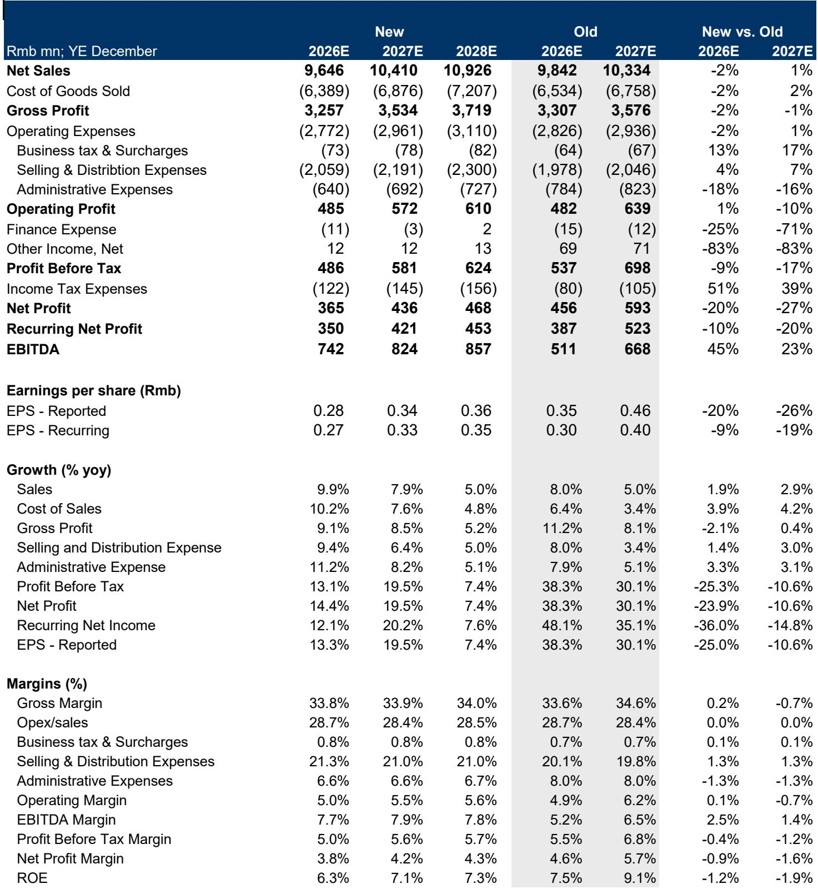
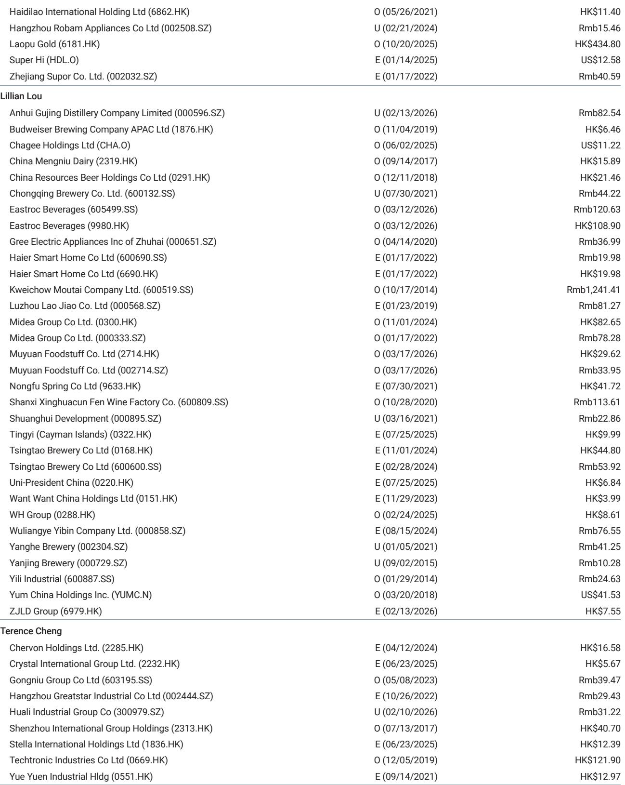
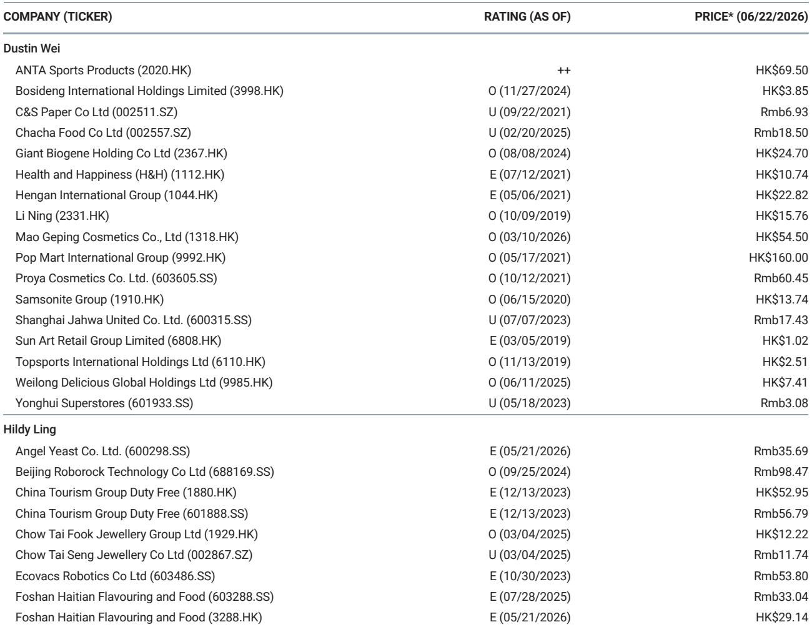

# China's Consumer Giants Are Winning Volume but Losing Pricing Power — and That Changes the Investment Calculus

The central tension in China's consumer staples sector today is not about demand destruction. It is about the structural erosion of pricing power, even as volumes hold steady. Across tissue, sanitary napkins, diapers, and beauty, the leading domestic players are gaining market share from smaller competitors, but they are doing so at the cost of average selling prices, margins, and ultimately earnings quality. A recent risk/reward update on three bellwether Chinese consumer companies — Hengan International, C&S Paper, and Shanghai Jahwa — makes this dynamic painfully clear. The report lowers earnings estimates for two of the three names, cuts price targets across the board, and maintains underweight ratings on both C&S Paper and Shanghai Jahwa. The core message is not that these businesses are broken, but that the path to profit growth has become narrower, more expensive, and far less certain than the market seems to price in.

This matters now because the market appears to be pricing these stocks for a recovery that the underlying data does not support. C&S Paper trades at 24 times 2026 estimated earnings despite limited pricing power, low return on equity, and only modest margin upside. Shanghai Jahwa trades at over 35 times 2026 earnings with limited profit visibility and a recovery that remains entirely investment-led. Even Hengan, which offers a defensive 6% dividend yield, faces a structural compression in operating margins that leaves little room for earnings acceleration. The gap between what the market expects and what the fundamentals are delivering is the central investment question for anyone exposed to China's consumer discretionary and staples space.

This article unpacks the strategic logic behind these ratings, identifies the structural forces that are reshaping the competitive landscape, and offers a decision framework for investors who need to navigate this increasingly treacherous terrain.

## Volume Growth Is Masking a Deeper Problem: The Structural Dilution of Pricing Power

The single most important insight from this report is that all three companies are winning volume, but none of them can translate that volume into pricing power. Hengan's tissue business is growing at mid-single-digit rates, driven by share gains as smaller manufacturers exit the market. C&S Paper's revenue growth is similarly volume- and share-gain-driven, as industry consolidation accelerates. Shanghai Jahwa's beauty brands, particularly Herborist and Dr. Yu, are recovering on the back of online strength and renewed brand investment. In each case, the volume story is real and strategically positive. The problem is that the channels delivering this volume — online platforms, new retail, and especially Douyin — are also the channels that destroy pricing power.

The mechanism is straightforward. Online and new retail channels demand higher promotional spending, sharper pricing, and constant investment in content and traffic acquisition. The rising mix of these channels dilutes average selling prices across the portfolio. For Hengan, the report explicitly notes that the rising mix of online and new retail channels is likely to remain a drag on ASP, keeping tissue revenue growth at mid-single-digit levels even as volume growth remains healthy. For C&S Paper, the dynamic is even more pronounced: higher promotion and sharper pricing may continue to dilute ASP and limit margin upside. For Shanghai Jahwa, the rising online and Douyin mix is strategically positive for reach, but it requires continued investment in content, traffic, and brand building, which limits near-term operating leverage.

The so-what here is critical. Investors who focus solely on market share gains or volume recovery are missing the structural shift in how value is captured. In the old model, volume growth translated directly into revenue growth and margin expansion. In the new model, volume growth is increasingly a defensive necessity — you must grow volume to hold share — but the incremental revenue and profit that comes from that volume is significantly lower. This is not a cyclical problem that will reverse when the economy improves. It is a structural shift in channel economics that will persist as long as online and new retail channels continue to gain share of total consumption.

## Earnings Recovery Is Visible but Not Viable at Current Valuations

The report cuts earnings estimates for C&S Paper by 20% for 2026 and 27% for 2027. For Shanghai Jahwa, the cuts are even steeper: 35% for 2026 and 39% for 2027. These are not marginal adjustments. They represent a fundamental reassessment of what these businesses can earn in the current environment. And yet, even after these cuts, the stocks trade at valuations that imply a much faster and more profitable recovery than the data supports.

C&S Paper's earnings recovery is described as visible but moderate. Operating leverage is limited by continued investment in branding, e-commerce, and new retail. Gross margin is broadly stable, helped by product premiumization and efficiency gains, but pulp costs and channel competition constrain further upside. The stock trades at 24 times 2026 earnings. For a company with limited pricing power, low ROE, and only modest margin upside, that multiple is difficult to justify on any fundamental basis. The report's underweight rating is not a judgment on the quality of the business. It is a judgment on the gap between the price and the underlying earnings power.

Shanghai Jahwa's situation is even more stark. The company is back to growth, driven by online strength and beauty segment recovery. But the recovery remains largely brand-investment-led. Gross margin should improve gradually with a better category mix, but selling expenses are likely to stay high as the company rebuilds brand equity. The report cuts earnings estimates by 35% and 39% for 2026 and 2027, yet the stock still trades at over 35 times 2026 earnings. At that multiple, the market is pricing in not just a recovery but an acceleration. The report's underweight rating reflects the view that the earnings trajectory does not support that premium.

Hengan is the exception that proves the rule. The stock trades at around 10 times 2026 earnings with a 6% dividend yield. The valuation is undemanding, and the dividend provides downside support. But even here, the report sees limited upside catalysts. Without stronger revenue acceleration or clearer evidence that hygiene products can return to sustainable growth, a higher multiple is hard to justify. Hengan is a value trap in slow motion: cheap for a reason, and likely to stay cheap until the growth narrative changes.

## The Margin Squeeze Is Not Cyclical — It Is a Permanent Feature of the New Retail Landscape

One of the most important analytical contributions of this report is its treatment of margins. Across all three companies, the margin story is one of structural compression, not cyclical recovery. Hengan's operating margin is expected to edge down from 10.6% in 2025 to around 9.5-9.6% in 2026-28. The driver is not input cost pressure — pulp prices are manageable — but rather the rising cost of doing business in a channel-diluted world. The company is increasing spending on brand investment, online channels, and new retail expansion. These investments are necessary to defend market share and reach younger consumers, but they bring additional promotional and platform costs that permanently lower operating leverage.

For C&S Paper, the margin picture is similar. Gross margin should stay broadly stable, but the upside is constrained by channel competition. Operating leverage is limited by continued investment. The report explicitly notes that earnings recovery is moderate because the company cannot scale back investment without losing share. This is the defining tension of the new retail landscape: you cannot win without investing, but the investment itself prevents the margin expansion that investors are waiting for.

Shanghai Jahwa faces the same dynamic in an even more acute form. Selling expenses are likely to stay high as the company rebuilds brand equity. The rising online and Douyin mix is strategically positive, but it requires continued investment in content, traffic, and brand building. The report's language is telling: the recovery is "brand-investment led." That is not a compliment. It means that the company is buying growth, and the cost of buying that growth is limiting the profit that comes from it.

The so-what for investors is clear. The margin compression across these three companies is not a function of weak demand or poor execution. It is a structural feature of an industry where the fastest-growing channels are also the most expensive. Any investor who is waiting for margins to revert to pre-pandemic levels is likely to be disappointed. The new normal is lower margins, higher investment, and slower earnings growth.

## What the Report Does Not Fully Answer Yet: The Endgame of Industry Consolidation

The report makes a compelling case that smaller players are exiting the market and that the leading companies are gaining share. But it leaves an important question unanswered: what happens when the consolidation is complete? In theory, a more concentrated industry should eventually lead to greater pricing power and higher margins. But the report's data suggests that this outcome is far from guaranteed.

The problem is that the channels driving consolidation — online platforms, new retail, Douyin — are themselves highly concentrated and possess significant bargaining power. Even as the number of tissue or beauty brands shrinks, the platforms that distribute those products are becoming more powerful. The result may be a transfer of value from brands to platforms, not from weak brands to strong brands. The report does not model this scenario explicitly, but the data it provides is consistent with it. Hengan, C&S Paper, and Shanghai Jahwa are all investing more in channel costs, even as their market shares increase. That is exactly what you would expect to see if the platforms are capturing the benefits of consolidation, not the brands.

A second unanswered question is whether brand equity can be rebuilt in a channel environment that commoditizes products. Shanghai Jahwa is investing heavily in brand building, but the channels that drive its growth — online and Douyin — are inherently price-transparent and promotion-driven. It is very difficult to build premium brand equity in a channel where consumers can compare prices across ten competitors in ten seconds. The report acknowledges this tension but does not resolve it. The question for investors is whether Shanghai Jahwa's brand investment is building long-term value or simply buying short-term market share that will prove unsustainable.

## A Decision Framework for Investors Navigating the New Consumer Landscape

For investors who need to make decisions in this environment, the report provides the raw material for a structured framework. The first question to ask is whether a company's volume growth is pricing-power-positive or pricing-power-neutral. If volume growth is coming from share gains in a consolidating market, but the channels delivering that growth are diluting ASP, then the volume is not creating value. It is simply maintaining scale. Investors should be skeptical of volume stories that are not accompanied by evidence of stable or improving pricing.

The second question is whether margin compression is cyclical or structural. If margins are being squeezed by input costs that will reverse, then the investment case is about timing. But if margins are being squeezed by channel mix shift and higher selling expenses that are likely to persist, then the investment case requires a structural re-rating. The report's data strongly suggests that the margin compression across these three companies is structural. Investors should not expect a cyclical recovery in margins unless the channel mix changes, which is unlikely.

The third question is whether valuation reflects the new earnings reality or the old one. C&S Paper at 24 times and Shanghai Jahwa at over 35 times 2026 earnings are pricing in a recovery that the report's own estimates do not support. Hengan at 10 times with a 6% yield is closer to fair value, but even here the lack of catalysts limits upside. The framework suggests that investors should be willing to pay for volume growth only if it comes with pricing power, and should be willing to pay for margin recovery only if the compression is cyclical. In the current environment, very few Chinese consumer companies meet both criteria.

The report's underweight ratings on C&S Paper and Shanghai Jahwa, and its equal-weight rating on Hengan, are consistent with this framework. They are not judgments on the quality of the businesses. They are judgments on the gap between what the market is pricing and what the fundamentals can deliver. For investors who want to close that gap, the framework offers a clear path: look for companies where volume growth is pricing-power-positive, where margin compression is cyclical, and where valuation reflects the new earnings reality rather than the old one.

## Join the Community to Read the Full Report and Review the Original Charts

The analysis above draws on a detailed risk/reward update that covers estimate changes, margin forecasts, and valuation scenarios for three of China's most important consumer companies. The full report contains the specific bull, base, and bear case scenarios, the DCF valuation models, and the detailed product-level forecasts that support the ratings. For investors who want to dig deeper into the data and test the assumptions behind the framework, the original report is essential reading. Join the community to read the full report and review the original charts.

*This article is for learning and discussion only and does not constitute investment advice.*

Personal reading notes and learning share only. Not investment advice.

