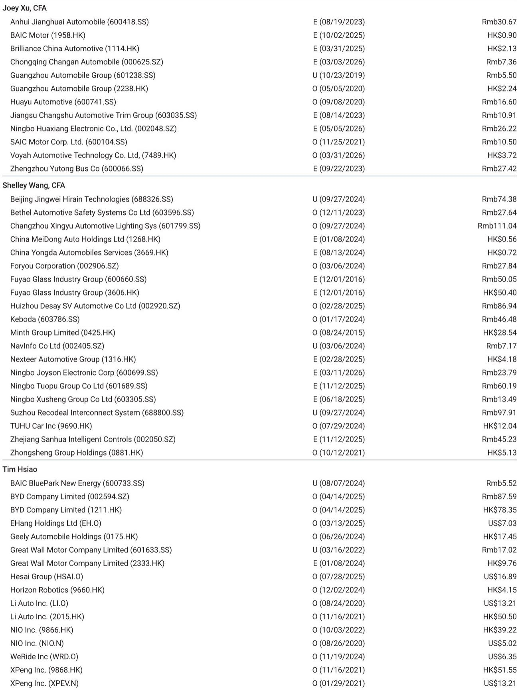
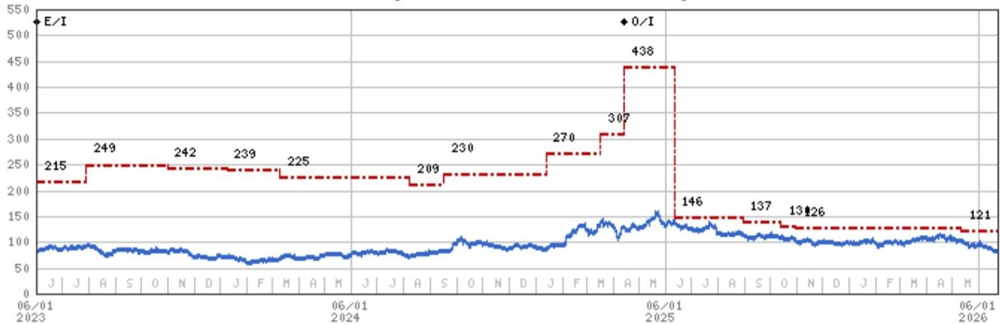
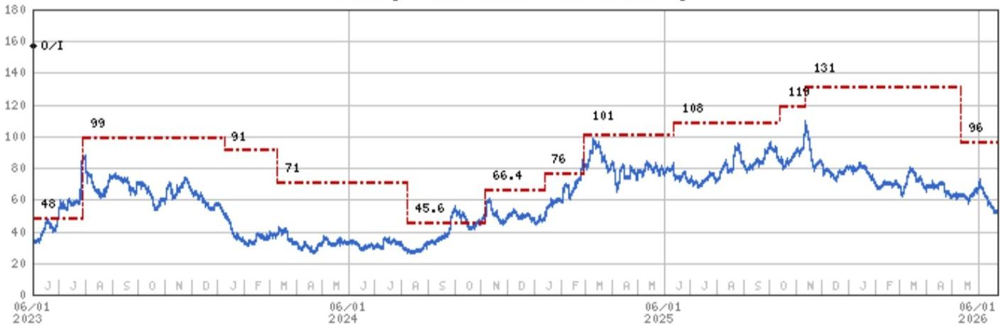

# 摩根斯坦利：MS：PHEV关税担忧被过度定价，中国车企的缓冲比市场想象的厚

中国汽车板块近期的一次集体回调，表面看是欧盟可能将反补贴关税扩展至插电式混合动力车（PHEV）的传闻所致。但MS在6月22日发布的一份研报中给出了一个值得深思的判断：**当前股价下跌已经price in了最坏情景，而中国车企的适应能力，很可能比市场预期的要强。**

这份报告的核心主张并非“风险不存在”，而是“市场对风险的定价已经过头”。在港股恒指仅下跌0.5%的背景下，主要中国车企股价跌幅达到3%至5%。MS认为，这种跌幅更多来自情绪和资金面的共振，而非基本面对PHEV关税风险的直接映射。

我们仔细拆解这份报告后认为，它提供的不是一个简单的“抄底”信号，而是一个重新审视中国车企全球化能力的分析框架。关税风险是真实的，但车企的应对工具箱——从渠道囤货到本地化生产——也比以往更丰富。

## 1. 这一轮下跌，恐慌情绪比实际风险更值得关注

MS指出了一个被市场忽略的关键细节：**股价跌幅最大的车企，并非那些PHEV出口欧盟占比最高的企业，而是南向资金持仓比例较高的公司。**

这个观察非常敏锐。它意味着今天的抛售，更多是资金层面的“被动减仓”或“避险性卖出”，而不是投资者对特定公司PHEV敞口的精准定价。如果市场真的在理性定价关税风险，那么比亚迪、上汽、吉利这些PHEV出口占比较高的公司应该领跌；但报告数据显示，跌幅分布与南向资金持仓高度相关。

> **KC评论：** 市场有时会“先开枪，再画靶子”。当负面新闻出现时，流动性好的股票往往最先被抛售，哪怕它的实际风险敞口并不大。这份报告提醒我们，区分“情绪驱动的下跌”和“基本面驱动的下跌”，在决策中至关重要。完整报告中还包含一张各车企PHEV出口欧盟占比的详细对比图，能帮助读者更直观地判断哪些公司真正暴露在风险之下。

这个结论的另一层含义是：如果后续没有实质性关税落地，这些被情绪错杀的股票存在修复空间。即使关税最终落地，当前股价也已经提前消化了部分利空。

## 2. PHEV关税若落地，对中国车企的冲击比BEV关税更复杂

要理解PHEV关税的潜在影响，必须先回顾2024年欧盟对中国纯电动车（BEV）加征关税后的市场反应。

当时，欧盟对BEV加征了7.8%至35.3%的额外关税（叠加10%的基础关税），但PHEV被豁免。这一政策差异直接改变了中国车企的出口产品结构。根据报告引用的MarkLines数据，**PHEV在中国对欧盟出口中的占比，已从2024年的6%迅速攀升至2026年的24%。**

这个变化意味着两件事：

第一，PHEV已经成为中国车企对冲BEV关税风险的“逃生舱”。如果这个逃生舱也被关闭，中国车企将失去一个重要的战略缓冲。

第二，PHEV关税的冲击可能比BEV关税更复杂。报告指出，BEV关税对中国整体出口动能的抑制效果有限，只是改变了出口产品的组合。但PHEV的情况不同——它目前是中国车企在欧盟市场增长最快的细分领域，一旦加税，对利润率的侵蚀可能更直接。

不过，MS也提出了一个关键疑问：**如果欧盟真的要对PHEV加征关税，它会采取与BEV相同的方式吗？** 报告没有给出明确答案，但暗示欧盟可能会调整策略，因为BEV关税的经验表明，简单加税并没有阻止中国车企的扩张。

> **KC评论：** 这里有一个值得追问的问题：欧盟是否会区分“中国品牌PHEV”和“中国制造但属于欧洲品牌的PHEV”？如果关税设计更精细，对不同车企的影响差异可能非常大。完整报告对这一问题有更深入的假设情景分析。

## 3. 短期渠道囤货可能带来“抢装”行情，但窗口期只有1-2个月

报告给出了一个对短期交易者极具参考价值的判断：**由于关税细则在1-2个月内不太可能确认，中国车企可能会选择加速向欧盟渠道发货（channel stuffing），就像2024年BEV关税落地前那样。**

这意味着，未来几周，中国对欧盟的PHEV出口数据可能出现短期激增。这种“抢装”效应在2024年曾经出现过，当时部分车企在关税生效前集中出货，使得季度出口数据大幅跳升。

对于投资者而言，这提供了一个短期观察窗口：如果接下来海关数据显示PHEV对欧出口量异常攀升，那么市场对关税风险的担忧可能会暂时缓解，因为“抢装”意味着车企正在主动管理风险。反之，如果出口数据平淡，则可能说明车企对关税落地已有预期，正在调整中长期策略。

但需要清醒认识到，这种“抢装”只是把未来的需求前置，并不能解决关税一旦落地后的长期竞争力问题。

## 4. 车企的分化将加剧：谁的全球化能力更厚，谁就能扛过这一轮

报告对不同车企的PHEV敞口进行了量化分析。根据MarkLines数据，**上汽、奇瑞和比亚迪的海外销量中，超过20%来自在欧盟销售的PHEV**，其次是吉利和零跑。而蔚来和小鹏的直接PHEV敞口有限，其股价下跌更多是受整体市场情绪拖累。

但MS的核心判断并非“PHEV敞口高的公司风险更大”，而是“那些已经在欧盟或海外布局了生产基地的车企，更有能力消化关税冲击”。报告明确提出，**从BEV关税到整个新能源车（NEV）关税的升级，可能会加速中国车企在欧盟本地化生产，或从中国以外的工厂进行出口。**

在这个框架下，MS维持了对小鹏（因其本地合作伙伴关系）、上汽（因估值重估机会）、比亚迪和吉利（因多生产基地布局）的增持评级。这份报告实际上在说：关税风险是一个筛选器，它会加速淘汰那些只有出口、没有本地化能力的车企，而头部玩家的竞争优势反而可能因为行业洗牌而强化。

> **KC评论：** 这里最值得关注的是“本地化生产”这条线索。中国车企在欧洲建厂的节奏和规模，将直接决定它们能否跨越关税壁垒。但报告没有完全展开的是：本地化生产的成本曲线、与欧洲工会和监管机构的磨合难度，以及供应链本地化的时间表。这些细节恰恰是判断不同车企“适应能力”强弱的关键变量。

## 5. 报告尚未完全回答的关键问题：欧盟会改变游戏规则吗？

尽管MS的分析框架相当完整，但有一个问题报告只是提出了疑问，没有给出结论：**如果欧盟对PHEV加征关税，它会不会采取与BEV不同的方式？**

这个问题的核心在于，欧盟是否已经认识到，简单的关税加征并不能有效遏制中国车企的竞争力。2024年BEV关税的经验表明，中国车企通过转向PHEV出口，成功绕开了部分壁垒。如果欧盟此次调整策略，比如引入更复杂的“本地化含量要求”或“碳足迹积分”机制，那么中国车企的应对难度将大幅上升。

此外，报告提到“全球合作”可能是一个解决方案，但并未展开。这意味着，中国车企与欧洲本土企业的合资、技术授权或代工合作，可能成为化解贸易摩擦的第三条道路。但这条路能走多远，取决于双方的政治意愿和商业互信。

## 6. 决策者应该关注的三个观察指标

基于MS这份报告，我们提炼出三个可供持续跟踪的指标，它们将帮助判断PHEV关税风险的演变方向：

**第一，欧盟的官方表态和立法程序。** 目前欧盟尚未对PHEV关税传闻做出正式回应。如果未来几周没有实质性的立法动议，市场的担忧可能会逐步消退。

**第二，中国车企的海外产能布局公告。** 比亚迪、吉利、上汽等公司是否加速在欧洲建厂，或者与欧洲车企达成新的合作，将是判断他们能否应对关税风险的最直接信号。

**第三，PHEV对欧出口的月度数据。** 如前所述，短期“抢装”效应可能掩盖真实趋势。需要观察的是关税细则明确后的3-6个月，出口数据是否出现持续下滑，以及车企能否通过提价或成本优化来维持利润率。

---

这份MS的报告，本质上是在告诉市场：不要把短期的情绪波动误读为长期的结构性逆转。关税风险是真实存在的，但中国车企已经证明了自己具备“动态适应”的能力——从BEV到PHEV的出口切换，再到海外本地化生产的推进，每一次外部压力都在倒逼它们变得更强大。

当然，报告的完整价值远不止我们在这里讨论的这些。它包含了各车企PHEV敞口的详细对比图表、不同关税情景下的盈利敏感性分析、以及MS对每家覆盖公司的估值方法。这些内容对于想要做出独立判断的投资者来说，是不可或缺的决策素材。

我们每天会由AI agent加上人工review，生成国际投行中文摘要与KC评论，daily更新约10-40页，并整理当天最新数据图表合集。这些内容既方便喂给AI进行二次分析，也方便人工快速把握全球市场的动态变化。如果你对这些深度内容感兴趣，欢迎来我们的星球和微信群继续讨论，一起追踪这些关键问题的后续演变。

Personal reading notes and learning share only. Not investment advice.

