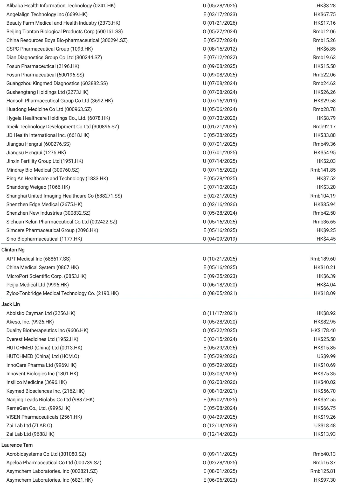
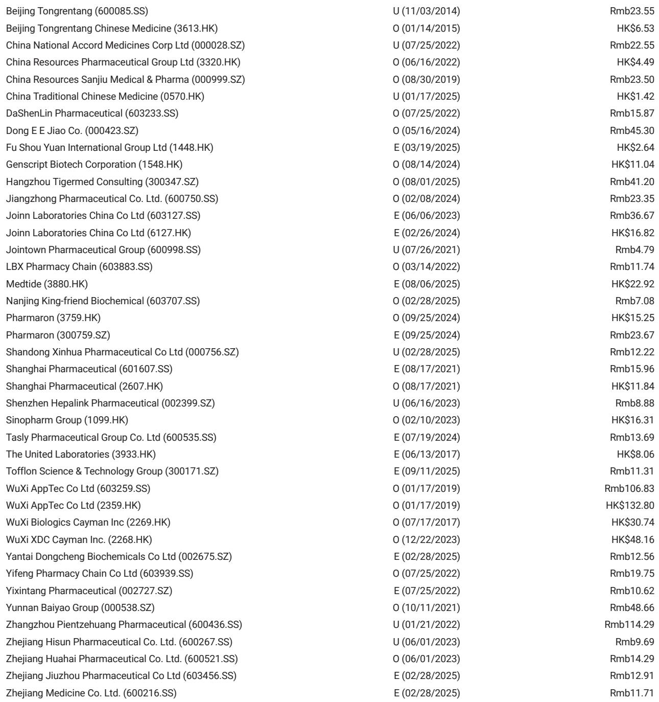
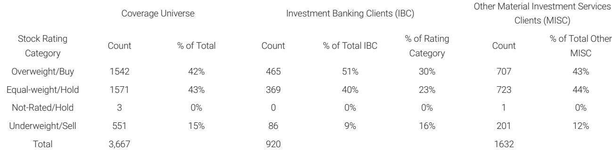

# 摩根斯坦利：MS：中国生物医药的“全球叙事”正在换剧本

2026年6月17日至18日，MS在上海举办了首届中国生物医药研讨会。这场以“连接生物医药前沿：中国与全球创新”为主题的活动，聚集了超过50家中国生物制药/生物科技公司、20多家全球药企以及10余家PE/VC机构的代表。

这不是一场普通的行业聚会。它发生在全球对中国创新药资产定价逻辑正在发生根本性转变的关键节点。过去三年，市场对中国生物医药的关注高度集中在ADC、双抗和GLP-1这三个工程化能力强的赛道。但这份研报的核心判断是：**全球对中国创新的认知，正在从“工程能力验证”进入“生物学差异化”的第二阶段。**

换句话说，中国生物医药的价值叙事，不再只是“我们做得更快、更便宜”，而是“我们开始思考不同的问题”。

## 1. 创新1.0的“工程红利”已经定价完毕，但2.0的生物学风险尚未被充分理解

中国生物医药创新1.0的核心优势——工程能力、低成本开发、执行速度——已经成功让全球药企和投资人相信，中国是药物研发价值链上不可忽视的一环。MS研报明确指出，这一阶段的成果已经基本被市场消化和定价。

但真正让这次研讨会值得关注的是，全球药企和PE/VC代表开始认可中国生物医药从“快速跟进”向“差异化生物学和药物形式”的转变。First-in-class（首创）创新正在涌现，尽管仍然处于早期阶段。

> **KC评论：** 这听起来像一句正确的废话，但它的投资含义很具体。如果市场已经给“中国速度”打了分，那么未来超额收益的来源，将取决于谁能真正做“全球新”的生物学。但报告也坦诚地指出，首创创新意味着更高的生物学风险——投资人可能还没有完全意识到这种风险的量级。这恰恰是完整报告中最值得细读的部分：它列出了哪些疾病领域和技术平台被PE/VC认为最有潜力，以及哪些风险是当前市场定价尚未充分反映的。

PE/VC投资人小组重点关注的五大机会方向包括：慢性病的超长效给药平台、肝外递送（如siRNA和saRNA）、生物药/多肽的口服替代方案、体内基因编辑以及细胞疗法。这些方向覆盖了肿瘤、中枢神经系统、免疫和炎症等多个治疗领域。

## 2. BD交易模式正在从“一次性卖资产”升级为“共建价值”，但谈判桌上有新的规则

传统的外许可模式仍然是主流，尤其适用于临床阶段、开发路径清晰的资产。但研讨会传递出的更重要的信号是：随着全球药企对中国发现平台的信心逐步建立，NewCo、共同开发（co-co）和战略合作等模式正在快速崛起。

这意味着中国生物医药公司不再只是“资产出售方”，而是有机会成为“价值共享方”。恒瑞医药就是一个典型案例：其GLP-1资产通过NewCo模式“Kailera”在18个月内完成了两轮私募融资和纳斯达克IPO，恒瑞除了获得里程碑付款和特许权使用费外，还保留了长期股权收益。

但交易模式的升级也带来了更高的“入场门槛”。全球药企在研讨会上明确列出了常见的“交易杀手”：薄弱的科学依据、不成熟的数据、知识产权风险、糟糕的全球可转化性、CMC（化学、制造和控制）的不确定性以及复杂的跨境结构。

> **KC评论：** 这其实是一个“反常识”的信号。很多人以为中国药企出海的最大障碍是地缘政治，但这次研讨会上，全球药企代表认为资产层面的许可交易相对安全——前提是公司结构和知识产权已经做好了尽职调查准备。真正被频繁提及的deal-breaker，反而是科学和临床设计层面的基本功。换句话说，地缘政治风险是“系统变量”，而科学严谨性才是“个体变量”。完整报告里详细拆解了全球药企在谈判中真正看重的条款权重排序，以及中国公司如何在临床设计阶段就为BD做好准备——这部分对任何有出海意图的生物科技公司创始人来说，几乎是必读的操作指南。

对中国公司而言，最好的准备方式是以BD思维来设计临床试验：采用高标准对照组、确保数据可以迁移到美国或全球监管包、尽可能包含多样化患者群体、保持知识产权归属的简单清晰。

## 3. AI药物发现正在从“讲故事”进入“交作业”阶段，真正的护城河不再是模型

AI驱动药物发现（AIDD）在中国的讨论热度已经持续了至少两年。但这次MS的研报给出了一个更清醒的判断：行业正在从“平台叙事”转向“资产生成”。

最成熟的价值主张是压缩从候选化合物发现到先导化合物优化的时间——有AIDD公司已经将这个流程缩短到大约9个月。中国的优势在于庞大的工程人才库、高效的CRO基础设施和快速的湿实验执行能力，这些与AIDD形成了完整的药物发现闭环。

但关键瓶颈同样明确：专有数据访问权（包括失败实验的数据集）和生物学知识。单纯拥有模型能力而没有资产验证的公司，将面临越来越激烈的竞争。

真正能够建立更高竞争壁垒的AIDD公司，是那些能够整合AI、自动化、转化生物学和可信的内部资产，并形成清晰商业化模式的企业。

## 4. 恒瑞的全球化路径提供了一个可复制的范式，但核心在于“端到端能力”

恒瑞医药管理层在研讨会上展示了其全球化路径，这被MS视为中国生物制药全球化的关键案例。恒瑞的路径核心在于：凭借端到端的开发和商业化能力，通过灵活多样的BD模式快速拓展全球版图。

除了前面提到的GLP-1 NewCo案例，恒瑞还与GSK和百时美施贵宝达成了两项广泛的战略合作，覆盖了早期I期、IND前和发现阶段的一系列资产。这种共同开发（co-co）安排可以利用双方的专业知识来解决靶点、开发或商业化相关的瓶颈，加速进入临床。

恒瑞案例的启示在于：全球化不是一锤子买卖，而是一套能力体系的输出——从早期发现到临床开发，从知识产权布局到交易结构设计。

## 5. 报告没有完全回答的关键问题：地缘政治风险的具体影响路径

尽管研讨会参与者普遍认为资产层面的许可交易相对安全，但地缘政治风险仍然是悬在整个行业上方的系统性变量。报告将其描述为“一个需要监测的不确定因素”，但没有深入展开如果风险升级，具体会通过哪些路径影响中国生物医药企业的估值。

例如，如果美国对中国生物科技公司的投资限制进一步收紧，NewCo模式的资金来源是否会受到冲击？如果FDA对中国临床数据的接受标准发生变化，那些以美国市场为目标的临床开发策略是否需要根本性调整？这些二阶影响在当前的研报框架下尚未被充分建模。

> **KC评论：** 这也是为什么我们需要持续跟踪国际投行的最新观点。地缘政治不是非黑即白的开关，而是一系列不断变化的灰色参数。MS这篇报告提供了一个很好的“基准线”——即行业在正常情境下的价值判断。但要理解风险情境下的定价变化，需要更高频、更结构化的信息更新。

## 6. 给读者的观察框架：三个信号决定中国生物医药的下一轮重估

基于这份报告的逻辑，我们认为以下三个信号值得持续关注：

第一，BD交易模式的升级速度。NewCo和共同开发案例的数量和规模，比单个license-out的金额更能说明全球药企对中国创新平台的真实信心。

第二，首创创新资产的临床数据读出来。报告强调的五个技术方向（超长效给药、肝外递送、口服替代、体内基因编辑、细胞疗法）中，能否有中国公司拿出真正差异化的临床数据，将决定市场对“创新2.0”的定价。

第三，AIDD公司的资产管线进展。那些能够展示从AI发现到临床候选化合物完整链条的公司，将比纯模型公司获得更大的估值溢价。

这三个信号都不是一蹴而就的，它们需要持续跟踪和交叉验证。而MS这份研报的价值，恰恰在于它为这些信号提供了一个结构化的分析框架——哪些是真正重要的变量，哪些只是噪音。

---

这篇报告的分析框架和信息密度远超本文所能覆盖的范围。例如，研报中详细列出了哪些疾病领域和药物形式被全球PE/VC认为最具投资价值，以及每类资产在BD谈判中的估值锚点。这些内容对于理解中国生物医药资产的定价逻辑至关重要。

我们每天会由AI agent加上人工review，生成国际投行的中文摘要与KC评论，daily更新约10-40页，同时整理当天最新数据图表合集，既方便喂给AI，也方便人工快速把握market dynamics。欢迎来星球微信群里继续讨论这些未解的问题——比如地缘政治风险的具体影响路径，或者不同BD模式下的估值差异如何量化。

Personal reading notes and learning share only. Not investment advice.

