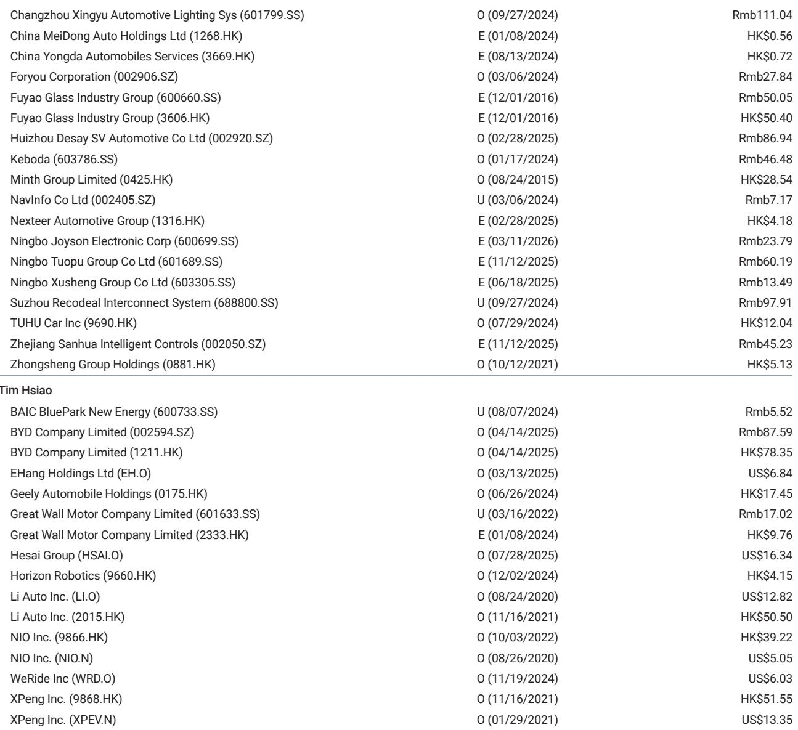
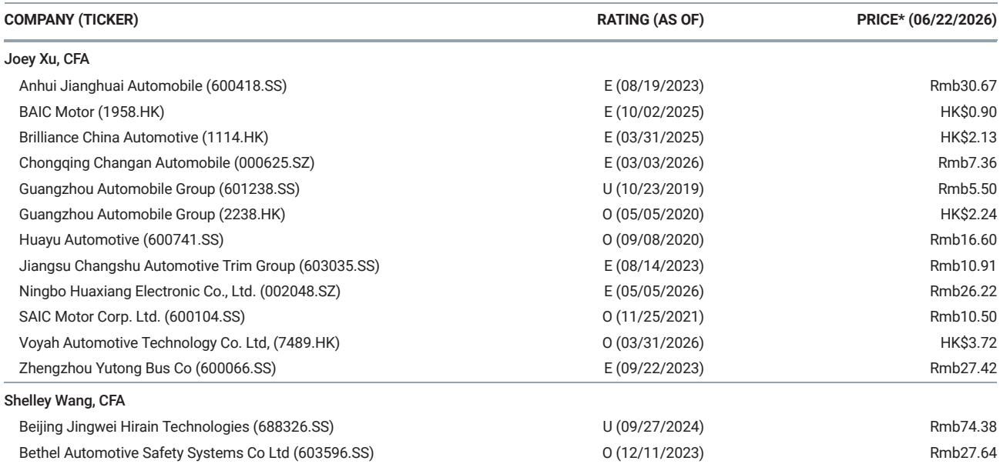
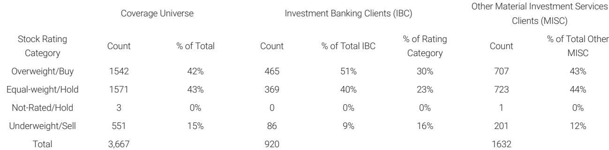

# China's EV Market Is No Longer Growing Uniformly — It Is Splitting Into Two Distinct Regimes, and Only One Offers Sustainable Returns

The Chinese electric vehicle market has entered a phase that many investors will misread as a routine seasonal fluctuation. It is not. According to the latest weekly order data from a major investment bank's Asia Pacific autos research team, the week of June 15-21 revealed a market that is fundamentally bifurcating. BYD recorded an extraordinary 104,500 to 105,000 weekly orders — a 61% week-over-week surge, driven by the pre-order conversion of the Great Tang model. Leapmotor delivered 19,300 to 19,500 orders, up 43% week-over-week, boosted by C-series facelifts. Meanwhile, NIO saw orders drop 10% week-over-week as the initial Onvo L60 launch spike faded. XPeng managed only 7,200 to 7,400 orders, down 58% month-over-month. This is not a market where all boats rise or fall together. It is a market where new product cycles and aggressive quarter-end promotions are creating a widening gulf between winners and everyone else.

The conventional narrative — that China's EV market is simply competitive and growing — is dangerously incomplete. The data reveals a more precise and more strategic story. The market is experiencing a temporary inflation of demand driven by quarter-end incentive pull-forward, layered on top of a structural divergence between brands with genuine product catalysts and those without. The implications for investors are stark: the next twelve months will separate companies that can generate self-sustaining demand from those that must continuously buy it. The week of June 15-21 is not an anomaly. It is a signal.

This analysis unpacks what the weekly order data actually means, why the July air pocket is more than a seasonal dip, and how investors should rethink their frameworks for evaluating Chinese EV companies. The argument is not about which brand sold the most cars last week. It is about which business models can survive the transition from a market driven by incentives to one driven by product conviction.

## The Quarter-End Pull-Forward Is Creating a False Peak That Will Distort Second-Half Comparisons

The most immediate and actionable insight from the June 15-21 data is the magnitude of the quarter-end promotion effect. BYD's 61% week-over-week growth is not purely organic demand. It is a conversion event tied to the Great Tang pre-orders, layered on top of aggressive dealer incentives designed to close the quarter with strong reported numbers. What makes this strategically important is not the absolute figure but the timing. The report explicitly notes that these promotions are pulling orders forward into late June, inflating bookings ahead of a likely July air pocket.

This pattern is not new to the auto industry, but its magnitude in the current cycle is unusual. Several factors are compounding the effect. First, the competitive landscape has intensified to the point where no major player can afford to report a weak quarter, especially with investor scrutiny on market share trajectories. Second, the transition from June to July coincides with the traditional summer lull in Chinese auto retail, which means the pull-forward will create a sharper-than-normal drop in July orders. Third, and most critically, the promotional intensity suggests that underlying demand — absent incentives — may be softer than the headline numbers imply.

The strategic implication for investors is straightforward. Companies that reported strong June order numbers should not be automatically extrapolated into a strong second half. The real test will come in July and August, when the promotional tailwind fades and the market must rely on genuine product pull. BYD's Great Tang conversion is a legitimate product event, but even that needs to be separated from the broader incentive-driven volume. Investors should demand to see the retention rate of June orders through to actual deliveries in July, and they should watch whether July promotional intensity ratchets up further to compensate for the air pocket.

## New Model Launches Are the Only Reliable Demand Catalyst in a Market Saturated with Incentives

The bifurcation in weekly orders is not random. It maps almost perfectly onto the product cycle calendar. BYD's Great Tang conversion and Leapmotor's C-series facelifts generated outsized growth. Aito's 12% week-over-week increase was driven by cheaper M6 variants starting from 229,800 RMB. In contrast, brands without recent product catalysts saw listless or declining orders. NIO's week-over-week decline of 10% followed the Onvo L60 launch spike, which appears to have been a one-time event rather than a sustained demand generator. XPeng's 58% month-over-month decline places it in the same category, with all eyes now on the Mona L03 debut scheduled for July 2.

This pattern confirms a thesis that has been building for the past twelve months: the Chinese EV market has crossed a threshold where incentive-driven demand has diminishing marginal returns. Consumers are no longer swayed by price cuts alone, because nearly every brand is offering them. The differentiation that matters is product differentiation — new models, facelifts, and technology upgrades that create genuine reasons to buy.

The data also reveals a more subtle dynamic. The magnitude of the response to new model launches is not uniform. BYD's Great Tang conversion produced a 61% week-over-week surge, while Leapmotor's C-series facelifts generated 43% growth. Aito's M6 variant launch produced only 12% growth, even though the price point is significantly lower than the brand's previous offerings. This suggests that the quality of the product catalyst matters as much as its existence. A facelift that meaningfully upgrades the value proposition will outperform a price reduction on an existing model, even if the price reduction is steep.

For investors, the framework is clear. Evaluate each company's product pipeline for the next six to twelve months, not just its current order trajectory. Companies with multiple high-impact launches scheduled will have a structural advantage. Companies relying on price adjustments to sustain volume will face increasing difficulty. The market is rewarding product innovation and punishing incentive dependency.

## The July Air Pocket Will Expose Which Brands Have Genuine Demand and Which Are Living on Borrowed Volume

The report's reference to a "likely July air pocket" is more than a seasonal footnote. It is a stress test. The quarter-end promotions that inflated June orders are not sustainable, and they will create a vacuum in July that will reveal the true state of demand for each brand. The companies that can maintain order momentum into July without escalating incentives will have demonstrated genuine product pull. Those that must immediately reintroduce or deepen promotions will have revealed their dependency.

This dynamic has direct implications for margin analysis. Promotional intensity is not just a volume driver; it is a margin destroyer. Companies that can generate demand through product cycles rather than price cuts will preserve gross margins. Companies that must buy demand through incentives will see margin compression that may not be fully visible in the June quarter results, because the promotional costs will be recognized when the orders convert to deliveries in subsequent months.

The July air pocket also creates an opportunity for investors to reassess market share narratives. A brand that loses share in July because the entire market contracts is one thing. A brand that loses share disproportionately because its June volume was artificially inflated is another. The distinction matters for valuation. Investors should be skeptical of companies that report strong June orders but have weak product pipelines for the second half. The July data will be more informative than the June data for assessing competitive positioning.

## What the Report Does Not Fully Answer: The Interaction Between Incentive Fatigue and Consumer Sentiment

The weekly order data provides an invaluable high-frequency snapshot of competitive dynamics, but it leaves several critical questions unanswered. The most important of these is the state of underlying consumer demand in China's broader economy. The report does not address whether the pull-forward effect is merely shifting demand from July to June, or whether it is also pulling in demand from later quarters. If consumers are simply accelerating purchases they would have made anyway, the July air pocket will be followed by a recovery in August and September. If the promotions are tapping out a finite pool of price-sensitive buyers, the recovery may be slower and weaker.

A related question concerns the sustainability of the premium segment. Brands like NIO and Li Auto operate in a different demand environment than BYD and Leapmotor. Their customers are less price-sensitive but more sensitive to brand perception and technology differentiation. The report shows Li Auto with suppressed L-series sales ahead of the L8 launch, which suggests that even premium brands are subject to product cycle risk. What the data does not reveal is whether the premium segment is experiencing its own version of incentive fatigue, or whether it remains structurally healthier than the mass market.

Finally, the report does not address the impact of macroeconomic factors on EV demand. Chinese consumer confidence, property market weakness, and employment concerns all influence big-ticket purchase decisions. The weekly order data captures the competitive dynamics within the EV market, but it does not capture the size of the total addressable market or whether it is expanding or contracting. Investors need to triangulate the weekly data with broader economic indicators to form a complete picture.

## A Decision Framework for Evaluating Chinese EV Companies in the Current Cycle

The weekly order data, combined with the structural analysis above, supports a three-part framework for investment decision-making. This framework is designed to be applied company by company, not as a market-wide filter.

First, assess product cycle density. Count the number of meaningful new model launches or facelifts scheduled for the next six months, weighted by the size of the addressable segment. A company with three launches in high-volume segments has a structural advantage over a company with one launch in a niche segment. BYD and Leapmotor score well on this metric. XPeng's future depends entirely on the Mona L03. Li Auto's near-term trajectory hinges on the L8 reception.

Second, measure incentive dependency. Calculate the ratio of promotional intensity to organic order growth. This requires channel-level data that is not always public, but the weekly order volatility provides a proxy. Companies with high week-over-week swings that correlate with promotion periods are more dependent on incentives. Companies with stable order growth across promotional and non-promotional periods have stronger product pull. The data suggests that NIO and XPeng are more incentive-dependent than BYD and Leapmotor, though the gap may narrow as new models launch.

Third, evaluate margin resilience in the face of the July air pocket. Companies with strong product pipelines can afford to let July orders dip without panicking. Companies with weak pipelines will be forced to increase promotions to maintain volume, compressing margins. The companies that maintain or improve gross margins in the second half of the year will be the ones with genuine product catalysts, not those with the deepest pockets for incentives.

This framework is not static. It will need to be updated as new weekly order data becomes available and as product launch calendars evolve. But it provides a disciplined way to separate signal from noise in a market that is generating plenty of both.

## The Full Picture Requires Granular Data That Only the Full Report Provides

The weekly order data discussed here represents a single week in a highly dynamic market. The full report from which this analysis is drawn contains historical trend data, channel-level feedback, and comparative analysis across multiple weeks that provides the context necessary for robust decision-making. The charts included in the original report — showing order trajectories over time, market share shifts, and the relationship between promotions and order conversion — are essential tools for investors who want to move beyond headlines and into actionable analysis.

The weekly data will continue to evolve, and the questions raised here — about the sustainability of demand, the quality of product catalysts, and the margin implications of incentive intensity — will only become more important as the market moves through the July air pocket and into the second-half competitive cycle. Investors who track these dynamics at the weekly level will have a significant information advantage over those who rely on monthly or quarterly reports.

Join the community to read the full report and review the original charts.

*This article is for learning and discussion only and does not constitute investment advice.*

Personal reading notes and learning share only. Not investment advice.

