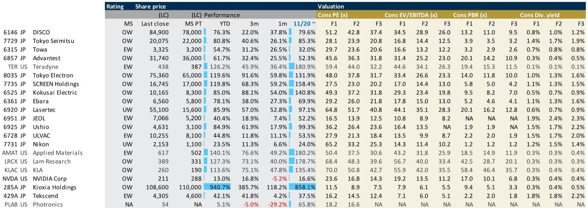

# 摩根斯坦利：半导体设备的下一个瓶颈不是芯片，是连接

这份报告最值得看的判断不是DRAM涨价，也不是设备出货量超预期。摩根斯坦利在2026年6月的日本半导体设备月度报告中，提出了一个真正具有结构意义的观点：当Agentic AI从概念走向部署，整个计算架构的瓶颈正在从芯片算力转向内存带宽，并进一步转向设备间的互联能力。这意味着，过去三年市场习惯的“买设备就是买AI基建”的逻辑，正在被重新定义。

市场目前对日本半导体设备板块的定价，基本建立在“AI拉动先进制程、存储扩产”这条主线上。但这份报告揭示了一条更隐蔽、也更值得追踪的线索：Agentic AI的工作负载模式，与Chatbot时代有本质区别。后者是单次请求-响应，前者需要AI代理在数十到数百个循环中反复调用上下文、检索知识、执行推理。这直接导致对DRAM和NAND的需求量级发生指数级跃迁，而非线性增长。

报告给出的数字值得反复推敲：仅NVIDIA Vera CPU的推出，就可能使2025年基础上的总DRAM bit需求增加约16%。这不是一个增量，而是一个跳变。更关键的是，报告指出，连接性将成为下一个瓶颈——当芯片和内存的密度足够高时，信号在铜缆上能传输的距离本身就成了物理限制。

> **KC评论：** 这意味着，市场目前对半导体设备公司的估值，可能还没有充分反映“互联设备”这一细分赛道的结构性溢价。报告没有直接给出买入建议，但它提供的框架暗示：那些在测试、互联、封装环节有技术壁垒的公司，其增长曲线可能比纯前道设备公司更陡峭。完整报告中有详细的互联设备收入拆分和竞争格局分析，值得细读。

## 1. Agentic AI正在改变内存需求的“量纲”，而非“斜率”

市场对AI拉动存储需求的认知，基本停留在“HBM供不应求、DDR5涨价”这个层面。但摩根斯坦利在报告中用一个简单的架构图，点明了本质差异：Chatbot模式下，一次推理只需要一次内存访问；而Agent模式下，GPU需要在一个循环中反复读取工作内存，CPU则需要承载更长的上下文计算。

这带来的直接后果是，内存需求的驱动因素从“每台服务器的容量”变成了“每个代理任务的循环次数”。后者是一个乘数效应，而非加法效应。报告估算，仅Vera CPU的部署，就能使2025年基础上的DRAM bit需求增长约16%。这还只是一个CPU型号的拉动。

更值得注意的是，报告在NAND部分也强调了类似逻辑：Agentic AI导致更长的上下文、更复杂的数据保留需求，使得AI存储架构从“GPU溢出-内存-闪存-HDD”的四层金字塔，变成每一层的容量和带宽都需要同步扩张。这不是简单的“存储跟着计算走”，而是“存储决定了计算能否有效展开”。

> **KC评论：** 如果这个判断成立，那么市场对存储设备公司的估值模型可能需要从“周期股”切换到“成长股”。报告中的DRAM和NAND价格趋势图、bit出货量同比拆分，是验证这一判断的关键数据。完整报告里有详细的WSTS数据拆解和摩根斯坦利的预测对比。

## 2. 测试设备正在从“后道”变成“瓶颈”，Advantest被上调为Top Pick的逻辑在此

摩根斯坦利在5月26日将Advantest上调为Top Pick，这一动作在报告中被放在显眼位置。但真正值得关注的不是评级本身，而是背后的逻辑链条：Agentic AI对内存和计算芯片的测试需求，不是线性增长，而是指数增长。

报告给出的Advantest收入和利润预测，已经清晰展示了这一趋势。Computing/Communication测试业务收入从2026财年的7290亿日元，预计增长到2027财年的10700亿日元，再到2028财年的15550亿日元。这背后隐含的测试机台出货量，从2026财年的2700台增长到2027财年的3835台，再到2028财年的5411台。

> **KC评论：** 这不是一个简单的“AI拉动测试需求”的故事。关键在于，Agentic AI芯片的复杂度——更多的核心、更大的缓存、更复杂的互联——使得每颗芯片的测试时间大幅增加，测试设备的利用率也随之上升。报告中的V93000 EXA Scale价格假设和隐含出货量推算，是理解这一逻辑的核心。完整报告有更详细的测试设备收入分拆和竞争对手对比。

## 3. 互联能力成为物理瓶颈，设备商的护城河正在被重新定义

报告中最具前瞻性的部分，是明确指出“连接性将成为下一个瓶颈”。这个判断的依据非常硬核：信号在铜缆上能传输的距离，随着数据速率的提升而急剧缩短。当数据传输速率达到200Gbps以上时，铜缆的有效传输距离可能只有几米。这意味着，在数据中心内部，设备之间的物理布局、互联架构、光模块和电模块的配合，正在成为制约系统性能的关键。

这一判断对半导体设备投资的意义在于：那些在互联相关设备——如测试接口、探针卡、封装设备、基板制造设备——有技术积累的公司，其增长逻辑将从“跟着制程走”变成“跟着架构走”。后者是一个更长期、更稳定的需求驱动。

报告没有直接点名哪些公司受益最大，但可以从其覆盖的股票中看出线索：Disco（切割/研磨设备）、Tokyo Seimitsu（探针台/划片机）、Towa（封装设备）等，都在互联链路上占据关键位置。

> **KC评论：** 这是报告中最值得深入挖掘的部分。如果互联成为瓶颈，那么设备公司的估值逻辑将从“CAPEX周期”切换到“架构升级周期”。完整报告中有关于互联设备市场规模的测算和竞争格局分析，这些数据在公开渠道很难找到。

## 4. 报告没有完全回答的问题：中国自主化对日本设备商的真实影响

摩根斯坦利在这份报告中，对地缘政治和供应链重构着墨不多。这本身就是一个值得追问的信号。报告主要覆盖日本设备商，而中国是日本设备的重要市场。但报告在讨论需求驱动时，基本只聚焦于AI和Agentic AI，没有单独分析中国自主化进程对日本设备商订单的影响。

这是一个关键的未解问题。一方面，中国晶圆厂正在加速国产替代，对日本设备的需求可能面临结构性压力；另一方面，中国在先进制程上的突破，又可能带来新的设备需求。两股力量如何对冲，报告没有给出明确的量化分析。

> **KC评论：** 这个问题直接影响对Tokyo Electron、SCREEN、Kokusai Electric等公司的估值。报告给出了这些公司的收入和利润预测，但没有单独拆解中国市场的贡献。完整报告里可能有更细分的区域收入数据，或者摩根斯坦利在后续的客户交流中会有更深入的讨论。

## 5. 给读者的观察框架：从“设备周期”切换到“架构周期”

综合这份报告的核心逻辑，我们认为投资者在跟踪日本半导体设备板块时，需要建立一个新的观察框架：

第一，关注内存需求的“量纲”变化，而非“斜率”。如果Agentic AI的部署加速，DRAM和NAND的bit需求增速可能超出市场预期，这将直接利好设备商。

第二，关注测试设备公司的订单能见度。Advantest被上调为Top Pick，背后是测试需求的结构性增长。如果测试设备订单持续超预期，可能意味着AI芯片的复杂度正在超出市场预期。

第三，关注互联设备的估值重估。如果互联成为下一个瓶颈，那么Disco、Tokyo Seimitsu、Towa等公司的增长逻辑将发生变化，市场可能需要对它们重新定价。

第四，关注地缘政治风险。报告没有展开讨论，但这并不意味着风险不存在。中国自主化进程、日本政府对半导体设备的出口管制政策，都是需要持续跟踪的变量。

---

这份报告的核心价值，不在于它给出了多少目标价或评级，而在于它提供了一个全新的思考框架：当AI从对话走向行动，整个计算架构的瓶颈正在从芯片转向内存，再转向互联。对于半导体设备投资者来说，这意味着“买设备就是买AI”的粗放逻辑，需要被更精细的“买哪个环节的设备”所取代。

报告中的图表和数据——从DRAM bit出货量同比拆分，到Agentic AI对内存需求的量化测算，再到互联设备的市场空间——都是验证这一框架的关键证据。这些内容在公开渠道很难系统性地获得。

如果你想深入理解这份报告的完整数据、图表拆解和摩根斯坦利对每家覆盖公司的详细预测，欢迎加入我们的社群。我们每天由AI agent和人工review生成国际投行中文摘要与KC评论，daily更新约10-40页，并整理当天最新数据图表合集，方便喂给AI，也方便人工快速把握market dynamics。欢迎来星球微信群里继续讨论。

Personal reading notes and learning share only. Not investment advice.

