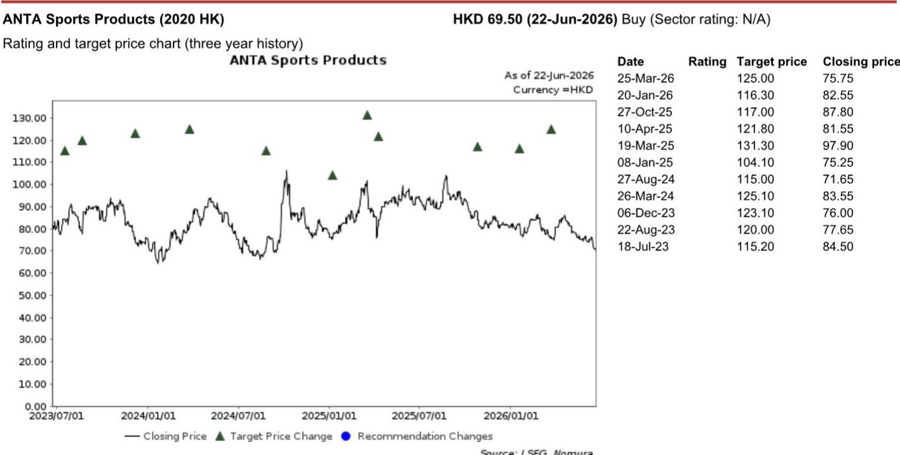
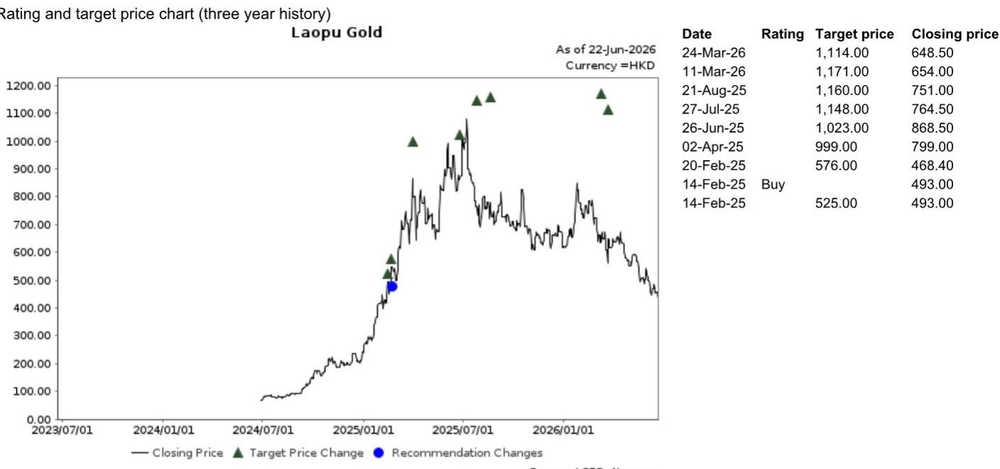
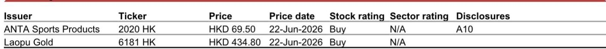

# NOM：端午消费数据透露的信号，比表面数字更值得警惕

消费数据正在传递一个清晰的信号：复苏的斜率在放缓，而市场对此的定价可能还不够充分。

NOM在端午假期后发布的一份消费相关研报中，给出了一个简洁但有力的判断：端午假期旅游出行和消费数据表现“平淡”（lukewarm），与五一和春节假期相比，增长动能明显减弱。这份报告的价值不在于它描述了“端午消费不太好”这个现象，而在于它通过对比不同假期的数据、不同出行方式的分化，以及商业区人流与销售额的背离，揭示了一个更值得关注的结构性变化——消费者的支出意愿正在变得更加审慎，而企业需要为此调整预期。

对于产业决策者和投资者而言，当前的关键问题不是“消费会不会突然崩溃”，而是“当消费增速从‘补偿性反弹’回归‘常态化低速增长’，哪些公司还能保持盈利韧性，哪些公司会被暴露在估值风险中”。

## 1. 端午数据不是孤立事件，而是消费动能系统性回落的第三个信号

NOM报告中最值得关注的一组对比，不是端午数据本身，而是它相对于五一和春节的减速幅度。

端午假期日均旅游出行量约2.16亿人次，同比增速接近零。相比之下，2026年五一假期日均出行量同比增长3.5%，春节假期同比增长8.2%。从8%到3.5%再到接近0%，这不是单次假期的波动，而是一个清晰的减速序列。

NOM将端午数据疲弱归因于三个因素：华南不利天气、出行燃料成本上升、以及更广泛的消费领域持续疲软。天气和燃料成本是短期扰动，但“消费领域持续疲软”才是结构性因素。如果只看端午数据，很容易将增速放缓归因于天气，但结合五一和春节的趋势来看，天气只是加速了已经存在的放缓过程。

> **KC评论：** 消费数据的减速序列比单次数据更有说服力。8%到3.5%到接近0%的增速递减，意味着即使没有天气等一次性因素，消费的内生增长动能也在减弱。投资者需要问的问题是：这种减速是短期调整，还是消费进入新常态的前兆？完整报告中包含了对不同出行方式的进一步拆解，以及NOM对消费板块的选股框架，这些细节对于判断上述问题至关重要。

## 2. 出行方式的分化揭示了一个真实的消费心理变化

NOM报告对出行方式的分拆提供了更细致的观察窗口。

端午假期铁路出行量同比增长2.9%，但增速低于五一假期的4.6%；自驾出行量同比下降2.1%，而五一期间自驾是同比增长2.6%的；航空出行量同比增长0.6%，相比五一期间的下降5.7%有所恢复。

自驾出行的转负是最值得关注的信号。自驾通常被视为消费弹性较高的出行方式——它不需要提前购票，决策门槛低，对家庭预算的敏感度也更高。当消费者开始减少自驾出行，转而选择铁路或干脆不出行，这背后反映的可能是对油费、过路费等可变成本的敏感度上升。

航空出行的恢复则可能更多受供给侧因素驱动——五一期间航空出行下降5.7%可能部分由于机票价格偏高，端午期间航空公司加大促销力度推动了需求恢复。但0.6%的增速仍然微弱，说明价格弹性并没有完全释放被压抑的需求。

> **KC评论：** 出行方式的分化本质上是一个“消费降级但未消失”的故事。消费者仍然在出行，但在选择更便宜的选项。这种“精打细算”的消费行为，对于航空、酒店、旅游等行业的定价能力意味着什么？完整报告中对商业区人流与销售额的背离分析，会进一步印证这一判断。

## 3. 商业区人流增长快于销售额增长，这是消费客单价下行的直接证据

NOM报告引用了商务部的数据：端午假期全国78个重点商业区的人流量同比增长4.0%，但同口径销售额仅增长3.5%。五一假期这两个数字分别是5.0%和5.3%。

人流增速高于销售额增速，意味着客单价在下降。消费者仍然在逛商场、逛商业区，但购买意愿和购买力在减弱。这是一个典型的“量增价减”格局，对于依赖客单价提升来驱动收入增长的零售企业来说，这是一个明确的警示信号。

更值得关注的是，五一假期的人流增速和销售额增速之间的差距（5.0% vs 5.3%）是销售额跑赢人流的，说明当时消费者的购买力仍然较强。而端午期间这个关系逆转，销售额增速落后于人流增速0.5个百分点。从“买得更多”到“逛得更多但买得更少”，这一转变可能比整体增速放缓更具警示意义。

## 4. NOM在平淡数据中选出的两只股票，透露了消费投资的选股逻辑

在数据疲弱的背景下，NOM明确表达了对两只股票的偏好：安踏体育和Laopu Gold。

安踏的逻辑在于“清晰的发展战略、可见的利润率趋势和有吸引力的估值”。在消费增速放缓的环境下，能够展示出利润率改善路径的公司，比单纯追求收入增长的公司更具防御性。安踏的多品牌矩阵和成本控制能力，使其在行业增速放缓时仍有可能维持利润率稳定。

Laopu Gold的逻辑则更具特殊性。NOM认为该股票的“风险回报比具有吸引力”，尤其是在黄金价格在地缘政治环境趋于宽松的情况下企稳的假设下。Laopu Gold作为一家黄金珠宝零售商，其估值与金价高度相关。NOM对Laopu的推荐，本质上是在押注金价不会大幅下跌，同时公司自身的品牌溢价和产品结构能够支撑其高于行业平均的估值倍数。

这两只股票的推荐逻辑共同指向一个核心判断：在消费增速放缓的环境下，市场将奖励那些有“定价权”或“利润率确定性”的公司，而惩罚那些依赖行业beta增长的公司。

> **KC评论：** NOM的选股逻辑实际上提供了一个消费投资的观察框架：在消费增速系统性放缓的背景下，投资者应该寻找那些“即使行业增速为零，也能通过份额提升或利润率改善实现盈利增长”的公司。完整报告中包含了对这两只股票的估值方法论和风险因素的详细拆解，这些细节对于理解NOM的推荐是否适用于自己的投资组合至关重要。

## 5. 报告尚未完全回答的关键问题：消费减速是周期性的还是结构性的？

NOM报告提供了一个清晰的数据快照和选股建议，但有一个问题它没有完全展开：当前消费增速的放缓，到底是周期性的（受天气、油价等短期因素影响，后续有望修复），还是结构性的（反映了居民收入预期、就业信心等长期因素的恶化）？

这个问题决定了投资策略的方向。如果是周期性的，那么当前消费股的估值回调可能提供了买入机会；如果是结构性的，那么消费板块的估值中枢可能面临系统性下移。

报告将“消费领域持续疲软”列为因素之一，但没有进一步量化这个因素的权重。天气和油价是可逆的，但消费信心一旦受损，修复时间可能比市场预期的更长。NOM在选股上偏向安踏和Laopu Gold，本质上是在选择那些即使消费增速放缓，也能通过自身竞争优势实现盈利增长的标的——这是一种结构性的应对策略，而非押注周期性反弹。

但对于更广泛的消费板块，尤其是那些高度依赖行业beta、缺乏差异化竞争优势的公司，这份报告没有给出明确的判断。这恰恰是投资者需要进一步研究的方向。

## 6. 一个观察框架：在消费减速期，如何识别能跑赢的公司

基于NOM报告的逻辑和数据，我们可以提炼出一个在消费减速期筛选公司的观察框架：

第一，看利润率趋势是否独立于收入增速。如果一家公司在收入增速放缓时，利润率仍然在改善，说明它具备成本控制或定价能力。安踏的逻辑就在这里。

第二，看客单价是否具有韧性。商业区销售额增速落后于人流增速，说明整体客单价在下降。但如果某个细分品类的客单价仍然稳定甚至上升，说明该品类或品牌具备较强的消费者黏性和定价权。

第三，看估值是否已经反映了减速预期。NOM指出安踏的估值处于“近期板块股价走弱后的有吸引力水平”，这意味着市场已经部分定价了消费减速的风险。但其他消费股的估值是否已经充分反映了当前的减速趋势？这需要逐一分析。

第四，看公司是否有“第二增长曲线”或结构性增长驱动。Laopu Gold的推荐逻辑部分建立在对金价走势的判断上，这本质上是在寻找一个与消费周期相关性较低的增长驱动因素。

这个框架不是NOM报告直接给出的，而是从其选股逻辑和数据分析中推导出来的。对于希望自主做出投资判断的读者，这个框架可能比任何单次推荐都更有长期价值。

---

端午消费数据只是一个切片。它没有告诉我们消费的终点在哪里，但它清晰地表明：从8%到3.5%到接近0%的增速递减，不是一条直线，而是一个加速下行的曲线。对于产业决策者来说，这意味着需要重新审视增长预期和成本结构；对于投资者来说，这意味着需要更加精细地甄别哪些公司能在低速增长中存活并壮大。

NOM这份报告的完整价值，在于它提供了足够的数据颗粒度和分析框架，帮助读者自己做出判断。报告中关于不同出行方式的弹性分析、商业区数据的时间序列对比、以及两只推荐股票的估值方法论和风险因素，都是无法在一篇文章中完全展开的细节。

如果你希望进一步探讨这些数据背后的含义，或者想看到更多类似的高质量投行分析，欢迎加入我们的社群。我们每天由AI agent和人工review生成国际投行的中文摘要与关键评论，每日更新约10-40页，并整理当天最新的数据图表合集。这些内容既方便你喂给AI进行二次分析，也方便你人工快速把握全球市场的动态变化。在微信群里，我们可以继续讨论：消费减速到底是周期性的还是结构性的？哪些细分赛道仍然具备结构性增长机会？欢迎你的加入。

Personal reading notes and learning share only. Not investment advice.

