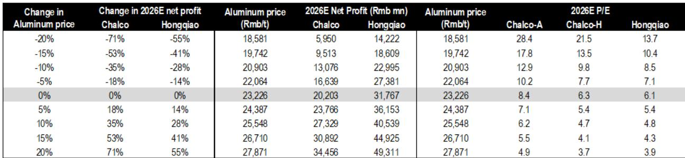
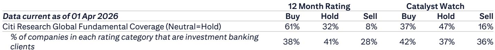
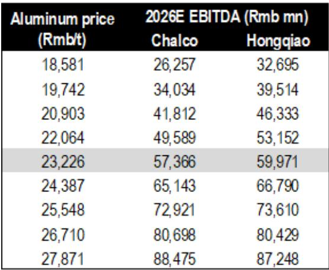

# China's Aluminum Capacity Cap Is Holding, and the Market Is Misreading the Data

The most important call on Chinese aluminum today is not about demand. It is about supply. And the supply story is being misread by a market that has latched onto a single data point from the National Bureau of Statistics and drawn the wrong conclusion. The concern is straightforward: investors worry that China's operating aluminum capacity has already breached the official 45 million tonne per annum cap, that discipline is breaking, and that a wave of new supply will collapse margins. That fear is misplaced. A careful reading of the data from Mysteel, the industry's preferred source, shows that operating capacity stood at 45.3 million tonnes per annum as of late June 2026, and full-year output is expected to reach approximately 45.4 million tonnes. That is not a breach. That is a ceiling that is holding. The NBS data that spooked the market is volatile and methodologically different from the monthly operating figures that industry participants actually use. The spike in April was an outlier. The May figure has already corrected lower. The capacity cap is not broken. The policy is intact, and the implications for aluminum equities are profound.

This is not a minor technical disagreement between data providers. It is the central analytical question for anyone positioning in Chinese aluminum stocks over the next twelve months. If the cap is holding, then the supply side remains structurally constrained. That means higher prices for longer. That means margins that sustain themselves above historical averages. And that means free cash flow that can fund dividends and buybacks at levels that the market has not yet fully priced in. The recent weakness in aluminum shares is not a signal to exit. It is a signal to look harder at the data. The market is pricing in a supply loosening that is not happening.

The report from a global investment bank makes this case with conviction. It reiterates Buy ratings on both Aluminum Corporation of China and China Hongqiao, seeing the current pullback as an enhanced opportunity to add exposure. The thesis rests on three pillars: the capacity cap is holding, overseas supply is not coming online fast enough to fill the gap, and the aluminum market is in a genuine deficit phase that will persist into 2027. Each of these pillars deserves scrutiny, and each reveals a layer of strategic complexity that most investors are overlooking.

## The Capacity Cap Is Intact, But the Market Is Using the Wrong Yardstick

The confusion begins with the data. When the NBS reported that annualized Chinese aluminum output in April 2026 hit 48 million tonnes per annum, it triggered a wave of concern that the government's capacity cap had been quietly abandoned or was being systematically ignored. That number, if accurate, would represent a roughly 6 percent overshoot of the official ceiling. It would signal that the entire supply discipline framework, which has been the single most important driver of aluminum profitability since 2017, was no longer credible.

But the NBS data is not the data that industry participants use. Mysteel, the most widely followed source for real-time capacity and output tracking in China, reported operating capacity at 45.3 million tonnes per annum in late June. The discrepancy is not random. The NBS figures are based on a monthly production survey that can be spiky, especially when month-end reporting adjustments occur. Mysteel's methodology tracks daily operating rates and is far more stable. Looking at the NBS data itself over a longer horizon reveals the problem: since March 2025, the annualized output implied by NBS has fluctuated wildly, including month-on-month declines that contradict the industry consensus that utilization rates have been rising alongside profitability. A data series that shows output falling in some months while margins are at multi-year highs is not a reliable guide to actual capacity.

The implication is clear. The market has been pricing in a supply loosening based on a data anomaly. The true operating rate is within the cap. And there is no evidence that the Chinese government is preparing to relax the policy. The risk that some investors cite, that Beijing might loosen supply cuts if prices overshoot, is a theoretical tail risk, not a base case. The policy has been remarkably consistent for nearly a decade. It is not going to be abandoned because of one volatile data print.

## Overseas Supply Is Coming, But Not Fast Enough to Change the Deficit Calculus

Even if Chinese supply is contained, the bull case for aluminum would be vulnerable if overseas capacity were ramping quickly enough to close the global deficit. The report addresses this directly, and the numbers are not encouraging for those hoping for a supply-driven price correction.

The Middle East has been a source of uncertainty due to the closure of the Strait of Hormuz. The report estimates that the inventory that could be transported out after reopening is less than 400,000 tonnes. That is a meaningful number, but it is not a game-changer in a market that is running a primary deficit of roughly 2 million tonnes in 2026. It represents a one-time release of material, not a sustained increase in supply.

Indonesia has been widely discussed as the next major low-cost aluminum hub. But the report cautions that power supply is the binding constraint, not just the construction of smelting capacity. Building power units takes time. Ramping up aluminum capacity takes even longer. The report estimates total overseas capacity addition at 1.85 million tonnes per annum in 2026, contributing about 1.2 million tonnes of actual output. That sounds like a lot, but it is more than offset by the capacity suspensions in the Middle East and only partial resumptions in Europe. The net effect is that total overseas aluminum output is expected to decline by 1.6 million tonnes year-on-year in 2026. In 2027, the picture improves, with output expected to rise by roughly 3 million tonnes year-on-year as Middle East production resumes and new Indonesian capacity comes online. But even that improvement still leaves the market in a primary deficit of approximately 270,000 tonnes in 2027.

The arithmetic matters. A market that is in deficit in both 2026 and 2027, even if the deficit narrows, is not a market where prices collapse. It is a market where prices remain elevated, where marginal costs set the floor, and where producers with access to low-cost power and captive alumina capture outsized margins.

## The Commodity Team's Price View Is a Strategic Anchor for Equity Positioning

The report's commodity team expects average aluminum prices of approximately USD 4,000 per tonne in the third quarter of 2026. The reasoning is strategic: the reopening of the Strait of Hormuz will stabilize demand faster than it restores supply. This is a critical insight. When a major shipping route reopens, the immediate effect is that buyers who had been stockpiling or deferring purchases can resume normal procurement. Demand snaps back. Supply, by contrast, takes time to restart. Idled capacity must be brought back online, supply chains must be re-established, and transportation logistics must be rebuilt. The asymmetry between the speed of demand recovery and the lag in supply restoration creates a window of pricing power for existing producers.

This price view is not an outlier. It is consistent with the deficit estimates and with the structural constraints on both Chinese and overseas supply. But it has a second-order implication that many equity investors may be underappreciating. If aluminum prices stay at or near USD 4,000 per tonne, the earnings sensitivity tables in the report show that both Chalco and Hongqiao generate enormous free cash flow. At the base case aluminum price of RMB 23,226 per tonne, Chalco's 2026E P/E is 8.4 times for the A-share and 6.3 times for the H-share. Hongqiao trades at 6.1 times. Those are not distressed valuations. But they are also not pricing in the upside scenario. If aluminum prices rise 10 percent from the base case, Chalco's net profit increases by 35 percent and Hongqiao's by 28 percent. The P/E multiples compress to 6.2 times for Chalco A-shares, 4.7 times for Chalco H-shares, and 4.8 times for Hongqiao. A 20 percent price increase drives earnings up by 71 percent and 55 percent respectively, pushing P/E ratios below 5 times.

These are not theoretical sensitivities. They are the direct consequence of high operating leverage in a business where the marginal cost of producing an additional tonne of aluminum is far below the selling price. The market is not pricing in the probability of upside. It is pricing in the probability of mean reversion. The report's argument is that mean reversion is not coming.

## What the Report Does Not Fully Answer: The Alumina Cost Risk and the Policy Tail

No analysis is complete, and this one leaves two important questions open. The first is alumina cost. The report's sensitivity analysis is based on an alumina price assumption of RMB 2,843 per tonne in 2026. That is a critical input. If alumina prices rise faster than aluminum prices, the margin compression could be significant, especially for Chalco, which is more exposed to alumina price volatility than Hongqiao. The report does not lay out a detailed alumina price forecast or stress-test the sensitivity to a sharp move in alumina. For a reader trying to size the downside risk, this is a meaningful gap. The bull case depends not just on aluminum prices staying high, but on the spread between aluminum and alumina remaining favorable.

The second open question is the policy tail. The report acknowledges that the Chinese government could loosen supply cut policies if aluminum prices overshoot. But it does not define what "overshoot" means. Is it USD 4,500 per tonne? USD 5,000? The lack of a clear threshold makes it difficult to assess the probability of this risk. If the government views high aluminum prices as inflationary or as a competitive disadvantage for downstream manufacturers, it may act sooner than the market expects. The report correctly identifies this as a risk factor for both Chalco and Hongqiao, but it does not quantify it. Readers are left to make their own judgment about where the political pain threshold lies.

These gaps do not undermine the thesis. They define the boundaries of the debate. An investor who understands the capacity cap, the overseas supply lag, and the deficit math can make a confident call. But that confidence must be tempered by an awareness that the cost side and the political side are less certain.

## A Decision Framework for Positioning in Chinese Aluminum Equities

For an investor trying to translate this analysis into a portfolio decision, the framework should be built around three questions.

First, what is your view on Chinese capacity data? If you believe the NBS data and think the cap has been breached, then you should be underweight aluminum equities. You are betting that supply discipline is breaking and that margins will compress. If you believe the Mysteel data and think the cap is holding, then you should be overweight. The evidence strongly favors the latter view, but the investor must make the call.

Second, what is your view on the speed of overseas supply restoration? If you think Middle East production resumes faster than expected and Indonesian capacity ramps ahead of schedule, the deficit narrows more quickly and the price upside is limited. If you think the bottlenecks in power and logistics are real, the deficit persists and prices stay high. The report's base case is for a slow restoration. The investor must decide whether that assumption is conservative or optimistic.

Third, what is your risk tolerance for policy intervention? This is the hardest question. The capacity cap has been a reliable feature of the Chinese aluminum market. But no policy is permanent. If aluminum prices reach levels that Beijing considers problematic, the rules could change. The investor must assess whether the current price level is already in the danger zone. The report suggests it is not, but it does not prove it.

The combination of these three questions yields a straightforward matrix. If you trust the Mysteel data, expect slow overseas supply, and believe policy risk is low, you should be aggressively positioned in Chalco and Hongqiao. If you are uncertain on one or more of these dimensions, you should size your position accordingly and look for entry points that offer a margin of safety.

## The Full Picture Requires the Charts and the Data

The argument presented here is based on the analytical framework of the report, but the full picture requires the original charts and the detailed sensitivity tables. The P/E and EV/EBITDA sensitivities to aluminum price changes are not just illustrative. They are the basis for calculating expected returns under different scenarios. The historical rating charts for Chalco and Hongqiao show how the market has re-rated these stocks in previous cycles and provide context for the current valuation. The capacity and inventory data from Mysteel are the foundation of the supply thesis. Without seeing the original charts, an investor is working with a summary rather than the full analytical toolkit.

Join the community to read the full report and review the original charts.

*This article is for learning and discussion only and does not constitute investment advice.*

Personal reading notes and learning share only. Not investment advice.

