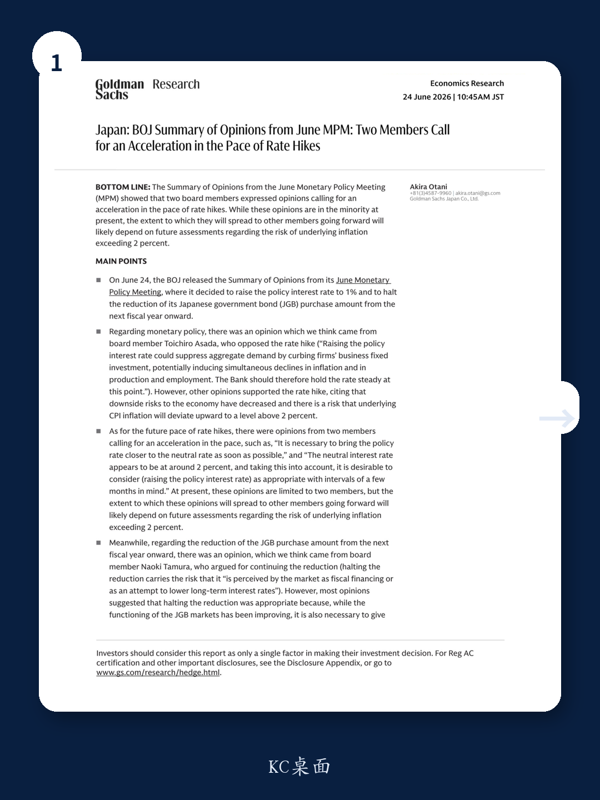

# GS：日本央行内部已有人要求加速加息，关键看通胀是否会超2%

日本央行6月货币政策会议的意见摘要，表面上只是常规披露。但GS日本经济学家团队在最新研报中捕捉到了一个值得深读的信号：有两位委员明确主张加速加息，认为政策利率应尽快接近中性利率水平。

这并非市场主流叙事。当前全球投资者的注意力仍集中在日本央行何时、以何种节奏缩减购债规模，以及日元汇率是否会继续承压。但GS指出，真正需要跟踪的，是“基础通胀超过2%的风险评估”——这个判断将决定少数派的加速加息主张是否会扩散为央行共识。

换句话说，日本央行下一次加息的时间窗口，可能比市场预期更早，也可能比市场预期更晚。而决定权，掌握在通胀数据手里。

## 1. 6月会议并非全员鹰派，但鹰派的声音正在变清晰

6月日本央行的政策决定本身并不令人意外：加息至1%，并从下一财年起停止缩减日本国债购买规模。市场对此已有充分预期。

真正值得关注的，是意见摘要中呈现的观点分歧。

一位委员明确反对加息，认为提高政策利率会抑制企业固定投资，进而同时压低通胀、产出和就业。这位委员的立场代表了对经济复苏可持续性的担忧。

但更多的委员支持加息，理由是两个：经济下行风险已经减弱；基础CPI存在向上偏离2%的风险。

GS的解读是：支持加息的理由中，“通胀超调风险”已经取代“经济过热风险”，成为央行决策的核心变量。这意味着，日本央行的加息逻辑正在从“预防性”转向“应对性”。

> **KC评论：** 这不是日本央行第一次讨论加息，但这是第一次在意见摘要中出现“基础通胀可能超过2%”的系统性担忧。对投资者来说，这意味着日本央行的加息决策将越来越依赖实际通胀数据，而非经济增速。谁在跟踪日本的核心CPI分项，谁就能预判下一次加息时点。

## 2. 两位委员要求“加速加息”，他们的逻辑是什么

这是整份摘要中最具冲击力的部分。

两位委员分别提出了明确主张：一位认为“有必要尽快将政策利率向中性利率靠拢”；另一位更直接地给出了数字——中性利率大约在2%左右，并认为“以几个月为间隔考虑加息是合理的”。

这两个表述叠加在一起，意味着在目前1%的政策利率水平上，这两位委员希望看到大约100个基点的加息空间。

当然，目前这只是两位委员的个人意见。GS在报告中特别强调，这些意见目前仍是少数派。但问题在于：这个少数派是否会扩大？

GS的判断是：这取决于未来对“基础通胀超过2%风险”的评估。如果未来几个月的核心通胀数据持续高于预期，更多委员可能转向支持加速加息。

> **KC评论：** 2%的中性利率目标并不是GS的预测，而是央行内部委员的表述。但这一表述本身就很有价值——它给出了一个可以跟踪的“政策目标区间”。如果市场开始相信日本央行确实想把利率提到2%，那么日本国债收益率曲线的定价逻辑就要重写。完整报告中，GS对中性利率的测算方法和假设条件值得细读。

## 3. 购债缩减按下暂停键，但市场稳定性才是真正的考量

6月会议的另一项重要决定是：从下一财年起停止缩减日本国债购买规模。

这一决定并非没有争议。一位委员明确反对停止缩减，认为这会被市场解读为“财政融资”或“压低长期利率的尝试”。这是一个非常尖锐的批评——如果市场真的这么理解，日元可能进一步承压，日本国债的信用溢价也可能上升。

但大多数委员选择了暂停。理由是：日本国债市场的功能虽然有所改善，但仍需考虑市场稳定。

GS没有在摘要中给出自己的判断，但隐含的逻辑很清晰：日本央行在“正常化”和“市场稳定”之间，选择了后者。这也意味着，日本央行短期内不会主动引发国债市场动荡，但长期缩减的方向并未改变。

> **KC评论：** 停止缩减购债，不等于日本央行重回宽松。它更像是一个“缓兵之计”——先稳住市场，再找机会继续缩减。对投资者来说，这意味日本国债的供给压力短期内不会加剧，但长期风险并未消除。完整报告中，GS对日本央行购债操作的技术细节和未来路径有更详细的拆解。

## 4. 报告尚未完全回答的关键问题：少数派何时变成多数派

GS这篇研报最大的价值，不是给出了一个明确的预测，而是提出了一个需要持续跟踪的问题：两位委员的加速加息主张，何时会扩散到更多委员？

这个问题目前没有答案。但GS给出了跟踪的框架：核心是“基础通胀超过2%的风险评估”。

这意味着，投资者需要关注的不只是整体CPI，更是剔除能源和新鲜食品后的核心CPI，以及服务价格、工资增长等更能反映“基础通胀”的指标。如果这些指标持续走高，加速加息的主张就会获得更多支持。

另一个未解问题是：如果加速加息真的发生，日本经济的承受能力如何？GS在报告中没有展开讨论，但这是所有投资者都必须考虑的风险——日本政府债务占GDP的比例超过250%，利率每上升100个基点，利息支出就将增加数万亿日元。

## 5. 给投资者的观察框架：三个需要持续跟踪的信号

基于GS这份报告，我们梳理出三个需要持续跟踪的信号：

第一，基础通胀的走势。这是决定少数派能否扩大的核心变量。关注日本核心CPI的月度变化，特别是服务价格和工资增长数据。

第二，中性利率的官方讨论。目前2%的中性利率只是个别委员的表述。如果日本央行的正式研究或会议纪要中出现对中性利率的系统性讨论，说明加速加息正在进入政策议程。

第三，日元汇率的反应。如果市场开始定价更快的加息路径，日元可能提前升值。这会反过来影响日本的进口价格和通胀预期，形成一个自我强化的循环。

这三个信号都不需要复杂的模型，但需要持续跟踪。这也是为什么我们每天会在社群中更新国际投行的最新研报摘要和关键数据图表——帮助读者在信息过载中抓住真正重要的变量。

---

这份GS研报的价值，不在于它给出了一个确定的结论，而在于它帮助读者识别了一个正在形成的政策分歧。分歧本身不是答案，但它是所有重要变化的前奏。

如果你希望持续跟踪日本央行的政策动向，以及全球主要投行对日本市场的最新判断，欢迎加入我们的社群。每天，我们会由AI agent与人工review相结合，生成国际投行中文摘要与KC评论，日均更新约10至40页，并整理当天最新的数据图表合集。这些内容既方便你直接喂给AI模型进行深度分析，也方便你人工快速把握全球市场动态。

在这里，我们不只是翻译研报，而是帮你提炼出真正值得关注的信号。

Personal reading notes and learning share only. Not investment advice.

