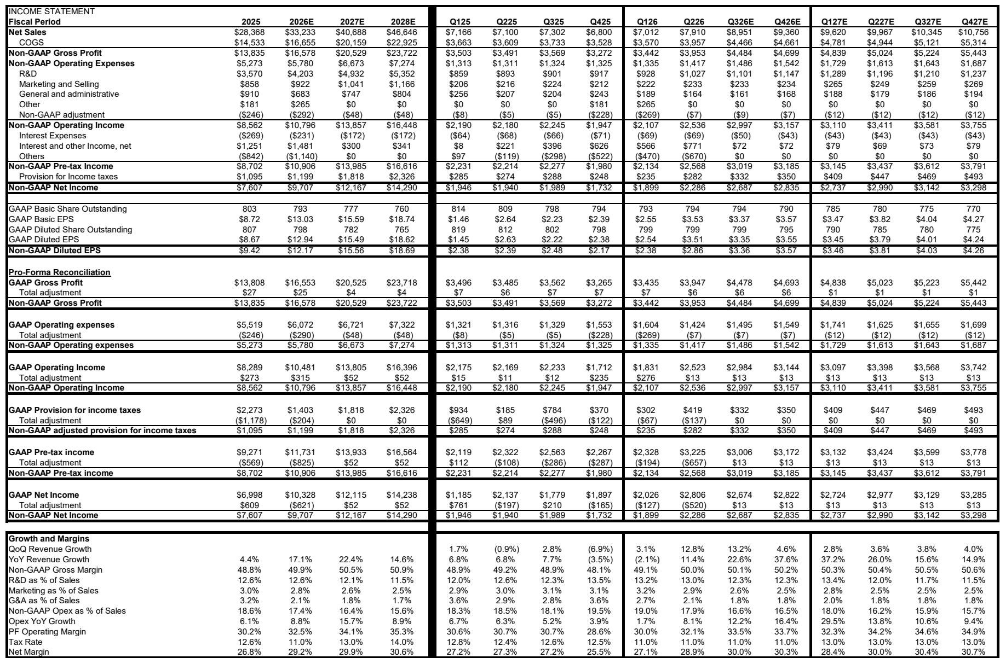
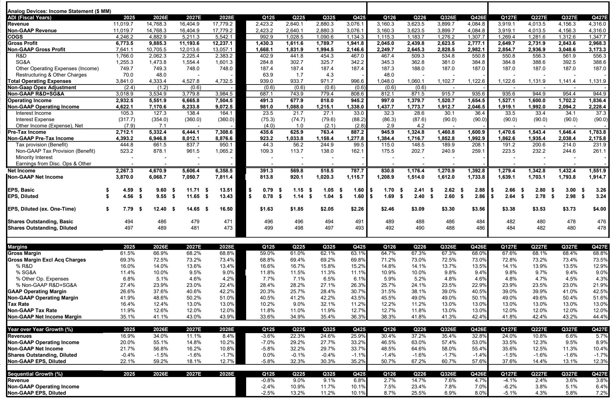
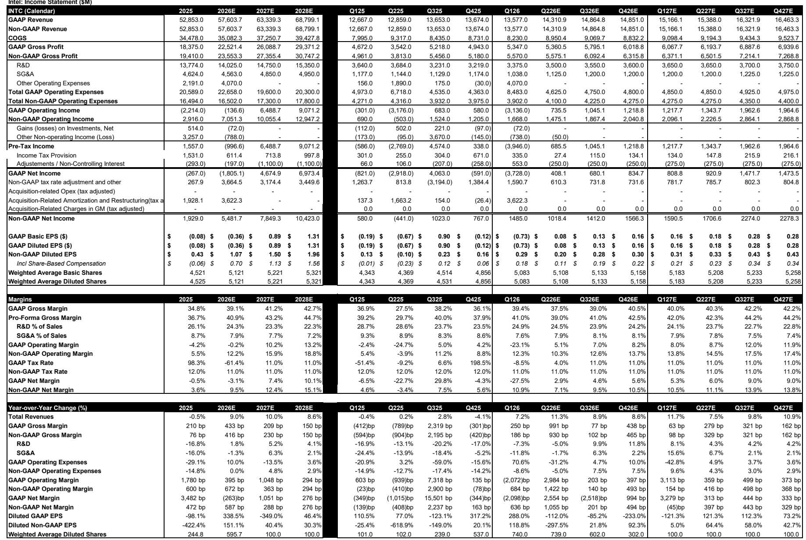

# Bernstein：半导体唯一的游戏还在，但拥挤度已到历史极值

AI主题已经膨胀到几乎拖拽整个半导体板块前进的地步——除了一个反常的例外：AI算力公司本身。这是Bernstein最新一期半导体周期速览报告给出的核心判断。报告作者Stacy Rasgon团队用一份详尽的“Tearsheet”展示了当前周期的位置，结论是：AI需求毫无放缓迹象，但几乎所有跟踪指标都在亮黄灯。估值、拥挤度、库存天数，每一个都在警示风险，而市场的反应却是继续加注。

这份报告最值得注意的判断并非“AI还会涨”，而是：**当前这轮行情的驱动力已经切换，从基本面改善转向了“只有这一个游戏可玩”的叙事惯性。** SOX指数年初至今上涨107%，是标普500涨幅的11倍。但Forward EPS同期也上涨了75%。这意味着估值扩张并非全部，盈利增长提供了支撑。但问题在于，当几乎所有非AI公司都在强行构建AI叙事时，市场已经进入了一个“只要沾上AI就能涨”的状态。

对于产业决策者和投资者而言，真正需要回答的问题是：这个状态还能持续多久？Bernstein的答案是——可能比大多数人预期的更久，但途中会有剧烈颠簸。

> **KC评论：** 报告的核心洞察是“唯一可玩的游戏”，而不是“唯一的增长”。这暗示了资金流向的集中度风险。当所有人都在追逐同一主题时，一旦出现任何边际变化，调整的幅度也会是同等的。完整报告中的Tearsheet图表（Exhibit 1）用红绿灯系统标出了7个关键指标的状态，其中6个已经从三个月前的“中性”转为“负面”。这些图表值得细看。

## 1. 真正的“输家”是AI算力公司本身，但它们的估值却出奇便宜

这是一个反直觉的现象。Bernstein指出，当市场注意力从GPU转向内存、半导体设备、光通信、模拟/功率器件，再到最近的CPU时，AI算力公司本身反而成了“输家”——它们的股价相对于板块其他成分表现落后。但报告认为，这种落后恰恰创造了机会。

“瓶颈”概念驱动的投资逻辑有一个根本缺陷：如果NVDA和AVGO不涨，所有围绕它们构建的瓶颈叙事最终都会失效。报告明确表示，两家公司目前的估值都“不合理地便宜”。NVDA的Blackwell/Rubin产品线到2027年的累计收入预期达到1万亿美元，而当前市场对NVDA的盈利预期仍然偏低。AVGO的1000亿美元AI收入目标，在报告看来甚至偏保守。

关键数据点：NVDA当前Forward PE仅22.7倍（2026年），AVGO为33.8倍（2026年）。对于一个年增长仍保持在三位数区间的行业，这样的估值并不算疯狂。

> **KC评论：** 报告没有展开的是“估值便宜”的前提——当前盈利预期是否足够保守。如果AI需求出现任何低于预期的信号，这些“便宜”的估值会迅速变得昂贵。完整报告中有详细的盈利模型拆解，包括每个季度的收入驱动因素，这些是判断预期是否安全的关键。

## 2. 半导体设备：WFE仍有上行空间，但价格已经不再便宜

Bernstein对半导体设备板块的整体判断是“继续持有”，但承认估值已经大幅上升。报告特别强调WFE（晶圆制造设备）支出仍有上行空间，尤其是DRAM、先进逻辑和先进封装领域。AI需求最终会转化为更多的芯片、更多的晶圆和更多的设备。

在三家覆盖的公司中，Bernstein倾向于Applied Materials（AMAT），理由是DRAM敞口和相对估值优势。AMAT、KLAC和LRCX均被给予“跑赢”评级。值得注意的是，报告提到了KLAC的10:1拆股后的模型修正，但并未因此改变评级。

一个值得关注的细节：报告认为中国市场的替换风险在KLAC身上更低。这暗示了地缘政治因素仍然是设备股定价的重要变量，但不同公司的暴露程度存在差异。

## 3. 模拟芯片：复苏已确认，但股价已经反映了太多

Bernstein对模拟芯片板块的态度是“观望”。TXN和ADI的营收已经连续多个季度实现双位数增长，这意味着行业不仅已经触底，部分领域可能正在进入中周期。但问题在于估值——两家公司目前的PE都在30-40倍区间，而数据中心业务虽然增长快，占比仍然较小（约10%）。

报告特别指出，TXN的故事最近更受关注，原因是其资本开支周期接近尾声，自由现金流将显著改善。但如果必须选一个，Bernstein倾向于ADI，理由是工业业务结构更好（国防和ATE敞口），且对汽车业务可能的提前拉货更为诚实。NXPI虽然更便宜，但汽车敞口过大，且渠道库存正在上升。

> **KC评论：** 模拟芯片的估值问题本质上是“复苏预期已经充分定价”。30-40倍的PE意味着市场已经将未来2-3年的增长折现到当前价格。完整报告中有详细的估值比较图表（Exhibits 55-56），展示了模拟板块相对于标普500的溢价水平。这些图表可以帮助判断当前估值是否还有安全边际。

## 4. 报告没有完全回答的问题：拥挤度何时成为转折信号

Bernstein的Tearsheet中，最令人不安的指标是“拥挤度”。报告显示，半导体板块相对于整个市场的拥挤度已经远高于历史区间上限。三个月前这个指标还是“中性”，现在已经转为“负面”。

历史经验表明，拥挤度达到极端水平后，板块往往会出现剧烈调整。但报告没有给出一个明确的触发条件。这是当前周期最不确定的部分——当所有资金都在同一个方向时，任何边际变化都可能引发连锁反应。

报告提到了“泡沫”讨论正在增加，但认为当前还远未到真正的泡沫阶段，因为盈利增长在支撑股价。然而，如果盈利增长出现任何放缓，估值扩张的支柱就会动摇。

## 5. 一个被低估的风险：内存短缺正在损害非AI需求

报告在一个细节中埋下了重要的风险提示：AI数据中心正在吞噬大量内存产能，这将对消费电子等非AI领域产生负面冲击。QCOM的智能手机业务就是典型受害者——内存短缺导致需求破坏，而市场却因为QCOM的数据中心故事而忽视了这一点。

Bernstein坦承自己在QCOM上犯了错误：3月份将QCOM降级至“市场表现”后，股价因为数据中心叙事而暴涨70%以上。但报告坚持认为，智能手机业务的压力是真实的，而数据中心故事能否持续仍有待观察。QCOM即将举行的分析师日可能成为下一个催化剂。

这个案例揭示了一个更广泛的问题：当市场只关注AI叙事时，非AI业务的基本面恶化可能被系统性低估。这种“选择性忽视”本身就是风险。

## 6. 投资者的观察框架：用Tearsheet的7个指标做定期体检

Bernstein的周期速览报告提供了一个实用的分析框架——Tearsheet。它包含7个关键指标：当前季度营收预期、远期营收预期、盈利修正趋势、渠道库存、半导体公司库存、相对估值、拥挤度。

当前的状态是：前两个指标（营收预期）高于季节性水平，属于负面信号；盈利修正似乎已经触底，属于中性；渠道库存略有下降但仍在高位，中性偏负面；半导体公司库存继续上升且远高于历史区间上限，负面；相对估值和拥挤度均为负面，且比三个月前更差。

这个框架的价值在于：它不是给出一个非黑即白的判断，而是提供一个动态监控体系。当多个指标同时从负面转向正面时，可能意味着周期拐点；反之，当多个指标都在恶化时，即使AI故事还在继续，也需要提高警惕。

---

Bernstein的这份报告，本质上是在说一句话：基本面仍好，但市场已经为此付出了很高的代价。对于已经参与这轮行情的投资者，关键问题不是“要不要卖”，而是“用什么框架来监控风险”。Tearsheet的7个指标提供了这样一个框架。

但报告没有完全展开的是：当AI投资从“建设期”进入“运营期”时，哪些公司会从资本开支受益者转变为运营效率受益者？半导体设备需求在AI数据中心建成后是否会面临结构性下降？这些问题可能需要更长的视角来回答。

如果你希望获得这份报告的完整版本，包括所有的Tearsheet图表、盈利模型拆解、以及每个公司的详细估值分析，欢迎加入我们的社群。每天由AI agent和人工review生成国际投行中文摘要与KC评论，daily更新约10-40页，并整理当天最新数据图表合集，方便喂给AI，也方便人工快速把握market dynamics。社群微信群里，我们会继续讨论这些未解的问题，包括拥挤度何时成为真正的转折信号、哪些非AI公司的基本面恶化正在被市场忽视、以及WFE支出的长期可持续性。

Personal reading notes and learning share only. Not investment advice.

