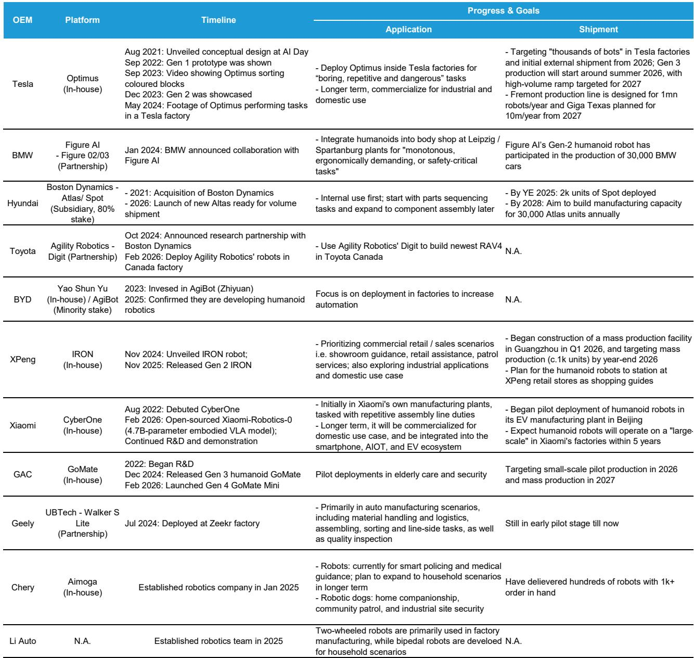
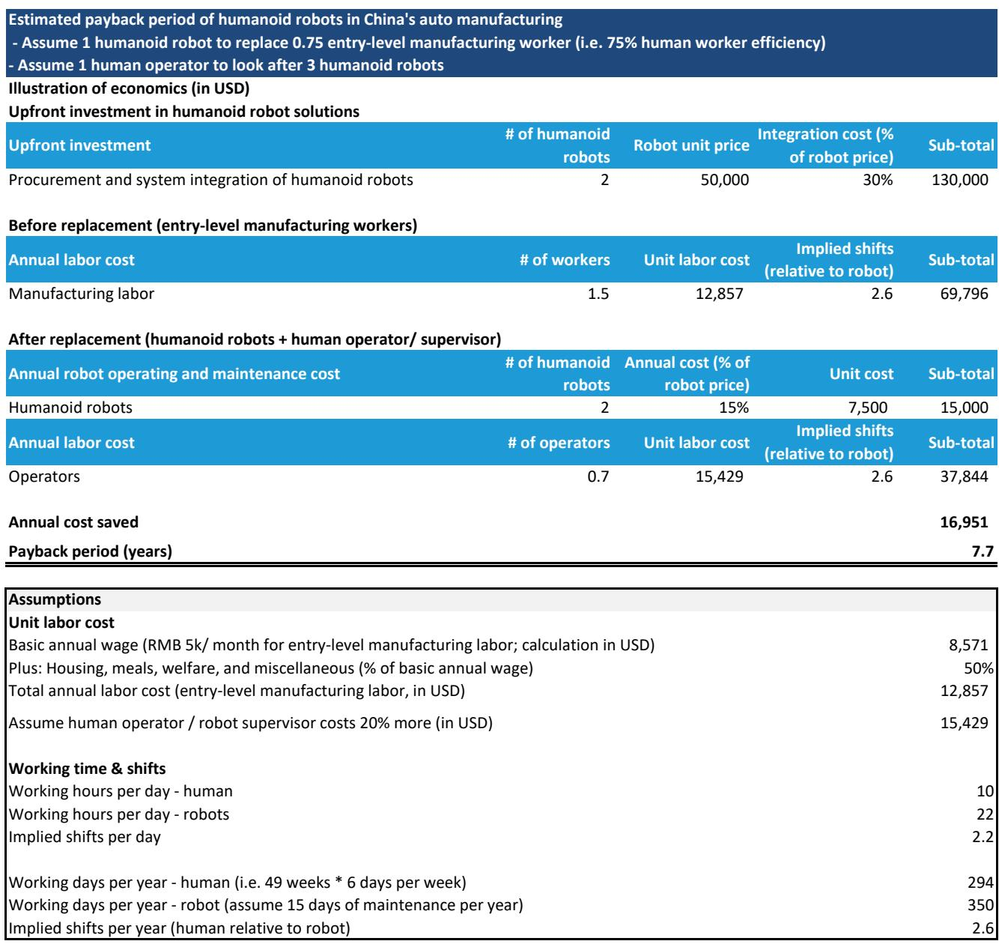
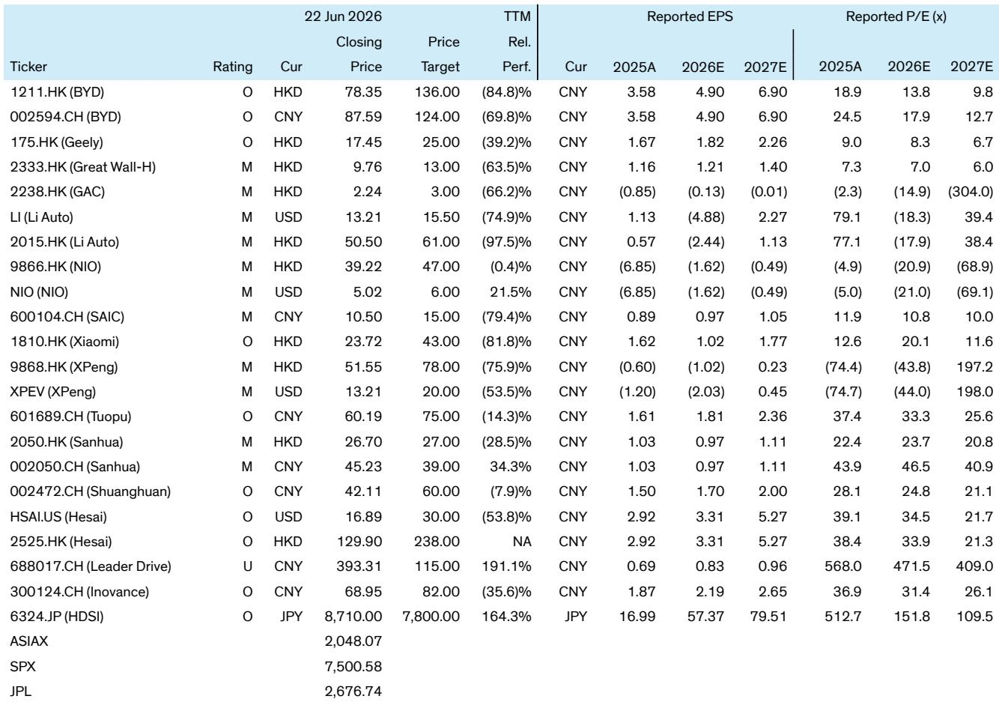

# Bernstein：车企造人形机器人，真正的护城河不在机器人本身

汽车制造商正在集体涌入人形机器人赛道。从特斯拉到现代，从小鹏到小米，2026年北京车展上，多家车企的人形机器人成为展台主角。这不是跨界玩票，也不是资本市场的故事新编。Bernstein最新研报给出了一个核心判断：车企进入人形机器人领域，不是多元化，而是主业的自然延伸——它们的竞争优势恰恰来自造车本身积累的硬件、软件和规模化能力。

这份报告的价值不在于罗列谁家机器人走得更好看，而在于它拆解了一个关键问题：当所有车企都在做同一件事，谁真正拥有结构性优势，谁只是在跟风？

## 1. 车企造机器人不是跨界，是“降维复用”

理解这一轮车企进军机器人，首先要跳出“机器人是新兴行业”的思维定式。Bernstein的研报从底层逻辑切入：一辆电动车和一个双足机器人，共享的零部件远比外界想象的多。

电机、减速器、传感器——这些构成机器人关节的核心部件，与新能源汽车的电驱系统高度同源。更关键的是制造端。车企现有的生产线、供应链管理能力、质量控制系统，可以直接迁移到机器人的量产过程中。这不仅仅是成本优势，更是时间优势：当纯机器人公司还在为一条产线融资时，车企已经在用现成的工厂做原型迭代。

> **KC评论：** 这份报告最值得细读的是它对“复用”的量化分析。读者可以重点关注研报中关于零部件重叠度和制造成本对比的图表，它们直观展示了为什么车企的起跑线比专业机器人公司靠前得多。完整报告中还有特斯拉和小鹏的零部件拆解对比，值得深入看。

从投资角度看，这意味着：评估一家车企的机器人业务前景，不能只看它机器人本身的技术参数，更要看它能把多少造车能力“平移”过去。那些垂直整合程度高、核心零部件自研比例大的车企，天然拥有更深的护城河。

## 2. 软件层面的“半复用”才是真正的胜负手

硬件复用是显性优势，但Bernstein的研报更强调一个容易被忽视的层面：软件和算法的部分重叠。

自动驾驶和人形机器人的底层技术架构正在趋同。VLA模型（视觉-语言-动作模型）和世界模型，是两者共同的技术基石。特斯拉的Optimus和FSD共享同一套感知和决策框架，小鹏的IRON机器人与其自动驾驶系统在AI模型层面也有大量交叉。

但这里有一个关键区别：不是所有车企的自动驾驶能力都足够强。Bernstein在报告中对各家车企的自动驾驶水平做了分级，这直接决定了它们在机器人软件栈上的起点。

> **KC评论：** 报告没有展开的一个二阶问题是：如果一家车企的自动驾驶本身还处于追赶阶段，它所谓的“软件复用”到底能复用多少？这个问题在完整报告的技术对比部分有更细致的拆解，包括各家的模型架构差异和训练数据来源。建议读者拿到完整报告后重点看“Software Overlap”那一节的图表。

这意味着，机器人业务的长期竞争力，很大程度上取决于车企在自动驾驶领域的真实积累。那些在自动驾驶上已经建立技术壁垒的公司，在机器人赛道上的优势会随时间放大。

## 3. 工厂是第一个战场，也是最好的实验室

Bernstein的研报提出了一个务实的观点：人形机器人的第一个大规模应用场景不会是家庭，而是工厂。

这恰恰是车企的天然主场。特斯拉已经在自己的工厂内部署Optimus执行零件搬运任务，宝马的Spartanburg工厂用Figure机器人完成了超过3万辆车的生产辅助工作，现代旗下的波士顿动力正在将Atlas机器人引入重载制造环节。

这种“自产自用”模式有几个战略价值：

第一，内部部署意味着车企可以在真实生产环境中快速迭代，发现的问题可以直接反馈给研发团队，形成“部署-反馈-改进”的闭环。这比任何实验室测试都有效。

第二，工厂场景的ROI更容易计算。Bernstein的研报给出了一个关键判断：当人形机器人的投资回收期低于5年时，在汽车制造中的部署就具有经济吸引力。目前报告估算的回收期是7-8年，但预计未来3-5年内随着机器人成本下降和劳动力成本上升，这个阈值将被突破。

> **KC评论：** 这里的核心变量是“回收期”。报告中有详细的TCO（总拥有成本）模型，对比了不同场景下机器人与人工的成本曲线。读者可以关注报告中关于“break-even year”的敏感性分析，它直接决定了这个赛道的商业化节奏。

从行业格局看，那些拥有大规模自建工厂的车企，在机器人部署上拥有天然优势。它们既是机器人的制造者，也是机器人的第一个大客户。这种双重身份带来了独特的迭代速度和成本控制能力。

## 4. 报告尚未完全回答的关键问题：谁能把技术优势转化为商业回报

Bernstein的研报在技术层面对各家车企的优势做了清晰梳理，但它也坦诚地指出了一些尚未被验证的关键假设。

首先是时间维度。报告对小鹏和特斯拉给出了相对积极的评价，但同时强调“长期时间线”的不确定性。小鹏的IRON机器人计划在2026年底量产，特斯拉的目标是2026年有限商业化——这些时间表能否兑现，取决于灵巧手等关键瓶颈的突破速度。

其次是商业模式。车企进入机器人领域，最终是要卖机器人还是卖服务？特斯拉和现代倾向于硬件销售，丰田选择了RaaS（机器人即服务）模式，小鹏则在探索消费级市场。不同的商业模式对应完全不同的估值逻辑和竞争壁垒。

第三是竞争格局的演化。目前车企的优势很大程度上来自“跨界复用”，但当专业机器人公司（如Figure、Agility、宇树科技）也开始规模化量产时，这种优势还能持续多久？报告提到了这个风险，但没有给出明确的判断。

> **KC评论：** 这些未解问题正是完整报告最有价值的部分。Bernstein在报告中提供了详细的竞争格局图谱和各家公司的技术路线对比，包括灵巧手、运动控制、AI模型等核心模块的进展。对于希望深入理解这个赛道的读者，这些细节比结论本身更重要。

## 5. 投资者的观察框架：三条线索，两个层次

基于Bernstein的报告逻辑，投资者可以从三个维度建立自己的观察框架：

**第一条线索：谁拥有最完整的“硬件+软件”复用链？** 这需要同时评估一家车企在电机、减速器、传感器等核心零部件的自研能力，以及它在自动驾驶和AI大模型上的技术积累。比亚迪在硬件垂直整合上优势明显，小鹏在AI和自动驾驶上领先，小米则强在生态系统和AI基础模型。

**第二条线索：谁的工厂部署计划最激进？** 内部部署的速度直接决定了迭代速度。现代计划到2028年在其工厂内部署超过2.5万台机器人，这个量级意味着它将在真实场景中积累远超竞争对手的数据和经验。

**第三条线索：谁在供应链上拥有更深的位置？** Bernstein的研报明确建议投资者关注上游零部件公司，尤其是那些客户基础广泛、业务不局限于人形机器人的企业。双环传动、禾赛科技、拓普集团是报告重点提及的标的。

从估值角度看，报告给出了一个清晰的判断：对于车企来说，机器人业务目前主要体现为“期权价值”，而非当期利润。小鹏的机器人业务可能带来更高的利润率——如果它能成功切入消费级市场并解决“情感陪伴”需求——但时间线较长。

> **KC评论：** 报告对各家车企的评级和估值模型是投资者最应该仔细研究的部分。Bernstein对小米给出了Outperform评级，对小鹏是Market-Perform，这种评级差异背后是对不同商业模式和时间线的判断。完整报告中有详细的DCF模型和情景分析，可以帮助读者理解这些评级背后的关键假设。

## 6. 产业链上的确定性机会：上游零部件比整车更值得关注

Bernstein的研报在投资建议部分提出了一个值得深思的观点：对于希望在机器人赛道布局的投资者，上游供应链可能提供比整车厂更确定的回报。

原因有三：第一，上游零部件公司的客户基础更广泛，不依赖单一车企的机器人业务成败；第二，它们在电机、减速器、传感器等领域已经证明了自己的技术扩展能力；第三，这些公司的主营业务本身质量较高，机器人业务是增量而非全部。

报告特别提到了双环传动（减速器）、禾赛科技（激光雷达）和拓普集团（底盘系统）作为优选标的。这些公司的估值逻辑与纯机器人公司不同：它们有传统业务作为安全垫，机器人业务则提供了向上的弹性。

---

这份Bernstein研报的价值，不仅在于它系统性地回答了“车企为什么做机器人”和“谁更有优势”，更在于它提供了一个可验证的分析框架。但报告本身也留下了一些悬而未决的问题：灵巧手的技术瓶颈何时能突破？消费级人形机器人的真实需求有多大？当行业从“概念验证”进入“规模量产”阶段时，竞争格局会如何演变？

这些问题，正是我们每天在社群中持续追踪和讨论的内容。我们会由AI agent配合人工review，每天整理国际投行最新研报的中文摘要与KC评论，覆盖Bernstein、GS、MS等主要机构，日均更新约10-40页，同时汇总当天最新数据图表合集。这些内容既方便你直接喂给AI做进一步分析，也适合人工快速把握市场动态。

欢迎加入我们的知识星球和微信群，继续讨论这些未解的问题。

Personal reading notes and learning share only. Not investment advice.

