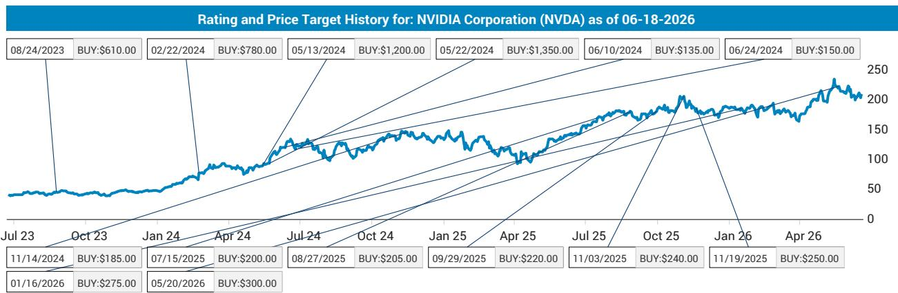
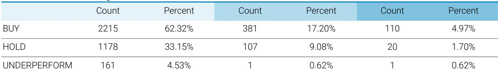
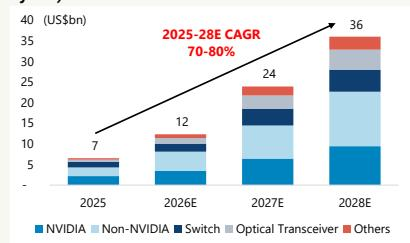

# The Kyber Delay Reshapes the AI Infrastructure Thesis: Why the PCB Supply Chain Must Rethink Its Growth Story

The most critical assumption underpinning the AI infrastructure investment narrative for 2027 and 2028 has just been called into question. A potential delay in the Kyber/backplane PCB architecture for Rubin Ultra threatens to reduce the AI PCB total addressable market by 5 percent in 2027 and as much as 16 percent in 2028 if the design is ultimately canceled. This is not merely a timeline adjustment for a single product generation. It represents a structural shift in how the market should value the entire PCB and CCL supply chain, and it forces investors to differentiate between companies that benefit from ongoing materials upgrades and those whose fortunes are tied to a specific architectural leap that may not materialize on schedule.

The conventional wisdom has been that AI infrastructure spending follows a monotonic upward trajectory, driven by relentless demand for higher performance interconnects. The Kyber delay reveals a more complex reality: architectural complexity can create bottlenecks that temporarily decouple the pace of innovation from the pace of deployment. The supply chain is now confronting the possibility that the next major PCB architecture will arrive later than expected, and in the meantime, the industry must operate with a design that was supposed to be transitional.

What makes this moment strategically significant is not the magnitude of the immediate TAM reduction, but what it signals about the risk premium that should now be embedded in PCB and CCL valuations. The Kyber architecture was not a marginal upgrade. It was the centerpiece of the next major step function in PCB value per rack. If that step function is delayed or abandoned, the entire growth curve shifts downward, and the winners and losers within the supply chain will be determined by their exposure to architectural risk rather than simply their position in the AI buildout.

## The Delay of Kyber Reveals That Architectural Complexity Has Become the Binding Constraint on PCB Value Growth

The Kyber structure was designed to replace the cable cartridge approach for intra-rack connectivity using an orthogonal backplane PCB architecture. This was not a minor engineering challenge. It required a fundamental rethinking of how signals travel within a rack, moving from a cable-based solution to a purely PCB-based interconnect that would have dramatically increased the layer count, material complexity, and dollar content per rack. The supply chain began to sense the possibility of a delay as early as May, and by late June, the absence of Kyber in 2027 had become a highly likely event.

This shift means that Rubin Ultra in 2027 will retain the Oberon structure, effectively the NVL72 design that the market already understands. The supply chain is now working toward a simplified two-canister version of Kyber for a later variant of Rubin Ultra in 2028, but even that scaled-back design faces outstanding challenges. The original four-canister design is no longer under active consideration for the near term. The worst-case scenario, which cannot be dismissed, is the complete cancellation of Kyber.

The strategic implication is clear: the PCB industry's growth trajectory is now constrained not by demand for AI compute, but by the industry's ability to deliver the next generation of interconnect architecture. Demand for higher bandwidth and lower latency is not diminishing. What is diminishing is the confidence that the supply chain can deliver the solution that was supposed to satisfy that demand on the original timeline. This shifts the analytical focus from top-down demand forecasts to bottom-up engineering feasibility assessments.

## The 5 Percent TAM Impact in 2027 Is Manageable, but the 16 Percent Downside in 2028 Represents a Structural Repricing of the Growth Narrative

The original forecast for global AI PCB TAM projected growth from approximately 12 billion dollars in 2026 to 25 billion in 2027 and 41 billion in 2028. The Kyber delay reduces the 2027 figure by 5 percent, which is within the range of normal forecast variance for a fast-moving industry. However, the potential 11 percent reduction in 2028 PCB TAM and 16 percent reduction in CCL TAM if Kyber is further delayed or canceled represents a far more consequential shift.

Why does the 2028 impact compound so dramatically? Because the original forecast assumed that Kyber would be fully ramped by 2028, contributing not only to higher layer counts and material upgrades but also to a broader adoption of the architecture across multiple hyperscaler deployments. Without Kyber, the entire 2028 growth vector depends on incremental improvements to the Oberon architecture, which has a lower ceiling for dollar content per rack. The growth rate decelerates not because AI demand slows, but because the value per rack reaches a temporary plateau.

This creates a structural challenge for companies whose valuation multiples are predicated on a compound annual growth rate that was driven by architectural transitions. If the next transition is delayed by one or two years, the cumulative TAM over the 2026 to 2028 period is materially lower, and the terminal growth rate that justifies current multiples must be reexamined. The market has been pricing PCB and CCL stocks for a continuous upward re-rating of content per rack. The Kyber delay introduces a scenario where content per rack may remain flat or increase only modestly for an extended period.

## Upstream Materials Vendors Will Continue to Outperform Downstream PCB Fabricators Because Pricing Power Is Independent of Architectural Cycles

The most important insight for portfolio construction is that the Kyber delay does not affect all parts of the supply chain equally. Upstream materials vendors, particularly those producing fiberglass cloth and copper-clad laminates, are experiencing ongoing price hikes driven by industrywide supply tightness that is largely independent of the specific architecture adopted for Rubin Ultra. These vendors have demonstrated the ability to transfer rising costs to customers and earn incremental profits from each price increase cycle.

Downstream PCB fabricators face a different reality. Their revenue and margin profiles are directly tied to the volume and complexity of the boards they produce. If the architectural upgrade that would have driven higher layer counts and more sophisticated designs is delayed, the volume of high-value boards may grow more slowly than expected. Fabricators also face the challenge of passing through materials cost increases to their customers, a process that is inherently more difficult in a market where the end customer has bargaining power and alternative sourcing options.

This divergence creates a clear relative value framework. Upstream names benefit from a structural supply-demand imbalance that is independent of Kyber. Downstream names face a demand profile that is now subject to architectural risk. The near-term price momentum is likely to favor upstream vendors, and investors who are positioned for a continuation of this trend may find that the thesis holds even as the broader PCB growth narrative is revised downward. The question is whether this relative outperformance can persist if the Kyber delay extends beyond 2028, at which point even upstream demand growth would face headwinds from a lower overall TAM trajectory.

## Copper Cable Vendors Gain a Strategic Window as the Extended Lifecycle of Oberon Delays Their Architectural Obsolescence

The Kyber delay has a clear beneficiary: copper cable manufacturers. The original thesis for Kyber was that it would replace cable-based intra-rack connectivity with a PCB-based solution, effectively threatening the revenue streams of copper cable vendors who supply the current generation of interconnect solutions. If Oberon remains the standard architecture through 2028, the replacement threat is postponed, and the cable vendors gain an extended lifecycle for their existing product lines.

This is not a marginal benefit. The cable vendors were facing the prospect of a declining addressable market as hyperscalers transitioned to PCB-based backplanes. The delay of Kyber removes that overhang for at least one to two years, and during that period, cable vendors can continue to benefit from the expansion of AI infrastructure without the structural risk of technological displacement. The earnings upside from this extended runway could be significant, particularly for companies that have been trading at a discount due to the perceived obsolescence risk.

However, investors should be cautious about extrapolating this benefit indefinitely. The R&D on PCB-based interconnects is continuing, and the industry is still targeting CoWoP penetration as early as 2027. The cable vendors are buying time, not securing permanent immunity. The strategic question is whether they can use this window to diversify into other product lines or secure longer-term contracts that extend beyond the current Oberon cycle. The report does not provide clarity on this point, and it remains one of the most important open questions for investors considering positions in the cable space.

## What the Report Does Not Fully Answer: The Probability Distribution of Kyber Outcomes and the Second-Order Effects on Hyperscaler Procurement Strategy

The report provides a clear binary scenario analysis: Kyber is delayed to 2028, or Kyber is canceled. It does not assign probabilities to these outcomes, nor does it explore the intermediate scenarios that could have materially different implications for the supply chain. For example, what if Kyber is delayed but eventually adopted in a simplified form that still drives significant content growth, just at a lower level than originally forecast? What if the delay causes hyperscalers to accelerate their own in-house interconnect development, reducing their dependence on the PCB supply chain altogether?

These are not academic questions. The hyperscalers have demonstrated a willingness to vertically integrate when the pace of innovation from the supply chain does not meet their requirements. If Kyber is delayed, the hyperscalers may choose to invest more heavily in alternative interconnect technologies, including optical solutions or custom cable assemblies that bypass the PCB architecture entirely. This would represent a second-order effect that is not captured in the TAM reduction figures provided in the report.

Furthermore, the report does not address the impact on capital expenditure plans for PCB and CCL manufacturers. If the architectural upgrade is delayed, companies may defer capacity expansion investments, which could create supply tightness in future years when demand eventually catches up. This dynamic is difficult to model but could have significant implications for pricing power and margin trajectories beyond the current forecast horizon.

Investors who want to develop a complete view of the risk-reward profile for PCB and CCL investments need to form their own views on these open questions. The report provides an excellent starting point, but the full picture requires a deeper analysis of hyperscaler behavior and supply chain investment cycles.

## A Decision Framework for Navigating the Kyber Uncertainty: Positioning for Three Scenarios

The Kyber delay creates a decision environment where investors must prepare for multiple outcomes rather than relying on a single base case. The following framework can help structure that analysis.

Scenario one: Kyber is delayed but adopted in 2028. In this case, the 2027 TAM impact is real but contained, and the 2028 growth trajectory resumes, albeit from a lower base. The winners are upstream materials vendors who benefit from near-term pricing power and copper cable vendors who gain an extended lifecycle. Downstream fabricators face a year of slower growth but retain the long-term upside from the eventual architectural transition. The appropriate positioning is to overweight upstream and cable names while maintaining selective exposure to fabricators with strong balance sheets.

Scenario two: Kyber is canceled. In this case, the 2028 TAM impact is severe, and the entire PCB growth narrative must be recalibrated. Upstream vendors would eventually face demand headwinds as the TAM ceiling becomes binding. Cable vendors would see their extended lifecycle become permanent, but the overall market growth would decelerate. The appropriate positioning is to reduce exposure to the PCB supply chain broadly and focus on cable vendors who can sustain growth independent of architectural upgrades.

Scenario three: Kyber is delayed, but hyperscalers accelerate alternative solutions. This is the most complex scenario and the one that is least discussed in the report. If hyperscalers respond to the delay by investing in optical interconnects or custom architectures, the PCB supply chain could face a structural loss of share in the intra-rack connectivity market. In this scenario, the cable vendors might also face competition from new technologies, creating a challenging environment for both groups. The appropriate positioning is to favor diversified suppliers with exposure to multiple interconnect technologies rather than pure-play PCB or cable companies.

The report provides the data to evaluate scenarios one and two. Scenario three requires additional analysis that goes beyond the scope of the current research. Investors who can develop a clear view on the likelihood of each scenario will have a significant advantage in positioning for the next phase of the AI infrastructure cycle.

## The Next Phase of AI Infrastructure Investment Requires a More Nuanced View of the Supply Chain Than the Market Currently Prices

The Kyber delay is not a reason to abandon the AI infrastructure thesis. It is a reason to refine it. The market has been treating the PCB and CCL supply chain as a monolithic beneficiary of AI buildout. The reality is more nuanced. Architectural risk is real, and it is not evenly distributed across the supply chain. Upstream vendors with independent pricing power, cable vendors with extended product lifecycles, and diversified suppliers with multiple technology exposures are all positioned differently for the scenarios that are now in play.

The full report contains detailed TAM forecasts and charts that illustrate the divergence between the original and adjusted trajectories. These charts are essential for understanding the magnitude of the impact and for calibrating the sensitivity of individual company valuations to the Kyber outcome. They also provide the raw material for building the scenario analysis that each investor must conduct for themselves.

Join the community to read the full report and review the original charts.

*This article is for learning and discussion only and does not constitute investment advice.*

Personal reading notes and learning share only. Not investment advice.

