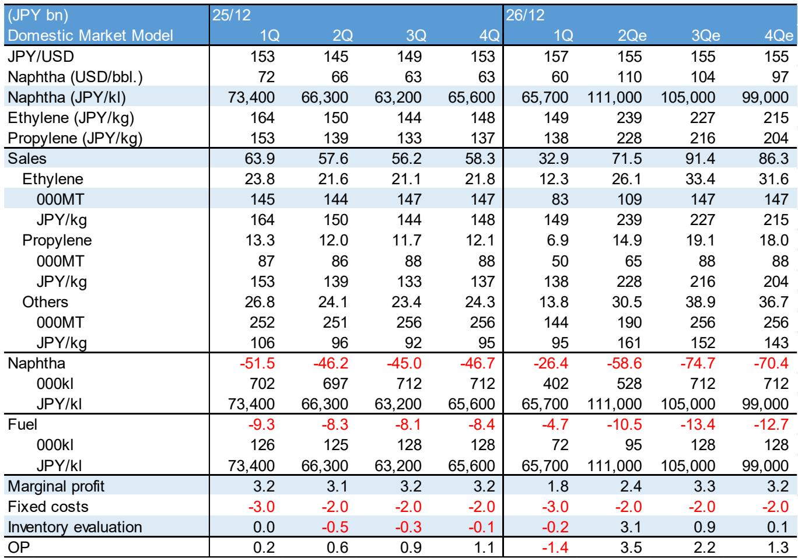
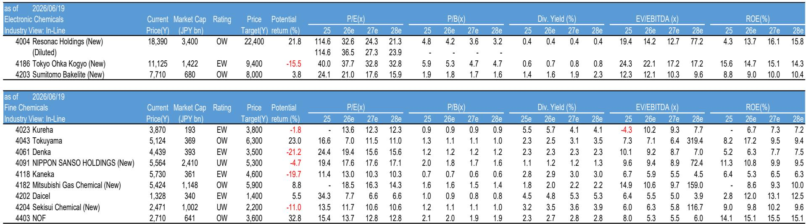
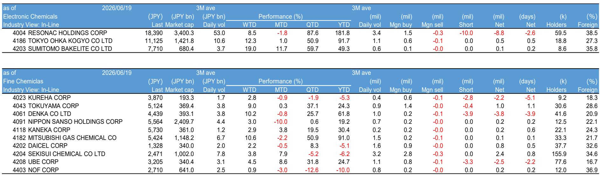

# 摩根斯坦利：日本电子化学品正在经历一场“材料级”的供应链重构

市场对日本电子化学品的关注，长期以来集中在光刻胶、高纯度化学品等“明星材料”上。但摩根斯坦利在2026年6月的最新月度报告中，给出了一个值得警惕的判断：**这一轮产业链变化，真正的结构性机会不在最热门的单品，而在那些被市场低估的“中间层”材料——覆铜板（CCL）和封装材料。**

这份覆盖日本电子化学品板块的报告，维持行业“In-Line”评级，但个股推荐出现了明确的分化。报告最核心的信号是：FC-BGA（倒装芯片球栅阵列）用覆铜板正经历“非常强劲”的需求周期，而中国市场的光刻胶需求是另一大驱动力。但这两条线索背后，隐藏着截然不同的竞争逻辑。

**KC评论：** 大多数投资者习惯用“半导体材料”这个笼统概念来覆盖日本公司。但摩根斯坦利这份报告提醒我们，电子化学品内部已经出现严重分化——材料的结构性短缺和周期性过剩并存。读完整份报告，才能真正理解为什么Resonac被列为“Overweight”，而Tokyo Ohka Kogyo却是“Equal-weight”。

---

## 1. FC-BGA覆铜板的强劲表现，正在重塑上游议价权

摩根斯坦利报告明确指出，“FC-BGA CCLs”的表现“非常强劲”。这不是一个模糊的行业观察，而是对特定细分赛道的确认。

覆铜板是PCB的核心基材，而FC-BGA封装基板用的CCL，技术要求远高于普通PCB。随着AI芯片、高性能计算对封装密度和信号完整性的要求持续提升，FC-BGA基板的需求在过去18个月持续走高。但真正值得关注的是，摩根斯坦利判断**Resonac很可能启动产能扩张，并进一步提价。**

这意味着什么？在电子产业链中，材料供应商通常处于“被动响应”位置——晶圆厂或封装厂给出规格，材料商按单生产。但Resonac的提价信号表明，FC-BGA CCL的供需格局已经紧张到让供应商获得了定价权。这不是周期性的“补库存”，而是结构性需求增长带来的议价能力转移。

---

## 2. Sumitomo Bakelite的封装材料正在进入台积电与OSAT供应链，这是比业绩本身更重要的信号

报告提到，Sumitomo Bakelite当前的业务“强劲”，两个关键进展值得关注：一是颗粒状封装材料向Intel的出货量正在增加；二是液态封装材料已开始向台积电和OSAT（外包封装测试厂）提供样品。

**KC评论：** 样品供应（sample supply）阶段，意味着产品已经通过了初步验证，进入客户认证的后期。对于一家日本材料公司来说，进入台积电供应链是“质变”信号。这份报告没有展开的是，液态封装材料在先进封装中的用量正在快速提升，而Sumitomo Bakelite在这个领域的技术积累，可能比市场预期的更深。完整报告中有详细的客户认证进度和产能规划，是判断未来12-18个月业绩拐点的关键。

---

## 3. 中国市场的光刻胶需求是真实驱动力，但Tokyo Ohka Kogyo的增速可能受限

报告指出，“中国市场正在驱动光刻胶需求”。这与过去两年中国本土晶圆厂扩产、国产化替代加速的趋势一致。但摩根斯坦利对Tokyo Ohka Kogyo给出了“Equal-weight”评级，目标价9,400日元，较当前股价有约15%的下行空间。

理由很直接：**Tokyo Ohka Kogyo的增长率低于JSR，这反映了其MOR（金属氧化物抗蚀剂）产能较低。** MOR是EUV光刻工艺中的关键材料，随着3nm及以下制程的量产，MOR需求正在爆发。Tokyo Ohka Kogyo在这个领域的产能布局落后于竞争对手，这意味着它可能无法充分受益于这一轮技术升级带来的增量市场。

**KC评论：** 这是一个典型的“赛道对了，但公司不一定对”的案例。中国光刻胶需求是真实且持续的，但如果一家公司不能在EUV相关材料上建立产能优势，其增长天花板就会比同行低。报告中的产能对比图和客户认证进度表，是判断Tokyo Ohka Kogyo能否追赶的关键。

---

## 4. 报告没有完全回答的问题：日本电子化学品的“中国敞口”到底有多脆弱？

摩根斯坦利报告反复提到中国市场的正面驱动，但一个悬而未决的问题是：**日本电子化学品公司对中国市场的依赖，在当前的宏观环境下是否构成风险？**

一方面，中国晶圆厂扩产带动了光刻胶、高纯度化学品等材料的直接需求。但另一方面，日本政府对半导体制造设备的出口管制，以及中美科技竞争的持续，可能间接影响日本材料商在中国市场的业务连续性。

报告没有深入讨论这个风险敞口，而是专注于技术面和供需面。对于投资者来说，这是一个需要自己补充判断的关键变量。完整报告中包含了各公司在中国市场的收入占比和客户分布数据，这些细节是评估风险的基础。

---

## 5. 估值信号：Resonac的ROE改善路径是核心叙事，但市场可能低估了执行难度

从估值表看，Resonac的ROE从2025年的4.3%预期提升至2027年的16.1%，这是一个相当激进的改善路径。公司当前P/E（2026e）为32.6倍，P/B为4.2倍，在电子化学品板块中属于偏高水平。

摩根斯坦利对Resonac的“Overweight”评级，本质上是在押注其重组和产能扩张的成功。但这里有一个尚未验证的假设：**Resonac能否在扩产的同时维持提价能力？**

FC-BGA CCL的强劲需求是提价的基础，但一旦产能扩张步伐超过需求增长，定价权就会迅速消失。报告提到了“进一步提价”的可能性，但没有给出具体的幅度和时间表。这是完整报告中值得细读的部分——产能扩张计划的具体节奏，以及客户对提价的接受度。

---

## 6. 投资者的观察框架：从“材料分类”转向“客户结构”和“产能稀缺性”

基于这份报告，我们认为，评估日本电子化学品公司时，传统的“按材料分类”框架需要升级。更有效的维度是：

第一，**客户结构是否多元化，且是否进入了先进封装和EUV供应链。** Sumitomo Bakelite的亮点在于同时进入了Intel和台积电，而Tokyo Ohka Kogyo的短板在于MOR产能不足。

第二，**公司是否在某一细分材料上具备“产能稀缺性”。** FC-BGA CCL的提价能力，本质上是因为短期内没有足够的替代产能。这种稀缺性比技术领先更难复制。

第三，**ROE改善的路径是否可验证。** Resonac的ROE从4.3%到16.1%的跃升，需要持续的利润率和资产周转率提升。每一季度的实际数据，都会成为市场重新定价的依据。

---

**KC评论：** 这份报告的价值不在于给出了“买A卖B”的简单结论，而在于提供了一个判断框架——哪些材料正在从“供应商”变成“定价者”，哪些公司的客户结构正在发生质变。完整报告中包含的季度利润趋势图、产能利用率数据和客户认证进展，是验证这些判断的唯一依据。

---

以上讨论只是这份摩根斯坦利报告的冰山一角。报告全文约30页，包含了各公司的季度利润拆解、产能扩张计划、客户认证时间表，以及对中国市场需求的详细测算。这些内容不适合在公众号文章中全部展开，但对于需要做投资判断的读者来说，原始报告中的图表和数据点是不可替代的。

我们每天会由AI agent加上人工review，生成国际投行中文摘要与KC评论，daily更新约10-40页，同时整理当天最新数据图表合集。这些内容既方便喂给AI做进一步分析，也方便人工快速把握market dynamics。欢迎来我们的星球和微信群，继续讨论这份报告中的未解问题——比如Resonac的提价能否持续，Sumitomo Bakelite的台积电认证何时转化为订单，以及Tokyo Ohka Kogyo的MOR产能何时能补上。

Personal reading notes and learning share only. Not investment advice.

