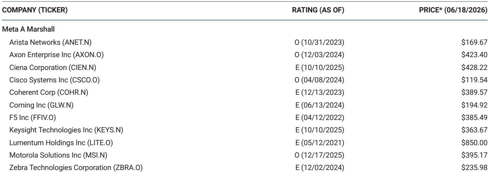
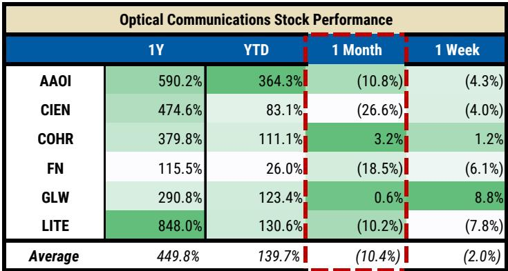
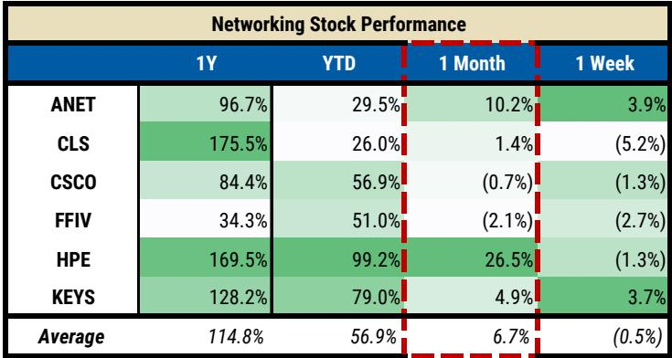

# 摩根斯坦利：MS：AI投资正从“光学狂欢”转向“网络务实”

市场对AI基础设施的叙事正在经历一次微妙的但关键的切换。当所有人还在为光模块的订单爆发和激光器产能焦虑时，MS的最新行业反馈揭示了一个正在发生的结构性转向：投资者的关注重心，正从光通信的“需求发现”阶段，移向网络设备的“推理落地”阶段。

这份报告的核心判断并非否定光学的长期价值，而是指出一个短期但重要的节奏变化——过去一个月，网络设备板块上涨6.7%，而光学板块下跌10%。这不是简单的板块轮动，而是市场在用一个更务实的框架重新审视AI基础设施的投资逻辑。

## 1. 光学赛道最大的焦虑已从“需求”转向“利润”

光学的需求故事并未终结。MS明确指出，需求条件仍然强劲，这不是投资者当前争论的焦点。真正的辩论已经上移了一个层次：在增量产能陆续释放、技术路线尚未收敛的背景下，这些订单的利润质量到底能维持多久？

报告梳理了四个关键变量：CPO/NPO技术的落地时间与形态、激光器新玩家的产能扩张、训练与推理之间资本配置的切换对规模光学定价的影响，以及光纤现货市场的价格信号。这些因素叠加在一起，使得光学的短期可见度下降，波动性上升。

> **KC评论：** 这其实是AI硬件投资从“炒预期”进入“验利润”的必然阶段。当所有人都知道订单会增长时，股价的边际驱动力就从“有没有订单”变成了“订单能赚多少钱”。这份报告最值得深读的部分，是它如何拆解不同光学公司的利润结构差异——不是所有光学股都站在同一块地基上。

## 2. 一个被市场过度解读的产能新闻：Source Photonics的扩张更像“扰动”而非“颠覆”

上周最引发市场关注的数据点，是苏州东山精密公告其子公司Source Photonics计划投资12亿美元建设光芯片及模块产能。消息一出，Lumentum和Coherent股价承压，市场担忧激光器市场将面临新一轮供给冲击。

但MS给出了一个冷静的校准：Source Photonics在激光器市场的份额仍然较小，行业反馈显示，其在竞争性讨论中并未形成实质性威胁。目前市场由Lumentum、Coherent、住友电工和博通主导。更重要的是，Source Photonics的产能扩张更可能影响的是CW激光器市场，而非利润率更高的EML市场。

这意味着，市场对这一消息的定价可能存在过度反应。但报告也承认，在缺乏现货市场数据的情况下，这种情绪驱动的波动在短期内很难完全消除。

## 3. 网络设备正在接过AI投资的“动量接力棒”

与光学的争论不休形成鲜明对比的是，MS在网络设备领域找到了更坚实的共识。报告特别点名Arista Networks和Cisco，认为这两家公司在未来一个月内将迎来更多正面催化剂，直至财报季。

核心驱动力来自一个判断：随着AI从训练阶段向推理阶段演进，网络设备的角色将从“管道”升级为“平台”。推理场景对网络延迟、负载均衡和边缘算力的要求，使得高端交换机和智能网络方案的价值量显著提升。这不是一个简单的量增逻辑，而是一个价增逻辑——用户愿意为更好的网络性能支付溢价。

> **KC评论：** 如果你把AI推理看作一个“服务交付”问题，而不是“模型训练”问题，网络设备的位置就从成本中心变成了体验中心。这是这份报告最有趣的洞察之一。完整报告里对Arista和Cisco的估值差异、产品组合和客户粘性有更详细的拆解，这些细节才是判断哪家公司能真正吃到这波红利的关键。

## 4. 光学板块中唯一“干净”的故事：Corning的逻辑为何不同

在光学板块的普遍噪音中，MS认为Corning是未来一个月“最干净的故事”。背后的逻辑值得推敲：Corning的商业模式以长期协议为主，而非现货定价。这意味着，尽管亚洲光纤现货市场的价格波动剧烈，但Corning的利润表不会受到直接冲击。

报告引用了Fujikura上调全年业绩指引这一事件——其营业利润预期上调47%，理由是需求更强、定价更好、氢气短缺影响弱于预期。虽然MS认为亚洲现货价格的解读对Corning过于激进，但Fujikura的调升无疑是一个正面的行业信号。

这与市场对Corning的普遍认知形成了有趣的张力：当所有人都在关注短期价格波动时，Corning的长期协议结构反而成为了一种防御性优势。这种“结构决定命运”的视角，恰恰是投行研报超越市场共识的价值所在。

## 5. 报告尚未完全回答的关键问题：推理对光学的二阶影响到底有多大

MS在这份报告中埋下了一个重要的未解问题：如果推理成为主导需求，对光学市场的总量和结构意味着什么？

报告指出，在训练阶段，规模光学（scale-across）的需求强劲且定价相对宽松。但进入推理阶段，由于推理场景更强调成本效率和规模部署，光学组件的定价竞争可能会加剧。这意味着，即使总需求继续增长，利润率的结构可能发生变化——这可能是当前市场对光学板块定价分歧的根源。

此外，CPO技术的落地时间表仍是一个巨大的未知数。如果CPO在2027年或2028年实现规模商用，现有的可插拔光学模块市场格局将被重塑。报告认为，规模升级中额外的光学内容比其形式更重要，但这个判断本身就需要持续验证。

> **KC评论：** 这个问题的答案，将决定光学板块未来两年的投资框架。如果推理场景下的光学需求只是“量增价跌”，那么当前的高估值需要重新审视；如果光学在推理中找到了新的价值锚点（比如更高性能的激光器或更复杂的封装方案），那么现在的波动可能就是机会。完整的报告里提供了更细致的需求拆分和敏感性分析，这些才是自己判断的基础。

## 6. 给读者的观察框架：如何跟踪这场“从光到网”的切换是否成立

基于MS的分析逻辑，以下三个信号值得持续跟踪：

第一，关注网络设备公司的盈利指引和订单结构。如果Arista和Cisco的推理相关收入占比开始显著提升，这将是叙事切换的最强验证。反之，如果光学公司的利润表依然坚挺，市场可能会重新评估当前板块轮动的合理性。

第二，关注激光器市场的供给信号。Source Photonics的产能扩张是否真正转化为市场份额，以及Lumentum和Coherent的定价权能否维持，是判断光学利润拐点的核心变量。这里缺乏高频数据，所以任何来自供应链的边际信息都可能引发价格波动。

第三，关注CPO技术的商业化进度。MS认为形式不如内容重要，但这个判断的前提是CPO不会颠覆现有的价值分配。如果CPO提前落地，整个光学板块的估值体系可能需要重写。

这三个信号背后，其实指向同一个问题：AI基础设施的投资逻辑，正在从“谁拿到了最多的订单”转向“谁能在订单中保留最多的利润”。这份报告的价值，恰恰在于它帮你把这个问题拆解成了可观察、可验证的维度。

但这些都只是基于公开报告逻辑的推演。真正完整的分析，包括对每家公司利润结构的量化拆解、对技术路线概率的加权判断，以及对不同情景下估值区间的测算，都在MS的完整报告中。每天，我们会通过AI agent加人工审核的方式，从国际投行的最新报告中提炼中文摘要和关键数据图表，形成约10-40页的daily更新，既方便喂给AI做进一步分析，也方便人工快速把握市场动态。如果你对这个跟踪框架感兴趣，欢迎在我们的星球和微信群里继续讨论——很多判断，只有放在持续的数据流中才能验证和迭代。

Personal reading notes and learning share only. Not investment advice.

