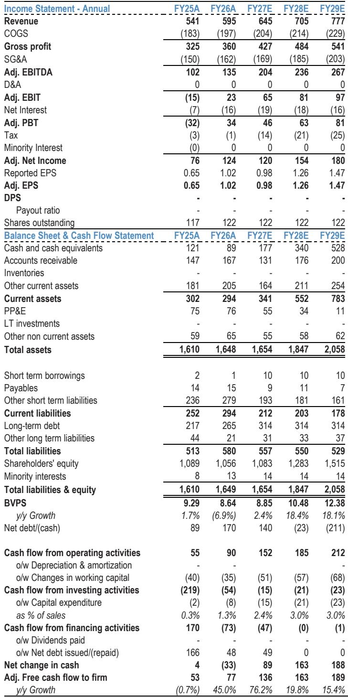
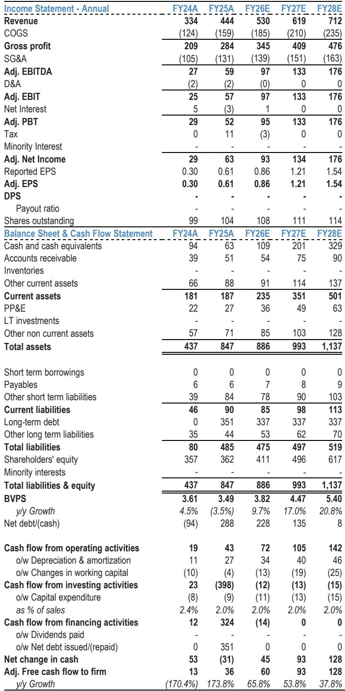
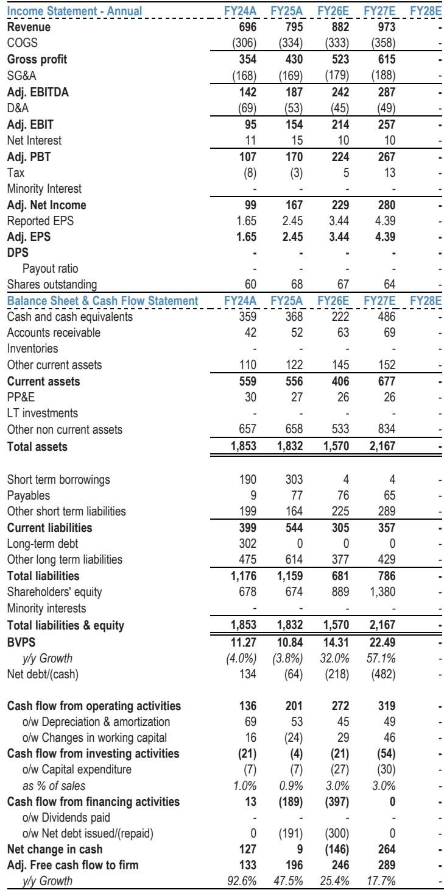

# JPM：AI颠覆论被高估，数字银行龙头才是真正的护城河

市场对AI颠覆软件行业的焦虑从未消退。当ChatGPT掀起生成式AI浪潮后，每一家SaaS公司都被迫回答一个问题：你的产品会被AI一键替代吗？在数字银行这个细分领域，JPM最新发布的研报给出了一个反共识的判断——AI颠覆风险被明显高估了。

这份覆盖Q2 Holdings、Alkami和nCino三家公司的深度报告，核心结论清晰而锐利：那些深耕银行核心工作流、数据整合与合规要求的垂直SaaS厂商，其护城河远比市场想象的深厚。AI新进入者无法绕过银行监管、历史数据访问权限和复杂系统集成这三道墙。

更关键的是，JPM不仅给出了判断，还明确指出了两条投资主线：Q2 Holdings作为有机增长的优质标的，Alkami作为高确定性的并购候选。而nCino虽然估值有吸引力，但竞争格局和AI叙事的清晰度仍逊一筹。

## 1. 银行SaaS的护城河不在于技术，而在于合规与集成复杂度

市场普遍担心AI原生公司会像颠覆内容创作一样颠覆银行软件。但这份研报揭示了一个被忽视的事实：银行软件的核心价值不在代码本身，而在系统集成、合规认证和历史数据积累。

JPM分析师在访问nCino总部后明确指出，客户对底层模型并不敏感，他们真正关心的是谁承担治理与监管责任。nCino联合创始人的观察更为直接——编码只是整个解决方案的一小部分，设计、测试、治理和持续支持才是真正的大头。

这意味着，即使AI能够生成代码，也无法自动完成与银行核心系统的对接、通过监管审计、处理遗留数据的兼容性问题。这些需要数年积累的行业知识和信任关系，才是数字银行SaaS最深的护城河。

> **KC评论：** 很多投资者把AI时代的护城河等同于模型能力，但在银行这个行业，合规和信任才是真正的准入壁垒。完整报告中包含了对三家公司在合规深度上的详细对比，以及各家公司与银行核心系统的集成层级图，这些细节能帮你更精确地判断哪家公司的护城河最深。

## 2. Q2 Holdings：双寡头格局下的有机增长机器

在JPM的评级框架中，Q2 Holdings是最清晰的有机增长故事。公司所处的数字银行市场已经形成双寡头格局，Q2和Alkami共同主导，竞争烈度远低于市场想象。

几个关键数据点值得关注：Q2拥有约2500万数字银行账户的可触达市场，但只有约20%迁移到了现代化平台。这意味着80%的渗透空间，且这些客户多为区域银行和信用合作社，它们升级的紧迫性远高于大型银行。合同周期长达5-7年，每年仅400-500个续约节点，收入可见性极强。

管理层给出的FY27订阅增长指引为12.5-13.0%，但JPM认为这仅仅是一个下限。更重要的是，公司预计未来五年EBITDA利润率将从FY25的24%扩张至约35%，且已实现超过90%的自由现金流转化率。无负债、高转化、保守的并购态度——这些特征让Q2在基本面驱动的市场中具备溢价基础。

JPM给予FY27 15倍EV/EBITDA估值，对应目标价60美元，较当前股价有近40%的上行空间。

> **KC评论：** 15倍EV/EBITDA对于一家拥有双寡头地位、利润率持续扩张、且无负债的公司来说，看起来并不贵。但完整报告中包含了详细的利润率拆解模型和客户迁移时间表，这些才是判断估值是否合理的关键依据。

## 3. Alkami：高确定性并购标的，激进投资者已入场

如果说Q2是稳健的有机增长标的，那么Alkami则是JPM眼中最具确定性的并购候选。激进投资者Jana Partners已经公开施压公司重启出售流程，这为股价提供了额外的催化剂。

Alkami的独特价值在于其云原生、多租户架构，这使其在部署速度和客户体验上具备优势。公司的客户留存率持续高于98%，客户流失的主要原因不是竞争，而是客户自身的并购活动。这种粘性在软件行业中极为罕见。

谁会是潜在买家？JPM认为私募股权是最可能的收购方。原因在于：FIS、Fiserv、Jack Henry等战略买家拥有大量遗留系统，收购Alkami会面临生态冲突；而PE买家则可以保持处理器中立性，并充分兑现运营杠杆——模型显示2026年Alkami的EBITDA利润率可达约18%，自由现金流/EBITDA转化率在60%以上。

股权结构也在支持这一逻辑：General Atlantic自2025年7月以来将其持股比例翻倍，目前已接近总股本的20%。这种大股东的支持为交易提供了稳定的基础。

JPM给予Alkami FY27 17倍EV/EBITDA估值，较Q2溢价2倍，理由正是更高的并购溢价。目标价19美元，对应约30%上行空间。

## 4. nCino：估值有吸引力，但竞争格局和AI叙事仍不够清晰

nCino是三家覆盖公司中唯一被给予中性评级的。尽管JPM在访问其总部后对AI防御能力的态度有所改善，但相比Q2和Alkami，nCino面临两个核心问题。

一是终端市场不够集中。nCino主要服务商业银行业务，这个市场的碎片化程度远高于零售数字银行。客户分布在不同的银行规模、地域和业务重点中，这使得规模效应的释放更加困难。

二是AI叙事不如同行清晰。虽然nCino已经在Banking Advisor、Digital Partners等产品中展示了AI应用，但JPM认为市场上存在更多明确的AI受益标的，nCino的差异化仍需要时间证明。

不过，nCino的估值确实有吸引力。FY27 9倍EV/EBITDA，在垂直软件公司中处于低位。公司正处于定价模式转型期，同时削减研发支出并加大销售投入，如果这些策略成功，订阅收入有望在几个季度后加速增长。此外，与埃森哲、德勤等系统集成商的合作加深，也为利润率改善提供了另一条路径。

## 5. 报告尚未完全回答的关键问题：AI对定价权的长期影响

尽管JPM对AI防御能力持乐观态度，但报告中有几个关键问题并未完全展开。

首先是AI是否会压缩这些公司的定价权。如果AI工具降低了银行系统的实施和维护成本，客户是否会要求更低的价格？nCino采用的捆绑智能单元计价模式，虽然能隔离代币成本波动，但长期来看，如果AI持续降低边际成本，定价压力可能逐渐显现。

其次是AI原生公司是否会在特定细分市场实现突破。报告提到银行认为AI原生公司在企业级就绪度上仍有差距，但这个差距正在缩小。如果未来两三年内出现一家能够通过监管审计、完成核心系统集成的AI原生银行软件公司，现有厂商的护城河可能面临重新评估。

最后是并购逻辑的时间窗口。Alkami的并购确定性很高，但交易何时落地、估值如何，都还是未知数。如果激进投资者的压力未能转化为实际交易，股价可能面临回调。

这些未解问题正是深入阅读完整研报的价值所在。JPM的分析师在报告中提供了详细的财务模型、客户访谈纪要、以及各公司AI防御能力的逐项对比，这些细节是做出独立判断不可或缺的输入。

---

每天由AI agent和人工review生成国际投行中文摘要与KC评论，日度更新约10-40页，并整理当天最新数据图表合集，既方便喂给AI，也方便人工快速把握market dynamics。欢迎来社群和微信群继续讨论这些未解问题，包括nCino的利润率拐点、Alkami的并购时间线、以及AI对定价权的二阶影响。

Personal reading notes and learning share only. Not investment advice.

