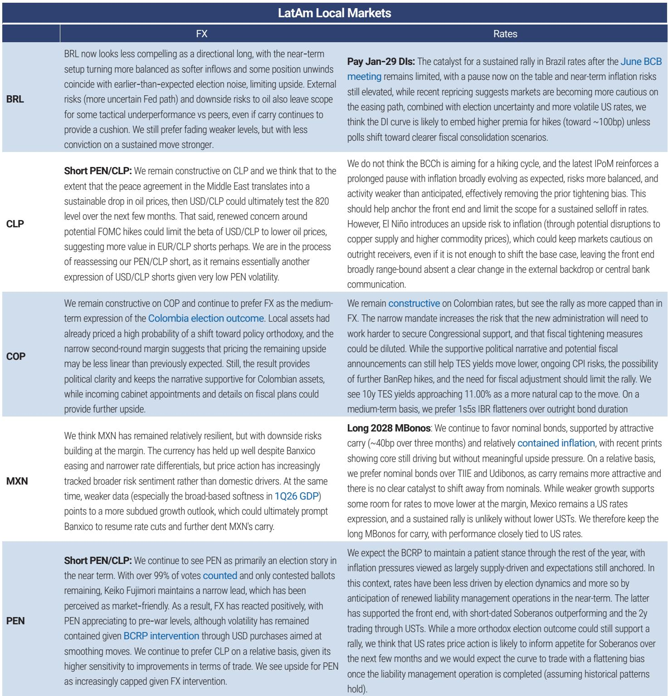
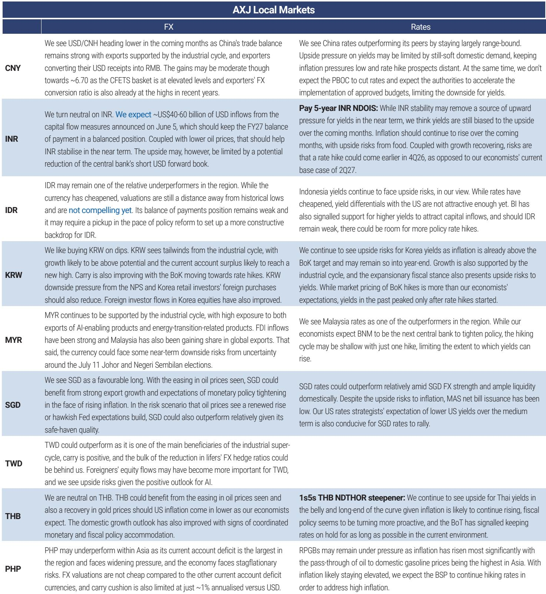
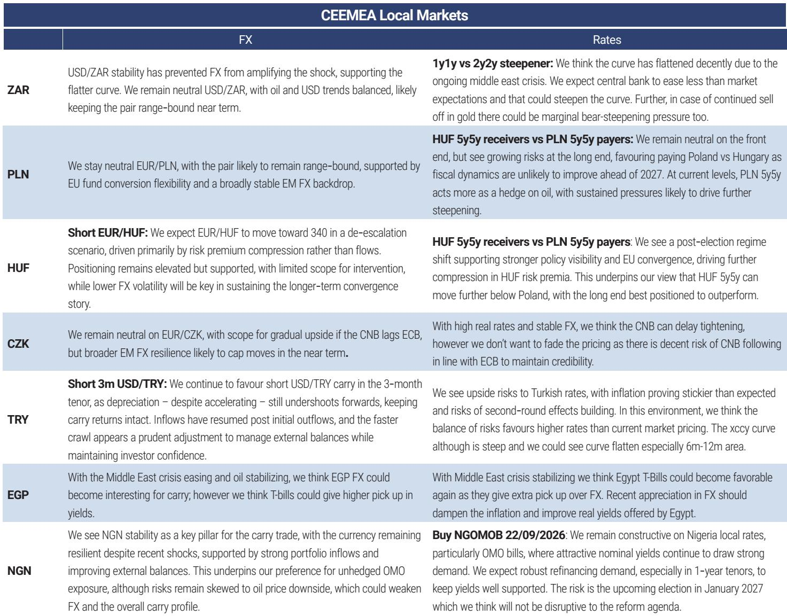

# 摩根斯坦利：新兴市场债券的“油价逻辑”尚未兑现

这份报告的核心判断简洁但有力：油价已经大幅回落，但新兴市场本地货币债券收益率并未同步下行。这中间存在一个10-15个基点的“便宜度”缺口，而摩根斯坦利认为这个缺口将在未来几周被填补。

这不是一份简单的“看多”报告。它更像是一份战术指南：在油价下跌、美联储暂停、风险偏好尚可的三重背景下，新兴市场债券的定价出现了结构性错位，而这种错位恰恰是机会所在。

报告发布的时间点是2026年6月22日，正值美国-伊朗冲突高峰过后、油价从高点显著回落之际。市场对新兴市场的情绪已经从三月的恐慌中恢复，但债券收益率的下行幅度远不及油价跌幅。摩根斯坦利的策略师团队——由James Lord领衔——认为，这种滞后不是基本面问题，而是由三个临时性因素造成的：美国利率走高、美元强势、以及市场对新兴市场央行加息的过度定价。

而这三个因素，都在发生变化。

## 1. 油价和新兴市场债券收益率的“脱钩”是一个定价错误

报告最核心的观察来自一个简单的相关性分析。在冲突爆发后的前两个半月，新兴市场本地货币债券指数收益率与油价走势高度同步。但过去一个月，两者出现了明显的背离：油价继续下行，而收益率却停滞不前。

用更宽泛的能源价格指数（Bloomberg Energy Index）来衡量，这种背离幅度约为10-15个基点。换句话说，按照历史关系，新兴市场债券收益率应该比现在的水平低10-15个基点。

> **KC评论：** 10-15个基点听起来不大，但对于一个规模数万亿美元的资产类别而言，这意味着数十亿美元的定价偏差。更重要的是，这种偏差不是由基本面恶化引起的，而是由三个“临时性因素”造成的——这意味着它更可能被修复，而不是持久存在。

为什么收益率没有跟随油价下跌？摩根斯坦利给出了三个原因：美国国债收益率走高、美元走强、以及市场对新兴市场央行加息的定价。但关键在于，这三个因素都在边际上出现逆转信号。

## 2. 新兴市场央行比市场想象的更“鸽”

这是整份报告中最具操作价值的一个判断。

摩根斯坦利的经济学家团队几乎在所有新兴市场国家都持有比市场更鸽派的利率预期。报告展示了一张对比图：市场定价显示新兴市场央行未来12个月将加息，而摩根斯坦利的基线预测是降息。

这种分歧的根源在于对通胀前景的判断不同。市场仍然在为高油价时期的通胀尾部风险定价，但摩根斯坦利认为，随着油价持续回落，通胀压力将显著缓解，央行将获得降息空间。

具体来看，南非市场定价隐含约75个基点的加息预期，而摩根斯坦利认为最多还有一次25个基点的加息。这种分歧为利率交易创造了机会：报告推荐做陡南非收益率曲线（1y1y-2y2y steepener），利用市场定价与摩根斯坦利基线之间的差距。

> **KC评论：** 这里有一个值得追问的问题：摩根斯坦利的通胀模型是否过于乐观？如果油价回落的速度慢于预期，或者核心通胀的粘性超出想象，那么央行的鸽派空间就会被压缩。报告没有完全展开这个风险，但它在“Required reading”部分推荐了一篇关于南非宏观策略的文章，那里可能有更详细的风险分析。

## 3. 新兴市场货币的韧性正在验证“风险偏好持续”的判断

新兴市场货币是这份报告的另一条主线。报告构建了一个新兴市场货币对G3（美元、欧元、日元）以及更广泛发达国家货币篮子（G3加瑞士法郎、澳元、加元）的总回报指数。这个指数在6月继续创出新高。

过去一个月、一个季度和年初至今，新兴市场货币对所有融资货币都实现了正回报——除了澳元（年初至今）和美元（本月至今，微幅负回报）。这个表现是在美联储6月会议偏鹰派的背景下取得的，这本身就说明新兴市场货币的上涨动力并非仅仅来自美元弱势。

报告认为，这种韧性的背后是三个结构性因素：风险偏好持续强劲、全球投资者对新兴市场本地资产的配置仍然偏低、以及新兴市场的基本面和政策环境在改善。

> **KC评论：** 这里有一个有趣的悖论。报告说投资者对新兴市场的配置仍然偏低，但期权市场数据显示投资者已经建立了大量的HUF多头头寸，并且近期在加仓ZAR、CNH、IDR和INR。这意味着“低配”可能正在被快速修正，而一旦修正完成，后续的资金流入动能可能减弱。报告没有讨论这个时间窗口有多长，但它可能是决定战术性交易成败的关键。

## 4. 资金流正在回暖，但还没有回到“拥挤”的程度

报告跟踪了9个主要新兴市场国家的本地货币债券外资持有数据。截至6月19日，已有5个国家公布了最新数据。

趋势是清晰的：三月的大幅流出之后，五月资金流趋于稳定，六月开始重新流入。年初至今的累计流入量与2025年同期相当。滚动三个月累计流入从2月中旬的约400亿美元骤降至5月底的约-200亿美元，目前正在反弹。

报告还展示了一个有趣的相关性图：资金流与新兴市场本地债券回报之间存在正相关关系，但目前两者都处于“中性”区间——既没有极端流出，也没有极端流入。报告暗示，如果出现极端流出（目前还没有），那将是一个很强的风险回报入场点。

## 5. 报告没有完全回答的关键问题：美联储暂停的可持续性

这份报告的一个关键假设是“美联储今年将按兵不动”。但报告本身也承认，美国经济数据强劲、FOMC偏鹰派，这导致了“美国例外论”的重新讨论。

问题在于：如果美国经济持续超预期，美联储被迫再次加息，或者至少维持高利率更长时间，那么新兴市场债券的“补跌”逻辑就会受到挑战。报告在讨论US收益率走高时提到了这一点，但没有深入分析这种情景的概率和影响。

对于读者来说，这是一个需要自己判断的关键变量。摩根斯坦利的基线是美联储暂停，但如果这个假设被打破，报告中推荐的几乎所有交易——做多新兴市场货币、做多新兴市场债券——都需要重新评估。

## 6. 一个值得关注的区域分化：拉丁美洲领先，亚洲落后

报告展示了一张年初至今的新兴市场总回报地图。拉丁美洲是唯一一个多个国家同时实现正回报的地区，其中哥伦比亚由于政策变革预期成为整个资产类别中表现最好的市场。匈牙利在中东欧地区领跑，南非也有所贡献。而亚洲地区普遍落后，只有中国提供了正回报。

这种分化背后是不同的宏观叙事。拉丁美洲受益于大宗商品价格回落、政治风险溢价下降和央行政策的可预见性。亚洲则面临更复杂的挑战：出口导向型经济体受到全球贸易放缓的影响，而印度和印尼等内需驱动型经济体则在应对通胀和资本外流的压力。

报告没有深入分析这种分化是否会持续，但它提供了一个有价值的观察框架：不是所有新兴市场都一样，交易策略应该因国而异。

## 7. 读者可以持续跟踪的三个观察维度

基于这份报告的逻辑，以下是三个值得持续关注的维度：

第一，油价与新兴市场债券收益率的差距是否在缩小。如果报告的判断正确，未来几周我们应该看到新兴市场收益率下行10-15个基点，或者油价反弹（这会导致差距消失但逻辑不同）。无论哪种情况，这个差距的变化本身就是重要的交易信号。

第二，新兴市场央行的实际政策路径是否如摩根斯坦利所料。报告中最具操作性的交易（南非收益率曲线陡化、匈牙利利率接收）都依赖于央行比市场更鸽派。如果央行实际加息幅度超出预期，这些交易将面临亏损。

第三，新兴市场货币对美元的表现。报告认为新兴市场货币将继续走强，但前提是风险偏好保持强劲。如果全球风险事件（如美国经济衰退、地缘冲突升级）导致风险偏好逆转，新兴市场货币将面临压力。报告推荐使用G3或更广泛的发达国家货币篮子作为融资货币来隔离美元风险，这是一个值得借鉴的思路。

---

这份报告只是一个引子。摩根斯坦利在同一个研究包中还发布了哥伦比亚选举专题、印度资本流入政策分析、以及南非利率策略等多篇深度报告。这些报告提供了更细致的国别分析和图表数据，是理解新兴市场全貌不可或缺的部分。

在我们的社群中，每天由AI agent和人工review共同生成国际投行的中文摘要与KC评论，daily更新约10-40页，同时整理当天最新数据图表合集。这些内容既方便喂给AI进行进一步分析，也方便人工快速把握全球市场的动态变化。欢迎加入我们的微信群继续讨论。

Personal reading notes and learning share only. Not investment advice.

