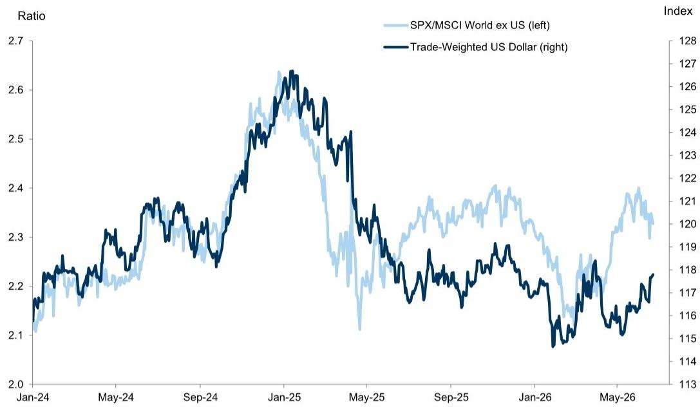
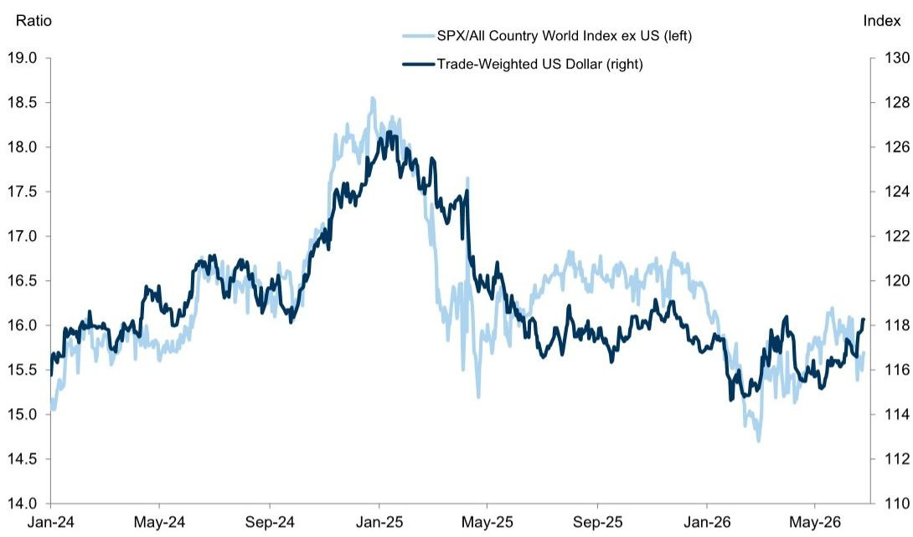
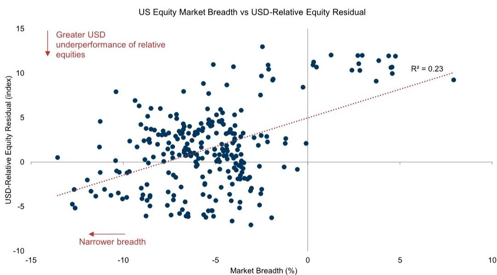

# The AI Boom Is Masking a Structural Dollar Weakness That Will Eventually Resurface

The relationship between US equity outperformance and dollar strength has broken down. Over the past year, the S&P 500 has dramatically outpaced developed-market peers, yet the broad dollar has not kept pace. This dislocation is not a statistical anomaly. It is a signal that the current driver of US exceptionalism—narrowly concentrated AI momentum—does not generate the same cross-border capital flows that broader, more durable outperformance would produce. For investors positioning across currencies and equities, understanding why this gap exists is the single most important analytical task of the current cycle.

Coming into 2026, the consensus expectation was that less exceptional US economic performance would gradually weaken the dollar. That narrative has been disrupted by two forces: escalating conflict in the Middle East, which has complicated the relative underperformance story, and a surge in AI-related momentum that has powered another leg of US equity gains. The result is a confusing landscape where US stocks are strong, the dollar is only modestly supported, and the traditional mapping between equity outperformance and currency demand has become unreliable.

The stakes are high. The dollar's rich valuation has been sustained in recent years by demand for US equity exposure that helps fund the current account deficit. If the equity impulse that has been supporting the dollar proves to be narrower and less durable than historical patterns suggest, the currency could be vulnerable to a sharper correction than most models predict. Conversely, if AI-driven outperformance broadens and deepens, the dollar may have further room to run.

A global investment bank's recent research report provides the analytical framework to resolve this tension. The report identifies three structural reasons why the dollar has been flatter than equity performance alone would imply, and these factors carry significant implications for portfolio construction, currency hedging, and sector allocation.

## US Equity Outperformance Is Real but Concentrated Against Developed Markets, Not Emerging Markets

The first reason the dollar has not kept pace with US equity gains is that the outperformance is unevenly distributed across geographies. When measured against developed-market indices such as the MSCI World ex USA, US equities have clearly outperformed. But against a broader benchmark that includes emerging markets—the MSCI ACWI ex USA—the gap narrows considerably.

This distinction matters because equity flows have a more significant impact on emerging-market currencies than on developed-market currencies. Regressing weekly foreign-exchange returns on net bilateral equity flows reveals that US equity inflows are a much stronger driver of the dollar against EM currencies than against DM currencies. Since the recent US outperformance has been primarily a developed-market phenomenon, the FX spillover has been inherently limited.

The implication is straightforward but often overlooked: the dollar's muted response does not mean the equity-dollar relationship is broken. It means the relationship is being filtered through a different geographical lens. Investors who focus only on the S&P 500 versus the Euro Stoxx 600 are missing half the picture. The real action is in how US equities are performing relative to Korea, Taiwan, and other tech-heavy Asian markets that have also benefited from the AI cycle.

The second-order question this raises is whether the current pattern will persist. If AI-driven capex and earnings momentum begin to spread more broadly across emerging markets, the dollar could face additional headwinds. If, however, the AI boom remains concentrated in US-listed companies and a handful of Asian suppliers, the dollar may continue to receive only modest support from equity flows.

## The Durability of Earnings Growth Matters More Than Its Magnitude for Dollar Demand

The second factor is more subtle but potentially more consequential. The dollar's sensitivity to equity outperformance depends not just on how much earnings are growing, but on whether that growth is expected to be sustained.

When consensus expectations for US earnings growth show a steep upward slope—with one-year-ahead estimates rising sharply above two-year-ahead estimates—the dollar tends to underperform relative to what equity performance alone would imply. This is exactly the pattern visible today. Surging near-term earnings estimates have driven the recent market rally, but forward-looking consensus points to deceleration beyond the current year.

The analytics are clear: sharp upgrades to near-term earnings expectations do not generate as much dollar demand as more sustained earnings power would. The broad dollar is more geared to the trajectory of US earnings expectations than to the relative earnings backdrop between the US and the rest of the world. In fact, US forward earnings growth expectations alone explain much of the residual between dollar performance and relative equity performance.

This insight has direct portfolio implications. It suggests that the dollar is pricing in a slowdown in earnings momentum, even as equity markets continue to rally. If earnings expectations begin to roll over, the dollar could weaken more sharply than the equity market decline alone would warrant. Conversely, if two-year-ahead estimates start to catch up to near-term optimism, the dollar could find renewed support.

The historical precedent is instructive. During the 2011-2014 period, dovish Federal Reserve policy weighed on the dollar despite supportive relative equity performance. More recently, flatter relative terms of trade versus other developed economies constrained the dollar against DM currencies. Earnings expectations are only one part of the story, but they are the part that is most directly tied to the current AI narrative.

## Narrow Market Breadth Limits the FX Spillover from Equity Rallies

The third factor is the most structural and perhaps the most concerning for those betting on sustained dollar strength. The concentration of the recent market rally has compressed US equity market breadth to one of its tightest levels in recent decades.

Using a measure of market breadth that captures how many stocks are participating in the rally, the analysis reveals a consistent pattern: more concentrated market rallies tend to coincide with larger dollar underperformance relative to what equity performance would imply. When only a handful of mega-cap technology stocks are driving returns, the FX spillover is muted. When the rally broadens, the dollar benefits more.

This makes intuitive sense. A narrow rally driven by a few large-cap names generates less cross-border capital flow than a broad-based rally that pulls in international investors across multiple sectors. The AI boom, for all its magnitude, has been remarkably concentrated. The beneficiaries are well-known, and the flow of capital into US equities has been correspondingly narrow.

The broader point is that the nature of the underlying shock matters for the FX transmission mechanism. During the software sell-off earlier this year, the dollar was resilient because the shock was not clearly US-negative—global equities sold off alongside US equities. The AI boom has had a similar but inverse dynamic: global equities have also benefited from the rally, in some cases more than the US. This makes the muted support for the dollar less surprising.

In fact, a broader procyclical, risk-supportive environment typically weighs on the dollar. The fact that "exceptional" US equity performance has kept the dollar as supported as it is may actually be a sign of underlying strength. Without the AI-driven equity impulse, the dollar would likely be weaker given the procyclical backdrop.

## What the Report Does Not Fully Answer: The Threshold for a Regime Change

The report's analytical framework is rigorous, but it leaves several critical questions open. The most important is the threshold at which the current pattern breaks. How much further can market breadth compress before the equity-dollar relationship reasserts itself? At what point does narrow AI momentum become broad enough to generate meaningful FX spillovers?

The report suggests that a US equity market sell-off with clearer rest-of-world outperformance should be one catalyst for dollar depreciation. But it does not specify the trigger for such a rotation. Is it a shift in Federal Reserve policy? A geopolitical shock that disproportionately impacts the US? A regulatory crackdown on AI that undermines the entire thesis?

There is also the question of whether the current relationship is sustainable. The report notes that the broader equity impulse has shifted from an expected drag to a source of support for the dollar. But it does not model how long this support can persist if earnings growth decelerates and breadth remains narrow. The historical analogies are useful, but they do not capture the unique dynamics of an AI-driven cycle that has no clear precedent in scale or concentration.

Finally, the report does not address the feedback loop between dollar weakness and equity performance. If the dollar does weaken meaningfully, that could provide a tailwind for US multinationals and further support equity markets, creating a self-reinforcing cycle. Alternatively, dollar weakness could signal broader US economic underperformance that ultimately drags down equities. The direction of causality remains ambiguous.

## A Decision Framework for Investors Navigating the AI-Dollar Disconnect

For investors trying to translate this analysis into actionable positioning, three questions should guide the decision process.

First, assess the breadth of the equity rally in real time. If market breadth begins to expand beyond the mega-cap tech names, the dollar should benefit. This is a leading indicator that can be monitored weekly. Investors should track the percentage of S&P 500 stocks trading above their 50-day moving average, as well as the performance dispersion between the top decile and the median stock.

Second, monitor the slope of earnings expectations. The gap between one-year-ahead and two-year-ahead consensus estimates is the single most important variable for dollar sensitivity. If this gap begins to narrow—either because near-term estimates moderate or because long-term estimates rise—the dollar should respond. Investors should watch for earnings revisions breadth as a confirming signal.

Third, distinguish between DM and EM equity exposure. The dollar's sensitivity to equity flows is much higher against emerging-market currencies. Investors who are long the dollar should be particularly attentive to US equity performance relative to Asian tech-heavy markets. If Korea and Taiwan continue to participate in the AI rally, the dollar's support from equity flows will remain limited. If they begin to lag, the dollar could strengthen.

The bottom line is that the current equity-dollar disconnect is not a reason to abandon the traditional framework. It is a reason to use it more carefully. The relationship still holds, but it must be filtered through the lenses of geographical composition, earnings durability, and market breadth. Investors who apply these filters will be better positioned to anticipate the next regime shift.

## Join the Community to Read the Full Report and Review the Original Charts

The analytical depth required to navigate this environment goes beyond what a single article can capture. The original report contains detailed exhibits showing the regression results, the breadth measures, and the earnings expectation dynamics that underpin the analysis. These charts are essential for any investor serious about understanding the current dislocation and positioning for what comes next.

Join the community to read the full report and review the original charts. The full analysis includes the specific trade ideas that the report's authors have implemented based on this framework, as well as the historical context that puts the current cycle in perspective. For institutional investors and sophisticated individual investors alike, this is the kind of research that separates informed positioning from guesswork.

*This article is for learning and discussion only and does not constitute investment advice.*

Personal reading notes and learning share only. Not investment advice.

