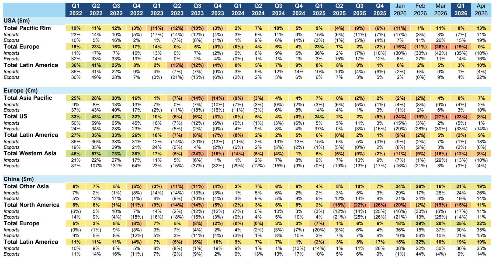
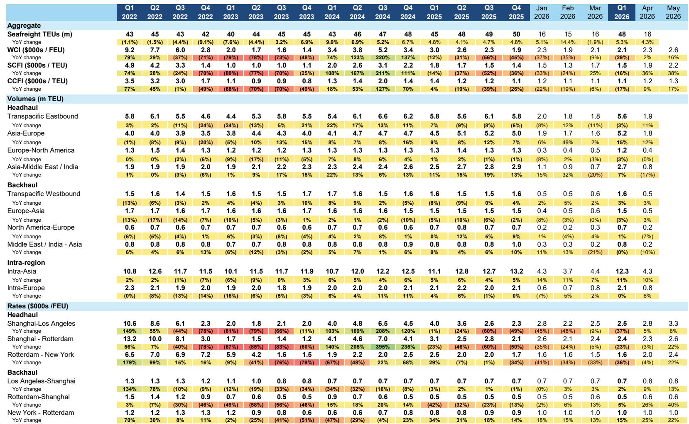
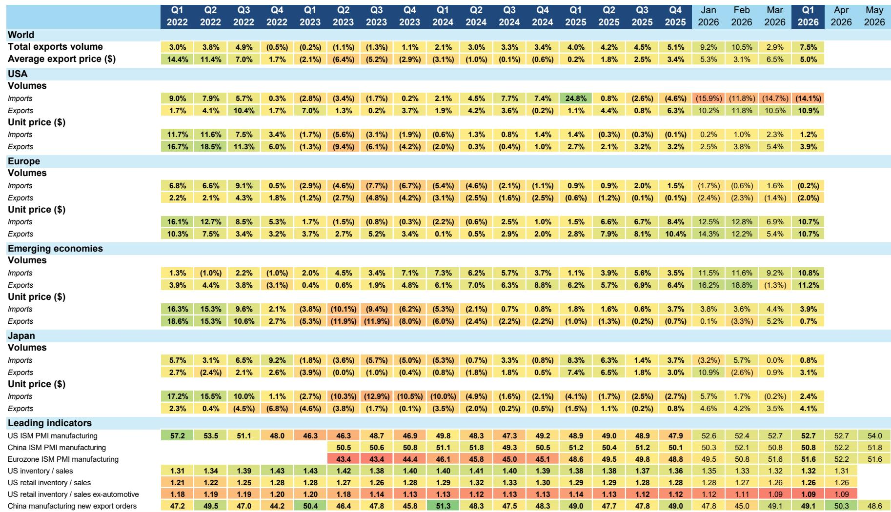

# Bernstein：供应链的“高运价”不是短期脉冲，而是结构性重定价

全球供应链正处于一个罕见的“三高”叠加窗口：运价高、需求韧、运力紧。这轮运价上涨并非单纯的地缘事件脉冲，而是正在重塑海运、空运、陆运的定价基准。Bernstein最新发布的《供应链脉搏报告》给出了一个与市场主流叙事略有不同的判断：高运价并未压制需求，消费者的购买行为正在适应新的运费成本，而供给侧的约束正在从临时性转向结构性。这份报告的核心洞察是，当前供应链的盈利环境对货运代理和运输公司而言是近期的“舒适区”，但不同环节、不同公司的受益程度将出现显著分化。

## 1. 这轮运价上涨的核心驱动力已从“事件冲击”切换为“供给约束”

报告明确指出，当前海洋运价较冲突前水平已上涨超过100%，空运运价也高出40%-50%。但真正值得关注的不是涨幅本身，而是推动运价持续高位的底层逻辑正在发生切换。

最初的红海危机和苏伊士运河绕行是典型的供给冲击，但经过几个季度的消化，市场已经部分适应了更长的航线。当前运价持续高位的核心原因，是运力供给的刚性约束：海洋运输面临新船交付高峰前的运力错配，空运则受限于海湾地区承运人的运力瓶颈和燃油附加费，而美国陆运市场则因监管执行趋严（语言、居住地、运营范围、工时、培训等要求）导致可用的卡车运力持续收紧。

这意味着，即使地缘局势出现缓和，运价也不会迅速回到冲突前水平。供给侧的约束具有更强的粘性，尤其是在美国陆运市场，监管因素带来的运力退出是结构性的，而非周期性的。

> **KC评论：** 市场往往习惯于用“地缘冲突缓和=运价回落”的线性逻辑来定价运输股，但Bernstein提醒我们，当前运价中有相当一部分是监管和运力结构变化带来的“硬成本”。这部分成本的回落速度会比想象中慢得多。完整报告中对美国陆运市场的监管细节和运力退出测算值得细读，这直接决定了联邦快递、UPS等公司的盈利中枢。

## 2. 消费者需求正在“消化”高运价，而非被其压垮

报告中最反直觉的发现之一是：运价上涨并未导致货运量萎缩。4月海洋集装箱量同比增长4%，处于马士基全年2%-4%增长指引的上沿；空运货量也维持在0%-5%的增长区间。整体收入在5月和6月同比增长约40%。

这背后是终端消费需求的韧性。尽管存在通胀压力，且油价仍高于冲突前水平，但消费者并未显著削减购买。Bernstein将此归结为供应链复杂性的持续存在——企业为了保障供应安全，愿意支付更高的运费来维持库存和交货可靠性。

这意味着，当前的高运价并非“量价齐跌”的恶性循环，而是“量稳价升”的良性窗口。对于货运代理和物流公司而言，这是一个难得的盈利环境：收入端受益于运价上涨，成本端则可以通过规模效应和灵活的运力配置来部分对冲。

## 3. 美国陆运市场正经历“供给推动”的运价飙升，需求端出现微弱曙光

美国陆运市场是报告重点分析的部分。现货市场卡车运价（不含燃油）同比涨幅已从5月的34%进一步扩大至6月的48%，连续三个月加速。Bernstein的判断是，这主要是一个供给驱动的故事，但需求端也出现了值得关注的积极信号。

供给侧的收紧主要来自监管执行：语言要求、居住地限制、运营范围界定、工时规定和培训标准等，正在系统性地淘汰不合规的承运人。美国最高法院对货运经纪人责任的裁决，虽然短期内不会立即冲击运价，但长期将进一步压缩运力。这应该会推动货运经纪行业的整合。

需求端则出现了“微光”：ISM制造业采购经理人指数连续多月处于扩张区间；托运人对制造业活动的信心有所改善（可能受到数据中心建设等工业活动的提振）；美国国内多式联运的年初至今累计货量在5月首次转为同比正增长（约+1%）。

> **KC评论：** 美国陆运市场正在经历一个“供给出清+需求弱复苏”的组合。对于投资者而言，关键在于区分哪些公司能在运价上涨中真正受益，哪些只是被动跟随。Bernstein对联邦快递和UPS给出了“跑赢大盘”的评级，但对JB亨特和CH罗宾逊仅给出“市场表现”。这些评级的差异，恰恰来自它们对运力控制能力和客户粘性的不同判断。完整报告中对每家公司的运力结构和客户组合分析，是理解这些评级差异的关键。

## 4. 欧洲物流巨头分化明显：DSV是整合赢家，马士基面临结构性挑战

在欧洲市场，Bernstein的评级分化极为鲜明：DSV是“跑赢大盘”，DHL和德迅是“市场表现”，马士基是“跑输大盘”。

DSV被列为欧洲物流板块的首选。核心逻辑在于市场尚未充分定价其收购DB Schenker后的协同效应。DSV在过去20年的五笔并购中展现了出色的协同兑现能力，市场有理由期待它在新的大额交易中复制这一成功。一旦杠杆率回归到约2倍，公司有望重启大规模股份回购（稳态下每年可回购约240亿丹麦克朗），并开启新一轮并购。报告预计，整合完成后（2028年），DSV的每股收益将超过100丹麦克朗。

马士基则被明确看空。报告认为其核心业务——集装箱航运——面临挑战。红海危机虽然暂时阻止了2023年运价的崩溃，但这种“保护”正在消退。中东一旦达成持久和平协议，亚洲与欧洲之间的苏伊士航线恢复，将给运价带来新的压力。中期来看，行业订单簿上的新船数量庞大，在出现大规模拆船之前，运价环境将持续承压。更关键的是，Bernstein认为马士基的“整合商”战略存在缺陷，七年来未能兑现承诺的收入协同效应。

## 5. 报告尚未完全回答的关键问题：需求端的“微光”能否演变为“曙光”

尽管报告对近期盈利环境持乐观态度，但一个核心问题仍悬而未决：需求端的改善信号是否可持续？

当前的需求韧性，部分来自企业为保障供应链安全而进行的“主动补库存”和“提前发货”。这种行为的可持续性存疑。一旦地缘局势趋于稳定，企业可能重新评估其库存策略，从“安全优先”切换回“效率优先”。届时，提前发货的需求可能迅速消退，甚至出现库存去化。

此外，消费者端的韧性也面临考验。高运价最终会传导至终端商品价格，而美国房地产市场（住房开工量5月同比下降8.7%）等关键消费驱动力的疲软，暗示整体消费需求的基础并不牢固。

Bernstein自己也指出，对马士基的二季度业绩存在“上行风险”，但对下半年需求恶化保持谨慎。这种“近好远忧”的叙事，意味着当前的高运价窗口可能比市场预期的更短。

## 6. 投资者需要建立的观察框架：区分“运价受益者”和“结构性赢家”

基于这份报告，投资者需要建立一个二元框架来审视物流和运输板块。

第一类是“运价受益者”，其盈利高度依赖于当前的高运价环境。这类公司包括纯集装箱航运公司（如马士基）和部分以现货运价为主的卡车运输公司。它们的盈利在当前环境下看起来很漂亮，但一旦运价回落，盈利将面临剧烈收缩。Bernstein对马士基的“跑输大盘”评级，本质上是对这种“周期陷阱”的定价。

第二类是“结构性赢家”，其竞争优势不依赖于运价水平。这类公司包括拥有强大并购整合能力的货运代理（如DSV）、拥有寡头定价权和资产利用率杠杆的快递网络（如DHL的快递业务、联邦快递和UPS），以及能够通过规模和客户粘性穿越周期的综合物流企业。它们的盈利增长来自市场份额提升、成本优化和协同效应，而非单纯的价格波动。

报告对DHL的“市场表现”评级，恰恰反映了这种二元性：DHL的快递业务是一个健康的寡头市场，拥有支撑性的定价和超越GDP的结构性增长，但集团整体盈利对B2B业务复苏的依赖度较高，且当前存在一定的分拆折价。这种“好资产+复杂结构”的组合，需要投资者耐心等待价值释放。

> **KC评论：** 当前市场对运输股的定价，很大程度上仍停留在“运价涨=利好”的简单逻辑上。但Bernstein的框架告诉我们，真正值得长期持有的，是那些在运价回落时仍能保持盈利韧性的公司。完整报告中对每家公司的运力结构、客户组合和成本弹性分析，是执行这一框架的“操作手册”。如果你对联邦快递和UPS的估值差异、或者DSV的并购协同测算感兴趣，这些内容都在完整报告中有详细展开。

---

以上分析仅触及了Bernstein这份报告的骨架。完整的报告还包括对每家公司的详细估值模型、运力供给的量化测算、以及不同情景下的盈利敏感性分析。我们每天会由AI agent加上人工review，生成国际投行中文摘要与KC评论，daily更新约10-40页，并整理当天最新数据图表合集。这些内容既方便喂给AI进行二次分析，也方便人工快速把握market dynamics。欢迎来知识星球和微信群中继续讨论，获取完整报告解读和原始数据图表。

Personal reading notes and learning share only. Not investment advice.

