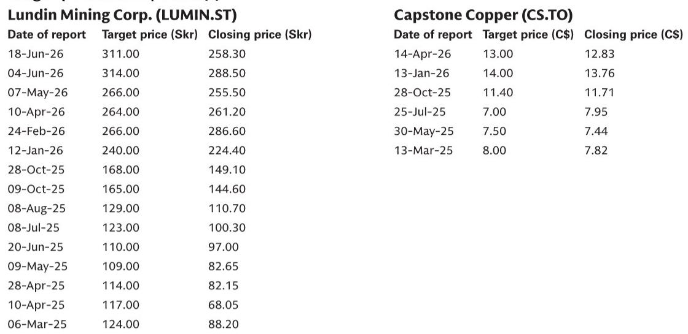
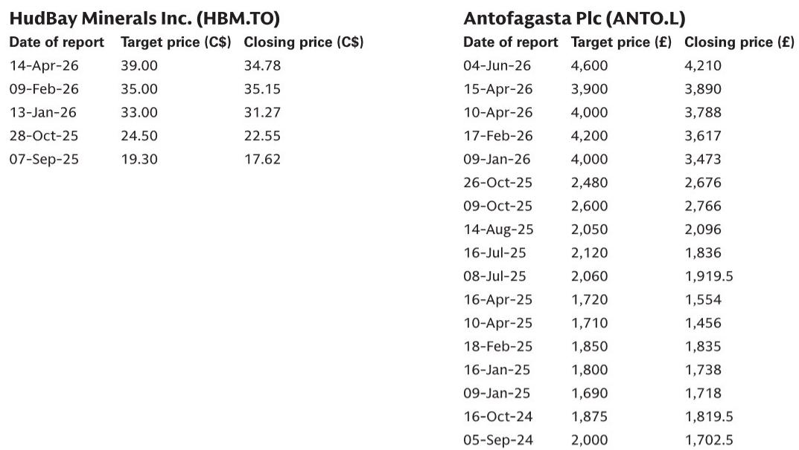
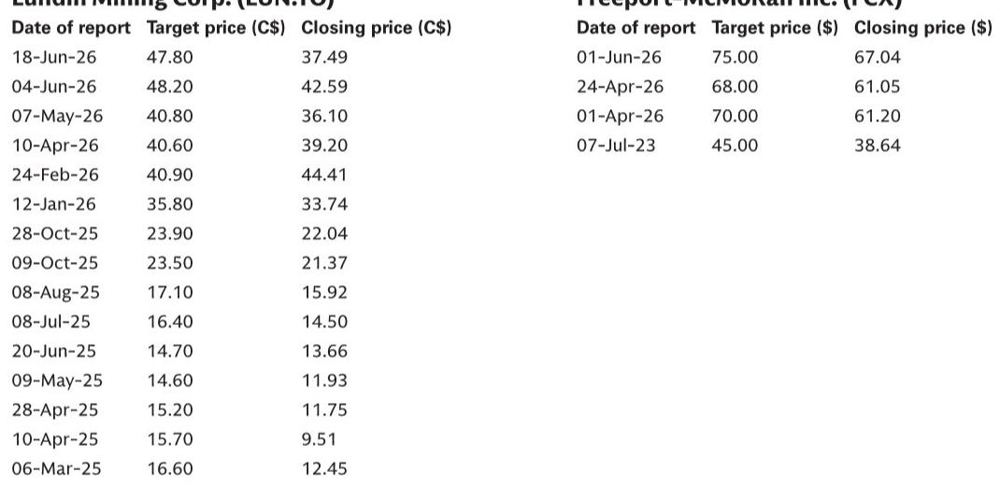

# Copper Producers Face a Strategic Fork: Those Who Can Deliver Growth Will Command a Scarcity Premium That Has Never Been Higher

The global copper market is entering a phase where the structural narrative and the cyclical reality are pulling in opposite directions. On one hand, every major investment bank and industry body agrees that the world will face a significant copper deficit by the end of this decade, driven by electrification, grid modernization, and the buildout of renewable energy infrastructure. On the other hand, the near-term picture is clouded by elevated US inventories, tariff uncertainty, persistent cost inflation, and a macro environment that has investors questioning the pace of demand growth. This tension creates a uniquely challenging environment for copper producers and their investors. The central question is no longer whether copper will be in deficit, but which producers are actually positioned to deliver the supply growth that the market so desperately needs.

The answer, according to the detailed company-level analysis underpinning a major investment bank's annual copper week event, is that the sector is far from homogeneous. A handful of producers have credible, well-capitalized growth pipelines and the operational track record to execute. Many others are burdened by high-cost assets, project delays, regulatory overhangs, or balance sheet constraints that limit their ability to capture the upside. The market is currently pricing many of these companies as if the structural deficit will automatically lift all boats. That assumption is dangerous. The real opportunity lies in identifying the companies that can actually grow production and expand margins, and distinguishing them from those that will remain structurally challenged even in a rising price environment.

This is not a sector for passive exposure. It is a sector for active, stock-specific selection based on a clear framework: growth credibility, cost positioning, and jurisdictional stability. The upcoming copper week event, where CEOs from the world's leading producers will present their plans, offers a critical inflection point for investors to test these assumptions against management reality. The stakes are high, because the divergence between winners and losers is likely to widen dramatically as the decade progresses.

## The Market Is Underappreciating the Execution Risk in the Growth Pipeline, Creating a Divergence Between Those Who Can Deliver and Those Who Cannot

The report makes clear that almost every company under coverage has either ongoing or planned growth projects. However, the critical distinction is not the existence of a project pipeline, but the credibility of its execution. Investors have been asking pointed questions about capex inflation risk, timeline updates, and funding conditions. These are not peripheral concerns. They are the central determinants of whether a company will actually capture the scarcity premium or remain stuck in a cycle of cost overruns and delays.

Consider the contrast between two companies in the coverage universe. Freeport-McMoRan is positioned as a best-in-class exposure to the structural deficit, with a clear and tangible growth pathway. Its Grasberg mine re-ramp is underway, with the goal of exiting 2026 at a 60-65% run-rate and reaching full capacity by late 2027. This is not a speculative greenfield project. It is a brownfield optimization of the lowest-cost mine in the world. The company also has a leaching initiative in North America that is set to increase production volumes and meaningfully reduce cost per pound through 2030. The combination of these factors leads to a projected gross profit per pound increase from $1.31 in 2025 to $2.90 in 2027, a 121% jump. This is the kind of tangible, near-term margin expansion that the market should reward.

On the other hand, Capstone Copper presents a more precarious picture. Its assets have a high-cost base, which gives it high operating leverage to copper prices, but that is a double-edged sword. The company's asset performance has been volatile, creating near-term cash flow uncertainty. Its key growth catalyst, the Santo Domingo project in Chile, is not expected to be sanctioned until late 2026, and the report explicitly states it is too soon to price it in. The company's implied copper price of $15,000 per ton is 10% above spot, meaning the market is already pricing in a significant rally just to justify current valuations. This is a company where the growth story is real but distant, and the near-term execution risk is high.

The implication is clear: investors must differentiate between companies where growth is already in motion and those where it remains a promise. The market tends to lump all copper producers together based on the commodity price outlook. The reality is that execution credibility is the single most important differentiator.

## Cost Headwinds Are Not Uniform; The Battle Against Grade Decline and Inflation Will Separate Low-Cost Incumbents from High-Cost Strugglers

The report identifies several structural cost challenges facing the industry: grade decline, regulatory changes, and replacement capex. These are not new issues, but they are intensifying. The key insight is that these headwinds do not affect all producers equally. Companies with low-cost, long-life assets have a natural buffer. Companies with high-cost, shorter-life assets are far more vulnerable.

Southern Copper is the clearest example of a defensive low-cost producer. The report highlights that the company's implied copper price is $11,600 per ton, which is 15% below spot prices. This means that even if copper prices fall significantly, Southern Copper would still generate positive returns. Its low cost profile and relatively lower operating leverage make it a strong candidate for a copper downturn. This is the kind of structural advantage that should command a premium, and the report notes that the company has been upgraded to Neutral from Sell precisely because of this scarcity premium.

In contrast, companies like Capstone and Ero Copper are far more exposed to cost volatility. Capstone's high-cost base means that any operational hiccup or cost overrun directly impacts cash flow. Ero Copper faces operational uncertainties at its Tucumã and Caraíba mines, and its implied copper price of $14,600 per ton is 7% above spot. These companies are effectively betting that copper prices will rise to justify their current valuations. That is a risky bet in an environment where macro uncertainty and tariff discussions are creating headwinds for demand.

The report also highlights the importance of energy and chemicals inflation as near-term cost headwinds. These are transitory to some degree, but they compound the structural challenges of grade decline. The companies that have already invested in efficiency and have the scale to negotiate better input prices will emerge stronger. The ones that are already operating at the margin will be squeezed.

## Regulatory and Political Risk in Latin America Is Not a Binary Event; It Is a Persistent Overhang That Requires Active Management

The report notes that Latin America, which is home to the world's largest copper reserves, has navigated a round of presidential elections, including in Peru and Chile. Brazil is due in the second half of this year, and Argentina in 2027. The conventional view is that elections create regulatory uncertainty, and that is true. But the more nuanced takeaway is that the regulatory environment is not a single event risk. It is a persistent, evolving factor that companies must actively manage.

Chile, for example, has seen significant political shifts in recent years, including debates over mining royalties and constitutional reform. Peru has experienced political instability and social unrest that has disrupted production at several mines. The report explicitly states that the copper week event will include consultations with management regarding expectations on the regulatory environment following recent political changes. This is not a one-time check. It is an ongoing dialogue that will determine the viability of future projects.

Companies with diversified geographic footprints, like Freeport-McMoRan, have a natural hedge against regulatory risk in any single jurisdiction. Freeport operates in Indonesia, North America, and South America, providing a buffer against localized disruptions. In contrast, companies like Capstone, which has over 70% of its assets concentrated in Chile, are far more exposed. The same is true for Southern Copper, which has significant operations in Mexico and Peru, both of which have seen regulatory changes.

The implication for investors is that jurisdictional risk must be factored into valuation. A company operating in a stable jurisdiction with a long history of mining law should trade at a premium to one operating in a country where the regulatory framework is in flux. The market often overlooks this distinction during a commodity bull run, but it becomes critical during downturns or periods of political instability.

## The Cobre Panama Wildcard: First Quantum Shows How a Single Asset Can Transform a Company's Trajectory, But It Also Highlights the Risk of Concentration

First Quantum Minerals presents one of the most interesting case studies in the report. The company has a long track record of solid operational execution and successful delivery of projects, including the S3 expansion and the original Cobre Panama mine. However, the mine has been shut down due to regulatory and legal challenges, and the company's entire current EBITDA is generated from Zambia. This creates an extreme concentration risk.

The report notes that a Cobre Panama restart would place First Quantum among the most attractive copper producers under coverage, with a normalized free cash flow yield of 17% and an EV/EBITDA of 3.2x on a full restart by 2029. The implied copper price including Cobre Panama is $11,300 per ton, which is 17% below spot. This means that the market is already pricing in a significant discount for the uncertainty surrounding the mine.

There have been encouraging developments, including an independent audit that found the mine broadly compliant, and government authorization to sell stockpiled copper and reactivate the concentrator circuit. But the report also states that a restart is not the base case. This is the classic binary risk-reward scenario that can generate outsized returns for investors who get it right, but also significant losses for those who get it wrong.

The key lesson is that single-asset concentration, whether in Zambia or Panama, creates a vulnerability that diversification eliminates. Investors who are bullish on First Quantum must have a strong conviction that the Cobre Panama situation will be resolved favorably. Those who are more cautious may prefer companies with diversified production bases, even if the upside potential is lower.

## What the Report Does Not Fully Answer: The Demand Side Remains the Biggest Unknown, and Tariff Policy Could Reshape the Market in Unpredictable Ways

The report focuses heavily on the supply side, which is appropriate given that the copper week event is centered on producer outlooks. However, the demand side of the equation is arguably more uncertain. The report acknowledges that investors have been concerned about rising inflation, macro uncertainties, and the impact on interest rate expectations and GDP activity. Elevated inventories in the US and tariff discussions have also been key points of attention.

What the report does not fully address is the potential for demand destruction. If the global economy enters a recession, or if the energy transition slows due to policy changes or technological hurdles, the projected copper deficit could be pushed further into the future. The report's bullish thesis rests on the assumption that structural demand drivers, namely electrification and grid modernization, will outweigh cyclical headwinds. That is a reasonable assumption, but it is not guaranteed.

Furthermore, the impact of US tariffs on copper is a wildcard. The report notes that US tariffs are a key near-term risk for several companies, including Antofagasta and Lundin Mining. If tariffs are imposed on copper imports, it could create a bifurcated market where US producers benefit from protectionist policies while international producers face headwinds. This could reshape trade flows and pricing dynamics in ways that are difficult to predict.

Investors who want a complete picture should seek out additional analysis on the demand side, including macroeconomic forecasts, energy transition policy timelines, and tariff scenarios. The supply-side analysis in this report is thorough, but it is only half the story.

## A Decision Framework for Copper Investors: Four Questions to Distinguish Winners from Losers

Based on the report's analysis, investors can apply a simple decision framework to evaluate any copper producer. The framework consists of four questions, each of which addresses a critical dimension of the investment thesis.

First, does the company have credible, near-term production growth that is already in motion? The key distinction is between projects that are under construction or ramping up versus those that are still in the planning or permitting stage. Freeport's Grasberg re-ramp and leaching initiative are examples of near-term growth. Capstone's Santo Domingo project is a longer-term catalyst that is too distant to price in.

Second, what is the company's cost position relative to the industry average, and how vulnerable is it to grade decline and input cost inflation? Low-cost producers like Southern Copper have a natural buffer. High-cost producers like Capstone are more exposed to volatility and require higher copper prices to generate attractive returns.

Third, how diversified is the company's geographic footprint, and how exposed is it to regulatory and political risk in any single jurisdiction? Companies with operations in stable, mining-friendly jurisdictions like Canada, the US, and parts of Europe are less risky than those concentrated in Latin America or Africa. First Quantum's concentration in Zambia and Panama is a significant risk factor.

Fourth, what is the implied copper price embedded in the company's current valuation? A company that trades at an implied price significantly above spot is effectively betting that copper prices will rise. A company that trades at an implied price below spot offers a margin of safety. The report provides implied copper prices for several companies, and they vary widely. This is a powerful tool for assessing relative value.

Investors who apply this framework will be better equipped to navigate the increasingly divergent landscape of copper producers. The structural deficit is real, but not every company will benefit equally.

## Join the Community to Read the Full Report and Review the Original Charts

The analysis above draws on the detailed company-level investment summaries, valuation methodologies, and risk assessments contained in a major investment bank's annual copper week report. The full report includes specific price targets, implied copper price calculations, and project timelines for each covered company, as well as the original charts that illustrate the supply-demand dynamics. For investors who want to make informed decisions in this critical sector, the full report provides the granular data and expert interpretation that a summary cannot capture. Join the community to read the full report and review the original charts.

*This article is for learning and discussion only and does not constitute investment advice.*

Personal reading notes and learning share only. Not investment advice.

