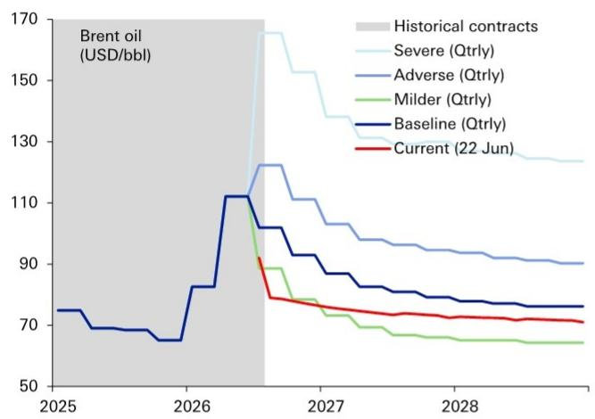
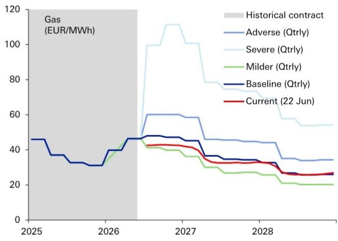
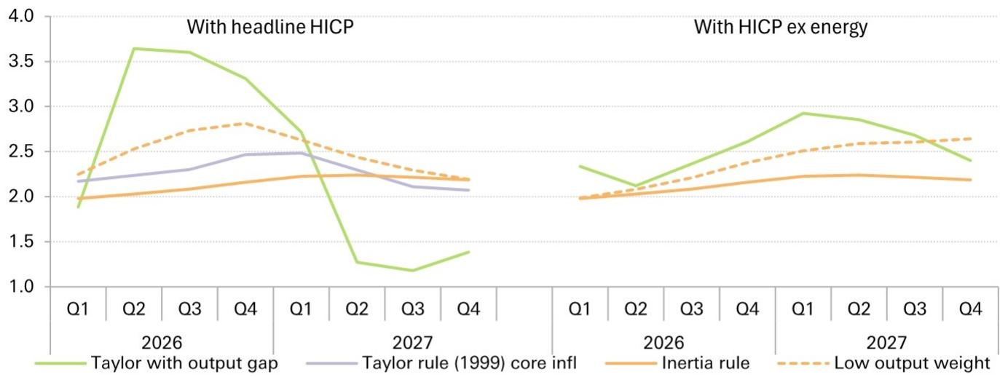
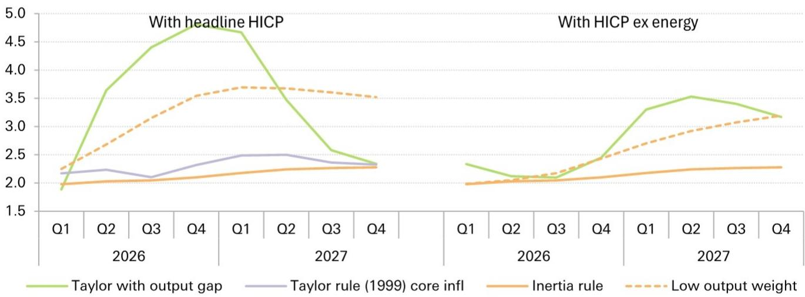
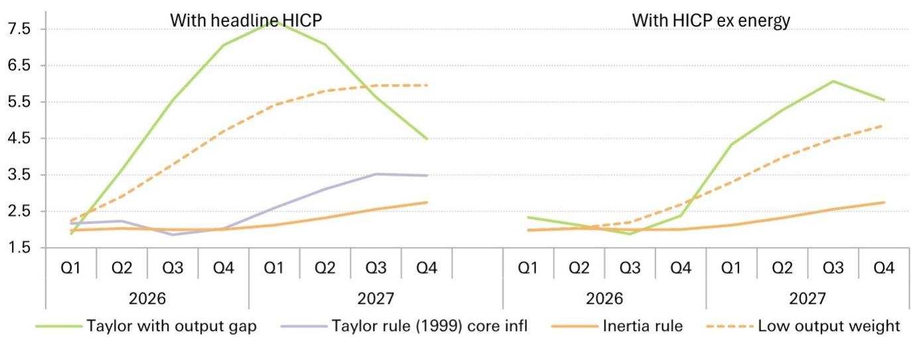
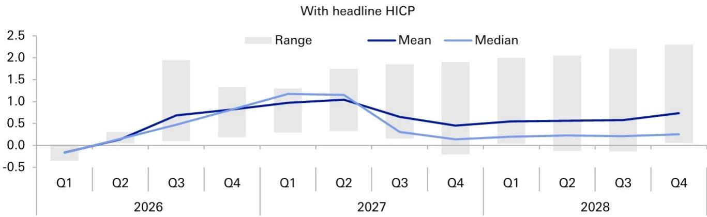
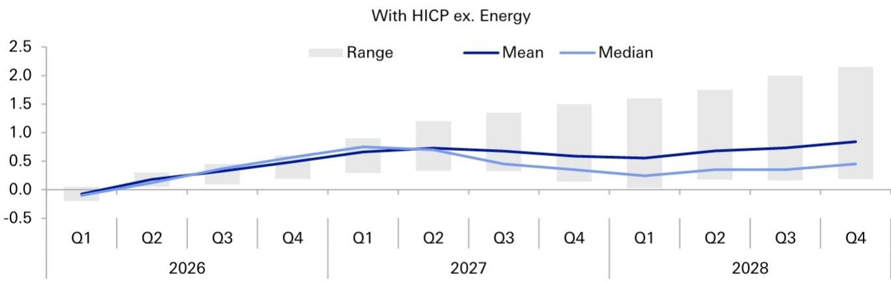
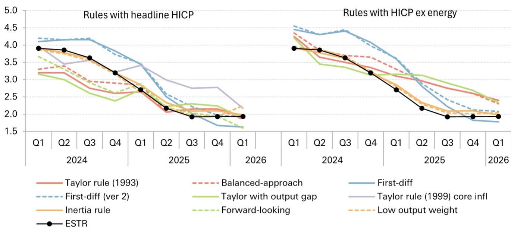

# Playing by the (policy) rules: Why ECB tightening is warranted

The ECB has embarked on a path of measured policy tightening, with President Lagarde describing June's 25bp hike as "robust" but not "forceful." To assess the appropriate trajectory of policy and the potential quantum of further hikes, we have applied a suite of simple policy rules to the ECB's own staff projections. This report shows that the ECB's own outlook for inflation and growth warrants some further policy tightening ahead, even after the recent US-Iran MOU announcement.

## Conclusions and takeaways:

Further policy tightening is warranted: The ECB's June rate hike was robust, supported even by the milder scenario. Using the ex-energy HICP forecasts, the median policy prescription under the baseline scenario is consistent with rates rising to roughly 2.75% by end-2026 (consistent with two more hikes). Or under the milder scenario, the median prescription suggests rates topping out at a little less than 2.50% at the end of this year (more or less consistent with one more hike).

June's revisions to the baseline projection warrant some further policy tightening: The revision to inflation and activity between the March baseline projection and the June projection boost the prescribed path of policy rates by 25bp to 50bp on average across the various rules. Between March and June, market pricing moved to price in an additional 25bp policy hike this year – broadly consistent with the policy rules.

Rules are only a guide not a script: While policy rules provide a guide for "good" monetary policy, they do not capture all the complexities of monetary policy. During the pandemic and energy shock from Russia's invasion of Ukraine, the rules prescribed highly aggressive policy tightening. During the 2024 rate cutting cycle, actual rates broadly followed the prescribed paths for rates early on, but perhaps pushed actual rates towards the lower end of the prescribed range by the end of the cutting cycle.

What this means for the ECB policy outlook: The tone at the ECB press conference on 11 June was consistent with the risk of two more hikes, leading to a terminal policy rate of $2.75\%$ . We maintain our baseline call for one more hike to $2.50\%$ . There are already some signs of the inflation shock moderating (e.g., dbDIG inflation expectations) and oil prices are lower than what we were expecting after a US-Iran deal. Current energy futures suggest the path ahead lies somewhere between the ECB's baseline and milder scenarios. If that is the case, the policy rules

# Economics Focus Europe

are consistent with another one or two hikes.

## Methodology

This report examines what interest rates should do according to a range of simple policy rules. The suite of policy rules is taken from a set regularly monitored by the Federal Reserve (see here and here) and includes a range of different rules based on various common measures of inflation (headline HICP, core HICP) and activity (unemployment, the output gap). The table in Figure 1 details the policy rules used.

<table><tr><td colspan="2">Figure 1: The suite of policy rules considered</td></tr><tr><td>Rule</td><td>Equation</td></tr><tr><td>Taylor (1993) rule</td><td> $i_t = r_t^{LR} + \pi_t + 0.5(\pi_t - \pi^{LR}) + (u_t^{LR} - u_t)$ </td></tr><tr><td>Balanced-approach rule</td><td> $i_t = r_t^{LR} + \pi_t + 0.5(\pi_t - \pi^{LR}) + 2(u_t^{LR} - u_t)$ </td></tr><tr><td>Taylor (1993) rule with output gap</td><td> $i_t = r_t^{LR} + \pi_t + 0.5(\pi_t - \pi^{LR}) + \text{output gap}_t$ </td></tr><tr><td>Forward-looking rule</td><td> $i_t = r_t^{LR} + \pi^{F}_{t+3} + 0.5(\pi^{F}_{t+3} - \pi^{LR}) + 0.5(\text{output gap}_t)$ </td></tr><tr><td>Core inflation in Taylor (1999) rule</td><td> $i_t = r_t^{LR} + \pi_t^{\text{core}} + 0.5(\pi_t^{\text{core}} - \pi^{LR}) + \text{output gap}_t$ </td></tr><tr><td>First-difference</td><td> $i_t = i_{t-1} + 0.5(\pi_t - \pi^{LR}) + (u_t^{LR} - u_t) - (u_{t-4}^{LR} - u_{t-4})$ </td></tr><tr><td>First-difference (ver. 2)</td><td> $i_t = i_{t-1} + 1.74(\pi_t - \pi^{LR}) - 1.19(u_{t-1} - u_{t-2})$ </td></tr><tr><td>Inertial rule</td><td> $i_t = 0.8i_{t-1} + (1 - 0.8)[r_t^{LR} + \pi_t^{\text{core}} + 0.5(\pi_t^{\text{core}} - \pi^{LR}) + \text{output gap}_t]$ </td></tr><tr><td>Low weight on output gap rule</td><td> $i_t = 0.91i_{t-1} + (1 - 0.91)[r_t^{LR} + \pi_t^{\text{core}} + 1.58(\pi_{t+1}^F - \pi^{LR}) + 0.14(\text{output gap}_{t+1})]$ </td></tr></table>

## The rules:

Taylor rule: The rule is inspired by the original 1993-version of Taylor's rule. Nominal interest rates should be raised by 1.5 times the inflation gap (more than one-for-one in order to satisfy the Taylor principle). Rates should also be raised when the unemployment rate is below its long-run value.

Balanced-approach rule: This rule modifies the previous rule to place more importance on the unemployment gap. Although the ECB does not have a dual mandate (like the Fed), because of the lags in inflationary pressure, targeting the current unemployment gap has similarities to also targeting future inflation (which unemployment affects through the Phillips curve).

Taylor rule with output gap: This rule replaces the unemployment gap with the output gap, an alternative measure of the slack in the economy.

Forward-looking rule: This rule targets future inflation rather than current inflation, which can help the central bank look through near-term variability they cannot affect due to the lags of monetary policy.

Core inflation in Taylor rule: An alternative approach to looking through near-term variability is to replace headline inflation with core inflation in the policy rule.

First-difference rules: These rules say the change in the policy rate should be related to inflation gaps and changes in the unemployment rate. If either of these two terms are non-zero, it suggests the economy is not in equilibrium, and policy should be adjusted to compensate. Version 2 does not rely on the long-run unemployment rate (which is unobservable), and could thus be more robust in real-time policy setting.

Inertial rule: This rule adds policy smoothing to the rule in an attempt to

better replicate the gradual nature of policy adjustments.

\- Low weight on output gap rule: This inertial-type rule lowers the weight on the output gap and increases it on inflation to focus more on inflation.

For forecasts of the variables in the rules we use the ECB's latest set of staff projections (released at the June meeting). $^{1}$

## Policy rule prescription for future interest rates

We begin the analysis by considering the central question: what do the policy rules suggest the ECB should do with interest rates over the near term?

Feeding the ECB's own June staff projections into the suite of policy rules, we have produced the path of interest rates prescribed by each rule over 2026-27 (Figure 2, LHS).

The suggested paths of interest rates broadly fall into three main groupings:

Taylor-type rules predicated on headline HICP inflation suggest monetary policy should be tightened aggressively and quickly in response to the inflationary pressures from the energy price shock. The rules suggest rates should be hiked to around 4% by the end of this year, a significant increase from current levels.

First-difference rules prescribe a steady tightening of policy. While less aggressive than the Taylor-type rules the fact that inflation is well above target in 2026, and further on unemployment is steadily falling (driven by the economic recovery) the rule interpret the data as signals we are still below equilibrium throughout this period.

Policy rules that incorporate smoothing of policy rates or based on core inflation suggest policy paths that are more in line with what markets and economists (the SMA) are predicting. The smoothing parameter helps the rule look through the near-term inflationary spike that is assumed in the forecasts to be temporary and take a more medium-term view.

The ECB can probably ignore the signal from policy rules based on headline inflation in an energy supply shock. Policy can do nothing about the direct energy effects and will instead focus on the spillovers or second-round effects from energy prices. For this reason, we also run the rules on HICP excluding energy as the inflation measure within the rules. These results are presented on the right-hand side of Figure 2.

Figure 2: Path of policy rates (ESTR) prescribed by a suite of monetary policy rules produced using the ECB's June staff baseline projections  
  
Source : DB, ECB, Haver Analytics, Bloomberg Finance LP
Notes: SMA = Survey of Monetary Analysts. Colour of lines group rules based on the "type" of rule

Excluding energy prices from the inflation measure produces policy prescriptions that lie much closer to current market pricing. The rules suggest that further tightening of policy is warranted under the ECB's baseline projects which incorporate a broadening of inflation throughout the economy. The median rule implies rates at roughly 2.75% by end-2026 (consistent with two more hikes).

Caveat for interpreting the policy prescriptions: The path of inflation and GDP used in the policy rules are drawn from the staff's baseline projections which are conditioned on market pricing (three interest rate hikes). There is no endogenous feedback from the path of prescribed policy from each policy rule back to inflation and output. In reality, if the ECB did follow the Taylor-type rules prescription at the last meeting and hike to around 3.75% rather than 2.25%, the future path of inflation and GDP growth would be different from what is assumed in the baseline projections. This in turn would affect the values of the prescribed policy from the rule further out in the projection horizon.

## How to respond to the alternative scenarios

The ECB staff projections introduced a new milder scenario to the downside of their baseline projection. With the recent announcement of the memorandum of understanding (MOU) between the US and Iran, the spot prices of oil and gas have fallen significantly, and with them the near-term energy futures as well. Over the rest of 2026, energy futures now lie closest to the ECB's milder scenario. However, further out in the forecast horizon, energy futures remain closer to the baseline projection (Figure 3).

During the press conference, Lagarde said that "the decision to raise rates is robust across a range of scenarios mapping out how the shock might evolve and affect the medium-term outlook for the euro area".

We have re-run the policy rules on all three alternative scenarios (Milder, Adverse, and Severe) to see how the policy prescription of each rule would differ from the baseline.

One important caveat is that the alternative scenario projections published by the ECB do not include their forecast for unemployment. Therefore, we can only analyse how some of the rules differ across scenarios – those that rely on the output gap rather than unemployment.

Figure 3: Oil and gas futures contracts vs the ECB's June alternative scenarios  
  
Source : DB, ECB, Bloomberg Finance LP

Figure 4 to Figure 6 shows the policy prescriptions of the various rules under the alternative scenarios the ECB published.

Milder scenario: The median prescribed interest rate from the policy rules (excluding energy from HICP) is consistent with policy rates around 2.50% from the end of 2026 onwards (consistent with one more hike this year).

Adverse and severe scenarios: Both rules have similar prescriptions to the baseline and milder scenario over 2026. This is because the alternative scenarios only begin to differ from Q3 2026, and it takes time for the higher energy prices under these scenarios to filter through to HICP excluding energy prices. But over 2027, both rules prescribe further steady tightening of policy throughout the year.

The ECB's claim that the June hike was robust is supported by the analysis of this framework. Even in the milder scenario, the rules suggest the 25bp hike in June was justified under the ECB's staff projections, and one further hike (to $2.50\%$ ) could also be appropriate. The fact that interest rates in the adverse and severe scenarios begin to deviate significantly only in 2027 suggests the ECB should be happy to leave some tightening risk premia in the market after it hikes to $2.50\%$ in September – if there is any risk of the adverse or severe scenarios still materialising.

Figure 4: Mild scenario – policy rule prescriptions  
  
Source : DB, ECB, Haver Analytics, Bloomberg Finance LP.
Notes: Only a subset of policy rules can be analysed as the ECB does not publish unemployment data for their alternative scenarios. Colour of lines group rules based on the "type" of rule.

Figure 5: Adverse scenario – policy rule prescriptions  
  
Source : DB, ECB, Haver Analytics, Bloomberg Finance LP. Notes: Only a subset of policy rules can be analysed as the ECB does not publish unemployment data for their alternative scenarios. Colour of lines group rules based on the "type" of rule.

Figure 6: Severe scenario – policy rule prescriptions  
  
Source : DB, ECB, Haver Analytics, Bloomberg Finance LP.
Notes: Only a subset of policy rules can be analysed as the ECB does not publish unemployment data for their alternative scenarios. Colour of lines group rules based on the "type" of rule.

Caveat on policy rules under alternative scenarios: It is important to keep in mind that the paths of inflation and output in the ECB's alternative scenarios are predicated on the same path of monetary policy (3 hikes) and fiscal policy as in the baseline. As the rules show, monetary policy should tighten under the adverse and sever scenarios, and be a little looser under the milder scenario (all relative to the baseline). Therefore, if any of these scenarios were to actually materialise, it is highly likely that monetary policy (and possibly fiscal policy) would respond differently to what the projections for inflation and GDP assume, which in turn would influence the actual outcomes of inflation and GDP. This means that we should keep in mind the policy rules give prescriptions for the specific path of inflation and GDP in the scenario, not how monetary policy should respond to the specific energy shocks underlying the alternative scenarios.

## How the policy prescriptions have evolved: March vs June staff projections

At the June meeting, the ECB staff revised up there forecasts for inflation noticeably in 2026-27, and revised down their growth only marginally over the projection. $^{2}$ Figure 7 and Figure 8 plot the difference in policy prescriptions based on the staff's June baseline projections and those based on the March baseline projections. This difference shows how the policy rules have evolved with the changes in inflation, unemployment, and growth outlooks under the two baseline projections.

Because of the large number of rules, we present the range of differences (represented by the grey bars) alongside the average and median differences across all the rules in the suite.

Figure 7: Difference between the policy rule prescriptions (pp) using the June staff projections vs the March projections – when headline HICP is used as the inflation measure in the rules

  
Source : DB, ECB, Haver Analytics, Bloomberg Finance LP. Notes: Range denotes the maximum-minimum difference in policy prescription between June and March staff projections

Figure 8: Difference between the policy rule prescriptions (pp) using the June staff projections vs the March projections – when HICP ex energy is used as the inflation measure in the rules

  
Source : DB, ECB, Haver Analytics, Bloomberg Finance LP. Notes: Range denotes the maximum-minimum difference in policy prescription between June and March staff projections

Focusing on the results excluding energy prices, the revisions made to inflation and activity projections between the March and June staff projections would be consistent with around 50bp of additional tightening in early 2027, and 25-50bp further out in the projection (relative to the March policy rule prescriptions). Between the March and June projections, market pricing has moved to price in one further hike over the next year, broadly in the range suggested by the rules.

## The ECB has not always followed these rules

Simple policy rules (like the ones in this report), serve as valuable benchmarks for assessing monetary policy but are not rigid prescriptions. While these rules provide a theoretical anchor based on core macroeconomic variables, actual policy rates often diverge. These divergences do not always necessarily reflect "policy mistakes". Central bankers incorporate a wider array of real-time data and forward-looking judgments not captured by stylized rules. But as benchmarks, the rules can stimulate debate as to why actual policy deviates from the what the rules recommend as "good" policy actions.

Below we look at how actual interest rates compare to the policy prescriptions from the rules over the last few years. The results show that the ECB does not follow any one specific rule.

## 2021-2022 pandemic and energy shock

Figure 9 plots the interest rate prescriptions from the policy rules over the period 2021-23 against the ESTR rate at the time. Even excluding the direct impact of energy prices, and assuming that interest rates are smoothed over time, the policy rules suggested interest rates should have started increasing by mid-2021, during the pandemic. The rates should then have further accelerated in early 2022 with Russia's invasion of Ukraine.

Figure 9: ESTR vs policy rule prescriptions (%) during the 2021-22 pandemic and energy shock  
  
Source : DB, ECB, Haver Analytics, Bloomberg Finance LP. Notes: Colour of lines group rules based on the "type" of rule

Even though ESTR did not begin rising until mid-2022, the ECB argues it did not respond too late to the shock. Before it started hiking rates, the ECB tightened policy through the balance sheet – something the simple rules do not capture. $^{3}$

One positive take away from Figure 9 is that the first difference rules and policy rules with smoothing did a reasonable job at predicting the peak of the tightening cycle ahead of the actual peak.

## 2024 rate cutting cycle

Figure 10 shows the policy rule prescriptions during the ECB's more recent cutting cycle (which started June 2024). The path of ESTR was broadly in the middle of the range of rules based on headline HICP throughout 2024. It then moved towards the lower end of that range in 2025. In terms of rules based on HICP excluding energy, ESTR remained close to the lower end of the range throughout the period.

Overall the rules suggest the ECB's rate cutting cycle was justified by the inflation and activity data at the time. But some of the ECB hawks might argue that the rate cutting cycle could have ended earlier than it did give the range of prescriptions in the second half of 2025 was skewed to the upside.

Figure 10: ESTR vs policy rule prescriptions (%) during the latest rate cutting cycle

  
Source : DB, ECB, Haver Analytics, Bloomberg Finance LP. Notes: Colour of lines group rules based on the "type" of rule

## Appendix 1

## Important Disclosures

## \*Other information available upon request

\*Prices are current as of the end of the previous trading session unless otherwise indicated and are sourced from local exchanges via Reuters, Bloomberg and other vendors. Other information is sourced from DB, subject companies, and other sources. For further information regarding disclosures relevant to DB, please visit our global disclosure look-up page on our website at https://research.db.com/Research/Disclosures/FICCDisclosures. Aside from within this report, important risk and conflict disclosures can also be found at https://research.db.com/Research/Disclosures/Disclaimer. Investors are strongly encouraged to review this information before investing.

## Analyst Certification

The views expressed in this report accurately reflect the personal views of the undersigned lead analyst(s). In addition, the undersigned lead analyst(s) has not and will not receive any compensation for providing a specific recommendation or view in this report. Michael Kirker, Mark Wall.

## Additional Information

The information and opinions in this report were prepared by DB AG or one of its affiliates (collectively 'DB'). Though the information herein is believed to be reliable and has been obtained from public sources believed to be reliable, DB makes no representation as to its accuracy or completeness. Hyperlinks to third-party websites in this report are provided for reader convenience only. DB neither endorses the content nor is responsible for the accuracy or security controls of those websites.

If you use the services of DB in connection with a purchase or sale of a security that is discussed in this report, or is included or discussed in another communication (oral or written) from a DB analyst, DB may act as principal for its own account or as agent for another person.

DB may consider this report in deciding to trade as principal. It may also engage in transactions, for its own account or with customers, in a manner inconsistent with the views taken in this research report. Others within DB, including strategists, sales staff and other analysts, may take views that are inconsistent with those taken in this research report. DB issues a variety of research products, including fundamental analysis, equity-linked analysis, quantitative analysis and trade ideas. Recommendations contained in one type of communication may differ from recommendations contained in others, whether as a result of differing time horizons, methodologies, perspectives or otherwise. DB and/or its affiliates may also be holding debt or equity securities of the issuers it writes on. Analysts are paid in part based on the profitability of DB AG and its affiliates, which includes investment banking, trading and principal trading revenues.

Opinions, estimates and projections constitute the current judgment of the author as of the date of this report. They do not necessarily reflect the opinions of DB and are subject to change without notice. DB provides liquidity for buyers and sellers of securities issued by the companies it covers. DB analysts sometimes have shorter-term trade ideas that may be inconsistent with DB's existing longer-term ratings. Some trade ideas for equities are listed as Catalyst Calls on the Research Website (https://research.db.com/Research/) , and can be found on the general coverage list and also on the covered company's page. A Catalyst Call represents a high-conviction belief by an analyst that a stock will outperform or underperform the market and/or a specified sector over a time frame of no less than two weeks and no more than three months. In addition to Catalyst Calls, analysts may occasionally discuss with our clients, and with DB salespersons and traders, trading strategies or ideas that reference catalysts or events that may have a near-term or medium-term impact on the market price of the securities discussed in this report, which impact may be directionally counter to the analysts' current 12-month view of total return or investment return as described herein. DB has no obligation to update, modify or amend this report or to otherwise notify a recipient thereof if an opinion, forecast or estimate changes or becomes inaccurate. Coverage and the frequency of changes in market conditions and in both general and company-specific economic prospects make it difficult to update research at defined intervals. Updates are at the sole discretion of the coverage analyst or of the Research Department Management, and the majority of reports are published at irregular intervals. This report is provided for informational purposes only and does not take into account the particular investment objectives, financial situations, or needs of individual clients. It is not an offer or a solicitation of an offer to buy or sell any financial instruments or to participate in any particular trading strategy. Target prices are inherently imprecise and a product of the analyst's judgment. The financial instruments discussed in this report may not be suitable for all investors, and investors must make their own informed investment decisions. Prices and availability of financial instruments are subject to change without notice, and investment transactions can lead to losses as a result of price fluctuations and other factors. If a financial instrument is denominated in a currency other than an investor's currency, a change in exchange rates may adversely affect the investment. Past performance is not necessarily indicative of future results. Performance calculations exclude transaction costs, unless otherwise indicated. Unless otherwise indicated, prices are current as of the end of the previous trading session and are sourced from local exchanges via Reuters, Bloomberg and other vendors. Data is also sourced from DB, subject companies, and other parties. Artificial intelligence tools may be used in the preparation of this material, including but not limited to assist in fact-finding, data analysis, pattern recognition, content drafting and editorial corrections pertaining to research material.

The DB Department is independent of other business divisions of the Bank. Details regarding our organizational arrangements and information barriers we have to prevent and avoid conflicts of interest with respect to our research are available on our website (https://research.db.com/Research/) under Disclaimer.

Macroeconomic fluctuations often account for most of the risks associated with exposures to instruments that promise to pay fixed or variable interest rates. For an investor who is long fixed-rate instruments (thus receiving these cash flows), increases in interest rates naturally lift the discount factors applied to the expected cash flows and thus cause a loss. The longer the maturity of a certain cash flow and the higher the move in the discount factor, the higher will be the loss. Upside surprises in inflation, fiscal funding needs, and FX depreciation rates are among the most common adverse macroeconomic shocks to receivers. But counterparty exposure, issuer creditworthiness, client segmentation, regulation (including changes in assets holding limits for different types of investors), changes in tax policies, currency convertibility (which may constrain currency conversion, repatriation of profits and/or liquidation of positions), and settlement issues related to local clearing houses are also important risk factors. The sensitivity of fixed-income instruments to macroeconomic shocks may be mitigated by indexing the contracted cash flows to inflation, to FX depreciation, or to specified interest rates - these are common in emerging markets. The index fixings may - by construction - lag or mis-measure the actual move in the underlying variables they are intended to track. The choice of the proper fixing (or metric) is particularly important in swaps markets, where floating coupon rates (i.e., coupons indexed to a typically short-dated interest rate reference index) are exchanged for fixed coupons. Funding in a currency that differs from the currency in which coupons are denominated carries FX risk. Options on swaps (swaptions) the risks typical to options in addition to the risks related to rates movements.

Derivative transactions involve numerous risks including market, counterparty default and illiquidity risk. The appropriateness of these products for use by investors depends on the investors' own circumstances, including their tax position, their regulatory environment and the nature of their other assets and liabilities; as such, investors should take expert legal and financial advice before entering into any transaction similar to or inspired by the contents of this publication. The risk of loss in futures trading and options, foreign or domestic, can be substantial. As a result of the high degree of leverage obtainable in futures and options trading, losses may be incurred that are greater than the amount of funds initially deposited - up to theoretically unlimited losses. Trading in options involves risk and is not suitable for all investors. Prior to buying or selling an option, investors must review the 'Characteristics and Risks of Standardized Options", at https://www.theocc.com/company-information/documents-and-archives/options-disclosure-document. If you are unable to access the website, please contact your DB representative for a copy of this important document.

Participants in foreign exchange transactions may incur risks arising from several factors, including the following: (i) exchange rates can be volatile and are subject to large fluctuations; (ii) the value of currencies may be affected by numerous market factors, including world and national economic, political and regulatory events, events in equity and debt markets and changes in interest rates; and (iii) currencies may be subject to devaluation or government-imposed exchange controls, which could affect the value of the currency. Investors in securities such as ADRs, whose values are affected by the currency of an underlying security, effectively assume currency risk.

Unless governing law provides otherwise, all transactions should be executed through the DB entity in the investor's home jurisdiction. Aside from within this report, important conflict disclosures can also be found at https://research.db.com/Research/ on each company's research page or under the 'Disclosures' tab. Investors are strongly encouraged to review this information before investing.

DB (which includes DB AG, its branches and affiliated companies) is not acting as a financial adviser, consultant or fiduciary to you or any of your agents (collectively, "You" or "Your") with respect to any information provided in this report. DB does not provide investment, legal, tax or accounting advice, DB is not acting as your impartial adviser, and does not express any opinion or recommendation whatsoever as to any strategies, products or any other information presented in the materials. Information contained herein is being provided solely on the basis that the recipient will make an independent assessment of the merits of any investment decision, and it does not constitute a recommendation of, or express an opinion on, any product or service or any trading strategy.

The information presented is general in nature and is not directed to retirement accounts or any specific person or account type, and is therefore provided to You on the express basis that it is not advice, and You may not rely upon it in making Your decision. The information we provide is being directed only to persons we believe to be financially sophisticated, who are capable of evaluating investment risks independently, both in general and with regard to particular transactions and investment strategies, and who understand that DB has financial interests in the offering of its products and services. If this is not the case, or if You are an IRA or other retail investor receiving this directly from us, we ask that you inform us immediately.

In July 2018, DB revised its rating system for short term ideas whereby the branding has been changed to Catalyst Calls ("CC") from SOLAR ideas; the rating categories for Catalyst Calls originated in the Americas region have been made consistent with the categories used by Analysts globally; and the effective time period for CCs has been reduced from a maximum of 180 days to 90 days.

United States: Approved and/or distributed by DB Securities Incorporated, a member of FINRA and SIPC. Analysts located outside of the United States are employed by non-US affiliates and are not registered/qualified as research analysts with FINRA.

European Economic Area (exc. United Kingdom): Approved and/or distributed by DB AG, a joint stock corporation with limited liability incorporated in the Federal Republic of Germany with its principal office in Frankfurt am Main. DB AG is authorized under German Banking Law and is subject to supervision by the European Central Bank and by BaFin, Germany's Federal Financial Supervisory Authority.

United Kingdom: Approved and/or distributed by DB AG acting through its London Branch at 21 Moorfields, London EC2Y 9DB. DB AG in the United Kingdom is authorised by the Prudential Regulation Authority and is subject to limited regulation by the Prudential Regulation Authority and Financial Conduct Authority. Details about the extent of our authorisation and regulation are available on request.

Hong Kong SAR: Distributed by DB AG, Hong Kong Branch, except for any research content relating to futures contracts within the meaning of the Hong Kong Securities and Futures Ordinance Cap. 571. Research reports on such futures contracts are not intended for access by persons who are located, incorporated, constituted or resident in Hong Kong. The author(s) of a research report, and the entities for which they act and/or are affiliated with, may not be licensed to carry on regulated activities in Hong Kong and, if not licensed, do not hold themselves out as being able to do so. The provisions set out above in the 'Additional Information' section shall apply to the fullest extent permissible by local laws and regulations, including without limitation the Code of Conduct for Persons Licensed or Registered with the Securities and Futures Commission. This report is intended for distribution only to 'professional investors' as defined in Part 1 of Schedule of the SFO. This document must not be acted or relied on by persons who are not professional investors. Any investment or investment activity to which this document relates is only available to professional investors and will be engaged only with professional investors.

India: Prepared by Deutsche Equities India Private Limited (DEIPL) having CIN: U65990MH2002PTC137431 and registered office at 14th Floor, The Capital, C-70, G Block, Bandra Kurla Complex, Mumbai (India) 400051. Tel: +91 22 7180 4444. It is registered by the Securities and Exchange Board of India (SEBI) as a Stock broker bearing registration no.: INZ000252437; Merchant Banker bearing SEBI Registration no.: INM000010833 and Research Analyst bearing SEBI Registration no.: INH000001741. DEIPL's Compliance / Grievance officer is Ms. Rashmi Poddar (Tel: +91 22 7180 4929 email ID: complaints.deipl@db.com). Registration granted by SEBI and certification from NISM in no way guarantee performance of DEIPL or provide any assurance of returns to investors. Investment in securities market are subject to market risks. Read all the related documents carefully before investing. DEIPL may have received administrative warnings from the SEBI for breaches of Indian regulations. DB and/or its affiliate(s) may have debt holdings or positions in the subject company. With regard to information on associates, please refer to the "Shareholdings" section in the Annual Report at: https://www.db.com/ir/en/annual-reports.htm. For latest India research audit report, refer https://country.db.com/india/deutsche-equities-india/index?language\_id=1.

Japan: Approved and/or distributed by Deutsche Securities Inc.(DSI). Registration number - Registered as a financial instruments dealer by the Head of the Kanto Local Finance Bureau (Kinsho) No. 117. Member of associations: JSDA, Type II Financial Instruments Firms Association and The Financial Futures Association of Japan. Commissions and risks involved in stock transactions - for stock transactions, we charge stock commissions and consumption tax by multiplying the transaction amount by the commission rate agreed with each customer. Stock transactions can lead to losses as a result of share price fluctuations and other factors. Transactions in foreign stocks can lead to additional losses stemming from foreign exchange fluctuations. We may also charge commissions and fees for certain categories of investment advice, products and services. Recommended investment strategies, products and services carry the risk of losses to principal and other losses as a result of changes in market and/or economic trends, and/or fluctuations in market value. Before deciding on the purchase of financial products and/or services, customers should carefully read the relevant disclosures, prospectuses and other documentation. 'Moody's', 'Standard Poor's', and 'Fitch' mentioned in this report are not registered credit rating agencies in Japan unless Japan or 'Nippon' is specifically designated in the name of the entity. Reports on Japanese listed companies not written by analysts of DSI are written by DB Group's analysts with the coverage companies specified by DSI. Some of the foreign securities stated on this report are not disclosed according to the Financial Instruments and Exchange Law of Japan. Target prices set by DB's equity analysts are based on a 12-month forecast period..

Korea: Distributed by Deutsche Securities Korea Co.

South Africa: DB AG Johannesburg is incorporated in the Federal Republic of Germany (Branch Register Number in South Africa: 1998/003298/10).

Singapore: This report is issued by DB AG, Singapore Branch (One Raffles Quay #18-00 South Tower Singapore 048583, 65 6423 8001), which may be contacted in respect of any matters arising from, or in connection with, this report. Where this report is issued or promulgated by DB in Singapore to a person who is not an accredited investor, expert investor or institutional investor (as defined in the applicable Singapore laws and regulations), they accept legal responsibility to such person for its contents.

Taiwan: Information on securities/investments that trade in Taiwan is for your reference only. Readers should independently evaluate investment risks and are solely responsible for their investment decisions. DB may not be distributed to the Taiwan public media or quoted or used by the Taiwan public media without written consent. Information on securities/instruments that do not trade in Taiwan is for informational purposes only and is not to be construed as a recommendation to trade in such securities/instruments.

Qatar: DB AG in the Qatar Financial Centre (registered no. 00032) is regulated by the Qatar Financial Centre Regulatory Authority. DB AG - QFC Branch may undertake only the financial services activities that fall within the scope of its existing QFCRA license. Its principal place of business in the QFC: Qatar Financial Centre, Tower, West Bay, Level 5, PO Box 14928, Doha, Qatar. This information has been distributed by DB AG. Related financial products or services are only available only to Business Customers, as defined by the Qatar Financial Centre Regulatory Authority.

Russia: The information, interpretation and opinions submitted herein are not in the context of, and do not constitute, any appraisal or evaluation activity requiring a license in the Russian Federation.

Kingdom of Saudi Arabia: Deutsche Securities Saudi Arabia (DSSA) is a closed joint stock company authorized by the Capital Market Authority of the Kingdom of Saudi Arabia with a license number (No. 37-07073) to conduct the following business activities: Dealing, Arranging, Advising, and Custody activities. DSSA registered office is Faisaliah Tower, 17th Floor, King Fahad Road - Al Olaya District Riyadh, Kingdom of Saudi Arabia P.O. Box 301806.

United Arab Emirates: DB AG in the Dubai International Financial Centre (registered no. 00045) is regulated by the Dubai Financial Services Authority. DB AG - DIFC Branch may only undertake the financial services activities that fall within the scope of its existing DFSA license. Principal place of business in the DIFC: Dubai International Financial Centre, The Gate Village, Building 5, PO Box 504902, Dubai, U.A.E. This information has been distributed by DB AG. Related financial products or services are available only to Professional Clients, as defined by the Dubai Financial Services Authority.

Australia and New Zealand: This research is intended only for 'wholesale clients' within the meaning of the Australian Corporations Act and New Zealand Financial Advisors Act, respectively. Please refer to Australia-specific research disclosures and related information at https://www.dbresearch.com/PROD/RPS\_EN-PROD/PROD0000000000521304.xhtml. Where research refers to any particular financial product recipients of the research should consider any product disclosure statement, prospectus or other applicable disclosure document before making any decision about whether to acquire the product. In preparing this report, the primary analyst or an individual who assisted in the preparation of this report has likely been in contact with the company that is the subject of this research for confirmation/clarification of data, facts, statements, permission to use company-sourced material in the report, and/or site-visit attendance. Without prior approval from Research Management, analysts may not accept from current or potential Banking clients the costs of travel, accommodations, or other expenses incurred by analysts attending site visits, conferences, social events, and the like. Similarly, without prior approval from Research Management and Anti-Bribery and Corruption ("ABC") team, analysts may not accept perks or other items of value for their personal use from issuers they cover.

Additional information relative to securities, other financial products or issuers discussed in this report is available upon request. This report may not be reproduced, distributed or published without DB's prior written consent.

Backtested, hypothetical or simulated performance results have inherent limitations. Unlike an actual performance record based on trading actual client portfolios, simulated results are achieved by means of the retroactive application of a backtested model itself designed with the benefit of hindsight. Taking into account historical events the backtesting of performance also differs from actual account performance because an actual investment strategy may be adjusted any time, for any reason, including a response to material, economic or market factors. The backtested performance includes hypothetical results that do not reflect the reinvestment of dividends and other earnings or the deduction of advisory fees, brokerage or other commissions, and any other expenses that a client would have paid or actually paid. No representation is made that any trading strategy or account will or is likely to achieve profits or losses similar to those shown. Alternative modeling techniques or assumptions might produce significantly different results and prove to be more appropriate. Past hypothetical backtest results are neither an indicator nor guarantee of future returns. Actual results will vary, perhaps materially, from the analysis.

The method for computing individual E,S,G and composite ESG scores set forth herein is a novel method developed by the Research department within DB AG, computed using a systematic approach without human intervention. Different data providers, market sectors and geographies approach ESG analysis and incorporate the findings in a variety of ways. As such, the ESG scores referred to herein may differ from equivalent ratings developed and implemented by other ESG data providers in the market and may also differ from equivalent ratings developed and implemented by other divisions within the DB Group. Such ESG scores also differ from other ratings and rankings that have historically been applied in research reports published by DB AG. Further, such ESG scores do not represent a formal or official view of DB AG.

It should be noted that the decision to incorporate ESG factors into any investment strategy may inhibit the ability to participate in certain investment opportunities that otherwise would be consistent with your investment objective and other principal investment strategies. The returns on a portfolio consisting primarily of sustainable investments may be lower or higher than portfolios where ESG factors, exclusions, or other sustainability issues are not considered, and the investment opportunities available to such portfolios may differ. Companies may not necessarily meet high performance standards on all aspects of ESG or sustainable investing issues; there is also no guarantee that any company will meet expectations in connection with corporate responsibility, sustainability, and/or impact performance.

Copyright © 2026 DB AG

<table><tr><td colspan="4">David Folkerts-LandauGroup Chief Economist and Global Head of Research</td></tr><tr><td>Pam FinelliCOO and Head of Fixed Income Research</td><td>Steve PollardGlobal Head of Company Research and Sales</td><td>Jim ReidGlobal Head of Macro and Thematic Research</td><td>Tim RokossaHead of European Company Research</td></tr><tr><td>Matthew BarnardHead of AmericasCompany Research</td><td>Debbie JonesGlobal Head of Sustainability and Data Innovation, Research</td><td>Robin WinklerHead of German Macro Research</td><td>Sameer GoelGlobal Head of EM &amp; APAC Research</td></tr><tr><td>Francis YaredGlobal Head of Rates Research</td><td>George SaravelosGlobal Head of FX Research</td><td>Peter HooperVice-Chair of Research</td><td>Nilendra de-MelHead of APAC &amp; Middle East Product Development</td></tr></table>

<table><tr><td>DB AG</td><td>DB AG</td><td>DB AG</td><td>Deutsche Securities Inc.</td></tr><tr><td>DB Place</td><td>Equity Research</td><td>Filiale Hongkong</td><td>1-3-1 Azabudai</td></tr><tr><td>Level 16</td><td>Mainzer Landstrasse 11-17</td><td>International Commerce</td><td>Azabudai Hills Mori JP Tower</td></tr><tr><td>Corner of Hunter &amp; Phillip</td><td>60329 Frankfurt am Main</td><td>Centre,</td><td>Minato-ku, Tokyo 106-0041</td></tr><tr><td>Streets</td><td>Germany</td><td>1 Austin Road West,Kowloon,</td><td>Japan</td></tr><tr><td>Sydney, NSW 2000</td><td>Tel: (49) 69 910 00</td><td>Hong Kong</td><td>Tel: (81) 3 6730 1000</td></tr><tr><td>Australia</td><td></td><td>Tel: (852) 2203 8888</td><td></td></tr><tr><td>Tel: (61) 2 8258 1234</td><td></td><td></td><td></td></tr></table>