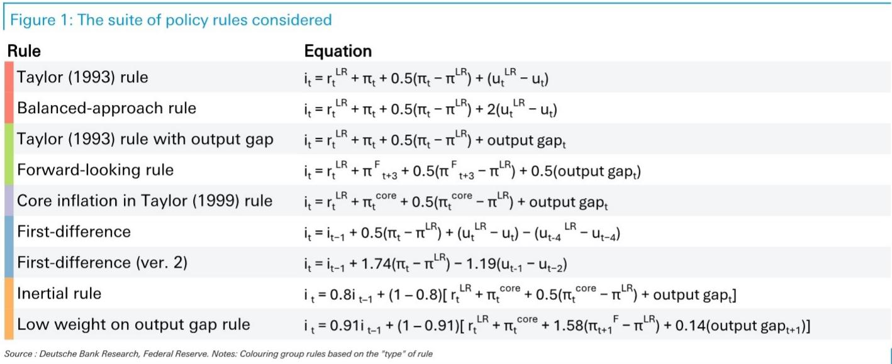
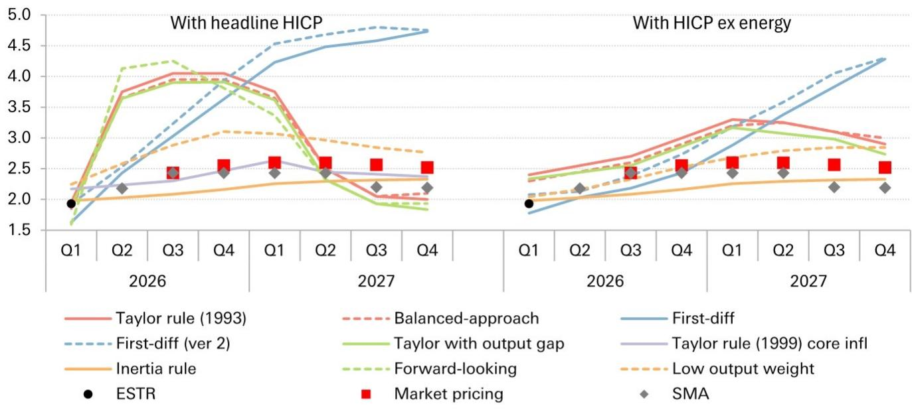
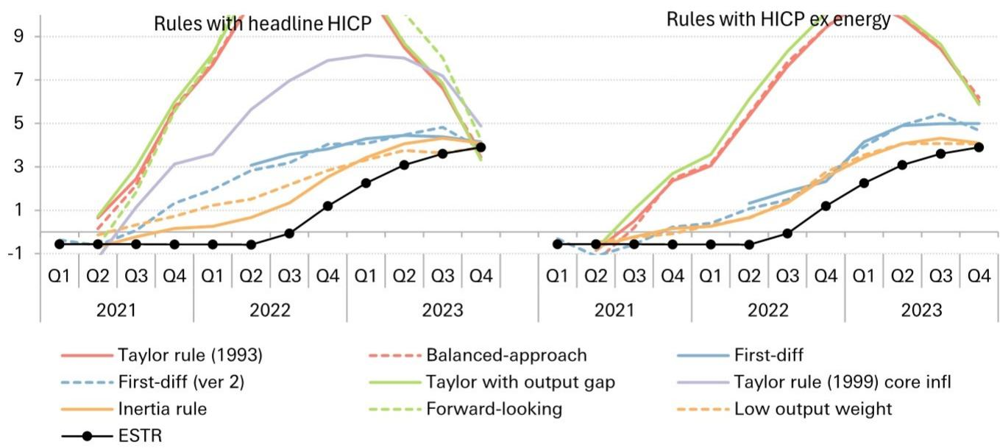

# DB：ECB加息不是终点，而是规则框架下的“稳健”起点

ECB在6月会议上宣布加息25个基点，行长拉加德用“稳健”而非“强硬”来形容这一决定。市场对此的解读分化明显：一部分人认为这是本轮紧缩周期的尾声，另一部分人则担心通胀粘性将迫使ECB继续加码。DB最新发布的研报，通过一套严谨的政策规则框架，给出了一个清晰的判断：ECB的加息进程远未结束，但节奏和终点将由通胀结构而非总量决定。

这份研报的核心价值不在于预测具体加息几次，而在于它提供了一个可复用的分析框架——用ECB自己的经济预测来检验其政策路径的合理性。结论是：即使采用最温和的情景假设，ECB也需要至少再加息一次；而如果通胀从能源领域向核心领域扩散的假设成立，终端利率可能比市场当前定价高出25-50个基点。

这不仅仅是一份关于ECB的研报，它实际上在回答一个更根本的问题：在供给冲击主导的通胀环境中，中央银行应该如何校准政策？规则指引和相机抉择之间的张力，如何影响资产定价？

## 1. 政策规则指向的终端利率，比市场定价更“鹰”

DB的分析起点非常直接：将ECB 6月员工预测数据输入九种不同的货币政策规则，看这些规则会给出什么样的利率路径。这九种规则包括泰勒规则、平衡法规则、前瞻性规则、惯性规则等，涵盖了对通胀指标（整体HICP vs 核心HICP）和产出缺口指标（失业率 vs 产出缺口）的不同选择。

结果是分层的。如果使用整体HICP作为通胀指标，泰勒型规则会建议ECB在年底前将利率大幅提升至4%左右，这显然是一个不切实际的激进路径。但DB明确指出，在能源供给冲击的背景下，ECB完全可以忽略基于整体通胀的规则信号——因为货币政策无法直接影响能源价格本身，只能关注其溢出效应和第二轮效应。

更关键的是剔除了能源价格后的HICP。当使用这一指标时，规则给出的路径与当前市场定价的距离大幅收窄。中位数规则显示，到2026年底，政策利率应达到约2.75%，这对应着两次额外加息。即便在ECB新引入的“温和情景”下，中位数规则也建议利率在年底达到略低于2.50%的水平，对应一次额外加息。

> **KC评论：** 这里的核心洞察是，ECB的加息决策不是基于对通胀的“恐惧”，而是基于一个可量化的规则框架。拉加德说“稳健”并非修辞，而是有数据支撑的。但读者需要注意，规则给出的只是“建议”，而非“剧本”。完整报告中详细展示了九种规则在三种情景下的具体路径，以及它们之间为何存在如此大的差异——这些细节对于理解ECB的实际决策边界至关重要。

## 2. 3月到6月的预测修正，已经内嵌了一次加息

DB还做了一项非常有价值的对比分析：比较3月和6月两次员工预测对规则路径的影响。结果显示，从3月到6月，通胀和增长预测的修正使得规则建议的政策利率路径平均提高了25-50个基点。

有趣的是，同期市场定价也恰好计入了一次额外的25个基点加息。这意味着，市场已经在某种程度上“消化”了ECB预测修正所隐含的政策收紧。但问题在于，这种消化是否充分？DB的规则框架表明，如果通胀从能源领域向核心领域扩散的假设持续成立，市场可能还需要进一步调整定价。

这一发现对于债券投资者尤其重要。它暗示当前收益率曲线中隐含的加息预期可能仍然偏低，尤其是在曲线的远端。如果ECB按照规则指引继续加息，长端利率可能面临上行压力。

> **KC评论：** 这份对比分析的价值在于，它展示了政策规则如何帮助投资者“校准”对央行行为的预期。市场定价和规则指引之间的偏差，往往意味着交易机会或风险。完整报告中还包含了3月和6月预测修正的详细数据表，以及这些修正如何具体影响每一条规则的计算结果——这些细节是理解央行行为逻辑的关键。

## 3. ECB不会机械遵循规则，但规则是衡量“偏离”的基准

DB非常清醒地指出，ECB从未机械地遵循任何一条规则。在2021-2022年疫情期间和俄乌冲突后的能源冲击中，规则曾建议ECB在2021年年中就开始加息，但实际利率直到2022年7月才开始上升。这种偏离并不一定是“政策错误”，因为央行需要考虑实时数据的滞后性、前瞻性判断以及金融稳定的考量。

但规则的价值恰恰在于提供一个基准——当实际政策与规则建议出现显著偏离时，投资者需要问：这种偏离是合理的，还是反映了央行的判断失误？在当前的语境下，ECB的加息路径与规则建议之间的差距已经大幅收窄，这意味着“政策正常化”的空间正在缩小，但尚未消失。

这一分析框架对投资者的启示是：不要简单地把ECB的每次加息都解读为“鹰派”或“鸽派”，而要看加息是否在规则框架内。如果ECB在规则建议的范围内行动，市场应该将其视为预期内的政策校准，而非意外冲击。

## 4. 能源期货走势正在向温和情景靠拢，但风险并未消失

DB报告中还有一个值得关注的细节：美伊谅解备忘录签署后，石油和天然气现货价格显著下跌，近端能源期货已经接近ECB的“温和情景”，但远端期货仍然更接近基线情景。

这意味着，ECB面临的是一个“时间错配”的挑战。短期内，能源价格下行有助于缓解通胀压力，从而降低进一步加息的必要性。但中期来看，如果能源期货价格重新上行，或者通胀从能源领域向核心领域扩散的势头持续，ECB将不得不重新评估其政策路径。

这里存在一个关键的未解问题：ECB的“温和情景”是否已经充分反映了美伊协议的影响？由于该协议的具体条款和执行细节尚未完全明确，ECB在6月预测中可能低估了其对能源价格的短期压制作用。如果能源价格在未来几个月持续低于预期，ECB可能会比规则建议的路径更早暂停加息。

> **KC评论：** 这一点对于投资者来说可能是最大的“变量”。报告中的规则框架是基于ECB的官方预测，但官方预测本身存在滞后性。如果能源期货的实际走势持续低于ECB的温和情景假设，那么规则建议的加息路径可能就会“过时”。完整报告中包含了能源期货与ECB三种情景的对比图，以及不同情景下规则路径的详细拆解——这些图表是判断ECB政策“拐点”的重要工具。

## 5. 报告尚未完全回答的关键问题：通胀的“广度”比“高度”更重要

DB的分析框架高度依赖于ECB对通胀和增长的预测，但报告本身也承认了一个关键限制：政策规则没有考虑通胀的“广度”或“扩散程度”。ECB在6月预测中假设通胀将从能源领域向核心领域“扩散”，但这一假设是否成立，取决于工资-价格螺旋是否形成、企业定价行为是否改变、以及消费者通胀预期是否脱锚。

如果通胀扩散的假设被证伪，ECB可能只需要再加息一次就结束本轮周期。但如果扩散持续，甚至加速，ECB可能需要将利率提升至3%以上。当前的市场定价和DB的基线预测都倾向于前者，但风险显然偏向后者。

另一个未完全展开的问题是：ECB的加息对欧元区边缘国家（如意大利、西班牙）的债务可持续性意味着什么？报告没有深入探讨这一金融稳定维度，但对于持有欧洲主权债券的投资者来说，这可能是比利率路径本身更重要的风险因素。

## 从规则到决策：投资者需要建立自己的观察框架

这份DB研报最值得借鉴的，不是它的具体结论（因为结论会随着数据变化），而是它的分析框架。对于关注欧洲资产价格的投资者，可以建立以下三个观察维度：

第一，跟踪ECB员工预测的变化。规则框架的核心输入是通胀和增长预测，每一次员工预测的修正都会影响规则建议的利率路径。投资者应该关注ECB在9月和12月会议上的预测修正，特别是核心HICP和失业率的预测变化。

第二，关注能源期货的期限结构。近端期货价格影响ECB的短期决策，而远端期货价格则影响市场对终端利率的定价。如果远端期货持续低于ECB的基线假设，市场可能会开始定价更低的终端利率。

第三，观察工资增长和通胀预期数据。这是判断通胀是否“扩散”的关键指标。如果欧元区工资增长持续加速，或者消费者通胀预期脱锚，ECB将不得不采取比规则建议更激进的行动。

这些观察框架的建立，需要持续的数据跟踪和模型更新。我们每天会由AI agent和人工review生成国际投行中文摘要与KC评论，daily更新约10-40页，并整理当天最新数据图表合集，方便喂给AI，也方便人工快速把握market dynamics。欢迎来星球微信群里继续讨论。

Personal reading notes and learning share only. Not investment advice.

