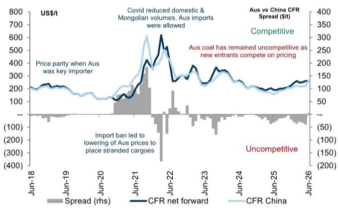
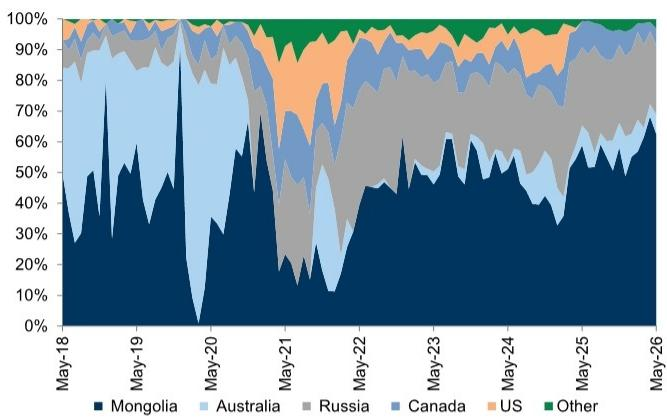
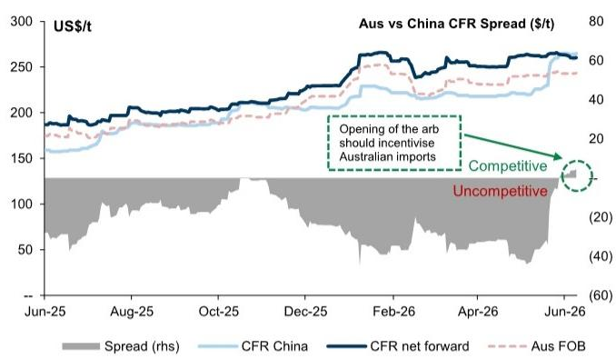

# GS：山西煤矿事故将结构性重塑全球焦煤定价权

如果你只关心焦煤价格会涨到多少，这份GS报告给出的答案是每吨280美元。但真正值得你关注的，不是这个数字本身，而是它背后正在发生的三件事：中国正在失去高强度焦煤的自主供应能力，澳大利亚正在重新夺回对华定价权，而印度虽然需求增长最快，却始终无法成为价格的主导者。

这份基于新加坡铁矿石周和焦煤会议的调研报告，提供了一个罕见的全景视角。报告最核心的判断是：山西矿难导致的1500-2000万吨产量损失，不是一次性的供应冲击，而是一次结构性重置。部分矿井可能永远无法恢复到满产状态，中国对优质进口焦煤的依赖正在从周期性变为结构性。

这意味着，全球焦煤的定价锚正在从中国CFR价格，重新回到澳大利亚FOB指数。而这一转变，将影响从钢铁厂利润到矿业公司估值的整个链条。

---

## 1. 山西矿难不只损失了产量，还摧毁了中国对高强度焦煤的自给能力

GS团队在会议上得到的反馈显示，山西事故后仍有约5000-5500万吨产能处于停产状态。市场已经消化了1500-2000万吨的年度产量损失，但真正关键的问题是：这些产能还能回来吗？

与会交易商的判断并不乐观。部分矿井即使复产，产能利用率也可能只能恢复到之前的70-80%，而过去有些矿井的实际产出甚至可以达到名义产能的110%。监管问责的升级和地方官员的调查，正在让复产审批变得更加谨慎。

> **KC评论：** 这里需要理解一个关键细节——损失的不仅是产量，更是特定品质的供应。山西事故中停产的主要是高强度、低挥发分的优质焦煤，这种煤蒙古和俄罗斯都无法替代。这意味着中国钢铁厂在配煤环节失去了关键的“骨架”原料，只能转向进口。完整报告中的图2和图3清晰地展示了这一冲击如何迅速拉平了澳大利亚煤和国内煤的价格。

更值得警惕的是结构性成本的变化。报告中提到，部分山西矿井的开采深度已达1-1.5公里，本身就处于成本曲线的高端。监管收紧后，安全投入的增加将进一步推高国内焦煤的边际成本。这意味著即使产能恢复，国内煤相对于进口煤的竞争力也在下降。

**对行业格局的含义：** 中国从“偶尔依赖进口”正在转向“结构性依赖进口”。过去四年，澳大利亚煤在中国进口中的占比一度降至7%左右，但这次事件正在逆转这一趋势。

---

## 2. 澳大利亚煤对华价格优势重现，这是四年来的第一次

报告中最引人注目的数据点是：澳大利亚优质焦煤目前在中国港口的到岸价格，已经比国内煤便宜5美元/吨。这是过去四年多来首次出现的情况。

GS团队测算，自山西事故以来，中国CFR价格已上涨约40美元/吨。随着澳大利亚煤的竞争力显现，越来越多的现货正在转向中国市场。交易商反馈，一级和二级澳大利亚焦煤（包括PCI煤）正加速流向中国。

> **KC评论：** 这意味着什么？过去几年，澳大利亚煤在中国市场几乎被边缘化，定价权主要掌握在蒙古和俄罗斯手中。但现在，澳大利亚正在重新成为中国的边际供应来源。当中国需要补充高强度焦煤时，澳大利亚是唯一能够大规模提供替代供应的来源。完整报告中的图1展示了这一价格套利窗口的打开过程，值得仔细研究。

GS的分析师进一步指出，随着澳大利亚煤重新进入中国市场，整体价格实现将得到改善。过去，部分矿商为了避免压低澳大利亚基准价格，选择直接向中国销售现货。但现在，随着中国和澳大利亚价格趋同，这一顾虑正在消除。

**对资产定价的含义：** 澳大利亚焦煤生产商的定价权正在修复。如果这一趋势持续，市场对澳大利亚矿业公司的估值模型可能需要上调——尤其是那些拥有优质低挥发分焦煤储量的公司。

---

## 3. 印度需求增长最快，但定价权仍然在别人手里

印度是焦煤需求增长最快的市场。报告显示，印度目前每年进口约8000万吨焦煤，预计这一数字将增长到超过1.2亿吨。背后是印度钢铁需求的独特结构：基础设施和建筑占钢铁需求的64%，远高于全球平均的52%。

然而，GS团队在会议中捕捉到一个关键矛盾：印度虽然需求量大，但在价格形成中并不占据主导地位。

原因有三。第一，印度买家高度依赖长期合同，现货参与比例通常只有10%左右。第二，印度的港口、堆场和混配基础设施远不如中国沿海市场成熟，限制了现货市场的流动性。一位交易商透露，印度现货市场只有约10个活跃买家，而中国超过100个。

> **KC评论：** 这解释了为什么当出现供应冲击时，定价权会迅速回到中国手中。印度可以推动价格在季风季后出现阶段性上涨，但一旦出现像山西事故这样的供应冲击，价格发现就会重新以中国CFR为锚。完整报告中的图9展示了印度进口量的增长轨迹，而正文中对印度定价机制的分析则揭示了为什么需求增长不等于定价权增长。

**对竞争格局的含义：** 印度钢铁厂的应对策略是更激进的配煤优化——通过增加二级煤、半软煤和国内煤的比例，将优质焦煤的依赖度从90%以上降至45-65%。这一趋势正在结构性改变全球焦煤的需求结构，压低了对最高等级焦煤的边际需求。

---

## 4. 澳大利亚供应端的结构性约束比市场预期的更紧

报告揭示了一个容易被忽视的事实：澳大利亚的焦煤出口能力正在被多重因素侵蚀。

过去十年，澳大利亚焦煤出口已从约2.2亿吨下降至1.95亿吨。GS预计，到2030年还将再减少1000万吨。原因包括：矿山枯竭（如Oaky Creek的关闭）、剥离比上升、矿坑加深、以及储备质量下降。

成本方面，昆士兰州的运营成本已比2022年初高出30-40%。柴油成本占运营支出的10-20%，仅燃料通胀就增加了每吨8-12美元的成本。再加上昆士兰州的特许权使用费上调，多位与会者表达了对该地区竞争力下降的明显不满。

**对投资决策的含义：** 澳大利亚的供应弹性正在消失。新的矿山审批周期超过5年，现有的矿山延期也面临漫长审批。这意味着即使价格上涨，供应端也无法迅速响应。全球焦煤市场的供需平衡将更加脆弱，价格波动可能加剧。

---

## 5. 蒙古和俄罗斯的增量供应能否填补缺口？

报告也指出了两个重要的对冲因素：蒙古和俄罗斯的供应增长。

蒙古目前每年向中国出口约8000-9000万吨原煤（洗选后约5000-5500万吨）。塔温陶勒盖铁路的升级计划于2027年完成，将新增约3000万吨的年运输能力，同时将物流成本从每吨30-35美元大幅降至8-12美元。

俄罗斯方面，随着支付机制正常化和政府支持，出口正在回升。埃尔加煤矿目前运营产能2000-2500万吨，但洗选能力只有800万吨，剩余部分以原煤形式（包括部分动力煤）销往中国。

> **KC评论：** 这里存在一个关键的质量问题。蒙古和俄罗斯的煤无法替代山西损失的高强度焦煤。它们可以在总量上填补缺口，但在品质上存在结构性错配。这意味着即使蒙古和俄罗斯的供应增加，优质焦煤的溢价仍可能扩大。完整报告中的图6、7、8分别展示了三国煤炭在中国进口中的份额变化，提供了更完整的供需图景。

**对价格判断的含义：** GS团队报告的价格目标——2H26每吨260-280美元——建立在优质焦煤结构性短缺的假设上。但如果美国煤重新进入中国市场（尽管存在28%的关税），或者蒙古铁路升级进度超预期，这一判断可能需要修正。

---

## 报告尚未完全回答的关键问题：美国煤能否成为变量？

报告提到了一个有趣的线索：最近有美国焦煤船货在28%关税下仍发往中国。这暗示部分交易商可能在押注中国会降低对美国煤的关税，如果海运价格持续高企。

美国此前每年向中国供应约1000万吨焦煤。如果关税降低或取消，这些供应可能从印度和巴西转向中国，从而缓解澳大利亚现货市场的紧张。但这一假设目前仍存在较大不确定性。

**这是一个值得持续跟踪的变量。** 美国煤的回归将改变全球焦煤的贸易流向，也可能压低澳大利亚基准价格的溢价。但目前来看，这更像是一个看涨期权，而非基准情景。

---

## 对读者的观察框架

基于这份报告，我们建议关注以下五个信号：

第一，中国国内焦煤价格与澳大利亚FOB价格的价差。如果价差持续收窄或倒挂，说明进口替代正在加速。

第二，山西停产产能的复产进度。如果到三季度末仍有大量产能未恢复，结构性短缺的判断将得到验证。

第三，印度季风季后（9月）的补库力度。这将测试优质焦煤市场的紧张程度。

第四，蒙古铁路升级的进度和成本下降幅度。这可能是未来两年最大的供应侧变量。

第五，美国对华焦煤出口的变化。任何关税调整的信号都值得高度重视。

---

这份GS报告提供了丰富的图表和数据支撑，但篇幅所限，我们无法在此展开所有细节。比如报告中关于昆士兰州各港口出口数据的逐月拆解、不同品质焦煤的价格分化趋势、以及印度配煤技术演进对需求结构的长期影响，都值得深入阅读。

在我们的社群中，每天由AI agent和人工review生成国际投行中文摘要与KC评论，每日更新约10-40页，并整理当天最新数据图表合集。这些内容既方便喂给AI进行进一步分析，也方便人工快速把握全球market dynamics。欢迎加入我们的微信群，继续讨论这份报告中的未解问题——尤其是美国煤能否成为变量、以及澳大利亚供应约束是否会比预期更紧。

Personal reading notes and learning share only. Not investment advice.

