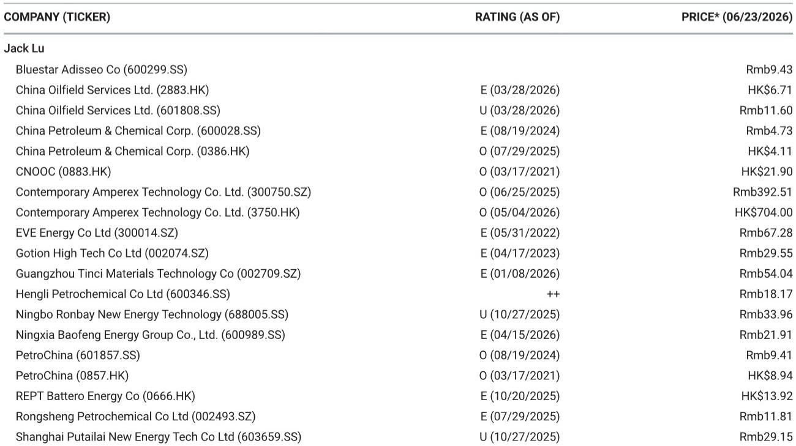
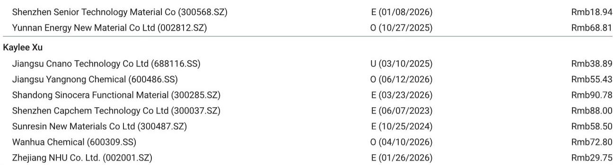
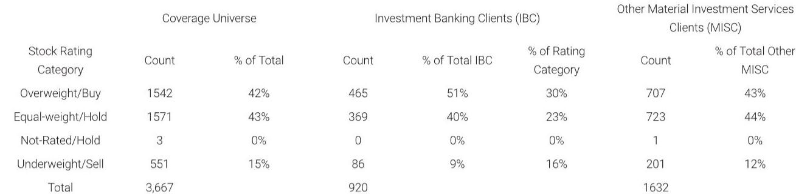

# 摩根斯坦利：MS：中国5月成品油需求暴跌，电动车不是“冲击”，是“替代完成”

中国5月的成品油消费数据，发出了一个比市场预期更清晰的信号。

MS最新发布的研报显示，中国5月隐含汽油和柴油需求同比分别下降12%和21%，总成品油消费同比下降13.5%。这个数字不是简单的“需求疲软”，而是结构性拐点的确认。报告明确指出，需求破坏的主要来源是公路运输和基建活动，而非航空或化工。

换句话说，中国石油需求的长期故事，正在从“增长放缓”切换为“存量替代”。

为什么这个判断比GDP增速或PMI数据更值得关注？因为成品油消费是经济活动最真实的“物理映射”——它不受库存周期、价格幻觉或统计口径的干扰。当汽油和柴油同时出现两位数下滑，且背后是电动车对燃油车的系统性替代时，投资者需要重新评估整个能源化工产业链的定价逻辑。

## 1. 柴油需求暴跌21%，基建和物流的“真实温度”比想象更低

柴油是经济活动的“毛细血管”——它关联着卡车运输、工程机械、矿山开采和农业机械。5月21%的同比降幅，是疫情以来最深的单月跌幅之一。MS将其归因于“基建和物流需求放缓”，但这背后可能还有更深层的结构变化。

传统上，柴油需求与固定资产投资高度相关。但这一次，数据似乎在说：即便基建投资名义增速没有大幅下滑，单位投资额的柴油消耗量正在下降。原因有二：一是新能源重卡和工程机械的渗透率在快速提升；二是物流行业的“集约化”趋势——更高效的路线规划和载具利用率降低了对柴油车的依赖。

> **KC评论：** 柴油21%的降幅不是“经济崩了”，而是“经济结构变了”。基建投资可能还在，但拉动的柴油消费正在被电动化和效率提升抵消。完整报告里对柴油库存和炼厂开工率的数据拆解，能帮你判断这是短期波动还是长期趋势。

## 2. 汽油需求下滑12%，电动车不再是“边际冲击”，而是“主力替代”

汽油需求的下滑更值得细读。12%的同比降幅，在历史上只有2020年初疫情封锁期间出现过。但这一次，没有封锁，没有大规模居家令。MS的判断是：高油价加速了消费者向电动车和公共交通的转移。

这个逻辑需要拆解两层。

第一层是“替代速度”。2023年中国新能源乘用车渗透率突破40%，2024年继续攀升。这意味着每新增100辆乘用车中，超过40辆是电动车。存量车中的燃油车替换速度也在加快——二手车市场燃油车价格持续承压，进一步降低了燃油车的持有意愿。

第二层是“行为锁定”。一旦消费者转向电动车，其加油行为几乎永久消失。这不是“今年少加一次油”的问题，而是“未来十年都不再加汽油”。因此，汽油需求的下滑不是线性的，而是带有“跳跃式”特征的——当渗透率突破某个临界点，替代速度会突然加速。

> **KC评论：** 汽油需求12%的降幅，本质上是“存量替代”而非“增量放缓”。报告中关于“高油价是否鼓励了消费者转向”的讨论，只是其中一个变量。更完整的分析需要看电动车保有量增速与汽油消费弹性系数的历史关系——这些在完整报告中有详细图表。

## 3. 航空燃油和石脑油仍坚挺，但“结构性安全”正在被侵蚀

在汽油和柴油全线溃败的背景下，航空燃油5月同比增长5%，石脑油消费基本持平。这似乎给成品油市场留下了一块“安全垫”。但MS的数据暗示，这个安全垫可能并不牢固。

航空燃油的韧性来自国内航空出行恢复和国际航线逐步放开。但问题是，航空燃油在中国成品油消费中的占比只有10%左右，无法对冲公路运输的下滑。更重要的是，航空领域的电动化虽然尚未大规模展开，但氢能和可持续航空燃料（SAF）的试点正在推进——长期看，航空燃油也不是“免疫区域”。

石脑油的需求持平，反映的是化工产业链的稳定。但石脑油的下游——乙烯、丙烯等基础化工品——正面临产能过剩的压力。如果化工品价格持续低迷，石脑油的需求也难以独善其身。

## 4. 炼厂库存高企，减产无法解决“需求消失”的问题

MS在报告中特别提到一个矛盾现象：尽管炼厂大幅削减开工率，成品油库存仍然处于高位。这说明需求下降的速度超过了供应调整的速度。

这个库存信号对投资者意味着什么？第一，炼厂的利润率将继续承压。即便原油价格保持稳定，成品油裂解价差可能持续走弱，因为“有货没人买”的局面短期内难以改变。第二，炼厂可能被迫进一步减产，这将影响上游原油加工量和相关化工品的供应。

> **KC评论：** 库存高企+需求下滑的组合，是炼化行业最危险的信号之一。完整报告中对“燃料库存和炼厂开工率”的图表，展示了从疫情以来库存是如何一步步累积的。这个趋势如果持续，可能触发更大规模的产能出清。

## 5. 报告没有完全回答的问题：替代速度何时“二阶加速”

MS这份报告的核心贡献，是指出了“替代正在加速”这个方向。但它没有完全回答一个关键问题：这个替代速度何时会“二阶加速”——即从现在的两位数降幅，进一步扩大到更高的水平。

这个问题的答案，取决于三个尚未验证的假设：

第一，电动车的成本下降速度是否快于燃油车的效率提升速度。如果电池成本继续下降，电动车的全生命周期成本优势将更加明显，替代速度会进一步加快。

第二，充电基础设施的瓶颈何时真正突破。目前充电桩的分布不均和充电时间仍然是制约因素。如果超充网络在2025-2026年大规模铺开，燃油车的最后一块“便利性优势”也将消失。

第三，政策是否会加速替代。碳达峰目标的推进、燃油车禁售时间表的明确化、以及可能的燃油税上调，都可能成为加速替代的“催化剂”。

这些变量，决定了成品油需求的下滑是“每年10%”还是“每年20%”。而这，直接关系到炼厂、油田服务和相关化工品的估值逻辑。

## 6. 投资者的观察框架：从“总量增长”切换到“结构替代”

基于以上分析，投资者需要重新构建对中国能源化工产业链的观察框架。核心是三个维度：

第一，供需关系的“量价分离”。过去，成品油需求增长带动炼厂开工率和利润同步上升。现在，需求总量在下降，但结构性的“优质需求”（如高端化工品、特种燃料）可能仍有增长。投资者需要区分“总量风险”和“结构机会”。

第二，替代速度的“临界点监控”。关注电动车渗透率、充电桩密度、燃油车保有量增速等指标。当这些指标突破某个阈值时，成品油需求的下滑速度可能非线性加速。

第三，产业链的“利润再分配”。成品油需求下滑，并不意味着整个能源化工行业没有机会。那些能够从“油”转向“化”的企业——即把原油加工成高附加值化工品而非燃料的公司——可能穿越周期。而那些高度依赖成品油销售的炼厂，则面临更大的挑战。

---

这份MS报告的数据清晰、逻辑严谨，但它只呈现了“现状”和“方向”。对于“替代速度的二阶导数”、“炼厂利润的底部在哪里”、“哪些化工品能对冲成品油下滑”等问题，报告并没有完全展开。

这些未解问题，恰恰是深度研究最有价值的部分。每天，我们的团队会结合AI agent和人工review，从MS、GS、JPM、UBS等国际投行的最新报告中，筛选出最具洞察力的内容，生成10-40页的中文摘要与KC评论，并整理当天最新数据图表合集。这些内容既方便你喂给AI做进一步分析，也方便你快速把握全球市场的动态变化。

欢迎加入我们的星球微信群，与上百位产业决策者和专业投资者一起，持续追踪这些关键变量的演变。我们每天更新，从不间断。

Personal reading notes and learning share only. Not investment advice.

