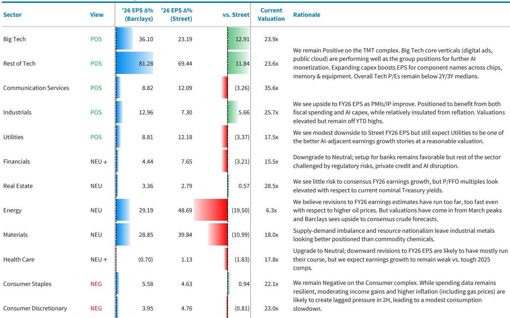
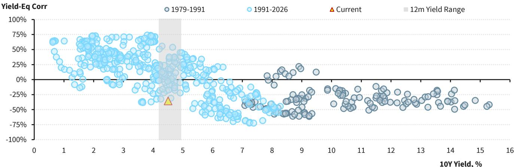

# BARC：标普500目标价7800，但真正支撑上涨的不是估值，是盈利

当市场还在为中东停火、油价回落、AI资本开支是否见顶而反复博弈时，BARC策略团队做出了一个看似矛盾的决定：**上调标普500目标价，却同时下调了估值假设。**

2026年底标普500目标价从7650上调至7800，2027年底目标价8800——这些数字本身并不惊人。真正值得关注的信号是，BARC将估值倍数从此前的约24倍下调至23.1倍，同时将2026年每股收益（EPS）预期从321美元大幅上调至337美元。

**这意味着什么？** BARC认为，推动美股继续上涨的发动机正在切换：从流动性驱动、估值扩张，转向盈利驱动、基本面支撑。如果这个判断成立，那么投资者需要重新审视自己的持仓结构——哪些公司真正有盈利可见性，哪些只是搭了估值泡沫的顺风车。

这份报告写于2026年6月19日，正值市场经历了一轮从地缘政治冲击到快速修复的完整周期。BARC的结论是：美股的牛市基础仍然完整，但支撑逻辑已经变了。

---

## 1. 这轮上涨的底层逻辑，正在从“估值讲故事”转向“盈利证明自己”

2026年上半年的美股走势，像一部浓缩的风险教育片。年初市场已经定价了大量好消息：全球宏观企稳、AI资本开支成为不可否认的顺风、市场领导力从超大型科技股向周期股和小盘股扩散。但高估值意味着容错空间极窄。

2月，软件行业被AI颠覆的担忧引发抛售，跌幅抹去了该板块自2022年以来相对于标普500的全部超额收益。随后，对高杠杆软件公司的担忧蔓延至私募信贷市场，进而引发对长久期成长资产的全面重估。紧接着，中东战争爆发，石油价格飙升，市场开始担忧滞胀。

BARC的策略是“看穿噪音”。当停火协议传出后，投资者迅速回归那些盈利可见性最强的板块——大科技、成长股和动量股重新领涨。2026年一季度财报季表现强劲，科技板块EPS增速创下2010年以来最佳水平，全年盈利预期上修速度创历史纪录。

**但关键转折点在于：** BARC认为，随着美联储降息路径收窄、市场仓位已不再能轻易吸收负面冲击，盈利和AI资本开支的可见性必须承担更多“支撑市场”的任务。换言之，过去两年靠“美联储会救市”的信仰推高的估值，现在需要真实盈利来兑现。

> **KC评论：** BARC的潜台词很明确——别再指望美联储给你送钱了。利率环境正在从“宽松预期”转向“高利率常态化”，这意味着估值扩张的红利基本耗尽。接下来市场会非常挑剔：只有那些能用盈利增长证明自己配得上当前估值的公司，才能继续获得资金青睐。完整报告里有一张关键的“收益率与股权相关性”图表，显示两者关系已转为显著负相关，这意味着利率上行对估值的压制正在加速——这张图值得仔细看。

---

## 2. 盈利上修的三个支柱：科技、再通胀、工业，但消费是最大拖累

BARC将2026年标普500 EPS预期从321美元上调至337美元，略低于市场共识的341美元，隐含同比增长约21%。这个上修幅度不小，但更值得关注的是上修的结构——它揭示了盈利增长正在从哪些行业来，又将从哪些行业走。

**第一个支柱：科技。** 2026年一季度财报季的强劲表现，证实了大科技和TMT板块仍在将AI相关需求转化为盈利超预期。全年盈利上修速度远超10年均值。半导体和设备板块的2026年EPS增长预期从年初的66%飙升至127%，科技硬件从14%升至39%。软件板块则从18%降至13%，反映了AI颠覆的负面影响。

**第二个支柱：再通胀。** 2026年全年温和的通胀压力将支撑名义收入增长，尤其有利于那些有经营杠杆或商品敞口的行业。

**第三个支柱：工业。** 工业活动数据持续向好：工业生产上升、ISM制造业PMI终于回到扩张区间、耐用品订单和产出均显示强劲动能。BARC经济学家预测，2027年工业生产背景将进一步改善。

**但消费是明显的拖累。** 支出数据已经降温，在通胀持续的环境下，实际购买力增长有限。BARC预计消费疲软将部分抵消上述三个支柱带来的盈利上修。

> **KC评论：** BARC的EPS框架有一个核心假设——科技板块能够持续交出正面的盈利惊喜，即便共识预期已经处于历史高位。这个假设并非没有争议，尤其是在AI投资周期所处阶段的讨论中。完整报告里有一张“供给-需求缺口将持续到2027年”的图表，来自BARC的半导体分析师团队，这是支撑该假设的关键论据。对于想深入研究AI周期位置的读者，这张图是必读的。

---

## 3. BARC对2027年的初步判断：盈利增速放缓，但并非衰退

BARC首次给出了2027年标普500 EPS预期：389美元，同比增长约15%，低于市场共识的398美元。这个数字隐含的判断是：2027年盈利增速将自然放缓，但不会出现断崖式下跌。

框架假设：消费在同比基础上部分复苏，工业活动继续走强（因为之前紧缩政策的滞后效应消退），但名义定价能力正常化（尤其是当去通胀力量扩大时）。乐观和悲观情景分别为397美元和380美元。

**这意味着什么？** BARC认为，2027年市场将面临一个“盈利增速放缓但仍有正增长”的环境。对于股市而言，这通常意味着估值承压，但盈利仍能提供底部支撑。关键在于，哪些行业能在增速放缓的环境中保持相对优势。

---

## 4. 板块轮动信号：金融和医疗从“看好”降级为“中性”，消费仍被看空

BARC的板块调整是这份报告中最具操作意义的信号之一。

**金融板块从“看好”降级为“中性”。** 理由很直接：之前看多金融的逻辑——银行驱动的盈利上修——没有兑现。私募信贷担忧、支付领域的监管风险、以及AI颠覆的威胁，共同抵消了银行的正面盈利修正。BARC坦承“看多金融的论点没有走通”。

**医疗板块同样降级为“中性”。** 理由与金融不同：BARC认为医疗板块的下行盈利修正已经基本走完，风险回报比变得更为平衡。换句话说，医疗不再是“避开”的板块，但也不是“买入”的板块。

**其他板块观点不变：** 看好TMT、工业和公用事业，看空消费。

这个板块矩阵传递了一个清晰的信号：BARC正在从“全面看多周期”转向“有选择性看多”。金融的降级尤其值得注意——如果连银行这类典型的周期股都无法在当前的宏观环境下兑现盈利增长，那么市场的周期交易可能比表面看起来更脆弱。

---

## 5. 报告没有完全回答的关键问题：AI资本开支的“资金来源”正在成为新的风险

BARC在报告末尾列出了下半年需要关注的三大风险：AI投资周期的压力迹象，包括模型进展、电力可用性，以及**资金问题**——尤其是随着融资结构变得更加复杂。

这个问题在报告的图表中得到了直观呈现。BARC的互联网和半导体研究团队指出，到2028年，超大规模云服务商的资本开支总额将超过1.1万亿美元，比市场共识高出约26%。与此同时，运营现金流压力正在加剧，且这种压力尚未被计入共识预期。

**简单翻译：** 科技巨头们正在以远超内部现金流的规模投资AI基础设施。如果融资环境收紧，或者投资者对回报周期的耐心耗尽，这种“借钱投资”的模式可能面临压力测试。

BARC在2025年9月曾提出过一组“如果……会怎样”的问题：如果模型进步放缓？如果电力供应不足？如果融资变得困难？这些问题至今没有答案，但正在从“假设”变为“需要密切关注的风险”。

**这正是报告没有完全回答的关键问题。** BARC给出了盈利上修的逻辑，也承认了AI资本开支的规模在膨胀，但没有深入分析：如果融资条件收紧，AI资本开支的可持续性如何？如果腾讯、阿里等中国科技巨头也加入资本开支竞赛，全球AI投资的回报率会如何变化？这些问题，需要投资者自己去跟踪和判断。

---

## 6. 给你的观察框架：三个维度判断当前市场的位置

基于BARC这份报告的框架，我们提炼出三个核心观察维度，供读者在接下来的几个月里持续跟踪：

**维度一：盈利上修的速度是否可持续。** 当前盈利上修的速度远超历史均值。如果未来几个季度盈利上修开始放缓，甚至转为下修，那么当前的市场估值将面临压力。重点跟踪科技板块的盈利指引和资本开支计划。

**维度二：利率与股市的关系是否进一步恶化。** BARC指出，利率与股市的相关性已转为显著负相关。这意味着利率上行不再被视为“经济好转”的信号，而是“估值压制”的信号。如果10年期美债收益率突破关键水平，股市的调整可能比预期更深。

**维度三：AI资本开支的“融资结构”是否出现裂痕。** 这是BARC报告中提及但未深入展开的风险。如果超大规模云服务商的融资成本上升，或者投资者开始质疑AI投资的回报周期，那么整个AI主题的叙事可能面临修正。

---

文末的思考题：如果AI资本开支的融资条件收紧，哪些公司最脆弱？哪些公司反而可能受益于“资本纪律”的回归？这些问题的答案，可能决定了未来12个月的投资胜负。

每天，我们的AI agent配合人工review，从国际投行最新研报中提取核心观点和关键图表，整理成约10-40页的中文摘要合集，既方便喂给AI做进一步分析，也方便人工快速把握全球市场的动态变化。如果你对BARC这份完整的研报原文、关键图表数据、或我们对AI资本开支资金来源的进一步拆解感兴趣，欢迎来我们的星球微信群里继续讨论——那里有更完整的原始素材和更及时的跟踪。

Personal reading notes and learning share only. Not investment advice.

