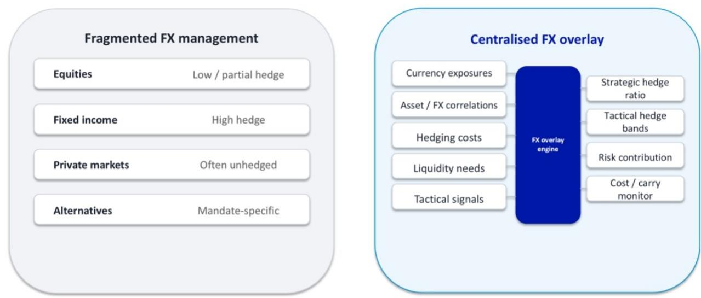

# Currency Risk Is No Longer a Silos Problem: Why Institutional Investors Must Centralise FX Management Now

The most overlooked source of portfolio inefficiency is not asset allocation, manager selection, or factor timing. It is currency risk management that remains fragmented, passive, and treated as an afterthought. After extensive client conversations and a deep analytical review of total portfolio approaches, the conclusion is clear: institutions that continue managing FX exposures in isolated asset-class silos are leaving measurable risk-adjusted returns on the table. The question is no longer whether a holistic currency framework makes theoretical sense, but how to implement it within the real-world constraints of governance structures, benchmark mandates, and liquidity requirements.

This matters now because the macroeconomic environment is shifting. Currency volatility is rising, correlation patterns between asset classes are breaking down, and the cost of inaction is becoming visible in portfolio-level drawdowns. The Dutch pension reforms, for example, are forcing funds to re-evaluate their FX stance. But the underlying issue is universal: choosing not to hedge is itself a risk decision, and making that decision passively or inconsistently across asset classes is a recipe for unintended exposures.

What emerged from our analysis and client dialogues is not a single solution, but a decision framework. The challenge is that currency risk management sits at the intersection of governance, portfolio construction, and operational execution. Getting it right requires a fundamental shift in how institutions think about FX: not as a peripheral concern, but as a central lever for portfolio efficiency.

## The Default Approach of Not Hedging Is an Active Bet That Most Institutions Do Not Intend to Take

The most common approach to currency risk is also the most dangerous: treating it as a default setting rather than a deliberate choice. Many funds simply leave their FX exposures unhedged because it requires no action, no system changes, and no governance debate. But this is not a neutral position. It is an active bet that currency movements will not materially harm portfolio outcomes, a bet that is rarely stress-tested or explicitly debated at the investment committee level.

The data from our research shows a stark asymmetry. Bond exposures are typically hedged more consistently than equities, not because of a principled risk management framework, but because of convention and because bond portfolios are more sensitive to currency moves in the short term. This piecemeal approach creates an inconsistent risk profile across the total fund. An equity portfolio tracking the MSCI World, which is unhedged, may be taking significant currency bets that the institution never intended to hold. Meanwhile, the bond portfolio hedges those same currency exposures, effectively creating a fragmented and potentially offsetting set of positions.

The implication is straightforward: institutions need to define a single, fund-wide currency risk policy that applies across all asset classes. This does not mean mechanically hedging everything. It means making an explicit decision about which exposures to hedge, by how much, and under what conditions. The default should be a conscious choice, not a legacy of inaction.

## Defining the Objective of Currency Management Is the Single Most Consequential Decision a Fund Can Make

Before any hedging program can be designed, the institution must answer a fundamental question that most funds avoid: is the goal of currency management to add returns, or to manage risk? This is not a theoretical debate. It determines every subsequent decision about instrument selection, hedge ratios, and performance measurement.

Our framework takes a clear position: currency hedging programs should aim to manage the stability and risk of the portfolio while preserving returns. The primary objective is risk reduction, not return generation. This distinction matters because treating FX as a return-seeking asset class leads to different strategies, different instruments, and different risk tolerances. It also creates confusion when evaluating performance. A hedging program that reduces portfolio volatility may appear to "lose money" during periods when the unhedged currency exposure would have generated gains, but that is a misunderstanding of the program's purpose.

The consensus emerging from our client conversations is that institutions should seek returns from their core asset allocation decisions, not from currency management. FX should be viewed through the lens of operational efficiency and risk control. This is not to say that currency cannot generate returns in certain circumstances, but that should be a separate, explicit overlay strategy, not an implicit feature of a hedging program. The discipline of separating these objectives is what allows for a clean evaluation of whether the hedging program is achieving its intended purpose.

## Benchmark-Aware Funds Can Still Capture Efficiency Gains Without Straying Far from Their Mandates

One of the most persistent objections to active currency management is the constraint of benchmark mandates. Many funds are measured against market indices that are unhedged, such as the MSCI World for equity portfolios, or against peer performance. The fear is that any deviation from the benchmark's currency exposure will create tracking error that must be explained to trustees, consultants, or stakeholders.

This constraint is real, but it is not a barrier to improvement. Our framework explicitly incorporates benchmark awareness into the hedging design. The key insight is that efficiency gains do not require abandoning the benchmark. They can be achieved by making marginal adjustments that improve the risk-return profile while keeping tracking error within acceptable bounds.

For example, a fund that is mandated to track an unhedged index can still implement a partial hedging program that reduces the most extreme tail risks without significantly altering the portfolio's currency exposure in normal market conditions. The hedge ratio can be calibrated to the fund's specific risk tolerance, not to a theoretical optimum. The result is a program that is both defensible to stakeholders and materially more efficient than a static 100% hedged or 100% unhedged position.

The practical implication is that funds should not view benchmark constraints as a reason to do nothing. Instead, they should use those constraints as guardrails within which to optimise. The conversation shifts from "can we deviate from the benchmark" to "how much deviation is acceptable, and how do we use that deviation most effectively."

## Forwards Remain the Workhorse, but Options Are Becoming Indispensable for Cost Efficiency and Flexibility

The instrument choice for hedging is often treated as a technical detail, but it has profound implications for portfolio outcomes. Forwards have long been the default tool for managing currency risk, and they remain the primary instrument for most programs. Their advantages are well understood: simplicity, liquidity, and the ability to lock in a known exchange rate for a specific future date.

However, our analysis reveals that options are becoming increasingly attractive as a secondary instrument, and for good reason. The embedded cost efficiencies of options can be significant, particularly for funds that must maintain a fully hedged currency exposure. In a forward-only program, maintaining a constant hedge ratio requires continuous rolling of contracts, which can be expensive and operationally burdensome. Options introduce flexibility: they allow the fund to define a range of acceptable outcomes rather than a single point, reducing the cost of hedging while still providing protection against adverse moves.

The strategic implication is that funds should think of hedging instruments as a toolkit, not a single solution. Forwards provide precision and certainty. Options provide flexibility and cost efficiency. The optimal program typically uses both, with the mix determined by the fund's specific objectives, cash flow patterns, and risk tolerance. The decision is not binary; it is a continuum that should be actively managed.

## The Unresolved Frontier: How to Measure and Hedge Indirect Currency Exposure in a Portfolio

For all the progress in currency risk management, one question remains stubbornly unresolved: how do you measure and manage the currency exposure that is embedded in the underlying holdings themselves? This is not a niche concern. A fund that owns a US stock whose business is materially exposed to the Japanese yen has an indirect yen exposure that is not captured by simply looking at the stock's currency of denomination.

This hidden exposure can be significant. Consider a global equity portfolio that includes a European luxury goods company with substantial revenue in Chinese renminbi, or a US technology firm with manufacturing operations in Taiwan. The fund's true currency risk is a combination of the direct exposure from the stock's listing currency and the indirect exposure from the company's underlying business. Ignoring the indirect component means the fund's hedging program is incomplete.

Our research identifies this as an area where current practice is far behind theory. There is no simple, standardised way to measure indirect currency exposure. One approach is to review company annual and quarterly reports to estimate those exposures, but this is labour-intensive and inconsistent across companies and sectors. Another approach is to use factor models that decompose equity returns into currency and other risk factors, but these models have their own limitations and assumptions.

This is the frontier. Institutions that can develop a reliable method for measuring and hedging indirect currency exposure will have a significant advantage over those that cannot. The question remains open, and it is one of the most important areas for future research and practical innovation.

## A Decision Framework for Implementing a Fund-Wide Currency Hedging Program

Based on our analysis and client discussions, we have developed a structured decision framework that institutions can use to design and implement a holistic currency risk management program. The framework is built around five sequential questions:

First, what is the fund's risk tolerance for currency exposure? This is not a technical question; it is a governance question that must be answered by the investment committee. The answer determines the target hedge ratio and the acceptable range of deviation.

Second, what are the benchmark constraints? If the fund is measured against an unhedged index, the hedging program must be designed to stay within acceptable tracking error limits while still improving efficiency.

Third, what is the appropriate instrument mix? This depends on the fund's cash flow patterns, the cost of hedging, and the desired flexibility. Forwards and options should be evaluated as complements, not substitutes.

Fourth, how will the program handle private markets? Currency management is more difficult in private markets because the timing and size of cash flows are uncertain. The emerging approach is to model expected distributions under different scenarios and design hedging strategies that balance risk reduction against carry costs.

Fifth, how will the program manage liquidity and margin requirements? Hedging with forwards creates margin call risk, especially when the hedged currency strengthens. The program must include a liquidity buffer and a plan for managing margin calls without disrupting the rest of the portfolio.

This framework is not a one-size-fits-all solution. It is a structured way of thinking that forces institutions to make explicit choices rather than defaulting to passive inaction. The institutions that adopt this framework will be better positioned to navigate the increasingly volatile currency environment ahead.

Join the community to read the full report and review the original charts.

*This article is for learning and discussion only and does not constitute investment advice.*

Personal reading notes and learning share only. Not investment advice.

