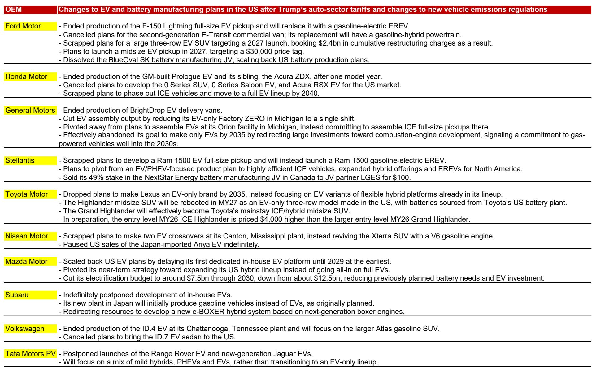
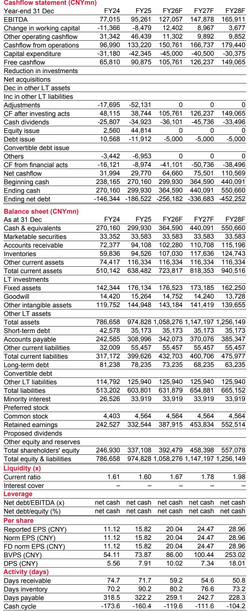
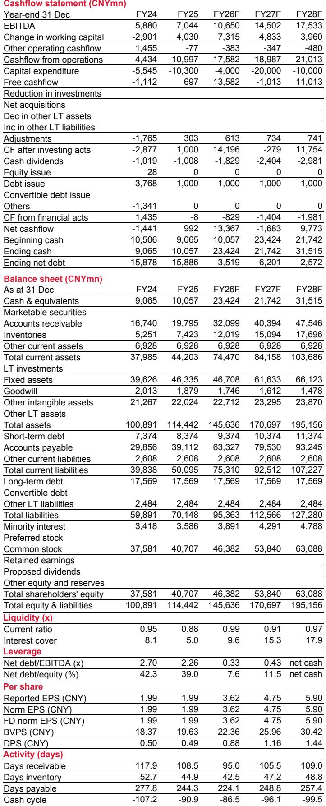

# NOM：电池行业已进入“三国分治”阶段，机器人电池是下一个价值高地

全球电池产业正在经历一场静悄悄但极其深刻的分化。当多数市场参与者还在用“产能过剩”和“价格战”来概括行业现状时，NOM最新发布的全球电池深度报告给出了一个截然不同的判断：行业已经不再是单一维度的竞争，中国、韩国、日本三大电池阵营正在走向完全不同的战略路径，而机器人电池——这个目前仅占极小份额的细分市场——可能成为未来几年最被低估的价值增长点。

这份报告的核心洞察并不复杂，但其含义却值得每一位关注先进制造和能源转型的决策者深思：全球电池需求仍在增长，但增长的结构正在发生质变。储能系统（ESS）电池将以17%的年复合增速成为增长最快的板块，到2030年达到926GWh；而电动汽车电池的增速将放缓至11%。更重要的是，中国企业凭借LFP电池和一体化供应链，已经拿下了全球78%的电动汽车电池和80%的储能电池市场份额。韩国和日本企业不再试图在规模上与中国正面竞争，而是分别转向了“高价值+本地化”和“AI数据中心”两个截然不同的赛道。

## 1. 中国电池的统治力比大多数人想象的要深，而且还在加固

NOM报告中最引人注目的数字，是中国电池企业在全球市场的份额。2026年，中国在全球电动汽车电池和储能电池市场的份额预计分别达到78%和80%。这个数字之所以惊人，不仅在于其绝对高度，更在于它是在美国和欧洲持续加征关税、设置本地化壁垒的背景下实现的。

中国电池的统治力根植于LFP（磷酸铁锂）化学体系的全面胜利。目前LFP已经占全球电池市场的61%，而中国几乎完全掌控了这条供应链。从锂资源加工到正极材料、隔膜、电解液，中国企业在每一个环节都拥有规模优势和成本优势。NOM报告指出，即使在海外市场，中国电池厂商凭借成本领先和供应链整合能力，依然占据了58%的份额。

> **KC评论：** 这意味着，对于全球车企和储能项目开发商而言，试图完全“去中国化”的电池供应链策略，在短期内不仅成本高昂，而且可能面临技术和交付能力的巨大缺口。中国电池的统治力不是政策补贴的产物，而是十年持续投入形成的系统级优势。完整报告中有详细的成本对比图表和各国LFP产能地图，这些数据会进一步说明为什么“替代中国电池”是一个比多数人想象中更困难的工程问题。

值得注意的是，NOM认为中国在下一代电池技术上依然保持领先。钠离子电池预计到2030年将占据储能电池需求的15-20%，而中国同样掌控着钠离子电池的供应链。半固态电池可能在未来两年内率先在中国实现商业化。这些技术进展将进一步巩固中国电池企业的护城河。

## 2. 韩国电池的突围路径：放弃规模竞争，押注高价值壁垒

韩国电池企业的战略转型，是这份报告中最值得关注的竞争格局变化之一。面对中国在规模上的绝对优势，韩国企业不再试图在成本上正面竞争，而是系统性地向两个高壁垒领域转移：高端电动汽车电池和美国储能市场。

在高端电动汽车领域，韩国企业保留了竞争优势。高镍化学体系（NCM/NCA）在长续航车型中仍有不可替代性，特斯拉青睐的4680圆柱电池也是韩国企业的强项。硅负极技术同样是韩国企业重点布局的方向。但真正形成壁垒的是美国和欧洲的本地化要求——关税壁垒和本地化生产要求正在为韩国企业创造出一个“有保护溢价”的市场空间。

NOM报告特别指出，韩国电池企业在美国储能市场的渗透正在加速。美国AI数据中心电力需求、可再生能源并网和电网现代化正在推动储能需求快速增长，预计到2030年美国储能电池需求将达到194GWh。在这个市场中，中国电池受到关税和地缘政治因素的制约，韩国企业因此获得了显著的定价权和增长空间。

> **KC评论：** 韩国电池企业的故事，本质上是一个“从追求规模转向追求定价权”的战略案例。对于投资者而言，关键问题在于：美国储能市场的本地化溢价能持续多久？如果中美贸易关系缓和，韩国企业的护城河是否会被削弱？完整报告中对韩国三大电池企业的产能规划和美国项目储备有详细拆解，这些信息对于判断韩国电池企业的估值逻辑至关重要。

## 3. 日本的另类选择：不做电池，做AI数据中心的基础设施

日本电池企业的战略定位可能是这三家中最反直觉的。当全球都在讨论电动汽车和储能时，日本选择了聚焦AI数据中心（AIDC）的备用电源市场。NOM报告显示，日本最大的电池制造商松下（Panasonic）已经将其电池业务的重心转向了AIDC服务器机柜中的BBU（电池备份单元）和精密储能系统。

这个市场的规模目前还很小，但增长极快。NOM估计，松下在全球AIDC BBU市场中占据了60-70%的份额，并且设定了到2029财年实现1万亿日元收入的目标，同时要求整个电池业务的ROIC达到20%。这个数字对于习惯了电池行业“薄利多销”思维的观察者来说，是一个令人意外的信号。

日本企业的选择背后有一个核心逻辑：在AI数据中心这个场景中，电池的性能要求远高于电动汽车和普通储能。高功率密度、高倍率放电能力、轻量化设计和先进的热管理，这些技术参数恰恰是日本企业在材料科学和精密制造领域的传统优势。在这个细分市场中，价格不是首要竞争维度，可靠性和性能才是。

## 4. 机器人电池：被忽视的高价值蓝海，单价是电动汽车电池的三倍

NOM报告中最具前瞻性的判断，可能来自对机器人电池市场的分析。人形机器人的商业化正在加速，而机器人对电池的需求与电动汽车完全不同。机器人电池需要更高的功率密度、更高的C-rate（充放电倍率）能力、更轻的重量和更先进的热管理系统。这些要求使得机器人电池的单价达到电动汽车电池的三倍。

NOM估计，到2030年，机器人电池的市场规模可能达到20-40亿美元。这个数字在电池行业总需求面前显得不大，但考虑到其高利润率和技术壁垒，它可能成为电池企业利润增长的重要来源。早期的人形机器人可能更倾向于高镍化学体系，但随着LFP性能的提升和电池更换架构的普及，中国企业有望在这个领域逐步获得可观的份额。

> **KC评论：** 机器人电池这个细分市场，目前大多数投资者还没有给予足够的关注。它的市场规模虽然远小于电动汽车和储能，但利润率可能高出数倍。对于电池企业而言，这不仅是收入增量，更是技术和品牌溢价的证明。完整报告中有人形机器人电池的技术路线对比图和2030年市场规模敏感性分析，这些内容对于理解这个新兴市场的投资价值至关重要。加入社群后可以获取这些图表和NOM分析师的详细推演。

## 5. 电池金属市场正在从过剩走向平衡，锂价可能温和反弹

对于关注上游资源的读者，NOM报告给出了一个与市场主流预期略有不同的判断：锂、镍、钴市场正在从供应过剩转向更加平衡的状态。锂价可能在2026-2027年温和回升至每吨2.2万-2.46万美元（2025年为每吨9700美元）。推动这一判断的因素包括：CATL的枧下窝矿等大型项目延期、津巴布韦的出口限制，以及Greenbushes矿下调产量指引。

镍和钴的价格也可能受到供应端收紧的支撑，主要来自印度尼西亚和刚果（金）的生产控制。但报告也提醒，澳大利亚部分矿山的复产可能部分抵消供应收紧的影响。

这个判断对于电池企业和下游应用企业都有直接含义。如果锂价确实温和回升，电池成本下降的速度可能放缓，这对于电动汽车的价格竞争力和储能项目的经济性都会产生影响。

## 报告尚未完全回答的关键问题：三国的“分治”边界在哪里？

NOM报告清晰地描绘了中国、韩国、日本三国电池企业的差异化战略，但报告中有一个值得追问的问题没有得到充分展开：这三条战略路径的边界在哪里？它们会在哪些领域重新产生竞争？

最明显的潜在交叉点是美国储能市场。韩国企业正在通过本地化布局抢占这个市场，但中国企业在LFP和钠离子电池上的成本优势是结构性的。如果美国政策环境发生变化，或者中国企业通过技术授权和海外建厂的方式绕过关税壁垒，韩国企业的溢价空间可能被压缩。

另一个未解问题是机器人电池。报告指出早期人形机器人可能更倾向于高镍化学体系，但LFP性能的提升和电池更换架构的普及可能让中国企业在2030年后获得显著份额。这个时间点的判断，对于投资机器人电池产业链的节奏至关重要。

这些问题的答案，需要更细致的竞争格局拆解和更长期的供需模型推演。NOM的完整报告提供了详尽的产能地图、技术路线对比和财务模型，这些是判断三国电池企业未来竞争态势的基础。

---

每天，我们的团队会通过AI agent结合人工review，从NOM、GS、MS等国际投行的最新研报中提取核心判断和关键数据，生成约10-40页的中文摘要与KC评论，并整理当天最新的数据图表合集。这些内容既方便喂给AI做进一步分析，也方便人工快速把握全球市场动态。如果你对这些未解问题感兴趣，欢迎加入我们的社群，在微信群里继续讨论。

Personal reading notes and learning share only. Not investment advice.

