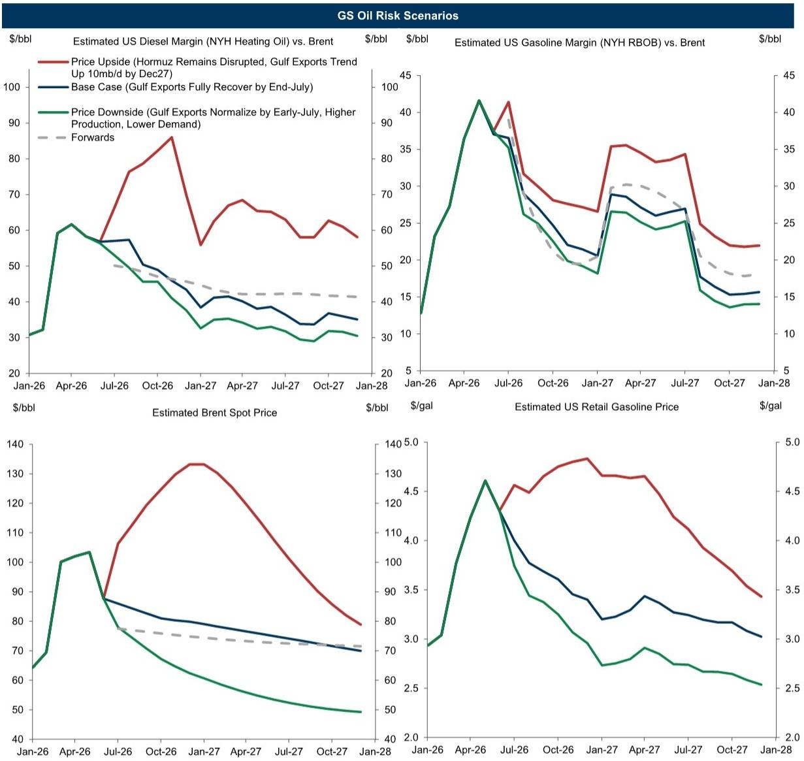
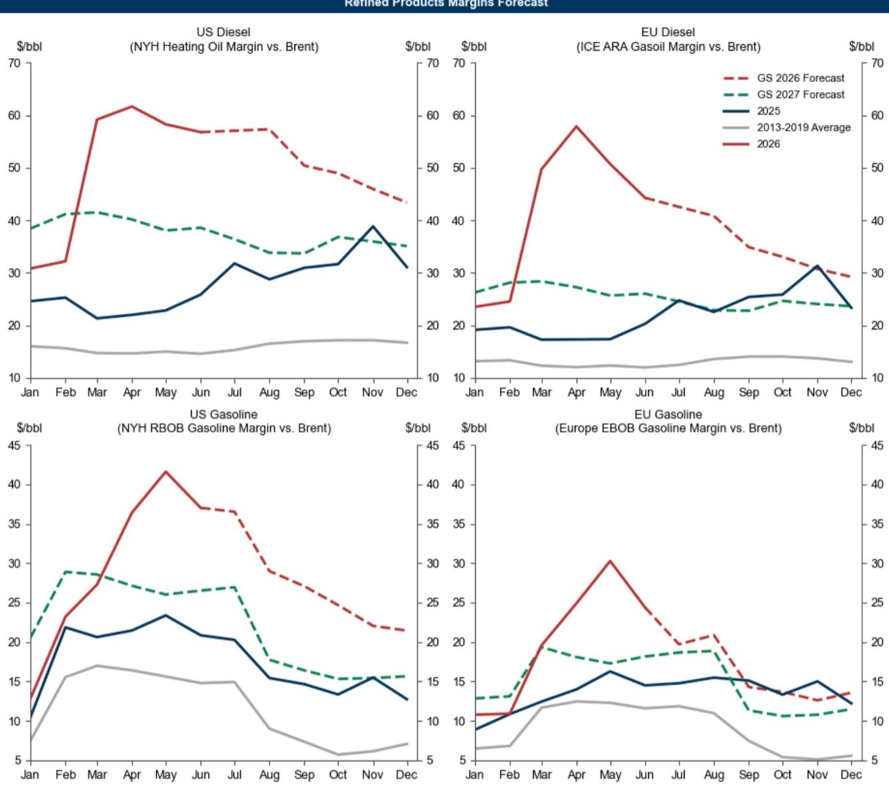
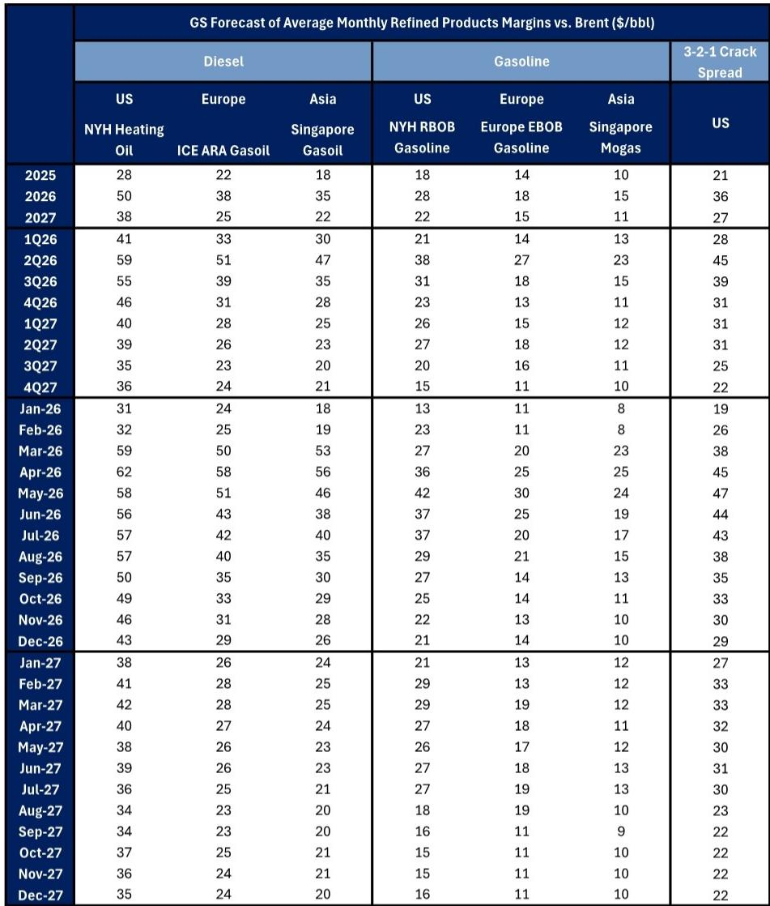

# Refined Product Margins Will Stay Elevated Longer Than Crude Prices, and the Downside Is Smaller Than Markets Expect

The global oil market has absorbed a shock that would normally signal the end of a margin cycle. Crude prices fell by more than $10 per barrel following the US-Iran interim peace deal announcement, and the immediate assumption among many traders was that refined product margins would follow crude into a sharp decline. That assumption is wrong. While crude prices have corrected meaningfully, refined product margins have fallen far less, and our global refined product margins index remains at roughly double its pre-war level. This is not a temporary lag. It is a structural divergence that will persist through at least 2027, and it creates a strategic opportunity for those who understand the asymmetry.

The central argument of this analysis is straightforward: refined product margins face a smaller downside risk than crude prices, and they will remain above 2025 levels even as geopolitical tensions ease. The reasons are not speculative. They are grounded in three measurable realities: persistently low product stocks, a stretched global refining system that will take years to rebalance, and a demand recovery that is more resilient than the market prices in. For investors, operators, and strategists, the question is not whether margins will decline from their peak. They will. The question is whether the market is correctly pricing the floor beneath them. It is not.

What follows is a structured examination of why product margins will hold, where the risks are asymmetric, and how to position for a market that is mispricing both the timing and the magnitude of the normalization.

## The Stock Deficit Is Not a Seasonal Blip; It Is a Structural Constraint That Will Take 18 Months to Resolve

The most immediate reason for elevated margins is not refinery outages or geopolitical risk. It is inventory. Both gasoline and diesel stocks in the United States remain below their 2022-2026 seasonal range. This is not a normal seasonal drawdown. It is the result of a multi-month production tilt by refineries that prioritized middle distillates--diesel and jet fuel--at the expense of gasoline, driven by the margin signals that followed the Hormuz disruption. The consequence is a gasoline stock deficit that is particularly acute, and it will not be resolved quickly.

The report projects that diesel stocks will continue to edge down for the next month, and gasoline stocks for the next four months, before a gradual recovery that does not return to 2025 seasonal levels until the second half of 2027. That is a long horizon. For context, the market typically prices stock normalization within a quarter or two. The data suggests a much slower process. The reason is not just the depth of the deficit, but the constrained ability of the refining system to rebuild stocks quickly. Refinery utilization is already high, and the capacity to surge production is limited by ongoing outages and structural bottlenecks.

The so-what is clear: as long as stocks remain below seasonal norms, product margins will have a floor that crude prices do not. Crude can fall on geopolitical easing alone. Product margins require actual physical barrels to be delivered into storage, and those barrels are not coming fast enough. This is the fundamental asymmetry that the market is underpricing.

## The Hormuz Reopening Is Priced into Crude, but the Refinery Outages Are Not Priced into Products

The ceasefire announcement triggered a rapid repricing of crude, but the impact on refined products has been more muted and more complex. The report notes that while Persian Gulf refinery outages decreased by roughly half since the announcement, approximately 1.3 million barrels per day of unplanned refining capacity remains offline in the region. These are not quick fixes. Many of these outages involve damage that will take several months to repair, and the restart process itself can create additional operational risks.

This creates a critical distinction. Crude supply can normalize relatively quickly if the Strait of Hormuz reopens and tanker flows resume. But product supply depends on refineries that are physically damaged, not just geopolitically constrained. Even if crude flows freely, the product that would have been processed in the Gulf must now be produced elsewhere, and the global refining system is already operating near capacity. The report's base case assumes Persian Gulf exports normalize by end-July, but it also acknowledges that the remaining outages will persist well beyond that date.

The implication is that the product market is subject to a slower and more uncertain normalization path than the crude market. This is not a forecast of perpetual shortage, but it is a forecast of extended tightness. And because the market tends to price product margins in line with crude movements, there is a systematic bias toward overestimating the speed of margin normalization. Investors who recognize this lag can capture a risk premium that is not reflected in forward curves.

## Structural Tailwinds from Delayed Refinery Additions and Ongoing Attacks Will Keep Utilization Rates Near All-Time Highs Through 2027

The report identifies two structural factors that are often overlooked in short-term margin analysis: extended delays in China and India refining capacity additions, and continuing attacks on Russian refineries. These are not temporary disruptions. They represent a multi-year constraint on global refining capacity that will keep utilization rates near all-time highs through 2027.

The capacity delays in Asia are particularly significant. New refineries in China and India have been pushed back repeatedly, and the report suggests that these delays are likely to extend further. At the same time, Russian refinery outages from drone and missile attacks have become a persistent feature of the market, not a one-time event. The combination means that even as demand growth moderates, the supply side of the refining equation remains constrained.

The report's forecast for 2027 margins reflects this structural support. Average US diesel margins are projected at $38 per barrel, and European diesel margins at $25 per barrel. Both are well above 2025 levels. Gasoline margins are forecast at $22 and $15 per barrel respectively. These are not peak-cycle numbers, but they are clearly above mid-cycle levels, and they imply that the refining industry will enjoy a period of above-normal profitability that extends well beyond the current geopolitical episode.

For strategic planners, this is the key takeaway: the margin cycle is not ending with the Hormuz reopening. It is transitioning from a crisis-driven spike to a structurally supported plateau. The plateau is lower than the peak, but it is higher than the pre-crisis trend, and it will last longer than most market participants expect.

## The Risk Asymmetry Favors Product Margins Over Crude, and the Upside Is Larger Than the Downside

The report provides a scenario analysis that is worth examining in detail, because it reveals the asymmetry that defines the current market. In the downside scenario, which assumes Gulf exports normalize by early July, crude production beats expectations, and demand losses prove stickier than expected, US diesel margins average 14 percent below the 2027 base case, while Brent crude falls by 28 percent. In dollar terms, that is a $5 per barrel downside for diesel versus a $21 per barrel downside for Brent.

The upside scenario is even more striking. If Hormuz remains disrupted through 2027 and Gulf crude exports recover only gradually, 2027 average US diesel margins could exceed the base case by 66 percent, or $25 per barrel, while Brent crude would be 41 percent above base case, or $30 per barrel. The absolute dollar upside is similar, but the percentage upside for diesel is significantly larger.

The reason for this asymmetry is rooted in the product composition of Hormuz flows. A disruption to the Strait hits middle distillates disproportionately, because a larger share of the products moving through the strait are diesel and jet fuel. That means the supply impact on diesel is more severe than on crude itself. Conversely, in a downside scenario, the product market benefits from the structural supports discussed earlier--low stocks, delayed capacity, and ongoing outages--that provide a floor that crude does not have.

For risk managers, this asymmetry is actionable. It suggests that hedging strategies should be calibrated differently for crude and products. The downside protection needed for a crude position is larger than for a product position, and the upside potential for products in a disruption scenario is higher relative to the base case. This is not a call to take a directional bet. It is a call to recognize that the risk distribution is not symmetric, and that standard approaches to hedging may underweight the product side of the equation.

## What the Report Does Not Fully Answer: The Demand Scarring Question and the Policy Feedback Loop

No analysis is complete, and this report leaves two important questions open. The first is the durability of demand scarring. The report assumes moderate demand scarring in 2027, but it does not fully explore the mechanisms that could make that scarring more or less severe. If high prices and geopolitical uncertainty lead to permanent shifts in consumer behavior or industrial fuel switching, the demand recovery could be weaker than projected. Conversely, if the global economy rebounds more strongly than expected, demand could surprise to the upside. The report's base case is reasonable, but the range of outcomes is wider than the scenario analysis captures.

The second open question is the policy feedback loop. Governments in major consuming regions have shown an increasing willingness to intervene in fuel markets, whether through price caps, strategic releases, or subsidies. If margins remain elevated for an extended period, the probability of policy intervention rises. The report does not model this explicitly, and it is a source of tail risk that is difficult to quantify but important to monitor. A coordinated release of strategic product reserves, for example, could accelerate the stock rebuild and compress margins more quickly than the physical fundamentals would suggest.

These questions do not invalidate the report's conclusions, but they highlight the importance of scenario planning. The base case is well-supported, but the path to that base case is not linear, and the risks on both sides deserve careful attention.

## A Decision Framework for Positioning in the Current Margin Environment

For readers who want to translate this analysis into actionable decisions, the following framework may be useful. It is not a trading recommendation, but a way to organize thinking across different time horizons and risk tolerances.

First, assess your exposure to the timing of stock normalization. If your position depends on margins declining quickly, you are betting against the report's central thesis. The data suggests that stocks will not recover to seasonal norms until late 2027, and that margins will remain above forward curves for the remainder of 2026. A short-duration bet on margin compression is likely premature.

Second, evaluate the asymmetry in your risk profile. If you are long crude, you are exposed to a larger downside than if you are long products. If you are long products, you have a structural floor that crude does not. This does not mean that products are a better trade, but it does mean that the risk-reward profile is different, and that hedging strategies should reflect that difference.

Third, monitor the refinery outage data. The report highlights that 1.3 million barrels per day of Persian Gulf refining capacity remains offline. The pace of repairs will be a leading indicator for margin normalization. If that number declines faster than expected, the margin outlook improves for refiners but worsens for product longs. If it stalls or increases, the opposite is true.

Fourth, watch for policy signals. If governments begin to discuss strategic product releases or price controls, the margin outlook shifts. This is a non-fundamental risk that can override the physical dynamics, at least in the short term. It is worth having a contingency plan for that scenario.

Finally, recognize that the market is likely pricing a faster normalization than the fundamentals support. The report's forecast calls for margins to average slightly above market forwards for the remainder of the year. That is not a dramatic call, but it is a contrarian one in a market that has already begun to price in a return to normal. The edge, if there is one, is in the timing and the magnitude of the normalization, not in the direction.

## Why This Analysis Matters Now, and Where to Go Deeper

The refined products market is entering a phase that is unfamiliar to many participants: a period of structurally elevated margins that are not driven by a single geopolitical event, but by a combination of inventory deficits, capacity constraints, and demand resilience that will take years to unwind. The temptation is to treat this as a repeat of past cycles, where margins spiked and then collapsed within months. The data suggests this time is different. The collapse will come, but it will be slower and shallower than the market expects, and the risks are asymmetrically skewed to the upside for products relative to crude.

For those who want to examine the original data, the charts, and the full scenario analysis, the complete report provides the detail that this article has synthesized. The exhibits on stock levels, outage trends, and scenario comparisons are essential for anyone making investment or operational decisions in this market.

Join the community to read the full report and review the original charts.

*This article is for learning and discussion only and does not constitute investment advice.*

Personal reading notes and learning share only. Not investment advice.

