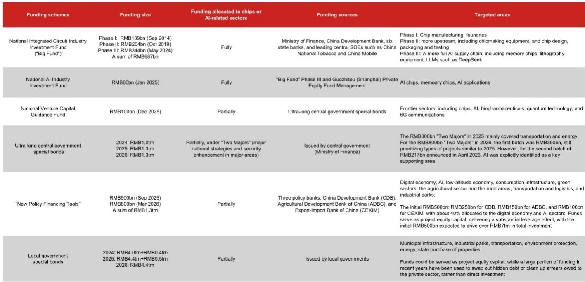

# NOM：中国AI投资的真正引擎不是BAT，是“国家资本矩阵”

理解中国AI产业的融资结构，比理解其技术路线图更为关键。NOM在最新发布的亚洲宏观研究报告中，系统拆解了中国AI资本开支的资金来源。其核心判断是：中国AI投资的驱动力并非市场自发行为，而是一个由国家资本主导、多层级联动的“资金矩阵”。这与美国的私人资本主导模式形成了根本性差异。

这份报告的价值不在于罗列数字，而在于揭示了资金流向背后的政策逻辑：中国正在用财政工具和国有资本，来对冲外部技术封锁和内部投资下行压力。对于关注中国科技产业、资产配置以及地缘风险的读者而言，理解这个资金矩阵的运作方式，是判断AI赛道未来走向的基本前提。

报告指出，中国AI资本开支的规模与美国仍有量级差距，但其资金来源的“结构性”差异，可能比资金总量本身更重要。美国AI资本开支的绝大部分由超大规模云服务商驱动，而中国则通过中央与地方的多层资金工具，将“国家战略”转化为“实际投资”。

## 1. 大基金的“三级跳”：从半导体到AI的全链条覆盖

国家集成电路产业投资基金，俗称“大基金”，是中国半导体和AI领域最核心的国家级投资工具。NOM报告显示，大基金已运行三期，注册资本从第一期的1390亿元，跃升至第三期的3440亿元，累计规模接近7000亿元。这三期投资的演进路径，清晰地反映了中国产业政策的阶段性重心：第一期聚焦芯片制造、封测等下游环节；第二期向上游设备、材料等高壁垒领域延伸；第三期则全面覆盖AI产业链，包括存储芯片、光刻设备，甚至参与了AI初创公司DeepSeek的早期融资谈判。

> **KC评论：** 大基金的投资路径不是随机的，它反映了一个清晰的“补链”逻辑。从下游制造到上游设备，再到AI全链条，每一步都在试图填补美国制裁留下的空白。对于投资者而言，大基金三期投资的领域，大概率就是未来几年政策扶持强度最高的“安全区”，但也意味着竞争格局将更加拥挤。

大基金的投资规模固然庞大，但它只是国家资本矩阵中的一个节点。当它与其他财政工具叠加时，其杠杆效应和信号意义才真正显现。

## 2. 超长期特别国债：从“铁公基”转向“算力基”

报告揭示了一个关键的政策转向：超长期特别国债的资金投向正在发生结构性变化。2025年，8000亿元“两重”建设资金主要流向交通、能源等传统基础设施。但到了2026年，情况发生了显著变化。在4月公布的第二批2170亿元资金中，人工智能被明确列为重点支持领域。这标志着，曾经为高铁、高速公路提供资金的财政工具，正在正式转向AI相关产业。

NOM还援引彭博社6月的一则报道称，中国政府正在起草一项为期五年、总额高达2万亿元的计划，旨在建立一个全国性的数据中心网络。该网络将依赖国产供应商提供至少80%的核心技术，包括华为的AI芯片，并由中国移动、中国电信等国有电信巨头运营。若计入配套电网投资，总项目支出可能达到至少5万亿元。资金将主要来自超长期特别国债和战略性产业国有基金。

> **KC评论：** 2万亿数据中心计划如果属实，其意义不亚于当年的“村村通”工程。它试图构建一个从芯片到算力、再到运营的完全国产化闭环。但这也提出了一个关键问题：如此庞大的算力供给，能否被市场需求有效消化？报告没有详细展开需求侧的测算，这恰恰是完整报告中最值得深读的部分。

## 3. 政策性金融工具的“杠杆效应”：5000亿撬动7万亿

除了直接的财政拨款，中国还动用了“准财政”工具。报告提到的“新政策融资工具”于2025年9月启动，初始额度5000亿元，2026年又追加了8000亿元。与2015-2017年和2022年的前两轮类似工具不同，本轮资金明确优先投向数字经济、AI和消费基础设施。国家开发银行和进出口银行分别将37.5%和40%的资金配置给了数字经济和AI领域。

更关键的是，这些资金作为项目资本金，能产生巨大的投资杠杆效应。据国家发改委估算，初始的5000亿元资金预计将撬动超过7万亿元的总项目投资。这意味着，国家投入的每一元钱，理论上可以带动14元的社会总投资。

## 4. 地方政府的“有心无力”与局部亮点

与中央政府的强力投入形成对比的是，地方政府的AI投入整体受限。报告数据显示，2025年地方政府专项债净融资5.4万亿元，但仅有1400亿元（约2.7%）流向了新基建和战略性新兴产业基础设施。这一比例在2026年一季度进一步降至1.0%。这背后的原因不难理解：持续的房地产下行严重拖累了地方财政，大量债券资金被用于置换隐性债务和清理拖欠企业账款。

但NOM也指出了局部亮点。例如，2026年4月，武汉推出了高达2600亿元的融资方案，专门支持长江存储和武汉新芯两大存储芯片企业的扩产。这反映了在“全球存储超级周期”背景下，少数具备产业基础的地方政府仍能集中资源进行“重点突击”。

> **KC评论：** 地方政府的AI投资呈现“冰火两重天”。大部分地区受困于财政压力，无力大规模投入；少数“幸运儿”则能抓住全球产业周期，获得中央和地方的双重加持。这提示我们，未来中国AI产业的区域分化可能会进一步加剧，投资机会将高度集中在少数几个“政策+产业”共振的城市。

## 5. 资本市场：科创板与港股的“定向输血”

在间接融资之外，股权市场也在发挥独特的“定向输血”作用。报告指出，尽管A股整体IPO自2024年初以来基本暂停，但科技公司仍被允许在科创板上市融资。过去一年，国产GPU设计公司摩尔线程（80亿元）、壁仞科技（39亿元）以及先进封装龙头盛合晶微（48亿元）均已完成IPO。

与此同时，香港市场也通过放松IPO规则来吸引内地科技公司。PCB制造商胜宏科技以230亿港元融资成为今年迄今香港最大IPO；AI芯片设计公司澜起科技完成了80亿港元的双重上市；智谱AI和MiniMax则分别融资44亿港元和55亿港元。科创板与港股市场，共同构成了中国AI产业的“资本双通道”。

## 6. 私人资本：云厂商的“军备竞赛”仍在升级

国家资本主导，并不意味着私人资本缺席。报告显示，以字节跳动、阿里巴巴、腾讯为代表的云服务商和大型语言模型开发商，每年的AI资本开支合计约5000亿元，形成了与公共投资并行的“双轮驱动”格局。

字节跳动将2026年AI资本开支计划上调至超过2000亿元；阿里巴巴则承诺了超过3800亿元的三年投资计划，并在2026年5月表示，五年期的AI基础设施部署预算将“远超”此前公布的数字。腾讯在2026年一季度的AI相关资本开支达到370亿元，同比增长16%，并誓言将加大全年投入。百度自文心一言发布以来，在AI领域的累计资本与研发投入已超过1000亿元。

## 7. 报告尚未完全回答的关键问题：投资效率与产能过剩风险

NOM这份报告的强项在于系统性地梳理了资金来源，但它也留下了一个尚未完全回答的关键问题：如此大规模、多层次的资金涌入，其投资效率如何？是否会重演光伏、电动汽车等行业的“产能过剩”与“价格战”？

报告提到了“杠杆效应”和“撬动社会投资”，但没有量化这些投资的实际回报率。当一个产业同时获得大基金、特别国债、政策性贷款、地方政府基金和资本市场的全力支持时，供给侧的快速膨胀几乎是必然的。但需求侧，无论是企业端的AI应用落地，还是消费端的杀手级应用，其增长曲线是否能够匹配供给侧的爆发，仍是悬而未决的命题。这或许是完整报告中更为细致的数据和模型才能回答的问题。

## 8. 给读者的观察框架：如何跟踪中国AI投资的实际落地

基于NOM的报告，我们可以建立一个三层观察框架，来跟踪中国AI投资的真实进展：

第一层，看“钱从哪里来”：重点关注超长期特别国债对AI领域的倾斜程度，以及大基金三期的具体投资案例。如果这两项指标持续超预期，说明国家意志的投入力度在加大。

第二层，看“钱花到哪里去”：跟踪科创板与港股的AI公司IPO节奏，以及云厂商的季度资本开支指引。如果IPO放量或云厂商上调资本开支，说明私人资本也在跟进。

第三层，看“钱能否赚回来”：关注AI相关公司的营收增长、毛利率变化以及产能利用率。这是判断投资效率的最终标尺。如果营收增速持续落后于资本开支增速，产能过剩的风险就会逐渐暴露。

---

以上分析仅基于NOM研报的公开摘要与解析，限于篇幅，许多关键细节——如大基金对DeepSeek的具体投资条款、超长期国债的年度分配节奏、以及“新政策融资工具”的详细杠杆模型——均未展开。这些信息对于精确判断投资节奏至关重要。

每天，我们都会通过AI agent与人工审核相结合的方式，从国际投行最新报告中提炼中文摘要与深度评论，形成约10-40页的日常更新，并整理当日最新数据图表合集。这份材料既方便您直接喂给AI工具进行二次分析，也方便您人工快速把握市场动态。欢迎来我们的知识星球与微信群中继续讨论上述未解问题，获取完整报告原文与更多独家解读。

Personal reading notes and learning share only. Not investment advice.

