# China AIDCs and Supply Chain

Riding on robust demand for AI compute

\- We expect demand for AI compute in 2028e to be 5x that of 2025's level as model training and inference needs grow...

\- ... benefiting leaders in AI data centres (AIDCs) and supply chain participants at various stages like switches

◆ Initiate on Range and Ruijie with Buy ratings in separate reports

Strong AI compute demand. We estimate China's AI compute demand to boom and reach c5GW by 2028, c5x more than 2025, driven by explosive demand for large language model training and inference. Domestic hyperscalers are rapidly boosting their capex, with the combined spending of ByteDance, Alibaba, and Tencent reaching RMB346bn in 2025 and set to more than double to over RMB700bn in 2026 (see Ex 6). This is still well below the spending intensity of US peers, indicating there's substantial growth potential. Leading AIDC operators and key supply chain participants (like switch vendors) should benefit.

AI network upgrades. We see the TAM for data centre switches – the high-speed traffic controllers of a network – reaching RMB118bn in 2030e, implying a 28% CAGR in 2025-30e, on 1) more layers being added to a network's structure given larger GPU clusters; 2) upgrades to switch port speed could boost product prices; and 3) scale-up switches (that connect GPUs within a rack) are new revenue drivers on rising penetration of SuperPOD. The shift to these SuperPOD cluster architecture raises technical barriers and boosts the value of specialised AIDC operators like Range whose market share we expect to reach 9% in 2028e vs 6% in 2025 in the domestic data centre space, and Ruijie's market share in China data centre switches should reach 24% in 2028e vs 21% in 2025.

Going global opportunities. Over the long term, domestic IDC operators have the potential to serve global inference demand via "token exports", leveraging China's model cost-efficiency, abundant low-cost green power in western China, and lower construction, mechanical and electrical equipment costs.

Prefer Range and Ruijie (both rated Buy). Benefiting from the AI compute boom, we expect robust AIDC revenue growth for Range, and a 43% 2025-28e EBITDA CAGR with improving margins. We expect Ruijie to gain market share in the fast-growing data centre switch market and expect its net margin to improve to 10% in 2028e vs 5% in 2025 given better economies of scale. See our initiation reports published today on Range and Ruijie.

Equities IT Services

China

Yiran Liu\* (Reg. No. S1700520040001)  
Head of A-share IT Software Research  
HSBC Qianhai Securities Limited  
yiran1.liu@hsbcqh.com.cn  
+86 10 5795 2349

Heng Zhang\* (Reg. No. S1700524050001)

Analyst, A-share IT Software Research

HSBC Qianhai Securities Limited

heng.zhang@hsbcqh.com.cn

+86 10 5795 2384

\* Employed by a non-US affiliate of HSBC Securities (USA) Inc, and is not registered/ qualified pursuant to FINRA regulations

Exhibit 1. Ratings, target prices, financials, and valuations of our preferred stocks

<table><tr><td rowspan="2">Company</td><td rowspan="2">Ticker</td><td rowspan="2">Market CapUSDbn</td><td rowspan="2">3MADTVUSDm</td><td rowspan="2">TPLC</td><td rowspan="2">PriceLC</td><td rowspan="2">Rating</td><td rowspan="2">Upside</td><td colspan="2">EPS growth_</td><td colspan="2">Rev growth_</td><td colspan="2">__PE (x)_</td><td colspan="2">__PS (x)_</td><td colspan="2">PEG (x)</td><td colspan="2">__ROE</td></tr><tr><td>2026e</td><td>2027e</td><td>2026e</td><td>2027e</td><td>2026e</td><td>2027e</td><td>2026e</td><td>2027e</td><td>2026e</td><td>2027e</td><td>2026e</td><td>2027e</td></tr><tr><td>Range</td><td>300442 CH</td><td>20.7</td><td>697</td><td>111.00</td><td>85.18</td><td>Buy</td><td>30%</td><td>-45%</td><td>38%</td><td>39%</td><td>33%</td><td>51</td><td>37</td><td>17.8</td><td>13.3</td><td>0.9</td><td>18%</td><td>21%</td><td></td></tr><tr><td>Ruijie</td><td>301165 CH</td><td>11.2</td><td>141</td><td>89.00</td><td>67.80</td><td>Buy</td><td>31%</td><td>115%</td><td>27%</td><td>27%</td><td>26%</td><td>50</td><td>40</td><td>4.2</td><td>3.3</td><td>1.1</td><td>23%</td><td>30%</td><td></td></tr></table>

Source: Wind, HSBC Qianhai Securities estimates. Note: Priced at close of 18 June 2026. TP – target price; nm = not meaningful

## Disclosures & Disclaimer

This report must be read with the disclosures and the analyst certifications in the Disclosure appendix, and with the Disclaimer, which forms part of it.

Issuer of report: HSBC Qianhai Securities Limited

View HSBC Qianhai Securities at: https://www.research.hsbc.com

# Robust demand, limited supply

\- Strong token consumption brings robust demand for compute, benefiting AIDC players

\- Price increases in the GPU rental business (GPUaaS) are likely to continue with leaders gaining market share

◆ Next step is for tokens to keep going global

## Robust token consumption brings strong AIDC demand

## AIDC is the core infrastructure for AI compute

We believe AIDC is one of the key sections in the AI compute supply chain. As the physical infrastructure of compute, AIDCs process data and connect hardware to software.

Exhibit 2. AI compute supply chain: Data centres are key infrastructure  
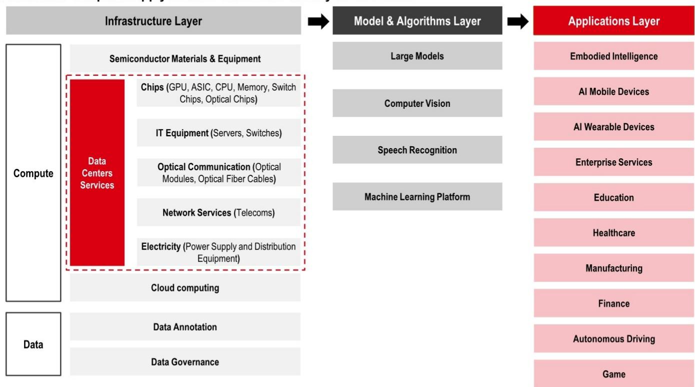

Data Annotation

Source: Company data, HSBC Qianhai Securities

Data Governance

Large Models

Computer Vision

Speech Recognition

Machine Learning Platform

Applications Layer

Embodied Intelligence

AI Mobile Devices

AI Wearable Devices

Enterprise Services

Due to 1) strong AI demand and 2) limited GPU and AIDC capacity supply, the GPU rental (GPUaaS) business is quite popular in both China and US. Some traditional internet data centre (IDC)/AIDC players have moved into this business. We list several GPUaaS businesses below. In our view, GPUaaS provides multiple advantages compared to in-house built GPU infrastructure, including 1) easier/quicker access to high-end GPUs compared to self-built; and 2) less investment required as rental refers to Opex instead of Capex for enterprises.

Exhibit 3. Data centres and GPU leasing business model comparisons

<table><tr><td>Feature</td><td>Retail data centres</td><td>Wholesale / Hyperscale data centres</td><td>AI data centres</td><td>GPU rental (GPUaaS)</td><td>Neo-cloud (GPUaaS)</td><td>Hyperscale public cloud</td></tr><tr><td>Representative companies</td><td>VNET (VNET US), Sinnet (300383 CH)</td><td>GDS (GDS US/9698 HK), VNET (VNET), Range (300442 CH), Chindata (Hec 600673 CH), Baosight (600845 CH)</td><td>Range (300442 CH), Chindata (Hec 600673 CH), Baosight (600845 CH), BONC (300166 CH)</td><td>Range (300442 CH), Lettall Electronic (603629 CH), Sharetronic (300857 CH), Glory View (301396 CH), BONC (300166 CH), Dawei (600589 CH)</td><td>CoreWeave (CRWV US), Nebius (NBIS US)</td><td>AWS, Azure, AliCloud</td></tr><tr><td>Pricing model</td><td>Monthly operation fee</td><td>Monthly operation fee</td><td>Monthly operation fee</td><td>Monthly rental fee + Revenue sharing based on token consumption</td><td>Pay-As-You-Go/ On-demand saving plans (commitment) Preemptible virtual machines</td><td>Pay-As-You-Go/ On-demand saving plans (commitment)</td></tr><tr><td>Service description</td><td>Physical facility rights</td><td>Physical facility rights</td><td>Physical facility and hardware rights, deeply tuned network</td><td>Physical hardware rights</td><td>AI-native cloud services</td><td>General-purpose virtualized cloud resources</td></tr><tr><td>Own data centres?</td><td>Yes</td><td>Yes</td><td>Yes</td><td>No</td><td>Partially</td><td>Partially</td></tr><tr><td>Own servers?</td><td>No</td><td>No</td><td>Partially</td><td>Yes</td><td>Yes</td><td>Yes</td></tr><tr><td>Network capability</td><td>Customer defined connectivity</td><td>Standard Ethernet at scale</td><td>Deeply tuned to support GPU clusters</td><td>Varies</td><td>Deeply tuned to support GPU clusters</td><td>Standardised SDN (software defined network)</td></tr><tr><td>Software support</td><td>Limited</td><td>Limited</td><td>Limited</td><td>Limited</td><td>AI containers, rendering &amp; inference</td><td>Full-stack (database, security, web, serverless)</td></tr><tr><td>Target market</td><td>General businesses</td><td>Hyperscalers, AI labs, large enterprises</td><td>AI labs, hyperscalers</td><td>AI labs, hyperscalers</td><td>AI labs, hyperscalers</td><td>General businesses</td></tr><tr><td>Contract terms</td><td>Short-to-long-term lease (1-10 years)</td><td>Long-term lease (e.g. 7-15 years)</td><td>Long-term lease (e.g. 3-5 years)</td><td>Short-to-long-term lease (e.g. 1-5 years)</td><td>Long-term lock-in but greater contractual flexibility</td><td>Highly flexible (pay-as-you-go by hour/second)</td></tr><tr><td>Key advantages</td><td>Cost-effective, reliable operations, scalable, good connectivity, proximity</td><td>Cost-effective, physical privacy, reliable operations, scalable, good connectivity</td><td>AI-optimized, physical privacy, reliable operations, scalable, good connectivity, advanced GPU access, high cluster performance</td><td>Advanced GPU access, high cluster performance</td><td>Advanced GPU access, high cluster performance, flexible contract terms</td><td>Global reach, versatile, instant scalability</td></tr></table>

Source: Company data, HSBC Qianhai Securities

## Strong compute demand to drive accelerated growth; we expect China intelligent compute to grow at a CAGR of $74\%$ over 2025-28e, reaching 5GW in 2028e

With more advanced model launches in 2026, token consumption has shown strong growth. Per National Data Administration, China's daily token consumption reached 140trn in March 2026, which is $40\%$ more vs December 2025. In addition, IDC estimates that global agent token usage will grow to 152,667 peta $(10^{15})$ in 2030e, vs 0.0005 peta in 2025. The rising penetration of generative artificial intelligence (GAI) and robust token usage growth potential brings strong demand for AI compute, and hence, CSPs/Internet companies have raised their capex. Notably, per company guidance and media reporting, China hyperscalers' total capex in 2026e is set to more than double to over cRMB700bn (see Ex 6).

As GAI penetration is still in the early stages, we expect the strong compute demand to persist and expect China intelligent compute (@FP16, or 16-bit binary floating-point computer number format) to grow to over 12 ZFLOPS (10^3 EFLOPS) in 2028e, close to 8x vs 2025 level. In addition, we expect China intelligent compute data centre demand to grow at a CAGR of $74\%$ over 2025-28e and to reach c5.4GW in 2028e. AIDC players that have more reserved/running capacity should benefit.

Exhibit 4. China daily token usage grew robustly over the last two years  
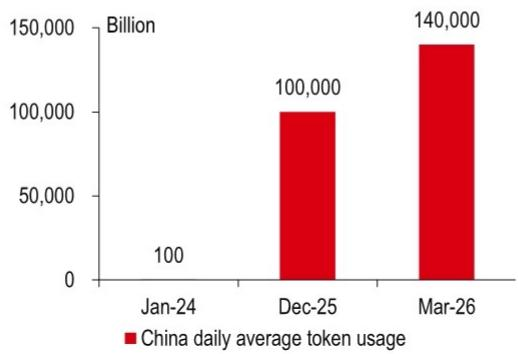  
Source: National Data Administration, HSBC Qianhai Securities

Exhibit 5. IDC estimates global agent token usage will grow to 152,667 peta in 2030e  
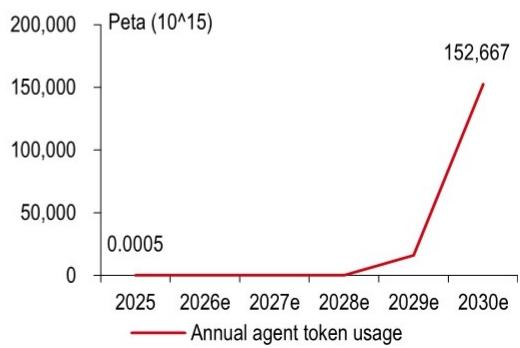  
Source: IDC estimates, HSBC Qianhai Securities

Exhibit 6. China CSPs continue to raise their capex  
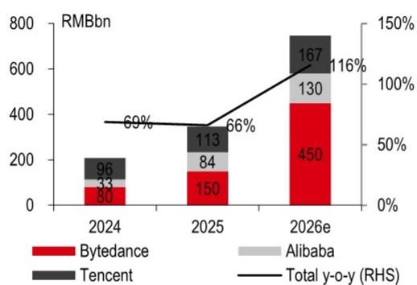  
Source: Company data (capex guidance), Reuters (23 Dec 2025), Bloomberg (May 2026), South China Morning Post (9 May 2026), HSBC Qianhai Securities

Exhibit 7. We expect China intelligent compute to grow to c12,354 EFLOPS (@FP16) in 2028e  
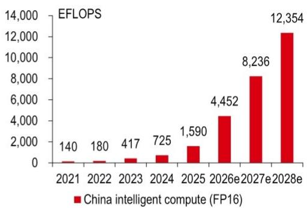  
Source: MIIT, CAICT, IDC, HSBC Qianhai Securities estimates

Exhibit 8. We expect China intelligent compute data centre demand to grow at a CAGR of 74% over 2025-28e and to reach c5.4GW in 2028e  
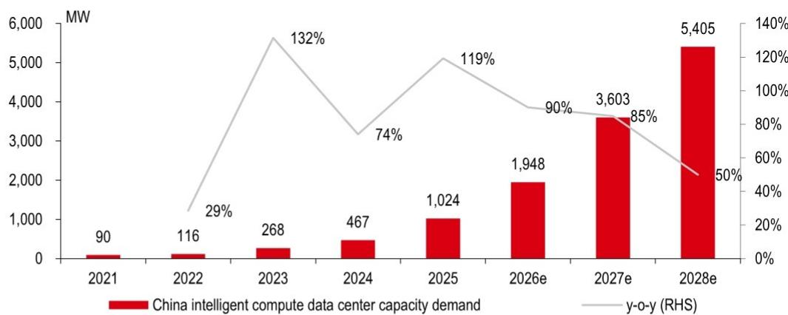  
Source: MIIT, CAICT, IDC, Nvidia, HSBC Qianhai Securities estimates

Based on 1) our above forecast for China's intelligent compute data centre capacity and the compute scale and pricing of mainstream NVIDIA GPU servers/compute trays, etc.; and 2) Range's annual data centre operation revenue per MW, we expect China's data centre market to reach RMB165bn in 2028. Specifically, we expect the AIDC market to grow at a CAGR of $78\%$ over 2025-28e, reaching RMB75bn on 2028e.

Exhibit 9. China third-party data centre TAM/growth  
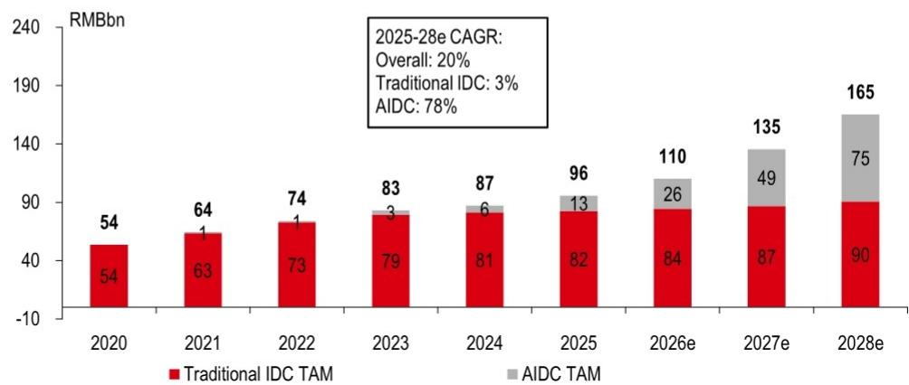  
Source: MIIT, CAICT, IDC, Range company data, HSBC Qianhai Securities estimates

## Supply is the bottleneck; leaders to gain market share

We expect AIDC to face supply shortages; GPUaaS should see robust growth
Due to strong AI demand and given limited GPU and AIDC capacity supply, since 2025, the GPUaaS market saw continued price hikes. Note that the Nvidia H100 rental price has risen from RMB12/GPU/hour to RMB17/GPU/hour, up c40%. Meanwhile, leading CSPs have announced cloud services price rises as well.

A new AIDC buildout usually needs 18-24 months for construction and utilisation ramp-up (source: Range company data). Per third party AIDC capacity plans, we expect supply shortages to continue, and the GPU rental business should see continued growth. AIDC players providing GPU leasing services (such as Range and Hec, per Exhibit 3), will continue to enjoy benefits from tight supply.

Exhibit 10. H100 1-year rental price has continued to rise since 2026  
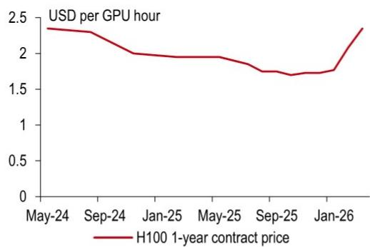  
Source: SemiAnalysis GPU pricing index, HSBC Qianhai Securities

Exhibit 11. Nebius raised further its GPU rental prices in May 2026  
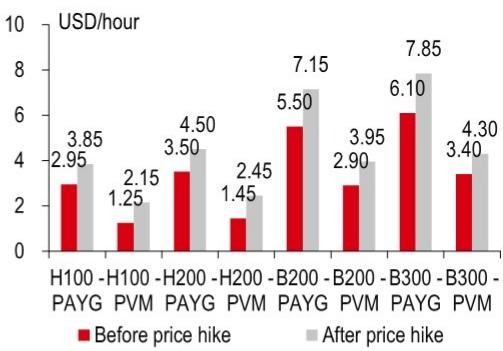  
Source: Nebius, HSBC Qianhai Securities

Exhibit 12. Many CSPs have announced cloud services price hikes since 1Q26

<table><tr><td>Company</td><td>Announcement date</td><td>Effective date</td><td>Adjusted services</td><td>Price hikes</td></tr><tr><td colspan="5">Chinese hyperscalers</td></tr><tr><td>Tencent Cloud</td><td>4/9/2026</td><td>5/9/2026</td><td>AI computing power, TKE native nodes and EMR</td><td>+5%</td></tr><tr><td>Tencent Cloud</td><td>3/11/2026</td><td>3/13/2026</td><td>Tencent HY2.0 Instruct/Think model token prices</td><td>+420%-+463%</td></tr><tr><td>Baidu Cloud</td><td>3/18/2026</td><td>4/18/2026</td><td>AI computing products and parallel file storage</td><td>+5%-+30%</td></tr><tr><td>AliCloud</td><td>4/15/2026</td><td>5/15/2026</td><td>Bailian MaaS platform model unit prices</td><td>+2%-+5%</td></tr><tr><td>AliCloud</td><td>4/14/2026</td><td>4/14/2026</td><td>DataWorks API quotas adjustment and usage based billings</td><td>Charging on excess usage</td></tr><tr><td>AliCloud</td><td>3/18/2026</td><td>4/18/2026</td><td>GPU computing services e.g. T-head Zhenwu 810E GPU</td><td>+5%-+34%</td></tr><tr><td>AliCloud</td><td>3/18/2026</td><td>4/18/2026</td><td>Cloud parallel file storage (AI computing version)</td><td>+30%</td></tr><tr><td>Ucloud</td><td>2/11/2026</td><td>3/1/2026</td><td>All products and services for contract renewals and new contract</td><td>+5%-+12%</td></tr><tr><td>Wangsu</td><td>2/1/2026</td><td>2/1/2026</td><td>CDN standard service traffic/CDN fast origin-pull traffic</td><td>+35%/+40%</td></tr><tr><td>Wangsu</td><td>2/1/2026</td><td>2/1/2026</td><td>Object storage service</td><td>+40%</td></tr><tr><td colspan="5">Overseas hyperscalers</td></tr><tr><td>Google Cloud</td><td>1/27/2026</td><td>5/1/2026</td><td>Networking services for CDN interconnect, direct peering and carrier peering (data transfer fees)</td><td>+100% for North America +60% for Europe +40% for Asia</td></tr><tr><td>Amazon AWS</td><td>1/23/2026</td><td>1/23/2026</td><td>EC2 machine learning capacity blocks</td><td>+15%</td></tr></table>

Source: Company data, HSBC Qianhai Securities

Exhibit 13. Overview of leading third-party IDC suppliers' in-service IT capacity and plans  
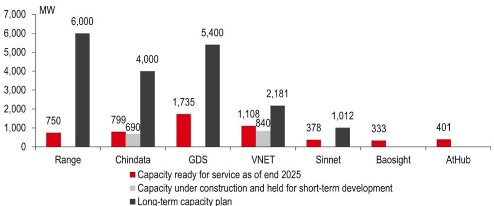  
Source: Company data, HSBC Qianhai Securities

## SuperPOD cluster architecture increases AIDC operators' value proposition

In the era of intelligent computing, cluster network communication bottlenecks have become the core constraint for both AI training and inference. However, a highly integrated SuperPOD architecture can break through bottlenecks related to scale, performance, and reliability. A SuperPOD is a technical architecture that aggregates multiple GPUs into a single SuperPOD in one rack via high-bandwidth interconnects, enabling large-scale parallel training.

This technological leap is driving new requirements for data centres in terms of cooling, power supply capacity, floor load-bearing capacity, ceiling height, and network architecture. Leading vendors with strong technical capabilities and capital resources are better positioned to secure SuperPOD data centre orders, leading to accelerated market share consolidation.

Moreover, the value proposition of SuperPOD data centres is expanding across multiple dimensions. Taking Range as an example, its AIDC business has not yet deployed SuperPOD solutions at scale, with high-performance servers remaining its primary equipment. However, its 2025 annualized revenue per MW of deployed capacity is already cRMB15m, representing a $c56\%$ increase compared to the cRMB9.6m generated by traditional IDC operation services. This provides early validation of the value uplift in AI data centres.

We believe that given the growing use of intelligent agents and large language models, data centres will evolve into “token factories”. Demand for long-context processing and high-concurrency throughput are intensifying, which is driving intelligent computing centres to enhance computing density, network bandwidth, and energy efficiency. AIDC service providers that possess sufficient energy quota reserves, high-bandwidth low-latency networks, liquid cooling technologies, and scalable operational and delivery capabilities will gain structural advantages during the industry upcycle and the ongoing shift in technical paradigms and are expected to continue benefiting in the long term.

Exhibit 14. SuperPOD brings higher requirements for data centre operators

<table><tr><td></td><td>General purpose CPU cabinet</td><td>Traditional AIDC cabinetExample: DGX H100</td><td>Overseas SuperPOD AIDC cabinetExample: DGX GB300 NVL72</td><td>Domestic SuperPOD AIDC cabinetExample: Atlas 950 SuperPoD</td></tr><tr><td>Cabinet power</td><td>4-12kW</td><td>40kW</td><td>120kW</td><td>Over 120kW</td></tr><tr><td>Core components</td><td>CPU servers</td><td>4 DGX H100 servers + 3 PDUs</td><td>18 1U compute trays + 9 1U NVLink switch trays + 8 rackmount power supplies</td><td>N/A</td></tr><tr><td>Scale</td><td>N/A</td><td>32*H100 GPU</td><td>72*B300 GPU</td><td>64* Ascend 950DT NPU</td></tr><tr><td>Intelligent compute (EFLOPS @FP16)</td><td>N/A</td><td>0.06</td><td>0.72</td><td>4</td></tr><tr><td>Cooling method</td><td>Air-cooled</td><td>Air-cooled</td><td>Liquid-cooled</td><td>Liquid-cooled</td></tr><tr><td>Memory capacity</td><td>N/A</td><td></td><td>21TB HBM3e</td><td>9TB HBM HiZQ2.0</td></tr><tr><td>Interconnect bandwidth</td><td>N/A</td><td></td><td>576TB/s</td><td>16.3 PB/s</td></tr><tr><td>Power supply method</td><td>AC power distribution unit (PDU) installed at the top or sides of the cabinet</td><td>AC PDU installed at the top of the cabinet (power distribution unit), typically with AC 220V/380V input.Power distribution: Each server has its own power supply module (PSU), converting AC to DC (typically to 12V)</td><td colspan="2">High-voltage DC (HVDC), with redundant power shelves built into the cabinet, typically outputting 48V or 50V DC</td></tr><tr><td>Floor load and space requirements for data centre</td><td>Floor load typically 800–1000 kg/m2, ceiling height typically 4-5m</td><td>Floor load typically &gt;1000 kg/m2, ceiling height typically &gt;6 m</td><td colspan="2">Cabinet weight exceeds 1 ton, with cable, cooling pipe, and power equipment volume and weight increasing significantly, requiring higher floor load capacity and ceiling height</td></tr></table>

Source: Nvidia, Huawei, HSBC Qianhai Securities

Exhibit 15. Range is gaining market share in China's third-party data centre space  
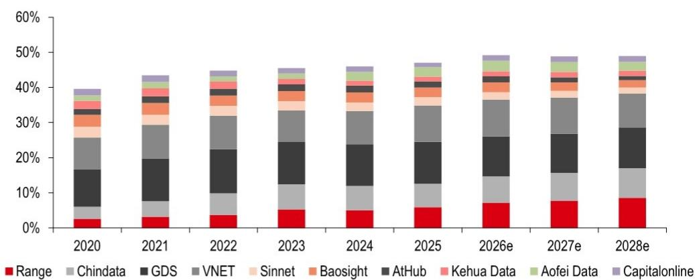  
Source: MIIT, CAICT, IDC, company data, Wind consensus estimates (for not covered public companies), HSBC Qianhai Securities estimates

Exhibit 16. China data centre and GPUaaS suppliers overview

<table><tr><td>Ticker</td><td>Company</td><td>In-service capacity (MW)</td><td>Long-term capacity plan (MW)</td><td>Approved energy quota (MW)</td></tr><tr><td>300442 CH</td><td>Range</td><td>750</td><td>6,000</td><td>3,200</td></tr><tr><td>600673 CH</td><td>Chindata (Hec)</td><td>799</td><td>4,000</td><td>N/A</td></tr><tr><td>9698 HK</td><td>GDS</td><td>1,735</td><td>5,400</td><td>N/A</td></tr><tr><td>VNET US</td><td>VNET</td><td>1,108</td><td>2,181</td><td>N/A</td></tr><tr><td>300383 CH</td><td>Sinnet</td><td>378</td><td>1,012</td><td>N/A</td></tr><tr><td>600845 CH</td><td>Baosight</td><td>333</td><td>N/A</td><td>N/A</td></tr><tr><td>600589 CH</td><td>Dawei</td><td>110</td><td>2,218</td><td>218</td></tr></table>

Source: Company data, HSBC Qianhai Securities

Source: OpenRouter, HSBC Qianhai Securities

## More upside to come: global expansion

## AIDC operators: key beneficiaries of domestic LLMs going global

China's leading AIDC operators have expanded into overseas markets to help support domestic CSPs' overseas compute demand. In this AI era, with more advanced domestic LLMs gaining market share in the overseas markets, we believe AIDC operators are major beneficiaries.

Exhibit 17. Weekly AI token usage on OpenRouter has surged since 2026  
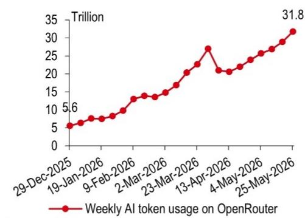

Exhibit 18. Chinese models have gained token share from US models since February 2026  
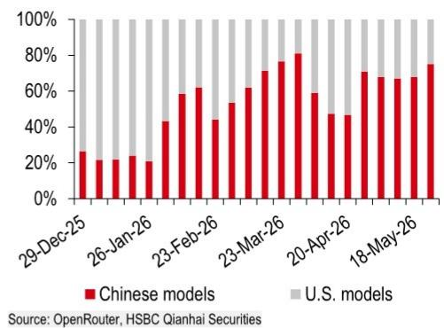

Exhibit 19. Top Chinese models perform well in the Intelligence Index at lower costs  
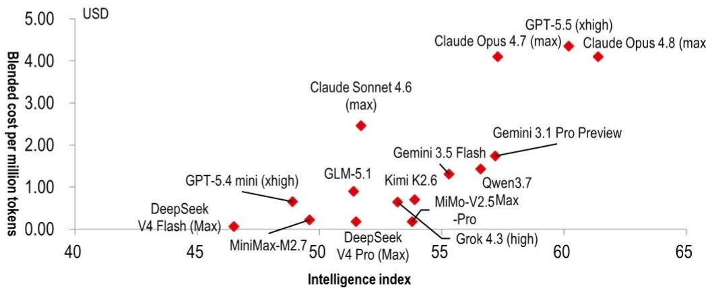  
Source: Artificial Analysis, HSBC Qianhai Securities

Exhibit 20. Top Chinese models' blended API cost is only c20% of US models'  
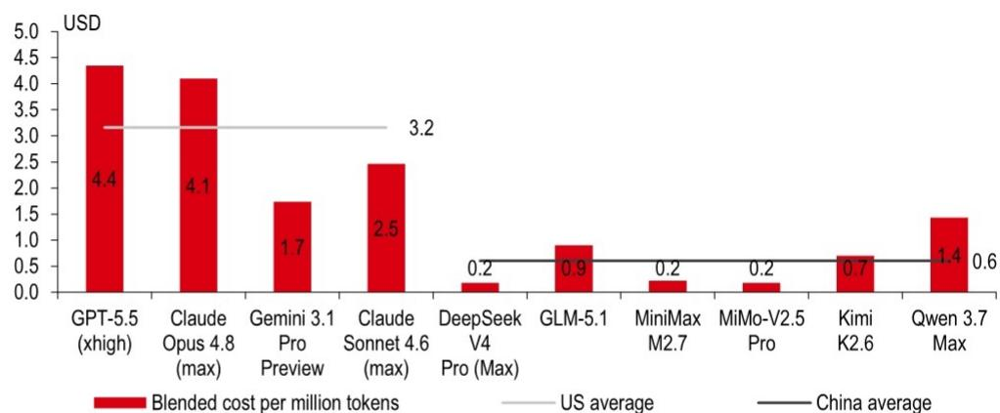  
Source: Artificial Analysis, HSBC Qianhai Securities
Note: Blended cost as 7:2:1 (cache-input-output).

Exhibit 21. Mainland Chinese data centre vendors are actively expanding offshore

<table><tr><td>Ticker</td><td>Company</td><td>Offshore in-service capacity (MW)</td><td>Offshore long-term capacity plan (MW)</td><td>Locations</td></tr><tr><td>300442 CH</td><td>Range</td><td>0</td><td>600</td><td>Hong Kong (240MW)Indonesia Batam (360MW)</td></tr><tr><td>600673 CH</td><td>Chindata (HEC)</td><td>c200</td><td>N/A</td><td>Johor (Malaysia), Kuala Lumpur (Malaysia), Bangalore (India), Thailand, Singapore</td></tr><tr><td>9698 HK</td><td>DayOne (GDS)</td><td>c440</td><td>2,700</td><td>Singapore, Thailand, Johor (Malaysia), Indonesia Batam, Japan, Hong Kong, Finland</td></tr></table>

Source: Company data, HSBC Qianhai Securities estimates

## Tokens going global to also benefit AIDC operators

As mentioned earlier, China not only has leading cost efficiency models, but also enjoys cheaper electricity price (see Ex 32). With the narrowing performance gap between Chinese models and US models, domestic AI model suppliers have the potential to sell tokens in the overseas markets over the long term, which also should benefit domestic AIDC vendors.

Exhibit 22. Models going global and tokens going global

<table><tr><td></td><td>Model going global</td><td>Token going global</td></tr><tr><td>Location of computing</td><td>Overseas</td><td>China</td></tr><tr><td>Latency</td><td>Low</td><td>Higher (cross border network latency)</td></tr><tr><td>Data compliance</td><td>Natively compliant</td><td>Complex, user data cross borders</td></tr><tr><td>Advantages for LLM suppliers</td><td>Better access to advanced accelerators</td><td>Lower cost on data centre electricity, civil works, mechanical and electrical equipment</td></tr></table>

Source: HSBC Qianhai Securities

# GPUaaS: China vs US

In terms of CSP capex, China has significant upside

\- China has energy/cost advantage; US has more high-end GPUs

In this chapter, we compare various GPUaaS operating metrics

GPUaaS refers to general GPU leasing, a concept that has attracted investor attention in both China and the US due to continued price hikes. In this section, we dig into the GPUaaS market in both markets.

## CSP capex: China has significant upside

ByteDance, Alibaba and Tencent together guided for 2026e capex to be over cRMB700bn (see Ex 6) (cUSD111bn), c16% of US hyperscalers' capex, showing substantial growth potential. We believe the GPUaaS market in China is at an early stage, and rising AI penetration should drive robust growth for years.

Exhibit 23. China hyperscalers' capex shows a substantial gap compared with US peers in terms of absolute numbers ...  
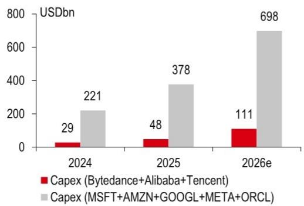  
Source: Company data (China hyperscalers' capex guidance), Reuters (23 May 2025), Bloomberg (27 May 2026), South China Morning Post (27 May 2026), Bloomberg consensus estimates (US hyperscalers' capex), HSBC Qianhai Securities  
Exhibit 24. ... and in terms of % of revenue and operating cash flow

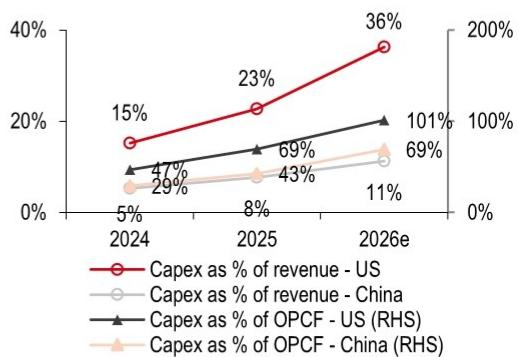  
Source: Company data (China hyperscalers' capex guidance), Reuters (23 May 2025), Bloomberg (27 May 2026), South China Morning Post (27 May 2026), Bloomberg consensus estimates (revenue, operating cashflow, US hyperscalers' capex), HSBC Qianhai Securities

Exhibit 25. Two leading US GPUaaS suppliers' revenue were a combined USD5.7bn in 2025  
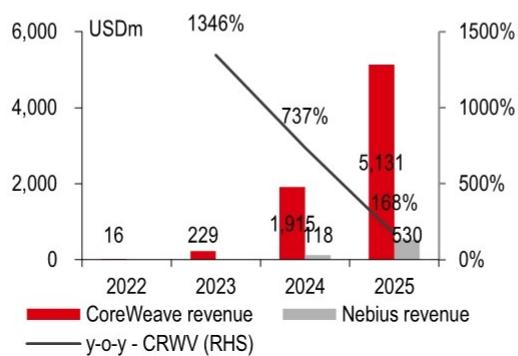  
Source: Company data, HSBC Qianhai Securities

Exhibit 26. ... while eight leading suppliers in China only generated RMB6,970m (cUSD976m) revenue in 2025  
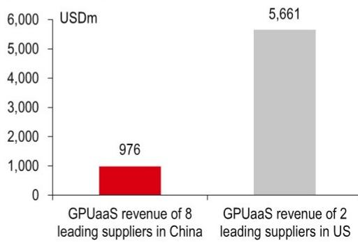  
Source: Company data, HSBC Qianhai Securities  
Note: We calculate Sharetronic Data (300857 CH), Glory View (301396 CH), Lettall Electronic (603629 CH), Hongbo (002229 CH), China Bester Group Telecom (603220 CH), Infore Environment (000967 CH), BONC (300166 CH), and Hongxin Electronics (300657 CH).

Exhibit 27. Two leading US GPUaaS suppliers' capacity, as of end 2025  
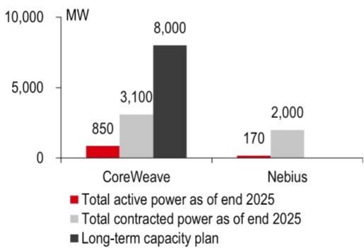  
Source: Company data, HSBC Qianhai Securities

Exhibit 28. Annualised revenue per MW US vs China  
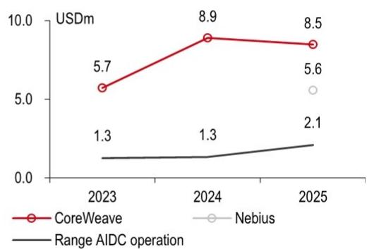  
Source: Company data, HSBC Qianhai Securities

## China has energy/cost advantages; US has high-end GPU supply

China's “Eastern data, Western compute” policy has shifted data centre supply from eastern China to western China. Meanwhile, the “compute power coordination” policy has gradually guided data centre building to regions with rich green power supply. That said, China's AIDCs should have energy and cost advantages over US peers, especially when competing in the global market.

Green power price in Western China is $c50\%$ lower than the US industrial power price. For foundation model vendors, China's data centre buildings, civil engineering and electricity costs are generally lower than in the US. China's western electricity price was $c50\%$ lower than the US average industrial electricity price in 2025.

Exhibit 29. China data centre electricity consumption only accounted for 1.9% of total electricity consumption in 2025  
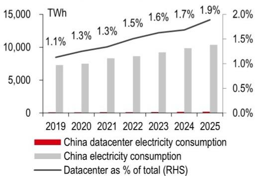  
Source: NEA, CAICT, HSBC Qianhai Securities

Exhibit 30. US data centre electricity consumption accounted for $7.7\%$ of total in 2025  
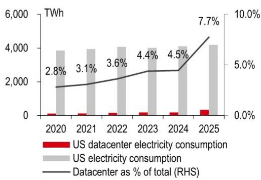  
Source: US EIA, Wind, HSBC Qianhai Securities

Exhibit 31. Average price of electricity to industrial consumers in US has risen over the last two years and reached USD0.0862/kWh in 2025  
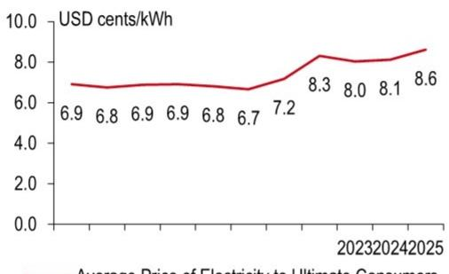  
— Average Price of Electricity to Ultimate Consumers, Industrial  
Source: EIA, HSBC Qianhai Securities

Exhibit 32. Western China's green electricity price is $c50\%$ lower than the US average industrial electricity price in 2025  
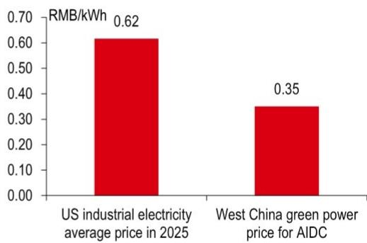  
Source: China Electric Power Planning & Engineering Institute, State Grid, China Southern Power Grid, National Development and Reform Commission (NDRC), US EIA, HSBC Qianhai Securities

Exhibit 33. Location breakdown of data centre racks in China in 2024: over $50\%$ in eastern China  
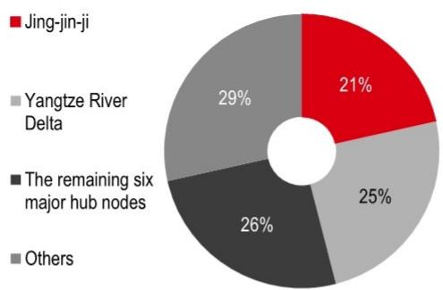  
Source: NEA, CAICT, HSBC Qianhai Securities

Exhibit 34. Western China's green electricity price is also c50% lower than China's average industrial electricity price in 2025  
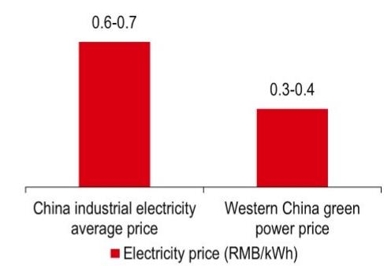  
Source: Cnenergynews (25 May 2026), HSBC Qianhai Securities

Cost-effectiveness of domestic GPUs is improving; US has access to advanced GPUs GPU supply remains tight in China due to US export controls on high-end GPUs, resulting in higher GPU server procurement costs in China versus the US. However, in the long term, we believe that as cloud vendors' self-developed ASIC (application-specific integrated circuit) chip supply increases and domestic substitution of high-performance computing chips progresses, domestic IT equipment costs, including servers, may approach US levels, while cost advantages from cheaper buildings and electricity will become increasingly pronounced.

Exhibit 35. Under equivalent compute, the price of domestic GPUs is getting closer to that of NVIDIA  
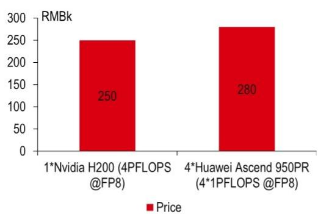  
Source: Nvidia, Huawei, 36Kr, HSBC Qianhai Securities

Exhibit 36. Currently, the China GPU rental rate is close to the low end pricing of overseas peers  
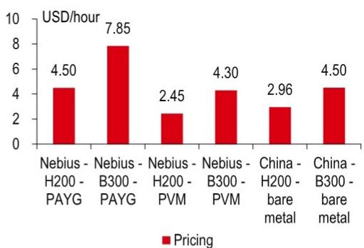  
Source: Nebius, Glory View, HSBC Qianhai Securities

North American neo-cloud vendors, like Nebius and Coreweave, have relatively sufficient supply of compute and develop and build their own hypervisor layer, a software layer beyond the bare metal GPU server, designed specifically for massive AI training and inference on top of GPU servers. This approach involves higher technical barriers, and as a result, their gross profit margins can reach around 70% with over 60% EBITDA margins in a mature stage.

China's GPU leasing leaders' core moat lies in scarce GPU supply-chain access given the US export controls. The gross margin of China's GPU leasing vendors is around $20\% - 30\%$ , with a net profit margin of $10\% - 15\%$ . The sector is now exploring new business models, shifting from fixed rental fees to token-throughput-based revenue sharing. This specific revenue-sharing business model and whether they can successfully transition remains to be seen. If successful, it could potentially improve the industry's gross and net profit margins.

Exhibit 37. US neo-cloud vendors are in a net loss position due to large depreciation and amortisation costs...  
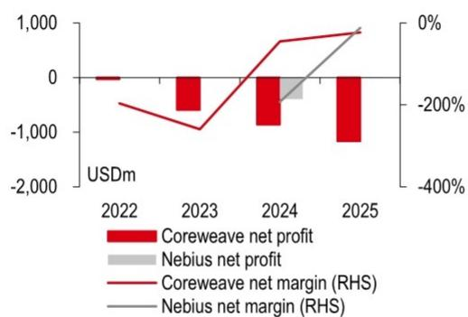  
Source: Coreweave, Nebius, HSBC Qianhai Securities

Exhibit 38. ... but their adjusted EBITDA margin could reach over $60\%$  
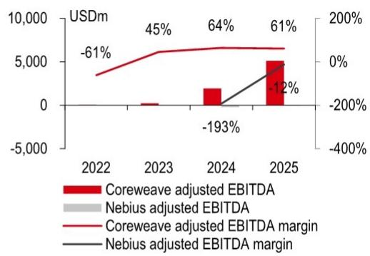  
Source: Coreweave, Nebius, HSBC Qianhai Securities

Exhibit 39. US neo-cloud gross margins could reach a c70% level while China GPU rental gross margins stand at 20%-30%  
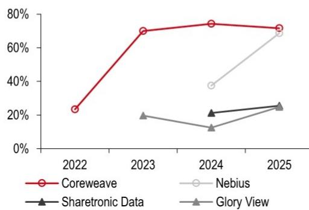  
Source: Coreweave, Nebius, Sharetronic Data (300857 CH), Glory View (301396 CH), HSBC Qianhai Securities

Exhibit 40. China GPU leasing vendors' net margin could reach 10-15% depending on the type of accelerators  
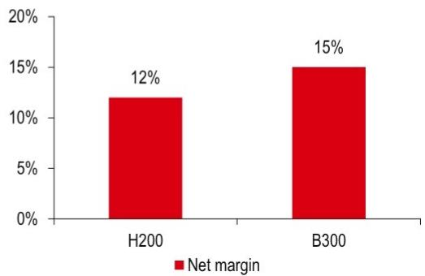  
Source: Glory View, Dawei, Hec, HSBC Qianhai Securities

## Related Reports

Spotlight: China Software: AI to supercharge software monetisation, 7 May 2026

China Software: Riding on the robust token usage growth, 11 March 2026

China Data Centres: Re-rating: just the beginning, 19 March 2026

US Data Centres: 2026 outlook: Traditional data centres look well positioned to benefit, 15 January 2026

# Disclosure appendix

## Analyst Certification

The following analyst(s), economist(s), or strategist(s) who is(are) primarily responsible for this report, including any analyst(s) whose name(s) appear(s) as author of an individual section or sections of the report and any analyst(s) named as the covering analyst(s) of a subsidiary company in a sum-of-the-parts valuation certifies(y) that the opinion(s) on the subject security(ies) or issuer(s), any views or forecasts expressed in the section(s) of which such individual(s) is(are) named as author(s), and any other views or forecasts expressed herein, including any views expressed on the back page of the research report, accurately reflect their personal view(s) and that no part of their compensation was, is or will be directly or indirectly related to the specific recommendation(s) or views contained in this research report: Yiran Liu and Heng Zhang

## Important disclosures

## Equities: Stock ratings and basis for financial analysis

HSBC and its affiliates, including the issuer of this report ("HSBC") believes an investor's decision to buy or sell a stock should depend on individual circumstances such as the investor's existing holdings, risk tolerance and other considerations and that investors utilise various disciplines and investment horizons when making investment decisions. Ratings should not be used or relied on in isolation as investment advice. Different securities firms use a variety of ratings terms as well as different rating systems to describe their recommendations and therefore investors should carefully read the definitions of the ratings used in each research report. Further, investors should carefully read the entire research report and not infer its contents from the rating because research reports contain more complete information concerning the analysts' views and the basis for the rating.

## From 23rd March 2015 HSBC has assigned ratings on the following basis:

The target price is based on the analyst's assessment of the stock's actual current value, although we expect it to take six to 12 months for the market price to reflect this. When the target price is more than $20\%$ above the current share price, the stock will be classified as a Buy; when it is between $5\%$ and $20\%$ above the current share price, the stock may be classified as a Buy or a Hold; when it is between $5\%$ below and $5\%$ above the current share price, the stock will be classified as a Hold; when it is between $5\%$ and $20\%$ below the current share price, the stock may be classified as a Hold or a Reduce; and when it is more than $20\%$ below the current share price, the stock will be classified as a Reduce.

Our ratings are re-calibrated against these bands at the time of any 'material change' (initiation or resumption of coverage, change in target price or estimates).

Upside/Downside is the percentage difference between the target price and the share price.

## Prior to this date, HSBC's rating structure was applied on the following basis:

For each stock we set a required rate of return calculated from the cost of equity for that stock's domestic or, as appropriate, regional market established by our strategy team. The target price for a stock represented the value the analyst expected the stock to reach over our performance horizon. The performance horizon was 12 months. For a stock to be classified as Overweight, the potential return, which equals the percentage difference between the current share price and the target price, including the forecast dividend yield when indicated, had to exceed the required return by at least 5 percentage points over the succeeding 12 months (or 10 percentage points for a stock classified as Volatile\*). For a stock to be classified as Underweight, the stock was expected to underperform its required return by at least 5 percentage points over the succeeding 12 months (or 10 percentage points for a stock classified as Volatile\*). Stocks between these bands were classified as Neutral.

\*A stock was classified as volatile if its historical volatility had exceeded $40\%$ , if the stock had been listed for less than 12 months (unless it was in an industry or sector where volatility is low) or if the analyst expected significant volatility. However, stocks which we did not consider volatile may in fact also have behaved in such a way. Historical volatility was defined as the past month's average of the daily 365-day moving average volatilities. In order to avoid misleadingly frequent changes in rating, however, volatility had to move 2.5 percentage points past the $40\%$ benchmark in either direction for a stock's status to change.

## Rating distribution for long-term investment opportunities

As of 31 March 2026, the distribution of all independent ratings published by HSBC is as follows:

Buy 59% (12% of these provided with Investment Banking Services in the past 12 months)

Hold 36% (12% of these provided with Investment Banking Services in the past 12 months)

Sell 6% (6% of these provided with Investment Banking Services in the past 12 months)

For the purposes of the distribution above the following mapping structure is used during the transition from the previous to current rating models: under our previous model, Overweight = Buy, Neutral = Hold and Underweight = Sell; under our current model Buy = Buy, Hold = Hold and Reduce = Sell. For rating definitions under both models, please see “Stock ratings and basis for financial analysis” above.

For the distribution of non-independent ratings published by HSBC, please see the disclosure page available at http://www.hsbcnet.com/gbm/financial-regulation/investment-recommendations-disclosures.

To view a list of all the independent fundamental ratings/recommendations disseminated by HSBC during the preceding 12-month period, and the location where we publish our quarterly distribution of non-fundamental recommendations (applicable to Fixed Income and Currencies research only), please use the following links to access the disclosure page:

Clients of HSBC Private Bank: www.research.privatebank.hsbc.com/Disclosures

All other clients: www.research.hsbc.com/A/Disclosures

## HSBC & Analyst disclosures

## Disclosure checklist

<table><tr><td>Company</td><td>Ticker</td><td>Recent price</td><td>Price date</td><td>Disclosure</td></tr><tr><td>Range Technology</td><td>300442.SZ</td><td>82.23</td><td>23 Jun 2026</td><td>-</td></tr><tr><td>RUIJIE NETWORKS</td><td>301165.SZ</td><td>64.36</td><td>23 Jun 2026</td><td>-</td></tr></table>

1 HSBC has managed or co-managed a public offering of securities for this company within the past 12 months.

2 HSBC expects to receive or intends to seek compensation for investment banking services from this company in the next 3 months.

3 At the time of publication of this report, HSBC Securities (USA) Inc. is a Market Maker in securities issued by this company.

4 As of 31 May 2026, HSBC beneficially owned $1\%$ or more of a class of common equity securities of this company.

5 This company was a client of HSBC or had during the preceding 12 month period been a client of and/or paid compensation to HSBC in respect of investment banking services.

6 This company was a client of HSBC or had during the preceding 12 month period been a client of and/or paid compensation to HSBC in respect of non-investment banking securities-related services.

7 This company was a client of HSBC or had during the preceding 12 month period been a client of and/or paid compensation to HSBC in respect of non-securities services.

8 A covering analyst/s has received compensation from this company in the past 12 months.

9 A covering analyst/s or a member of his/her household has a financial interest in the securities of this company, as detailed below.

10 A covering analyst/s or a member of his/her household is an officer, director or supervisory board member of this company, as detailed below.

11 At the time of publication of this report, HSBC is a non-US Market Maker in securities issued by this company and/or in securities in respect of this company.

12 As of 17 June 2026, HSBC beneficially held a net long position of more than $0.5\%$ of this company's total issued share capital, calculated according to the SSR methodology.

13 As of 17 June 2026, HSBC beneficially held a net short position of more than $0.5\%$ of this company's total issued share capital, calculated according to the SSR methodology.

14 HSBC Qianhai Securities Limited holds 1% or more of a class of common equity securities of this company.

HSBC and its affiliates will from time to time sell to and buy from customers the securities/instruments, both equity and debt (including derivatives) of companies covered in HSBC on a principal or agency basis or act as a market maker or liquidity provider in the securities/instruments mentioned in this report.

Analysts, economists, and strategists are paid in part by reference to the profitability of HSBC which includes investment banking, sales & trading, and principal trading revenues.

Whether, or in what time frame, an update of this analysis will be published is not determined in advance.

Non-U.S. analysts may not be associated persons of HSBC Securities (USA) Inc, and therefore may not be subject to FINRA Rule 2241 or FINRA Rule 2242 restrictions on communications with the subject company, public appearances and trading securities held by the analysts.

Economic sanctions laws imposed by certain jurisdictions such as the US, the EU, the UK, and others, may prohibit persons subject to those laws from making certain types of investments, including by transacting or dealing in securities of particular issuers, sectors, or regions. This report does not constitute advice in relation to any such laws and should not be construed as an inducement to transact in securities in breach of such laws.

For disclosures in respect of any company mentioned in this report, please see the most recently published report on that company available at www.hsbcnet.com/research. HSBC Private Bank clients should contact their Relationship Manager for queries regarding other research reports. In order to find out more about the proprietary models used to produce this report, please contact the authoring analyst.

## Additional disclosures

1 This report is dated as at 23 June 2026.

2 All market data included in this report are dated as at close 18 June 2026, unless a different date and/or a specific time of day is indicated in the report.

3 HSBC has procedures in place to identify and manage any potential conflicts of interest that arise in connection with its Research business. HSBC's analysts and its other staff who are involved in the preparation and dissemination of Research operate and have a management reporting line independent of HSBC's Investment Banking business. Information Barrier procedures are in place between the Investment Banking, Principal Trading, and Research businesses to ensure that any confidential and/or price sensitive information is handled in an appropriate manner.

4 You are not permitted to use, for reference, any data in this document for the purpose of (i) determining the interest payable, or other sums due, under loan agreements or under other financial contracts or instruments, (ii) determining the price at which a financial instrument may be bought or sold or traded or redeemed, or the value of a financial instrument, and/or (iii) measuring the performance of a financial instrument or of an investment fund.

5 This report may be a translation of a report authored in another language. If so, and if there is any discrepancy between versions, the original-language version shall prevail.

## Production & distribution disclosures

1. This report was produced and signed off by the author on 23 Jun 2026 08:45 GMT.

2. In order to see when this report was first disseminated please see the disclosure page available at https://research.hsbcqh.com.cn/R/34/fdkQft2

## Disclaimer

Legal entities as at 13 May 2026:

HSBC Bank plc; HSBC Continental Europe; HSBC Continental Europe SA, Germany; HSBC Bank Middle East Limited, DIFC; HSBC Bank Middle East Limited, Dubai branch; HSBC Yatirim Menkul Degerler AS, Istanbul; The Hongkong and Shanghai Banking Corporation Limited, Hong Kong; The Hongkong and Shanghai Banking Corporation Limited, Singapore Branch; The Hongkong and Shanghai Banking Corporation Limited, Seoul Securities Branch; The Hongkong and Shanghai Banking Corporation Limited, Seoul Branch; HSBC Qianhai Securities Limited; HSBC Securities (Taiwan) Corporation Limited; HSBC Securities and Capital Markets (India) Private Limited, Mumbai; HSBC Bank Australia Limited; HSBC Securities (USA) Inc., New York; HSBC México, SA, Institución de Banca Múltiple, Grupo Financiero HSBC; Banco HSBC SA

Issuer of report

HSBC Qianhai Securities Limited  
Unit 2201, 22/F, Qianhai Chow Tai Fook Finance Tower (Phase I), No. 66 Shu Niu Avenue, Nanshan Subdistrict, the Shenzhen Qianhai Shenzhen-Hong Kong Cooperation Zone, the PRC  
Phone number: +86 755 8898 3288  
Website: www.hsbcqh.com.cn

In mainland China, this document is issued and approved by HSBC Qianhai Securities Limited for the information of its clients only; it is not intended for and should not be distributed to retail customers in mainland China. HSBC Qianhai Securities Limited is regulated by the China Securities Regulatory Commission ("CSRC") and is qualified to engage in Securities Investment Advisory Business in mainland China [91440300MA5EPLHG1B]. All inquiries by recipients must be directed to the HSBC Qianhai Securities Limited contact in mainland China. If it is received by a customer of an affiliate of HSBC Qianhai Securities Limited, its provision to the recipient is subject to the terms of business in place between the recipient and such affiliate. This document is being supplied to you solely for your information and may not be redistributed or passed on, directly or indirectly, to any other person, in whole or in part, for any purpose. This document is not and should not be construed as an offer to sell or solicitation of an offer to purchase or subscribe for any investment. HSBC Qianhai Securities Limited has based this document on information obtained from sources it believes to be reliable but which it has not independently verified; HSBC Qianhai Securities Limited makes no guarantee, representation or warranty and accepts no responsibility or liability as to its accuracy or completeness. The decision and responsibility on whether or not to purchase, subscribe or sell (as applicable) must be taken by the investor. No consideration has been given to the particular investment objectives, financial situation or particular needs of any recipient. Any form of written or verbal commitment on the sharing of gains or losses from the securities investment between the investors and the HSBC Qianhai Securities Limited arising from the research services provided are not permitted and shall be invalid. Expressions of opinion are those of the Research Division of HSBC Qianhai Securities Limited only and are subject to change without notice. From time to time research analysts conduct site visits of covered issuers. HSBC Qianhai Securities Limited and its affiliates and/or their officers, directors and employees may have positions in any securities mentioned in this document (or in any related investment) and may from time to time add to or dispose of any such securities (or investment) to the extent permitted by law. HSBC policies prohibit research analysts from accepting payment or reimbursement for travel expenses from the issuer for such visits. HSBC Qianhai Securities Limited and its affiliates may act as market maker or have assumed an underwriting commitment in the securities of companies discussed in this document (or in related investments), may sell them to or buy them from customers on a principal basis and may also perform or seek to perform investment banking or underwriting services for or relating to those companies and may also be represented on the supervisory board or any other committee of those companies. This document may contain hyperlinks to external websites for convenience of its recipients. HSBC Qianhai Securities Limited are not responsible for any content therein.

The Hongkong and Shanghai Banking Corporation Limited owns 90% and Qianhai Financial Holdings Co., Ltd. ("QFH") owns 10% of shares in HSBC Qianhai Securities Limited, which prepared and/or contributed to this research report. HSBC Qianhai Securities Limited has established policies and procedures reasonably designed to prevent QFH from exercising direct or indirect influence over the content of HSBC Qianhai Securities Limited research reports and the choice of companies that will be the subject of research reports. Furthermore, HSBC Qianhai Securities Limited has established additional policies and procedures reasonably designed to prevent any person or entity, whether from within HSBC Qianhai Securities Limited, QFH or otherwise, from influencing the activities of the HSBC Qianhai Securities Limited's research analysts or the content of research reports.

In Hong Kong, this document has been distributed by The Hongkong and Shanghai Banking Corporation Limited in the conduct of its Hong Kong regulated business for the information of its institutional and professional customers; it is not intended for and should not be distributed to retail customers in Hong Kong, unless permitted otherwise. The Hongkong and Shanghai Banking Corporation Limited makes no representations that the products or services mentioned in this document are available to persons in Hong Kong. Any enquiries with respect to any matters arising from, or in connection with, this research report should be directed to the recipient's contact person at The Hongkong and Shanghai Banking Corporation Limited. The analyst(s) named in this research report who is(are) not employed by and/or accredited to The Hongkong and Shanghai Banking Corporation Limited is(are) not licensed to carry on any regulated activities in Hong Kong under the SFO. The analyst(s) is(are) only named in this research report as being a source of the information contained herein and does(do) not purport to carry on any regulated activities in Hong Kong under the SFO or hold himself/herself(themselves) out as being able to do so. The document is intended to be distributed in its entirety. Unless governing law permits otherwise, you must contact a HSBC Group member in your home jurisdiction if you wish to use HSBC Group services in effecting a transaction in any investment mentioned in this document.

In the UK, this publication is distributed by HSBC Bank plc for the information of its Clients (as defined in the Rules of FCA) and those of its affiliates only. Nothing herein excludes or restricts any duty or liability to a customer which HSBC Bank plc has under the Financial Services and Markets Act 2000 or under the Rules of FCA and PRA. A recipient who chooses to deal with any person who is not a representative of HSBC Bank plc in the UK will not enjoy the protections afforded by the UK regulatory regime. HSBC Bank plc is regulated by the Financial Conduct Authority and the Prudential Regulation Authority.

In the European Economic Area, this publication has been distributed by HSBC Continental Europe or by such other HSBC affiliate from which the recipient receives relevant services.

In Japan, this publication has been distributed by HSBC Securities (Japan) Co., Ltd.. It may not be further distributed in whole or in part for any purpose. In Korea, this publication is distributed by either The Hongkong and Shanghai Banking Corporation Limited, Seoul Securities Branch ("HBAP SLS") or The Hongkong and Shanghai Banking Corporation Limited, Seoul Branch ("HBAP SEL") for the general information of professional investors specified in Article 9 of the Financial Investment Services and Capital Markets Act ("FSCMA"). This publication is not a prospectus as defined in the FSCMA. It may not be further distributed in whole or in part for any purpose. Both HBAP SLS and HBAP SEL are regulated by the Financial Services Commission and the Financial Supervisory Service of Korea. In Singapore, this publication is distributed by The Hongkong and Shanghai Banking Corporation Limited, Singapore Branch for the general information of institutional investors or other persons specified in Sections 274 and 304 of the Securities and Futures Act 2001 of Singapore ("SFA") and accredited investors and other persons in accordance with the conditions specified in Sections 275 and 305 of the SFA. Only Economics or Currencies reports are intended for distribution to a person who is not an Accredited Investor, Expert Investor or Institutional Investor as defined in SFA. The Hongkong and Shanghai Banking Corporation Limited, Singapore Branch accepts legal responsibility for the contents of reports. This publication is not a prospectus as defined in the SFA. It may not be further distributed in whole or in part for any purpose. The Hongkong and Shanghai Banking Corporation Limited Singapore Branch is regulated by the Monetary Authority of Singapore. Recipients in Singapore should contact a "Hongkong and Shanghai Banking Corporation Limited, Singapore Branch" representative in respect of any matters arising from, or in connection with this report. Please refer to The Hongkong and Shanghai Banking Corporation Limited Singapore Branch's website at www.business.hsbc.com.sg for contact details. In Australia, this publication has been distributed by The Hongkong and Shanghai Banking Corporation Limited (ABN 65 117 925 970, AFSL 301737) for the general information of its "wholesale" customers (as defined in the Corporations Act 2001). Where distributed to retail customers, this research is distributed by HSBC Bank Australia Limited (ABN 48 006 434 162, AFSL No. 232595). These respective entities make no representations that the products or services mentioned in this document are available to persons in Australia or are necessarily suitable for any particular person or appropriate in accordance with local law. No consideration has been given to the particular investment objectives, financial situation or particular needs of any recipient.

HSBC Securities (USA) Inc., a US-registered broker-dealer and member of FINRA, accepts responsibility for the content of this research report prepared by its non-US foreign affiliate. The information contained herein is under no circumstances to be construed as investment advice and is not tailored to the needs of the recipient. All US persons receiving and/or accessing this report and wishing to effect transactions in any security discussed herein should do so with HSBC Securities (USA) Inc. in the United States and not with its non-US foreign affiliate, the issuer of this report. HSBC México, S.A., Institución de Banca Múltiple, Grupo Financiero HSBC is authorized and regulated by Secretaría de Hacienda y Crédito Público and Comisión Nacional Bancaria y de Valores (CNBV). In Brazil, this document has been distributed by Banco HSBC SA ("HSBC Brazil"), and/or its affiliates. As required by Resolution No. 20/2021 of the Securities and Exchange Commission of Brazil (Comissão de Valores Mobiliários), potential conflicts of interest concerning (i) HSBC Brazil and/or its affiliates; and (ii) the analyst(s) responsible for authoring this report are stated on the chart above labelled "HSBC & Analyst Disclosures".

If you are a customer of HSBC International Wealth & Premier Banking ("IWPB"), including HSBC Private Bank, you are eligible to receive this publication only if: (i) you have been approved to receive relevant research publications by an applicable HSBC legal entity; (ii) you have agreed to the applicable HSBC entity's terms and conditions and/or customer declaration for accessing research; and (iii) you have agreed to the terms and conditions of any other internet banking, online banking, mobile banking and/or investment services offered by that HSBC entity, through which you will access research publications (collectively with (ii), the "Terms"). If you do not meet the above eligibility requirements, please disregard this publication and, if you are a IWPB customer, please notify your Relationship Manager or call the relevant customer hotline. Distribution of this publication is the sole responsibility of the HSBC entity with whom you have agreed the Terms. Receipt of research publications is strictly subject to the Terms and any other conditions or disclaimers applicable to the provision of the publications that may be advised by IWPB. © Copyright 2026, HSBC Qianhai Securities Limited, ALL RIGHTS RESERVED. No part of this publication may be reproduced, stored in a retrieval system, or transmitted, in any form or by any means, electronic, mechanical, photocopying, recording, or otherwise, without the prior written permission of HSBC Qianhai Securities Limited.

# HSBC Qianhai Research Team

Head of Research, HSBC Qianhai Securities  
Steven Sun +86 755 8898 3158  
stevensun@hsbcqh.com.cn

## China Equity Strategy

Analyst, Head of China Equity Strategy Research  
Steven Sun +86 755 8898 3158 stevensun@hsbcqh.com.cn

Analyst, China Equity Strategy Research  
Jeffrey Xie +86 10 5795 2361  
jeffrey.p.xie@hsbcqh.com.cn

Analyst, China Equity Strategy Research
Neal Chen +86 21 5066 2066
neal.m.chen@hsbcqh.com.cn

Analyst, China Equity Strategy Research  
Lydia Li +86 21 5066 2022  
lydia.j.y.li@hsbcqh.com.cn

## Agriculture & Fishery

Analyst, Head of A-share Agriculture Research
Yihui Sha +86 21 5066 2004
yihui.sha@hsbcqh.com.cn

## Auto & Auto Parts

Analyst, China Autos Research  
Elaine Chen +86 10 5795 2364  
elaine.chen@hsbcqh.com.cn

Analyst, China Autos Research  
Michel Liu +86 10 5795 2351  
michel.m.liu@hsbcqh.com.cn

## Consumer

Analyst, Head of A-share Consumer Research
Kathy Song +86 21 5066 2007
kathy.l.h.song@hsbcqh.com.cn

Analyst, A-share Food & Beverage and Pulp & Paper Research  
Darron Xue +86 755 8898 3407  
darron.xue@hsbcqh.com.cn

Analyst, A-Share Consumer  
Li Quan +86 755 8898 3471  
li.quan@hsbcqh.com.cn

Analyst, A-Share Consumer
Doris Luo +86 755 8898 3161
doris.y.s.luo@hsbcqh.com.cn

Analyst, A-Share Consumer
Eric Liu +86 21 5066 2053
eric.x.c.liu@hsbcqh.com.cn

## Financials

Analyst, Head of A-share Financials Research
Angel Sun +86 21 5066 2015
angel.y.sun@hsbcqh.com.cn

## Industrials & Renewables

Analyst, Head of A-share Industrials & Renewables Research  
Corey Chan +86 21 5066 2001  
corey.chan@hsbcqh.com.cn

Analyst, A-share Industrials & Renewables Research  
Amy Hu +86 755 8898 3408  
ruo.lin.hu@hsbcqh.com.cn

Analyst, A-share Industrials & Renewables Research  
Dun Wang +86 21 5066 2027  
dun.wang@hsbcqh.com.cn

Analyst, A-share Industrials & Renewables Research
Echo Zhang +86 10 5795 2314
echo.x.zhang@hsbcqh.com.cn

Analyst, A-share Industrials & Renewables Research  
Gary Yao +86 21 5066 2078  
gary.x.d.yao@hsbcqh.com.cn

## Healthcare

Analyst, Head of China Healthcare Research
Linda Shu +86 755 8898 3246
linda.y.l.shu@hsbcqh.com.cn

Analyst, China Healthcare Research
Cindy Chai +86 21 5066 2005
cindy.x.r.chai@hsbcqh.com.cn

Analyst, China Healthcare Research
Oliver Wang +86 21 5066 2058
oliver.h.y.wang@hsbcqh.com.cn

Analyst, China Healthcare Research  
Andre Sun +86 21 5066 2034  
andre.h.j.sun@hsbcqh.com.cn

Associate Evie Liu

## Petrochemical & New Materials

Analyst, Head of A-share Petrochem & New Materials Research  
Yi Ru +86 21 5066 2008  
yi.ru@hsbcqh.com.cn

Analyst, A-share Petrochem & New Materials Research  
Jill Huang +86 21 5066 2024  
jill.q.huang@hsbcqh.com.cn

Telecoms, Media & Technology  
Analyst, A-share Technology Hardware Research  
Bingyi Zheng +86 21 5066 2028  
bingyi.zheng@hsbcqh.com.cn

Analyst, A-share Technology Hardware Research  
Cara Su +86 21 5066 2080  
cara.z.h.su@hsbcqh.com.cn

Associate Yongzhu Wang

Analyst, Head of A-share Media & Internet Research  
Jing Han +86 10 5795 2344  
jing01.han@hsbcqh.com.cn

Analyst, A-share Media & Internet Research  
Bruce Sun +86 10 5795 2357  
bruce.z.j.sun@hsbcqh.com.cn

Analyst, Head of A-share IT Software Research
Yiran Liu +86 10 5795 2349
yiran1.liu@hsbcqh.com.cn

Analyst, A-share IT Software Research  
Heng Zhang +86 10 5795 2384  
heng.zhang@hsbcqh.com.cn

## Transportation and Logistics

Analyst, Head of A-share Transportation & Logistics Research
David Wu +86 21 5066 2002
david.wu@hsbcqh.com.cn

Analyst, A-share Transportation & Logistics Research
William Sun +86 21 5066 2061
william.x.d.sun@hsbcqh.com.cn