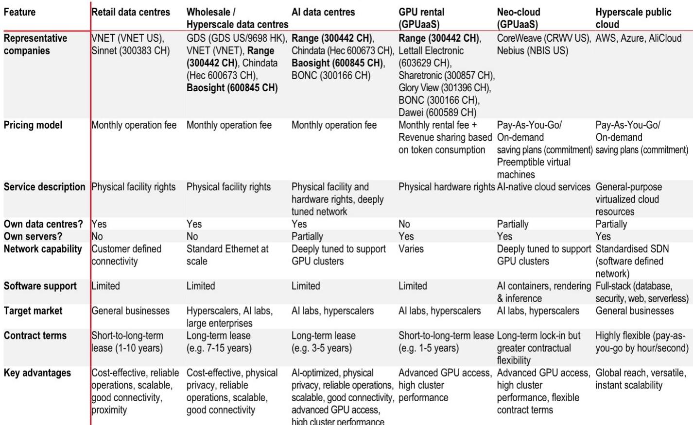
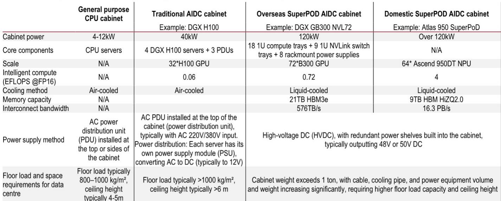
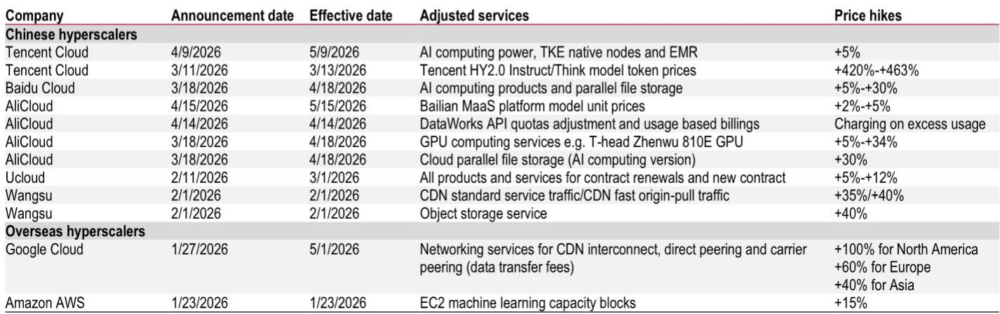

# China's AI Data Centre Boom Is Not a Bubble—It's a Structural Supply Crisis That Favors the Few

The thesis is straightforward but often misunderstood: China's AI compute demand is not merely growing—it is exploding at a scale that will quintuple capacity by 2028, and the market is structurally undersupplied. This is not a cyclical upswing driven by speculative capital. It is a physical infrastructure bottleneck created by the collision of insatiable token consumption, hyperscaler capex commitments that have already more than doubled, and a multi-year construction lag that no amount of financial engineering can compress. The implication for investors is clear: the winners will not be those who simply own data centres, but those who control the scarce combination of power quotas, high-bandwidth network architecture, and operational scale required to serve the next generation of AI workloads.

Why now? Because the market is at an inflection point where the narrative shifts from "AI is coming" to "AI is here and the pipes are clogged." Daily token consumption in China reached 140 trillion in March 2026, a 40% increase from just three months prior. Agent token usage is forecast to grow from virtually zero to 152,667 peta by 2030. The hyperscalers—ByteDance, Alibaba, Tencent—have responded by raising combined capex from RMB346 billion in 2025 to over RMB700 billion in 2026. Yet the supply side cannot keep pace. A new AI data centre takes 18 to 24 months to build and ramp. The result is a pricing environment where GPU rental rates have risen 40% since early 2025, and cloud service providers across the board have announced price hikes of 5% to 463% on AI compute products.

This report from a global investment bank makes a compelling case that the AI data centre opportunity in China is both larger and more concentrated than most investors appreciate. But the real strategic insight lies not in the demand numbers—impressive as they are—but in the supply dynamics that will determine which companies capture the value. The following sections unpack the key arguments, identify the unresolved questions, and provide a decision framework for investors navigating this complex landscape.

## The Demand Trajectory Is Underestimated Because Token Consumption Is Not Linear—It Is Exponential and Agent-Driven

The conventional view of AI compute demand is anchored to model training cycles: a new large language model is trained, compute demand spikes, then plateaus. This framework is dangerously outdated. The report's analysis reveals a fundamentally different demand structure driven by inference and agent-based workloads. China's intelligent compute demand is expected to reach over 12 ZFLOPS by 2028, nearly eight times the 2025 level. But the more striking projection is that data centre demand for intelligent compute will grow at a 74% CAGR over the same period, reaching approximately 5.4 gigawatts.

The mechanism behind this growth is the explosion of token consumption, which is not a one-time event but a compounding phenomenon. As generative AI moves from experimental use to production deployment, each application—whether a customer service agent, a code generation tool, or a medical imaging assistant—consumes tokens continuously. The report cites IDC estimates that global agent token usage will grow from 0.0005 peta in 2025 to 152,667 peta in 2030. This is not a tenfold increase; it is a nine-order-of-magnitude leap. For investors, the implication is that demand forecasting based on historical compute patterns will systematically understate the required capacity.

The strategic insight here is that the hyperscalers' capex commitments are not optional—they are defensive necessities. With Tencent, Alibaba, and ByteDance collectively spending over RMB700 billion in 2026, the scale of investment is already approaching the intensity of US peers, yet China's total compute capacity remains well below comparable levels. This gap suggests that the capex cycle has room to run far longer than most market participants expect. The question is not whether demand will materialize, but whether the infrastructure ecosystem can deliver capacity fast enough.

## Supply Constraints Are Structural, Not Cyclical, and Favor Incumbents with Pre-Existing Power and Network Assets

The most underappreciated aspect of the AI data centre thesis is that supply constraints are not merely a function of GPU availability—they are embedded in the physical infrastructure itself. The report details that a new AIDC buildout typically requires 18 to 24 months for construction and utilisation ramp-up. But this timeline assumes that power allocation, cooling system design, and network integration proceed without delays. In practice, each of these elements faces independent bottlenecks.

Power is the most binding constraint. China's western regions offer abundant low-cost green energy, but transmission infrastructure and regulatory approvals create multi-year lead times. The report notes that leading operators with existing energy quota reserves and liquid cooling technologies will gain structural advantages. This is not a minor edge—it is a moat. Companies that already have land, power approvals, and cooling systems in place can bring capacity online in 18 months; new entrants face three to five years of regulatory and construction hurdles.

The network architecture dimension adds another layer of complexity. The shift to SuperPOD cluster architecture—where hundreds of GPUs are aggregated into a single rack via high-bandwidth interconnects—raises the technical bar dramatically. A SuperPOD cabinet can draw over 120 kilowatts, compared to 4 to 12 kilowatts for a traditional CPU cabinet. This requires entirely different cooling, power distribution, and floor-loading specifications. The report's exhibit on SuperPOD requirements shows that domestic SuperPOD configurations demand cabinet power levels exceeding 120kW, with liquid cooling and high-bandwidth network switches as prerequisites.

The strategic implication is that the market is consolidating toward a small number of operators who can meet these technical requirements at scale. The report estimates that Range's market share in the domestic data centre space will rise from 6% in 2025 to 9% in 2028, while Ruijie's share of China data centre switches will increase from 21% to 24%. These are not dramatic shifts in percentage terms, but in a market growing at a 28% CAGR for switches alone, even modest share gains translate into outsized revenue growth.

## The "Token Export" Thesis Opens a Second Growth Vector That Most Investors Have Not Priced

One of the most provocative arguments in the report is that China's AI data centre operators have a long-term opportunity to serve global inference demand through "token exports." The logic rests on three structural advantages: China's model cost-efficiency, abundant low-cost green power in western regions, and lower construction and equipment costs compared to developed markets.

This is not a near-term catalyst—the report positions it as a long-term potential—but it has profound implications for valuation. If Chinese AIDC operators can capture even a fraction of global inference demand, the addressable market expands far beyond China's domestic hyperscaler spending. The cost advantage is real: Chinese data centre construction costs are estimated to be 30% to 50% lower than in the United States, and power costs in western China can be a fraction of coastal or international rates.

The unresolved question is whether regulatory and geopolitical barriers will prevent this thesis from materializing. Data sovereignty concerns, export controls on AI technologies, and the risk of retaliatory trade measures could limit the token export opportunity. The report does not provide a probability assessment, which is appropriate given the uncertainty. But for investors willing to take a long-term view, this thesis represents a free option embedded in the current valuations of leading AIDC operators.

## What the Report Does Not Fully Answer: The Durability of GPU Rental Pricing and the Risk of Overcapacity

For all its analytical rigor, the report leaves two critical questions unresolved. First, how durable is the current GPU rental pricing environment? The report documents that H100 rental prices have risen from RMB12 to RMB17 per GPU per hour, and that Nebius raised prices further in May 2026. But this pricing power depends on sustained supply-demand imbalance. If GPU availability improves faster than expected—whether through domestic production advances or eased import restrictions—the pricing tailwind could reverse.

Second, what is the risk of overcapacity in the 2028 to 2030 timeframe? The report's demand projections are aggressive, but they assume that token consumption continues to grow at exponential rates. If agent adoption slows, or if model efficiency improvements reduce compute requirements per token, the capacity that is being built today could face utilization risk. The report acknowledges that supply is currently the bottleneck, but it does not model a scenario where demand growth decelerates.

These are not flaws in the analysis—they are the natural boundaries of any forward-looking research. But they should give investors pause before extrapolating current pricing and growth rates indefinitely. The most prudent approach is to focus on operators with the strongest balance sheets and most flexible capacity, who can weather a potential downcycle better than leveraged new entrants.

## A Decision Framework for Investors: Three Filters to Separate Winners from Losers

Based on the report's logic and the structural dynamics it describes, investors evaluating AIDC opportunities should apply three filters:

**Filter One: Power and Land Sovereignty.** Does the company own or have long-term rights to data centre sites with secured power allocations? The report makes clear that power is the binding constraint. Operators who must compete for new power approvals in each cycle will face margin compression and execution risk. Those with existing portfolios of powered land sites have a structural advantage.

**Filter Two: Technical Capability for SuperPOD Architecture.** Can the company deliver cabinets exceeding 120kW with liquid cooling and high-bandwidth network integration? The shift to SuperPOD architecture is not optional—it is a requirement for serving the largest AI workloads. Operators who cannot meet these specifications will be relegated to lower-value, lower-growth segments of the market.

**Filter Three: Exposure to the Switch Ecosystem.** The report projects that the data centre switch TAM will reach RMB118 billion by 2030, growing at a 28% CAGR. Companies like Ruijie, which have a direct stake in this ecosystem, offer a different risk-return profile than pure-play AIDC operators. Switches benefit from both volume growth and price upgrades as port speeds increase, creating a double lever that pure capacity operators do not have.

These three filters are not exhaustive, but they provide a structured way to evaluate the dozens of companies that will claim exposure to the AI data centre theme. The report's preferred names—Range and Ruijie—score well on all three, but the framework can be applied to any company in the space.

## The Unanswered Analytical Questions Are Precisely Why You Need the Full Report

The argument presented here is that China's AI data centre market is undergoing a structural transformation that favors a small number of technically capable, well-capitalized operators. The demand drivers are real and accelerating. The supply constraints are binding and persistent. The pricing environment is favorable and likely to remain so for the next 18 to 24 months.

But the report contains nuances and data points that cannot be fully captured in a summary. The exhibits on GPU rental pricing trends, hyperscaler capex trajectories, and SuperPOD technical specifications contain granular details that inform investment decisions. The market share projections for Range and Ruijie are based on specific capacity buildout assumptions that deserve careful scrutiny. And the "token export" thesis—which could double the addressable market for Chinese AIDC operators—is presented with enough supporting data to warrant a deep dive.

Join the community to read the full report and review the original charts.

*This article is for learning and discussion only and does not constitute investment advice.*

Personal reading notes and learning share only. Not investment advice.

