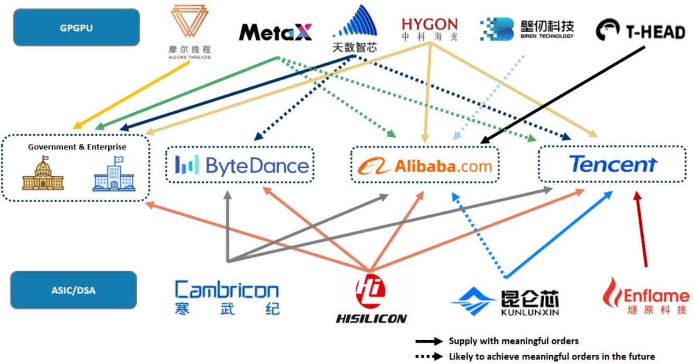

# The Next AI Bottleneck Is No Longer the GPU—It Is the Entire Infrastructure Stack

The semiconductor industry has entered a phase where the most important question is no longer which company builds the fastest training chip. For the past two years, the market has been fixated on GPU performance benchmarks, NVIDIA's dominance, and the race to scale large language models. That narrative is now incomplete. A global investment bank's latest research on European and Asian semiconductor supply chains reveals a more complex and strategically significant reality: the binding constraint on AI's continued expansion has shifted from raw compute to a set of interconnected bottlenecks spanning advanced packaging, passive components, power semiconductors, and the geopolitical bifurcation of AI chip supply chains. The implications for investors are not about picking a single winner in GPUs. They are about understanding which layers of the infrastructure stack will capture value as the industry scales into a new regime defined by inference workloads, custom silicon, and Chinese self-sufficiency.

The thesis is straightforward but non-obvious. The AI semiconductor market is not a monolith. It is fracturing along three axes: training versus inference, cloud versus edge, and general-purpose GPU versus custom ASIC. Each axis creates different winners and different bottlenecks. The report makes clear that the most acute shortages and the most attractive investment opportunities are emerging in areas that have historically been overlooked—multi-layer ceramic capacitors, advanced packaging capacity, power semiconductors, and the domestic Chinese AI chip ecosystem. These are not peripheral concerns. They are the structural constraints that will determine how fast AI can scale over the next three years.

The timing matters because the data is inflecting. Monthly sales growth among key Taiwanese MLCC suppliers has turned positive. Earnings revision breadth has improved meaningfully. Global discrete semiconductor revenue growth turned positive in the fourth quarter of 2025 after a prolonged downturn. Industrial automation companies are showing 21% year-over-year revenue growth. And Chinese cloud capex is surging, driven by domestic AI demand that is far more real than many Western investors appreciate. These are not speculative signals. They are the early indicators of a supply-driven upcycle that the market has not fully priced.

## The AI Infrastructure Bottleneck Has Moved from GPU Supply to Advanced Packaging and Passive Components

The market's obsession with GPU availability has obscured a more fundamental constraint: the physical ability to package, power, and stabilize these chips at scale. The report identifies advanced packaging—specifically CoWoS and SoIC technologies—as a critical gating factor. But the more surprising finding is the role of MLCCs, the small ceramic capacitors that are essential for power stabilization and noise filtering in every modern electronic device. AI servers require significantly more MLCCs than traditional servers, and the specification requirements are rising. Higher capacitance, lower equivalent series inductance, and embedded solutions positioned closer to CPUs and GPUs are becoming standard. This is not a niche market. The report estimates that AI server MLCC demand will approach $1 billion by 2027, driven by both content growth and spec upgrades.

The so-what here is structural. The MLCC industry is highly consolidated, with the top five suppliers controlling approximately 87% of the global market. This concentration means that capacity additions are deliberate and slow. When demand inflects, pricing power shifts to suppliers. The report highlights Murata and Samsung Electro-Mechanics as key beneficiaries, but the broader implication is that investors need to broaden their definition of "AI semiconductor exposure." The value chain extends far beyond the chip itself. It includes the passive components that enable the chip to function reliably at scale. And in a world where every incremental AI server requires more of these components, the bottleneck is not just at the leading edge of lithography. It is also at the level of ceramic powder and multilayer manufacturing.

## Custom ASICs Are Not a Threat to GPU Dominance—They Are a Complementary Growth Vector That Expands the Total Addressable Market

A persistent debate in the investment community is whether custom ASICs from cloud service providers will erode NVIDIA's GPU market share. The report provides a more nuanced and strategically useful framework. The data shows that major CSPs—Google, Amazon, Meta, and Tesla—are all investing heavily in custom chips. Google's TPU is entering its sixth generation, with a roadmap extending to a 1.4nm node. Amazon's Trainium series is scaling rapidly, with Trainium3 entering production and Trainium4 already in planning. The volume forecasts are striking: Google's TPU shipments are projected to grow from 500,000 units in 2023 to over 6 million units by 2028. Amazon's Trainium shipments are expected to rise from 300,000 to 2 million units over the same period.

But the report's key insight is that this ASIC expansion is not a zero-sum game. The total addressable market for AI compute is growing so rapidly that both GPU and ASIC demand can expand simultaneously. CSPs need custom chips for specific inference workloads where cost per token and power efficiency are paramount. They still need NVIDIA GPUs for large-scale training and for workloads where flexibility and ecosystem maturity matter more than raw cost. The report's framework suggests that investors should think in terms of three growth vectors: inference versus training, edge versus cloud, and custom versus general-purpose. Each vector creates different opportunities. The ASIC supply chain—design services, advanced packaging, memory integration—is becoming an independent investment theme, not just a footnote to the GPU narrative.

## China's AI Chip Ecosystem Is Closing the Performance Gap Through Infrastructure Innovation, Not Just Silicon Breakthroughs

The most provocative section of the report deals with China's domestic AI semiconductor ecosystem. The conventional Western narrative is that US export controls have crippled China's ability to compete in AI chips. The report challenges this assumption with data. The analysis compares nine factors across US and Chinese AI capabilities, covering chips, systems, and infrastructure. The conclusion is that China's infrastructure strength is narrowing the perceived technology gap. Domestic chips from companies like Cambricon, MetaX, and Iluvatar are demonstrating competitive performance per dollar, especially in inference workloads. The report's performance analysis, using DeepSeek R1 as the benchmark model, shows that Chinese accelerators can deliver comparable tokens per second at materially lower pricing.

The strategic logic is important. Chinese AI chip companies are pursuing a three-step strategy: if one computing die is not powerful, package more dies into a single chip. If one chip is not powerful enough, build larger racks and clusters. If one fab is not sufficient, expand manufacturing capacity. This is not a recipe for matching NVIDIA's absolute performance. It is a recipe for achieving adequate performance at scale, using available technology, and optimizing for total cost of ownership. The report estimates that domestic chips have lower TCO and comparable per-token cost versus NVIDIA's processors for China. This is a significant finding. It suggests that China's AI infrastructure buildout is not being held back by chip performance. It is being held back by capacity and supply chain constraints—constraints that the Chinese ecosystem is actively addressing.

The investment implications are specific. The report identifies Cambricon, MetaX, and Iluvatar as key names, with Cambricon expected to grow revenue at a 90% CAGR from 2025 to 2028 and Iluvatar at 122%. These are not speculative forecasts. They are based on order placement data, customer anchoring, and supply chain resilience. The report's framework for evaluating Chinese AI chip companies includes foundry sourcing viability, sovereign background, and AI inference performance. These criteria create a clear differentiation between companies that can execute and those that cannot.

## Power Semiconductors Are Entering a Supply-Driven Upcycle That the Market Has Not Priced

The power semiconductor market has been in a downturn for over two years, driven by weakness in automotive and industrial end markets. The report argues that this is about to change. Global discrete semiconductor revenue growth turned positive in the fourth quarter of 2025. Industrial automation companies are showing robust 21% year-over-year revenue growth in the first quarter of 2026. China EV wholesale growth, while weak year-to-date, is turning incrementally positive. These are early but meaningful signals.

The more structural argument is about supply. Global leading power semiconductor companies have been cutting capex for two years. Capacity additions are likely to slow further from 2026 to 2028. This creates a classic supply-driven upcycle: demand is inflecting from a low base, supply is constrained, and pricing power is returning to manufacturers. The report notes that auto and industrial applications account for approximately 70% of end demand in discrete semiconductors. If these end markets recover simultaneously, the supply-demand imbalance could be significant. The investment implication is that power semiconductor companies, particularly those with exposure to AI server power delivery architectures, are attractively positioned for a multiyear upcycle that is not yet reflected in consensus estimates.

## What the Report Does Not Fully Answer: The Geopolitical Risk Premium and the Inference Monetization Puzzle

For all its analytical depth, the report leaves several critical questions unresolved. The first is how to price geopolitical risk in Chinese AI chip companies. The report provides detailed revenue forecasts for Cambricon and Iluvatar, but these forecasts depend on continued access to advanced foundry capacity. If export controls tighten further, or if domestic foundries cannot scale to meet demand, the growth trajectories could be disrupted. The report acknowledges this risk but does not provide a framework for quantifying it. Investors are left to make their own judgments about the probability and impact of further supply chain restrictions.

The second unresolved question is about inference monetization. The report shows that inference workloads are growing rapidly and that domestic chips are competitive on cost per token. But it does not address who captures the economic value of inference at scale. Is it the chip vendor, the cloud service provider, or the application layer? The answer has profound implications for which parts of the value chain are most attractive. If inference becomes a commodity service, chip margins could compress. If inference remains differentiated by software ecosystem and memory bandwidth, the GPU incumbents may retain pricing power. The report provides the data to frame this question but does not answer it.

The third open question is about the pace of advanced packaging capacity expansion. The report identifies packaging as a bottleneck but does not model the timing of capacity additions from key suppliers. If packaging capacity expands faster than expected, the MLCC and power semiconductor bottlenecks may become more binding. If packaging remains constrained, GPU supply may be the limiting factor. The interaction between these constraints is complex and not fully modeled.

## A Decision Framework for Investors Navigating the Infrastructure-Led AI Cycle

The report's analytical structure lends itself to a clear decision framework for investors. The framework has three layers.

The first layer is the demand regime. Investors need to determine whether the AI market is in a training-dominated phase or an inference-dominated phase. Training favors GPU incumbents with the most compute density and the largest memory bandwidth. Inference favors custom ASICs with optimized cost per token and power efficiency. The report's data suggests that inference is becoming the dominant workload, which shifts the investment focus toward ASIC supply chains and inference-optimized silicon.

The second layer is the bottleneck identification. Within the AI infrastructure stack, which component is most supply-constrained? The report identifies three candidates: advanced packaging, MLCCs, and power semiconductors. Each has a different supply-demand dynamics and different pricing power. Investors should overweight the most constrained layer and underweight layers where capacity is abundant.

The third layer is the geographic exposure. The US and Chinese AI supply chains are decoupling. This creates two separate investment universes with different risk profiles and different growth trajectories. The US universe is driven by GPU incumbents and advanced packaging leaders. The Chinese universe is driven by domestic ASIC vendors and infrastructure builders. The two are not interchangeable. Investors need to decide which universe offers the better risk-reward based on their view of export controls, domestic policy support, and technology catch-up.

The report provides enough data to populate this framework but leaves the final judgments to the investor. That is as it should be. The function of serious research is not to provide answers. It is to provide the structure for better questions.

## The Full Picture Requires the Original Data and Charts

The analysis above draws on a rich body of research that includes detailed product roadmaps, supply chain maps, and financial forecasts for specific companies. The full report contains charts on MLCC demand by server type, ASIC volume forecasts by major CSPs, performance per dollar comparisons across Chinese AI accelerators, and capex trends for global power semiconductor leaders. These charts are essential for building conviction around the investment thesis. They show the inflection points, the capacity constraints, and the competitive dynamics in a way that text alone cannot.

Join the community to read the full report and review the original charts. The data on Cambricon's product roadmap, Iluvatar's revenue trajectory, and the MLCC demand curve for AI servers are not available in any other single source. For investors who want to position for the next phase of the AI cycle, this report provides the analytical foundation.

*This article is for learning and discussion only and does not constitute investment advice.*

Personal reading notes and learning share only. Not investment advice.

