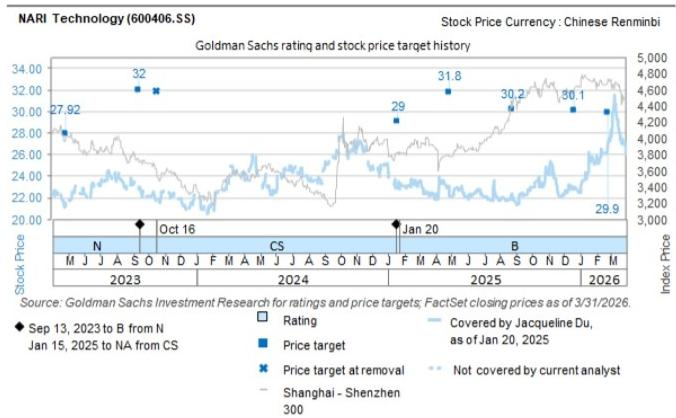
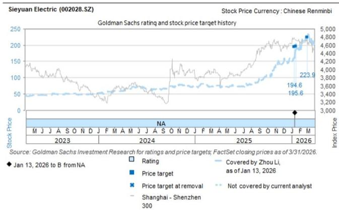
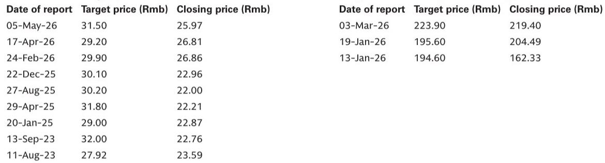

# GS：美国变压器缺的不是产能，是中国速度

这份来自GS的最新变压器出口追踪报告，在五月数据中揭示了一个被市场低估的信号：中国变压器总出口增速从4月的27%同比飙升至5月的72%。但真正值得关注的，不是这个数字本身，而是数字背后的结构性错配——美国本土变压器供需缺口高达72%，而中国供应商的交付速度是本土企业的四倍。

这不是一个简单的“中国出口强劲”的故事。这是一场关于全球电力设备供应链重构中，速度与规模如何重新定义竞争格局的博弈。

GS在这份报告中给出了明确的判断：美国电力变压器需求与本土供应的缺口，将从当前的72%收窄至2028年的57%。这个收窄幅度意味着什么？意味着即便考虑了所有已公布的美国本土扩产计划，短缺仍将持续存在。非传统供应商，包括中国企业，仍有明确的进入空间。

报告覆盖的三家核心标的中，GS对思源电气和国电南瑞给予买入评级，对华明装备维持中性。但比个股评级更重要的，是报告揭示的行业逻辑：在变压器交付周期长达128周的美国市场，思源电气能在6-9个月内完成交付，产能扩张周期仅需一年左右。这种速度优势，正在改写全球电力设备的竞争规则。

> **KC评论：** 72%的缺口听起来像是一个静态数字，但GS真正在说的是一个动态博弈——美国本土产能扩张需要2-3年，而中国供应商的扩产周期是一年。这中间的两年时间差，就是中国变压器企业最大的战略窗口。完整报告中对这个时间差的量化拆解，以及对各区域出口结构的详细分析，值得仔细推敲。

## 1. 五月出口数据爆发的真正推手，不是美国而是中东和非洲

五月中国变压器出口增速从27%跃升至72%，表面看是全面开花，但拆解区域贡献后会发现，真正的结构性变化藏在结构里。

非洲贡献了252%的同比增长，占出口总额的18%；中东152%的同比增长，占比23%；美洲113%的同比增长，占比21%；亚洲35%的同比增长，占比23%；欧洲则是唯一的负增长区域，同比下降12%，占比15%。

这个结构告诉我们三件事。第一，中东和非洲的爆发式增长不是偶然，这两个区域的电力基础设施投资正在加速，且对价格敏感度较高，中国供应商的性价比优势在这里被放大。第二，欧洲市场的负增长值得警惕，可能反映了欧洲本土产能的恢复或贸易政策的调整。第三，美国市场虽然114倍的同比增长看起来很惊人，但这是在极低基数上的反弹，环比增长26%，相比4月的95%同比增速，实际动能并没有加速。

GS在这份报告中还提供了其他品类的出口数据：电子电表出口同比下降11%，断路器出口同比下降16%。这进一步印证了，变压器出口的强劲并非中国电力设备整体出口的普遍现象，而是特定品类的结构性机会。

> **KC评论：** 很多人看到72%的增速会认为中国变压器出口全面爆发，但GS的数据清楚显示，欧洲市场是负增长，电子电表和断路器也在下滑。这说明变压器出口的强劲更多是结构性需求驱动，而非中国制造业的整体竞争力提升。完整的区域出口拆分图表和品类对比数据，在报告中有更详细的呈现。

## 2. 美国本土产能扩张的承诺，与交付现实之间存在两年时间差

GS估算，美国电力变压器需求与本土供应的缺口将从72%收窄至2028年的57%。这个15个百分点的收窄，看似乐观，但背后是多重假设的叠加。

美国本土变压器制造商确实在扩产。Virginia Transformer刚刚宣布在阿拉巴马州新建一座变压器工厂。但问题在于，全球变压器交付周期仍然维持在约128周的高位，而新建产能从规划到投产通常需要2-3年。

相比之下，思源电气可以在6-9个月内交付变压器，产能扩张周期约一年。这种速度优势背后是中国供应链的敏捷性——上游原材料、零部件、熟练工人的配套能力，是美国本土制造商短期内难以复制的。

GS还指出，思源电气刚刚宣布了第三期变压器工厂，目标年产值达到90-100亿元人民币。这个规模对应的是全球化的产能布局思维，而不仅仅是满足国内需求。

> **KC评论：** 128周交付周期与24-36周交付周期的差距，本质上不是生产效率的差异，而是整个产业生态的差异。美国本土制造商面临的不仅是工厂建设周期，还有上游供应链的重建时间。GS报告中对这个时间差的量化分析，以及对思源电气产能扩张节奏的详细拆解，是理解这个投资主题的关键。

## 3. 价格信号出现分化，但尚未构成系统性风险

市场最担心的风险之一，是中国出口变压器的价格战。GS的数据显示，220-330MVA规格的变压器，3-5月滚动均价同比下降了29%。这个数字看起来触目惊心，但GS认为，价格仍处于2024年以来的正常波动区间内。

更值得关注的是中美两地的价格分化。美国变压器PPI自去年10月以来一直稳定在高位，5月同比上涨3.9%。而中国出口到美国的变压器价格，在10-220MVA规格上由于产品组合变化较大，难以观察出明确趋势。

这种价格分化说明，美国市场的定价权仍然掌握在本土供应商手中，中国供应商更多是在填补供需缺口，而非主动发起价格竞争。只要美国本土供需缺口维持在高位，中国供应商就有足够的议价空间。

原材料方面，变压器核心原材料取向硅钢（GOES）价格正在小幅下行，这对中国供应商的利润率是正向支撑。

> **KC评论：** 29%的价格跌幅很容易被解读为价格战信号，但GS的核心判断是“仍在正常区间”。这里的关键在于理解产品组合效应——不同规格、不同客户的变压器价格差异极大，单纯看均价变化可能会误判竞争格局。报告中对价格区间的详细图表和分规格分析，是判断价格趋势不可或缺的依据。

## 4. 报告尚未完全回答：中国变压器出口的关税和政策风险如何量化

这份GS报告提供了详实的数据和清晰的判断，但有一个关键问题没有完全展开：美国对中国变压器加征关税的可能性与影响。

目前中国变压器出口到美国，面临的是基础关税叠加301条款关税。如果美国进一步加征关税，或者将变压器纳入更广泛的贸易限制清单，中国供应商的成本优势可能被大幅压缩。

GS在报告中提到了“非传统供应商”这个表述，包括中国企业在内。但并没有详细分析，如果贸易壁垒升级，中国供应商是否可以通过东南亚等第三国产能规避，或者美国本土制造商是否能在短期内填补缺口。

另一个未被充分讨论的问题是，中国国内电网投资的节奏变化。国电南瑞的主要收入来自国内电网资本开支，如果国内电网投资放缓，其估值逻辑可能需要重新审视。

这些不确定性并不意味着GS的判断有误，而是提醒读者，任何基于当前数据的推演都需要考虑政策变量的变化。

## 5. 给产业决策者的观察框架：三个核心变量决定投资节奏

基于GS这份报告的逻辑，产业决策者和投资者应该建立以下三个观察维度：

第一，美国本土变压器制造商的产能扩张进度。GS假设缺口将从72%收窄至57%，这个假设的验证节点在2026-2027年。如果美国本土产能扩张速度慢于预期，中国供应商的窗口期将更长。

第二，中国出口变压器的产品结构变化。目前出口到美国的变压器中，52%来自10-220MVA规格，19%来自220-330MVA规格，29%来自400-500MVA规格。向更高电压等级、更高附加值产品的迁移速度，决定了中国供应商的利润天花板。

第三，原材料价格走势。取向硅钢价格的小幅下行是利好，但如果上游原材料价格反弹，中国供应商的成本优势将被侵蚀。GS的报告提供了材料价格指数的历史走势，可以作为后续跟踪的基准。

这三个变量互相影响，但核心逻辑只有一个：在供需缺口收窄之前，具有速度优势的中国供应商能够获得超额收益；缺口收窄之后，竞争将转向成本控制和技术升级。

这份GS报告的价值，不仅在于提供了五月出口数据的最新更新，更在于建立了一个清晰的供需分析框架。报告中对美国PPI与中国出口价格的对比、各区域出口贡献的拆解、以及三家核心标的的评级逻辑，都值得深入阅读。

报告中的图表数据包含了超过12张详细图表，涵盖出口金额分区域拆解、价格趋势、原材料价格走势、以及美国PPI与其他电力设备品类的对比。这些图表背后的二阶效应，以及GS分析师在报告中未完全展开的假设条件，是理解这个投资主题的关键。

每天由AI agent和人工review生成的国际投行中文摘要与KC评论，会持续跟踪这些变量，并整理当天最新数据图表合集，方便喂给AI，也方便人工快速把握市场动态。欢迎来知识星球微信群继续讨论这些未解问题。

Personal reading notes and learning share only. Not investment advice.

