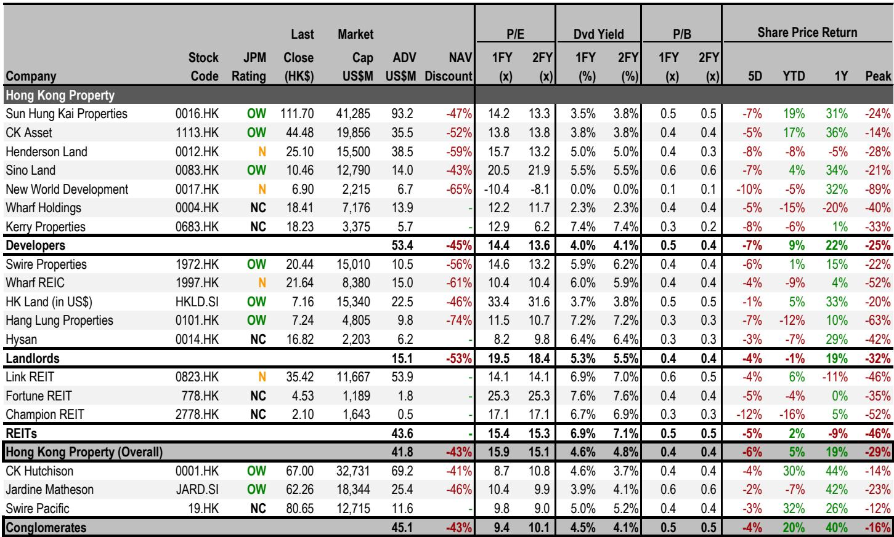
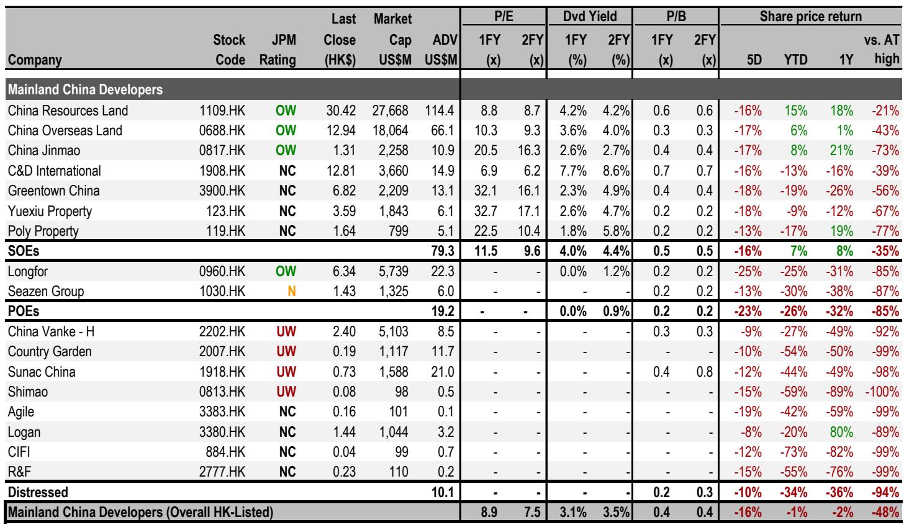
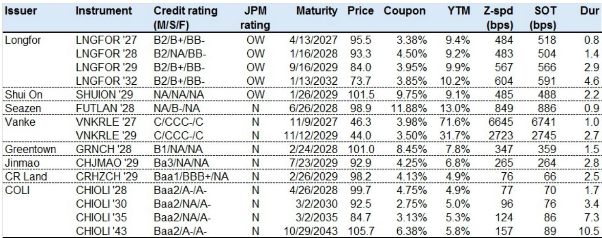

# JPM：中国楼市真正的拐点，不在成交量，在挂牌量

这份JPM最新周度数据监测，在端午假期扰动之下，给出了一个值得认真对待的信号：中国房地产市场并非全面回暖，但一线城市二手房挂牌量的持续下降，正在为价格企稳构筑一个此前被市场低估的底部。这并非简单的“销售回暖”故事，而是一个关于供给收缩如何改变定价权的结构性变化。

市场普遍关注成交量，因为它是情绪的晴雨表。但JPM的数据显示，真正关键的变化发生在供给端。一线城市二手房挂牌量已从3月峰值下降2.6%，上海单周挂牌量更是加速下降1.1%。当卖盘不再涌出，买方才有机会在议价中不再被动。这正是本轮周期与以往最大的不同。

当然，端午假期打乱了所有周度数据的可比性。10城实时二手房成交同比从+13%骤降至0%，60城新房网签同比下滑23%。JPM特别指出，若与去年同期端午假期对比，10城及一线城市成交分别上升15%和10%。数据噪音之下，趋势并未逆转。

但噪音本身也值得解读。假期效应暴露了市场的一个脆弱点：当前成交量的韧性高度依赖交易日的正常节奏，一旦遇到假期扰动，同比增速就会快速收窄。这意味着，市场尚未形成自我强化的内生动力。真正的考验在下半年，当政策脉冲效应消退，成交量能否在没有假期干扰的情况下维持正增长。

> **KC评论：** JPM的数据提醒我们，不要被单一周的数据牵着走。端午假期造成的同比失真，在二手房网签数据中尤为明显——过去9周连续正增长的记录被中断。但剔除假期影响后，10城成交同比仍为正。这个细节在完整报告中有更细致的图表拆解，值得仔细对比。

## 1. 这轮变化真正考验的是企业能否把规模转化为议价权

JPM在信用债观点中明确提出“K型分化”正在加剧。5月统计局70城数据显示，一线城市二手房价格连续三个月环比上涨，但整体70城环比降幅从4月的-0.23%扩大至-0.26%。这组数据背后的含义非常清晰：市场正在分裂为两个世界。

一线城市的企稳，并非因为需求突然爆发，而是因为供给端出现了主动或被动的收缩。JPM跟踪的中原报价指数从17.8微降至17.3，说明业主涨价意愿并不强烈，但挂牌量下降意味着可售房源减少，买方选择范围收窄，议价空间自然压缩。

对于开发商而言，这意味着资产价值的重估将高度分化。在一线城市拥有优质土储和商业资产的公司，将受益于资产价格底部的确认。而广泛布局低能级城市的开发商，仍将面临持续的价格下行压力。JPM在股票和信用债层面的推荐，无一例外地指向了这种分化逻辑。

## 2. 上海是唯一一个在所有维度上都表现出韧性的城市

在JPM的数据中，上海的表现格外突出。一线城市二手房成交同比下滑3%，但上海仍保持正增长。12城二手房网签同比下滑13%，上海是唯一同比正增长的一线城市。更值得注意的是，上海二手房挂牌量单周下降1.1%，降幅远高于其他一线城市。

这意味着上海正在形成“量缩价稳”的正向循环：挂牌量下降减少供给，成交韧性维持需求信心，价格预期逐步稳定。JPM的中原经理信心指数虽从53回落至51，但仍处于50荣枯线上方，表明市场参与者对后市并未转向悲观。

上海的特殊性在于其经济基本面和人口流入的支持。但这也提出了一个问题：其他一线城市能否复制上海的模式？北京、广州、深圳的挂牌量下降幅度明显小于上海，成交数据也更为波动。如果上海的经验无法被快速复制，那么全国市场的企稳节奏将比预期更为缓慢。

> **KC评论：** 上海是当前中国楼市最值得观察的“实验室”。它的挂牌量下降速度领先于其他城市，这意味着价格修复可能也会领先。但报告没有展开的是，上海这轮挂牌量下降，有多少是政策限制的结果，有多少是市场自发出清？这个问题的答案，直接关系到其他城市的参考价值。完整报告中有更多城市层面的细分数据，可以帮助读者做出自己的判断。

## 3. 香港楼市已触及全年目标，下半年的动能才是真正悬念

JPM对香港住宅市场的判断非常直接：房价已实现全年10-15%涨幅目标的上沿，预计下半年涨幅将放缓至5%以下。这并非看空，而是对动能衰减的理性预判。

数据支撑了这一判断。香港房价指数周环比上涨0.6%，年初至今已累计上涨10.4%。但35个大型屋苑的二手房成交量仅为43套，环比下降16%，同比下降47%，为春节以来最低。恶劣天气固然是短期因素，但成交量与价格的背离已经出现。

中原经纪人指数从69.6回落至68.2，虽然仍高于50荣枯线，但边际走弱。估值指数从82.7升至86.2，说明业主定价预期仍在走高。这种“量缩价涨”的组合，在历史上通常是动能见顶的前兆。

JPM的推荐组合也反映了这种谨慎：开发商方面，他们更青睐拥有优质资产和稳定派息能力的公司，如CKA和Sino；收租股方面，Swire Properties和HKL是首选。这暗示了他们对交易性机会的偏好正在减弱，而对现金流和资产质量的要求在提升。

## 4. 信用债市场的“K型”修复：新城控股的REITs操作值得关注

JPM信用债团队指出，JACI中国高收益地产指数上周上涨0.3%，年初至今回报率达6.4%。但真正值得关注的不是指数本身，而是个体信用之间的分化。

新城控股被单独提及。据Debtwire报道，新城控股计划在6月完成一笔20亿元人民币的私募REITs扩募，底层资产为天津和南通的两个购物中心。这笔操作如果成功，将覆盖该公司2026年剩余17亿元的在岸到期债务。JPM认为这一规模“可观”。

这揭示了一个重要的信用修复路径：拥有优质商业资产的公司，可以通过REITs等工具实现资产变现和债务覆盖，从而避免信用事件。而缺乏这类资产的公司，融资渠道将更为狭窄。

新城控股的操作还暗示了一个更大的趋势：中国商业地产的资本化率正在被重新定价。如果REITs能够为商业资产提供更透明的定价基准，那么整个行业估值体系可能面临重塑。JPM在信用债推荐中选择了龙湖和旭辉的美元债，正是基于对这类“资产变现能力”的判断。

> **KC评论：** 新城控股的REITs操作，是当前信用债市场最值得跟踪的微观案例。它不仅关乎一家公司的存续，更检验了“商业资产+REITs”这一融资模式的可复制性。如果成功，可能会为多家开发商提供模板。但报告没有展开的是，20亿的规模相对于新城控股的整体债务来说仍然有限，这种模式能否规模化，仍需观察。完整报告中有更多关于信用利差和个券分析的细节。

## 5. 报告尚未完全回答：下半年政策真空期，成交量能否自我维持

JPM的数据清晰地展示了当前市场的状态：一线城市在供给收缩的支撑下价格企稳，但全国范围的成交量仍高度依赖政策脉冲和正常交易节奏。端午假期的数据扰动只是表象，更深层的问题是：当没有假期、没有政策刺激时，市场能否靠自己站稳？

这个问题在下半年将面临真正的检验。一方面，一线城市的挂牌量下降趋势能否延续，决定了价格修复的可持续性。另一方面，低能级城市的价格下行压力仍在加大，5月70城环比降幅扩大，说明全国层面的底部尚未到来。

JPM没有给出明确的答案，但他们的推荐组合已经隐含了判断：聚焦一线城市、聚焦优质资产、聚焦现金流确定性高的公司。这本身就是一种对市场分化的确认。

---

端午假期数据背后的噪音，恰好提供了一个审视市场真实状态的窗口。JPM这份周报的价值，不在于给出了一个简单的“好”或“坏”的判断，而在于用数据揭示了市场正在发生的结构性变化：挂牌量的下降正在改变定价权，但这一过程远未完成。

这些未解问题——挂牌量下降的可持续性、香港量价背离的后续演化、REITs融资模式的可复制性——正是我们需要持续跟踪和讨论的焦点。每天，我们的AI agent和人工团队会从JPM、GS、MS等国际投行的最新报告中，提炼中文摘要与KC评论，daily更新约10-40页，并整理当天最新数据图表合集。这份材料既方便喂给AI做进一步分析，也方便人工快速把握市场动态。欢迎来星球微信群里继续讨论。

Personal reading notes and learning share only. Not investment advice.

