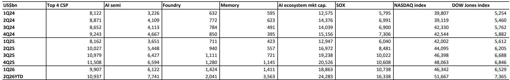
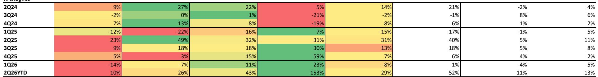

# Memory Is Becoming the Most Strategic Asset in AI Infrastructure—But the Market Is Still Pricing It Like a Commodity

The semiconductor market has entered a phase where memory is no longer a passive component but the central bottleneck in AI infrastructure buildout. Over the past one to three months, memory share prices have surged 44 to 184 percent, dramatically outpacing the Philadelphia Semiconductor Index's 20 to 88 percent gain during the same period. This is not noise. This is the market beginning to price in a structural shift that most investors have yet to fully internalize: memory has become the most strategically scarce resource in the AI value chain, and its pricing power is only beginning to reflect that reality.

The upcoming earnings season for the second quarter of calendar 2026 will be a critical inflection point. Investors are understandably focused on near-term volatility, labor strikes, and the slow pace of long-term agreement announcements. But the deeper story is about a supply-demand imbalance that is worsening, not improving; about memory's rising share of cloud service provider capital expenditure that has already crossed 50 percent; and about a valuation re-rating that long-term agreements, when they finally materialize, will unlock.

The argument is straightforward: memory is structurally undersupplied through at least 2027, its strategic importance to artificial general intelligence is non-negotiable, and the current market pricing still embeds a commodity discount that no longer applies. Investors who treat the current volatility as a reason to hesitate risk missing the cycle's most consequential repricing.

## Long-Term Agreements Are Delayed, Not Derailed—And They Will Be the Catalyst for a Structural Valuation Re-Rating

The market has grown impatient with the slow pace of long-term agreement announcements since May. Several investors have interpreted the silence as a sign that demand is softening or that memory makers lack pricing power. This interpretation is mistaken. The delays reflect prudence, not weakness. Memory manufacturers are negotiating terms that will govern multi-year, multi-billion-dollar supply commitments. Price floors, prepayment structures, penalty clauses, and volume guarantees all take time to calibrate when the underlying product is evolving every generation.

The recent agreement between Micron and Anthropic offers a template for what is coming. That deal structured long-term supply of HBM, DRAM, and SSDs alongside an equity investment, creating alignment between supplier and customer that goes far beyond a traditional purchase order. Samsung and SK Hynix are also strategic equity partners of Anthropic. The implication is clear: the hyperscalers and leading AI labs are moving toward a model where memory supply is secured through strategic partnerships, not spot markets.

Expect announcements from Asian memory makers with US hyperscalers in the second half of 2026. When they come, they will provide the foundation for a gradual multiple re-rating. The market is waiting for proof that memory has escaped its historical cyclicality. These agreements will be that proof.

## Memory Content Optimization Is a Symptom of Shortage, Not a Sign of Weakening Demand

Recent headlines about SOCAMM content cuts and the shift to 12Hi HBM4E sampling instead of 16Hi have raised concerns that AI models are becoming less memory-intensive. Some investors have pointed to cost-optimized models like DeepSeek or Turboquant as evidence that the memory shortage may self-correct through innovation.

This logic gets the causality backwards. Memory content optimization is happening because there is not enough supply. Customers are adjusting specifications not because they want less memory, but because they cannot get enough of it. The shift from 16Hi to 12Hi in HBM4E sampling is a budget-optimization decision, not a performance preference. It reflects the reality that memory makers are allocating scarce capacity, and customers must prioritize what they can secure.

The role of memory as a strategic asset in AGI buildout remains unchanged. The demand for tokens is exploding, and every token requires memory bandwidth. Some investors have flagged networking innovations like co-packaged optics as a potential workaround that could reduce memory requirements per rack. This is speculative at best. Current demand projections show no signs of demand destruction that would meaningfully ease the supply-demand imbalance. If anything, 2027 is expected to be worse than 2026.

The key monitoring point will be the next server architecture pipeline updates from major cloud service providers. Their commentary on performance trade-offs amid memory spec adjustments will tell us whether content optimization is a temporary workaround or a structural shift. The weight of evidence currently favors the former.

## Memory's Rising Share of CSP Capex Is Justified by Its Strategic Role, But the Market Needs a Narrative Breakthrough

The most striking data point in the current cycle is that memory now accounts for over 50 percent of cloud service provider capital expenditure, up from less than 20 percent in the pre-AI era. This number is expected to trend above 70 percent next year. Many investors find this trajectory unsustainable. They argue that memory cannot continue to consume such a large share of CSP budgets without a corresponding acceleration in AI service revenue to justify it.

This concern conflates two separate questions. The first is whether memory's value share is justified by its contribution to system performance. The answer is yes. Memory is no longer a peripheral component; it is the determinant of how many tokens can be generated per dollar of infrastructure spend. The relationship between memory performance and AI output is tighter than ever.

The second question is whether the market has already priced this in. The evidence suggests it has not. Consensus forecasts for memory value within CSP capex have moved up substantially, but the pace of revision has been faster in the semiconductor space than among the hyperscalers themselves. It may take additional months for the gap to narrow. But the direction is clear.

Memory's market cap relative to the rest of the AI ecosystem has historically correlated strongly with its share of CSP capex. As that share continues to rise, memory stocks should capture a growing proportion of AI ecosystem value. The current ratio still understates memory's strategic importance.

## The True Decision Framework Is Not About Timing the Cycle but About Distinguishing Structural Scarcity from Cyclical Noise

Investors approaching the memory market today face a difficult analytical challenge. The share price volatility is real. The labor strike at Samsung is a genuine operational risk. The Chinese DRAM maker's impending IPO introduces a new competitive dynamic. And the pace of LTA announcements has been disappointing.

The decision framework that matters is not about predicting the next quarter's earnings beat or miss. It is about distinguishing between factors that are structural and those that are cyclical or transient.

Structural factors include: the worsening supply-demand imbalance through at least 2027; the multi-year lead time for greenfield capacity expansion; the structural restriction on bit output from HBM's wafer consumption; and the non-negotiable role of memory in AGI infrastructure.

Cyclical or transient factors include: the timing of LTA announcements; the specific terms of individual agreements; labor disputes; and the near-term volatility around earnings dates.

The evidence shows that memory share prices ultimately follow the EPS revision cycle, with LTAs acting as a re-rating catalyst. Near-term volatility around earnings dates has been high, but the three-month post-earnings performance has consistently rewarded patience. The current rally has been sharp, but it has lagged the upward revision in consensus EPS estimates until very recently.

The correct question is not whether memory shares have run too far too fast. It is whether the structural thesis has changed. It has not.

## What the Report Does Not Fully Answer: The Interaction Between Chinese Competition and Global Pricing Power

The report flags the imminent IPO of a Chinese DRAM manufacturer as a development worth monitoring, but it does not fully resolve the question of what this means for global memory pricing over a three-to-five-year horizon. The Chinese player has approval to raise approximately USD 4.3 billion on the Shanghai stock exchange, with a listing potentially as early as July. Local producible capacity is estimated at 300,000 wafers per month by the end of 2026, representing about 14 percent of global DRAM capacity, with annual increases of roughly 100,000 wafers through 2029.

The report's base case is that Chinese DRAM players will prioritize the local B2C market and make only gradual entry into the low-end HBM space, with limited impact on the high-end market serving US hyperscalers. This is a reasonable starting point, but it leaves several open questions.

First, can the Chinese manufacturer successfully scale down to 1anm and achieve competitive DDR5 yields for server-grade memory? Second, will the IPO proceeds accelerate capacity expansion beyond current estimates? Third, how will US export controls and potential retaliation evolve in response to a listed Chinese memory champion?

The most important unknown is whether Chinese competition will compress margins in conventional DRAM to the point where it affects the economics of the entire industry, or whether the market will bifurcate into a high-end segment dominated by Korean and US players and a low-end segment where Chinese players compete on price. The report leans toward the bifurcation scenario, but the evidence is not yet conclusive.

## The Community Question: How Do You Position for a Re-Rating That Has Not Yet Begun?

The full report contains the original charts that illustrate the relationship between memory's share of CSP capex, its market cap trajectory, and the EPS revision cycle. These charts are essential for understanding why the current moment is different from previous cycles.

The report also includes detailed analysis of HBM pricing economics, the trade-loss ratio across generations, and the capacity allocation decisions that will determine which products remain in shortage and for how long. For investors who want to move beyond the headlines and build a position based on structural scarcity rather than cyclical momentum, these details matter.

The most important unresolved question is whether the market will wait for LTA announcements before re-rating memory stocks, or whether the re-rating has already begun and the LTAs will simply confirm it. The evidence from the past three months suggests the latter, but the next earnings season will provide the data needed to test this hypothesis.

Join the community to read the full report and review the original charts that show the CSP capex share trajectory, the memory market cap evolution, and the EPS revision cycle that underpins the structural thesis.

*This article is for learning and discussion only and does not constitute investment advice.*

Personal reading notes and learning share only. Not investment advice.

