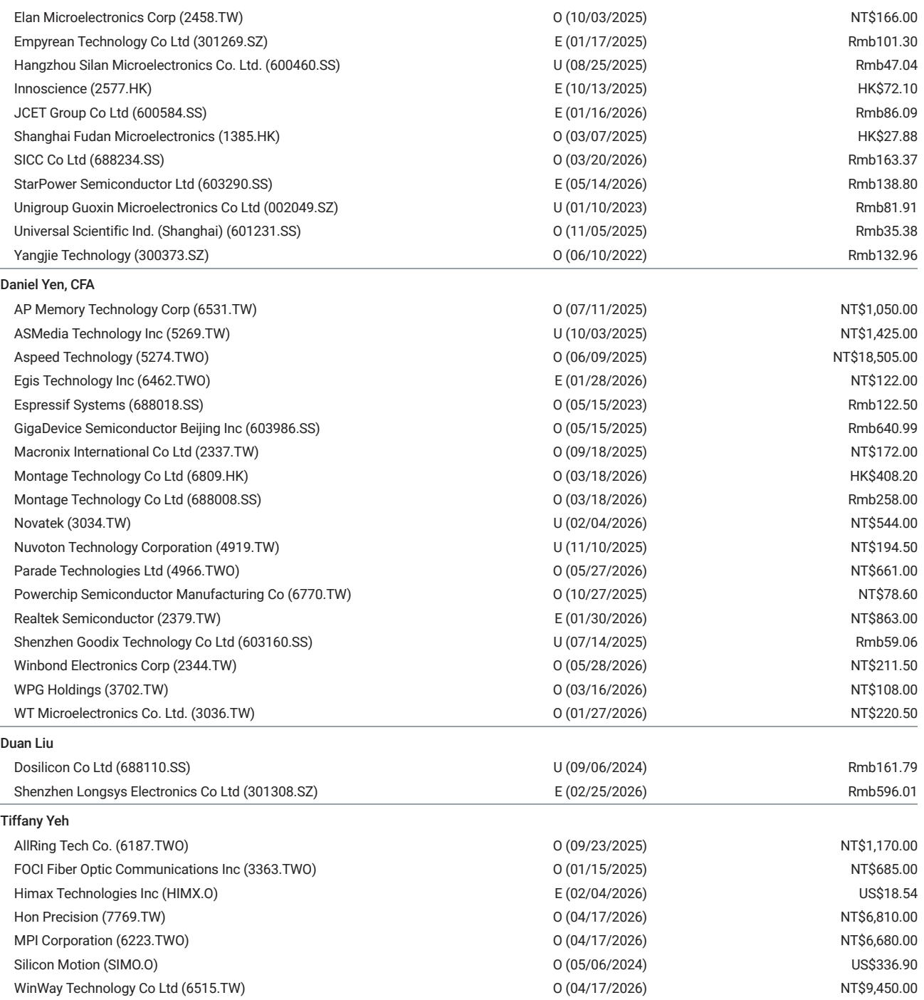
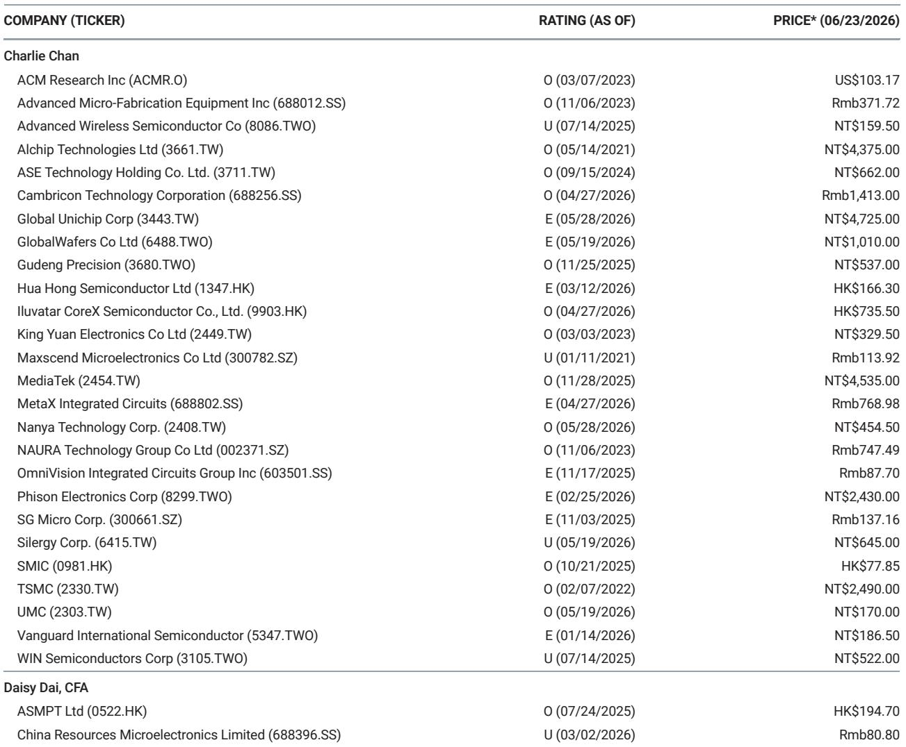
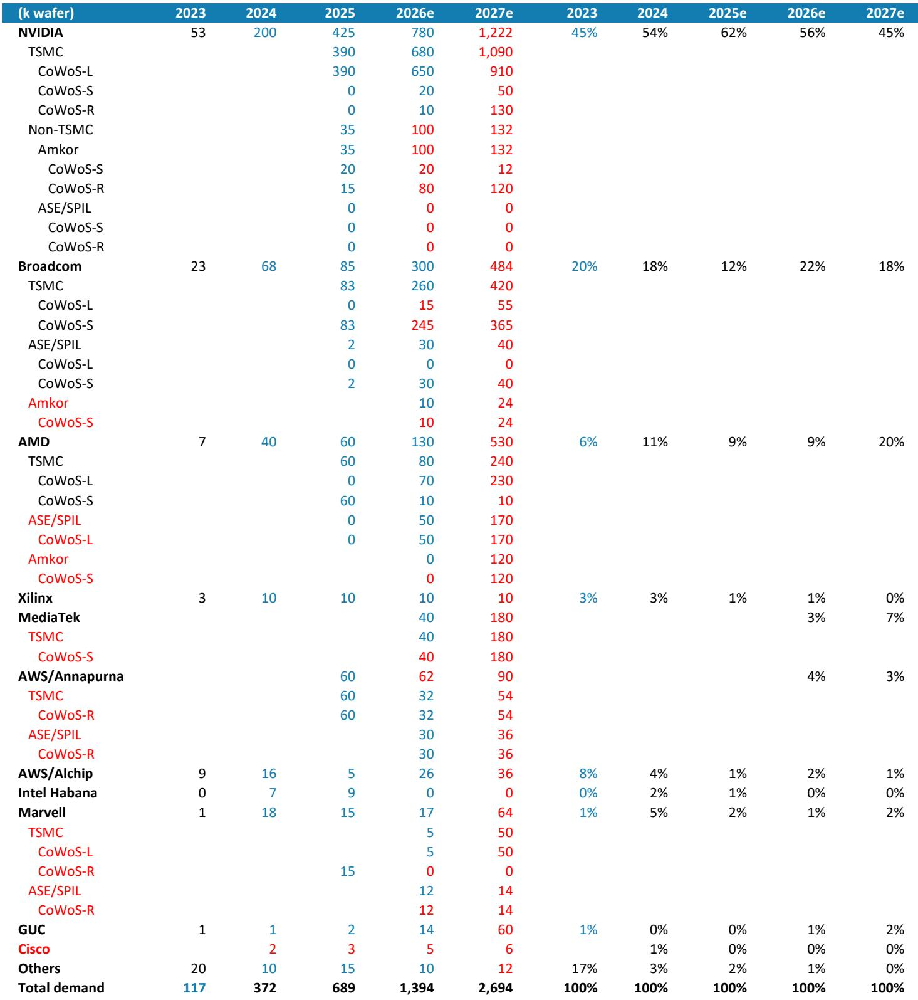

# 摩根斯坦利：MS：2027年CoWoS的蛋糕，NVIDIA切走一半，但真正的变量在CPU

当市场还在争论AI算力需求是否会在2026年见顶时，MS的一份最新报告给出了一个反直觉的判断：2027年，全球AI芯片的先进封装产能不仅不会过剩，反而会迎来新一轮结构性扩张，而推动这一轮增长的，不只有GPU。

这份由Charlie Chan领衔的亚太科技团队发布的报告，核心在于首次系统性地拆解了台积电2027年的CoWoS产能分配。结论清晰且有力：NVIDIA依然是最大的单一客户，但真正让这份报告值得细读的，是它揭示了CPU正在成为先进封装的新变量，以及Google TPU生态中联发科的意外崛起。

这不是一份简单的产能预测。它是一张2027年AI芯片竞争格局的路线图。谁在扩张，谁在收缩，谁在借势，都写在了CoWoS的订单里。

---

## 1. 2027年CoWoS总需求逼近270万片，NVIDIA占比降至45%但绝对值仍翻倍

MS将台积电2027年底的CoWoS产能假设从17万片/月上调至20万片/月，这意味着全球AI XPU产业在2027年将实现约60%的同比增长。而根据供应链核查，全球CoWoS总需求将从2026年的约139万片飙升至2027年的约269万片，接近翻倍。

NVIDIA的CoWoS消耗量预计增长57%，达到122万片。虽然其份额从2026年的56%下降到45%，但这并非需求减弱，而是因为其他玩家的增速更快。NVIDIA在CoWoS-L上的消耗量增长40%至91万片，主要服务于Rubin和Blackwell系列GPU。而CoWoS-R的订单激增则暗示了Vera CPU的出货量几乎翻倍——这一点与MS另一位分析师Joe Moore对NVIDIA数据中心收入增长52%的预测一致。

> **KC评论：** 份额下降不代表地位动摇。NVIDIA的绝对消耗量从78万片增至122万片，增量高达44万片，超过Broadcom或AMD的全年总量。这意味着，即便竞争对手在追赶，NVIDIA对先进封装产能的锁定能力依然是行业天花板。完整报告中有一张2023-2027年各客户CoWoS消耗量的堆叠图，直观展示了NVIDIA的领先优势如何被稀释但未被撼动。

---

## 2. Google TPU双供应商策略成型，联发科成为2027年最大变量

报告中最引人注目的变化来自Google TPU供应链。MS将联发科2027年的CoWoS-S预订量定为18万片，对应约360万颗TPU v8t芯片，远高于此前250万颗的出货假设。如果联发科能够帮助Google解决T-Glass基板供应问题，这一数字还有上行空间。

与此同时，Broadcom的CoWoS-S预订量为36.5万片，其中约33万片分配给TPU v8i，对应约390万颗芯片。这意味着，Google在2027年将同时通过联发科和Broadcom两条线生产TPU，且联发科的产品主打更高性价比的v8t，而Broadcom的v8i则拥有更大的芯片面积和更高的单颗价值。

更值得关注的是，报告披露了Google下一代2nm TPU的代号：TriggerFish。这是HumuFish的推理优化版本，暗示Google正在将训练和推理芯片分拆设计，以更精准地匹配不同工作负载。TriggerFish还可能用于TPU租赁服务，这将是Google云业务的一个潜在增长点。

> **KC评论：** 联发科从手机芯片巨头跨界到AI ASIC，是这份报告中最有想象力的故事。18万片CoWoS-S的预订量意味着联发科在2027年将成为台积电CoWoS的第四大客户，仅次于NVIDIA、Broadcom和AMD。但这里有一个关键假设尚未验证：ABF基板的供应是否真的能跟上。报告中提到，联发科的出货量假设已经考虑了基板短缺的风险，但如果供应改善，上行空间可能超出预期。完整报告中的表Exhibit 3详细列出了每个客户的CoWoS类型和代工厂分配，值得仔细推敲。

---

## 3. CPU正在成为先进封装的第三极，AMD Venice CPU出货量暴增5倍

如果说GPU和ASIC是AI芯片的前两波浪潮，那么CPU正在成为第三极。MS的报告显示，2027年CPU对2.5D先进封装的需求正在显著增长，这呼应了Joe Moore在台湾实地考察后的观察：agentic AI正在驱动CPU需求。

具体来看，NVIDIA的3nm Vera CPU预计在2027年出货575万颗，而AMD的2nm Venice CPU出货量将从2026年的125万颗飙升至2027年的675万颗，增长超过5倍。Venice CPU的CoWoS预订量从5万片增至27万片，其中大部分产能由ASE/SPIL、Amkor和Powertech等非台积电阵营承接。

这一变化对供应链的影响是结构性的。AMD的CoWoS总消耗量增长308%至53万片，其中非台积电部分占比从2026年的38%提升至2027年的55%。这意味着，ASE、Amkor等封测厂商正在从AMD的CPU扩张中获得增量订单，而不仅仅是等待NVIDIA的溢出。

> **KC评论：** CPU进入先进封装，意味着AI算力的竞争已经从单纯的GPU军备竞赛，扩展到整个计算架构的重构。Agentic AI需要更频繁的推理和决策，而CPU在低延迟、高并发场景下的优势正在被重新定价。报告没有完全展开的是，这种CPU需求是否可持续，还是仅仅因为2027年是2nm CPU的换机大年。完整报告中有一张全球CoWoS产能按供应商拆分的图表，展示了台积电与非台积电阵营的产能扩张路径，是判断封测板块投资机会的核心素材。

---

## 4. Broadcom的ASIC帝国继续扩张，但增长引擎正在切换

Broadcom是这份报告中另一个值得深挖的标的。其CoWoS总消耗量增长61%至48.4万片，虽然增速不及AMD，但绝对增量依然可观。结构上，Broadcom的增长引擎正在从Google TPU向Meta的定制ASIC切换。

报告显示，Broadcom的CoWoS-L预订量从2026年的1.5万片增至2027年的5.5万片，主要用于Meta的MTIAv3 ASIC Iris。与此同时，Google TPU（Ironwood和SunFish）合计占Broadcom CoWoS-S预订量的34.3万片，对应约417万颗TPU芯片。此外，Broadcom还在承接其他小型AI ASIC客户的订单，但报告未详细披露具体名单。

值得注意的是，Broadcom的产能扩张并非全部在台积电。ASE/SPIL承接了4万片CoWoS-S，Amkor承接了2.4万片。这种多供应商策略一方面增强了供应链韧性，另一方面也意味着Broadcom对台积电的依赖度正在下降。

> **KC评论：** Broadcom的故事正在从“Google TPU代工厂”向“AI ASIC平台型公司”演进。Meta的Iris芯片是一个重要的新增量，但报告没有展开的是，这个ASIC的生命周期和迭代节奏如何。如果Meta的AI战略出现调整，Broadcom的CoWoS-L订单可能会面临风险。完整报告中有一张2027年各客户CoWoS消耗量的详细表格，包含了每个客户的产能类型和代工厂分配，是拆解Broadcom收入结构的关键。

---

## 5. 报告未完全回答的关键问题：产能扩张的瓶颈在哪里？

MS的这份报告提供了极其详尽的产能分配数据，但有一个问题始终悬而未决：这些产能扩张计划能否如期实现？

报告提到，台积电正在将Fab 15A的28nm/22nm空间转换为55nm interposer生产，这暗示了interposer本身可能成为瓶颈。此外，ABF基板的供应问题在报告中多次被提及，尤其是对联发科TPU出货量的潜在影响。非台积电阵营的产能扩张同样存在不确定性：ASE/SPIL计划将FoCoS+CoWoS产能从30万片/月扩至50万片/月，Amkor计划从20万片/月扩至30万片/月，但这些扩产计划是否已经获得了设备订单和材料保障，报告并未深入展开。

另一个未被充分讨论的风险是HBM的供应。报告显示，2027年AI HBM总需求将高达510亿Gb，NVIDIA的Rubin R200和Rubin Ultra将消耗其中的绝大部分。HBM4和HBM4e的量产时间表、良率爬坡速度，以及三星、SK海力士、美光之间的竞争格局，都将直接影响AI芯片的实际出货量。

> **KC评论：** 这份报告的价值在于它给出了一个极为清晰的“需求端”图景，但“供给端”的约束条件同样重要。interposer、ABF基板、HBM，任何一个环节的瓶颈都可能导致产能分配的实际结果偏离预测。完整报告中有多张图表展示了全球CoWoS产能的扩张路径和各供应商的产能分配，是判断这些瓶颈是否可控的核心素材。

---

## 6. 投资者的观察框架：从CoWoS分配看AI芯片竞争格局的五个维度

基于这份报告，我们可以建立一个五维观察框架，用于跟踪AI芯片竞争格局的变化：

第一，NVIDIA的CoWoS-L份额变化。如果NVIDIA的CoWoS-L消耗量增速低于40%，可能意味着Rubin系列的推出节奏延迟或需求不及预期。

第二，联发科的ABF基板供应进展。如果联发科能够成功解决T-Glass供应问题，其TPU出货量将超出当前假设，这将是2027年最大的预期差。

第三，AMD Venice CPU的出货量能否兑现。675万颗的出货假设意味着AMD在CPU市场的份额将显著提升，但这一假设依赖于agentic AI的需求能否持续爆发。

第四，Broadcom的ASIC客户多元化进度。Meta的Iris芯片是一个新变量，但Broadcom能否获得更多超大规模客户的ASIC订单，将决定其长期增长空间。

第五，非台积电阵营的产能扩张执行力。ASE和Amkor的扩产计划能否如期完成，将直接影响AMD和Broadcom的产能保障，也是封测板块投资的核心变量。

---

这份MS的报告为我们提供了一个难得的“上帝视角”，让我们得以提前两年看到AI芯片产业的竞争格局。但正如所有预测一样，它建立在大量假设之上，而这些假设的验证过程，正是投资机会所在。

报告中的每一张图表、每一个数字背后，都隐藏着对供应链、技术路线和竞争格局的深刻判断。我们每天会由AI agent加上人工review，生成国际投行中文摘要与KC评论，daily更新约10-40页，并整理当天最新数据图表合集，方便喂给AI，也方便人工快速把握market dynamics。如果你对这份报告中的某个数字、某条供应链或某个假设有疑问，欢迎来星球微信群里继续讨论。

Personal reading notes and learning share only. Not investment advice.

