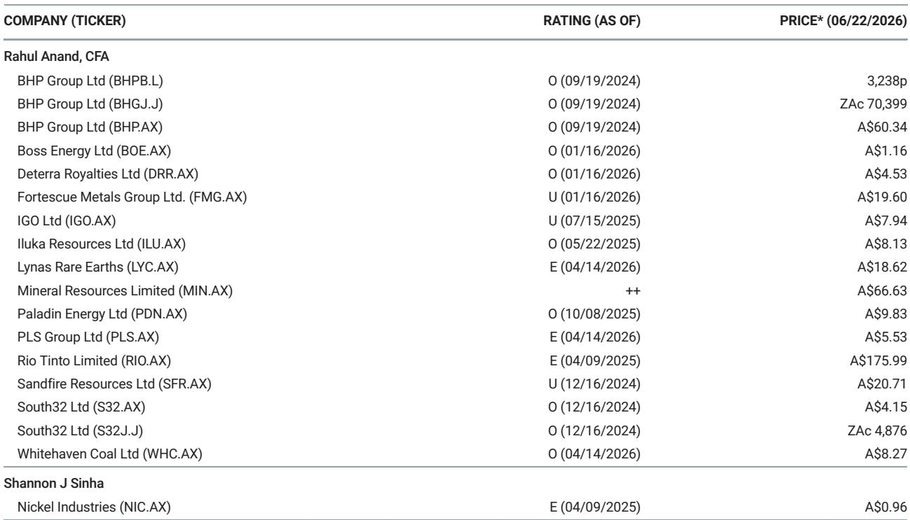
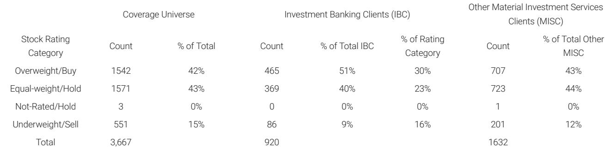

# 摩根斯坦利：MS：稀土磁材的“中国之外”叙事，产能不是最大变量

当市场还在争论“中国稀土出口管制”会带来多大冲击时，MS近期与一位拥有35年行业经验的专家进行了深度对话，并发布了一份罕见的、聚焦于稀土永磁产业“中国之外”产能建设的研报。这份报告的核心判断，可能和许多人的直觉相反：美国规划的稀土永磁产能，到2028年理论上足以覆盖其当前的全部进口需求。但问题不在于能不能造出来，而在于造出来之后，谁用、用在哪、成本是多少。

这份报告的价值不在于给出了一个简单的“看好”或“看空”结论，而是系统性地拆解了从产能到成本、从技术到应用、从军用到民用之间的多层逻辑断层。对于关注产业链安全、新能源上游材料以及全球制造业格局重组的读者而言，这是一份必须细读的框架性文件。

## 1. 美国规划的产能数字很漂亮，但“产出”和“产能”是两回事

报告中最引人注目的数据是：美国钕铁硼（NdFeB）磁材产能到2028年可能达到约2.8万吨/年，如果加上已融资和潜在项目，这一数字可达3.5万吨，远期甚至可能超过5万吨。而美国当前从中国、越南和欧洲进口的散装磁材总量大约只有8500吨/年。单从数字看，美国规划的产能是其当前需求的3倍以上。

但专家在讨论中反复强调了一个核心区别：产能不等于产出。决定实际产出的，不是厂房和设备，而是客户认证、金属/合金供应、良品率、工艺控制和成本竞争力。对于有经验的企业，从工厂设计到满产大约需要3年；而对于初创公司，这个时间可能接近6年。这意味着，即便2028年的产能数字是真实的，其实际产出能否达到8500吨，仍然高度不确定。

> **KC评论：** 这是一个经典的“规划泡沫”问题。投资者在看到大量产能建设公告时，需要区分“可融资的计划”和“可交付的产出”。完整报告中详细讨论了美国供应链中缺失的“氧化物到金属的转化”和“薄带铸轧合金生产”这两个关键环节，这些瓶颈是理解产能落地概率的关键。

## 2. 成本差距是西方磁材产业最硬的骨头，但质量差距并非不可逾越

专家给出了一个非常具体的判断：西方生产商大约需要3年时间就能达到中国磁材的质量水平，但在短期内几乎不可能达到中国的低成本。具体到价格，专家估计，西方生产的钕铁硼磁材可能比中国产品贵约50%。

这个成本差距并非来自单一环节，而是贯穿于整个制造链条：从更低的人工成本、更成熟的供应链、到几十年的工艺学习积累。中国供应商在2000年代初期的定价就已经是美国售价的75%，这直接导致当时美国生产商在盈亏平衡线上挣扎。一个具有竞争力的西方磁材产业，必须首先拥有一个能够支撑可持续定价的制造成本基础。

> **KC评论：** 50%的溢价在国防和某些高价值应用中是可以接受的，但对于价格敏感的电动汽车和风电行业，这是一个巨大的障碍。报告没有直接给出“成本差距何时缩小”的预测，而是提供了一套分析框架：需要关注哪些环节的成本下降路径。这正是完整报告中最值得深入推敲的部分。

## 3. 稀土减量化的故事，主要讲的是重稀土，不是钕镨

市场经常讨论“减少稀土使用量”的趋势，但这份报告给出了一个精确的修正：过去二十年，钕铁硼磁材中的总稀土含量只从约32%微降至约30.5%。真正的进步发生在重稀土（镝和铽）的使用上。通过晶界扩散、晶界工程、更细的晶粒尺寸和更低的应用温度，某些应用场景中重稀土的需求已经减少了50%以上。

而钕镨（NdPr）的替代则困难得多。专家明确指出，钕镨在钕铁硼磁材的化学结构中嵌入得更深。虽然镨的替代有助于拓宽可用原料来源，而铈/镧替代的牌号已经发展成一个低成本产品家族，但它们填补的是钕铁硼与铁氧体、铝镍钴等较低性能磁材之间的空白，而非替代高性能钕铁硼。

> **KC评论：** 这一结论对投资者的含义是：不要因为看到了“稀土减量”的新闻就认为钕镨需求即将见顶。重稀土的减量故事是真实的，但钕镨的需求增长逻辑依然坚实。完整报告中对不同应用场景下磁材用量的具体估算，是理解这一判断的基础。

## 4. 中国的稀土管制是国家安全问题，但商业影响要分层看

专家将中国的稀土相关出口管制部分归因于保护其产业地位，同时也有地缘政治考量。一个关键细节是：中国不仅直接出口磁材，还通过成品（如家电、风扇和其他设备）出口磁材。这使得管制在商业和政治上都非常敏感。

专家指出，客户已经在转向非中国供应商进行即时供应和审批流程。但一个重要的结构性矛盾在于：西方国防工业对钕铁硼磁材的需求可能不到500吨/年，这个量级很小，但国防应用往往与商业和工业应用混杂在一起，这使得“双重用途”的审批变得复杂。军用和高温应用仍然是敏感领域，钐钴（SmCo）磁材在高温和严苛的航空航天/国防应用中仍然具有不可替代性。

> **KC评论：** 500吨的国防需求与2万吨的规划产能之间形成了巨大的鸿沟。如果西方磁材产能只能依赖国防订单，那么产能利用率将非常低。真正的商业逻辑在于：除了国防之外，还有哪些民用领域愿意为“非中国”磁材支付50%的溢价？报告没有直接回答这个问题，但它提供了一个分析框架：需要区分“必须去中国化”的应用和“可以继续使用中国产品”的应用。

## 5. 风电和电动汽车的磁材需求，远没有市场想象的那么统一

报告中对终端市场的讨论非常务实。在美国，只有约1-2%的已安装风力发电机使用钕铁硼磁材，欧洲的比例略高，而中国可能达到30-50%甚至更高。在电动汽车领域，专家给出了一个具体数字：每千瓦额定电机功率的钕铁硼磁材重量约为12克，相当于每辆纯电动轻型车略高于2公斤，而混合动力车大约只用一半。

专家还提到，像移动机器人这样的新兴领域可能会增加需求，但许多应用使用的磁体非常小，虽然单价可能很高，但不需要数千吨的磁材产出。这意味着，对于大型磁材生产商而言，这些新兴市场可能无法提供足够的规模效应来消化新增产能。

> **KC评论：** 这是整份报告中最具“反常识”价值的部分之一。市场往往将“新能源”和“稀土磁材”直接划等号，但现实是，不同地区、不同技术路线、不同应用场景对磁材的需求结构差异巨大。完整报告中包含了对风电、电动汽车、机器人等细分市场的详细需求测算，这些数据是判断产能过剩风险的关键输入。

---

这份MS的研报，表面上是在讨论一个技术性很强的产业问题——稀土永磁的产能建设。但它的深层价值在于，提供了一个理解“供应链去风险化”这一宏大叙事的微观分析框架。它告诉我们，产能数字只是故事的开始，真正的博弈发生在成本、认证、工艺和终端需求这四个维度上。

报告没有给出“看好”或“看空”的简单结论，而是留下了一系列需要继续追问的问题：西方磁材的成本差距能否通过技术突破或政策补贴来弥补？国防需求的500吨规模能否撬动更大的民用市场？电动汽车和风电对磁材的需求结构，是否会因为技术路线变化而出现重大调整？这些问题的答案，决定了全球稀土永磁产业链未来十年的格局。

每天，我们会由AI agent结合人工review，生成国际投行中文摘要与KC评论，日更约10-40页，并整理当天最新数据图表合集。这份材料既方便喂给AI进行深度分析，也方便人工快速把握全球市场的动态变化。欢迎在星球微信群里继续讨论这些未解的问题，我们会持续跟踪产业链的每一个关键变量。

Personal reading notes and learning share only. Not investment advice.

