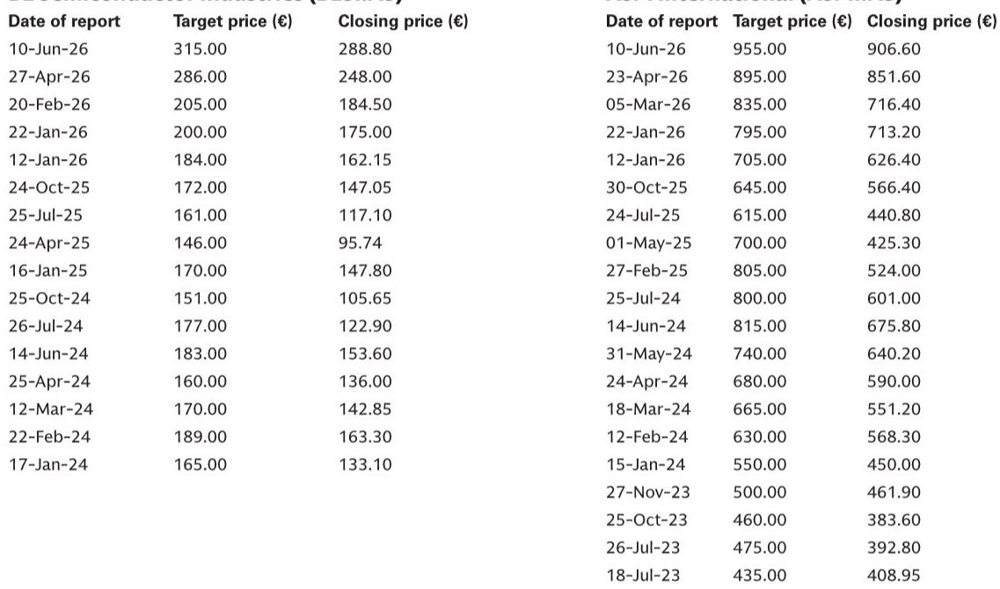
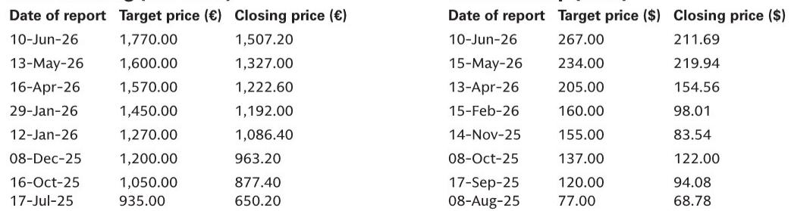
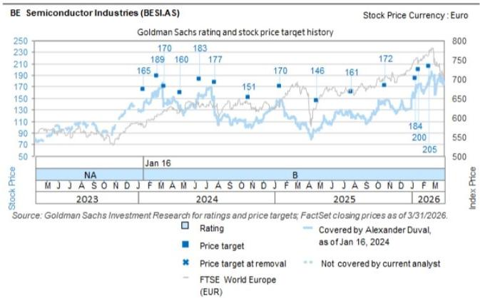

# Micron's Explosive Quarter Proves Memory Is the New Bottleneck in AI Infrastructure -- and European Semicap Stocks Are the Only Way to Play It

The most important data point in the global technology industry this quarter did not come from a hyperscaler earnings call or a GPU launch event. It came from a memory company. Micron's fiscal third-quarter revenue of roughly $41.5 billion -- a staggering 346% year-over-year increase and 74% sequential growth -- was not merely a beat. It was a signal that the structural dynamics of the AI supply chain have fundamentally shifted. For the first time in this cycle, memory, not logic, is the binding constraint. And for European semiconductor equipment and AI infrastructure investors, this changes everything.

The implications are not subtle. Memory demand is now so intense that Micron's data center revenue alone exceeded $25 billion in a single quarter, implying an annualized run rate of approximately $100 billion. The company has signed 16 take-or-pay strategic customer agreements covering roughly $100 billion in committed revenue over five years at floor prices. These contracts include both floor and ceiling pricing mechanisms, covering about 20% of expected DRAM volume and a third of NAND volume. This is not cyclical demand. This is structural re-pricing of the memory industry's relationship with its customers.

What matters most for European investors is the read-across. The supply-demand imbalance in memory is expected to persist beyond calendar 2027, with supply improving only gradually in 2028. That timeline aligns perfectly with the investment cycles of the companies that make the machines that make the chips. ASML, ASMI, BESI, and Nebius are not passive beneficiaries of this trend. They are the only practical means by which the memory industry can resolve its capacity crisis. The question is no longer whether these companies will see demand. The question is whether their own capacity constraints will become the next bottleneck.

---

## Memory Tightness Creates Unprecedented Visibility for European Semicap Suppliers, Not Just Volume

The conventional wisdom in semicap investing has long been that equipment orders are lumpy, cyclical, and difficult to forecast. That assumption is breaking down. When a memory manufacturer signs take-or-pay agreements with floor and ceiling prices covering $100 billion of committed revenue, it changes the incentive structure for capital expenditure. Customers who have guaranteed their off-take must now guarantee their production capacity. That means they must place equipment orders with far greater certainty and far longer lead times than in any prior cycle.

For ASML, ASMI, and BESI, this translates into a level of demand visibility that is historically unprecedented. Supply-side tightness in memory forces customers to share incremental details about technology ramps and product cadences. When a memory maker knows it must deliver on a five-year contract, it cannot afford opacity with its equipment suppliers. The result is a virtuous cycle: better customer visibility leads to better production planning, which leads to higher utilization, which leads to more orders.

This dynamic is particularly powerful for ASML, which carries roughly 40% memory exposure and has lead times exceeding 12 months for its extreme ultraviolet lithography tools. The recent multi-year EUV supply agreement between Micron and ASML is a direct validation of this thesis. It is also congruent with a broader trend: increasing EUV layer adoption at advanced nodes. ASML is not just selling machines into a tight market. It is selling into a market where customers have already pre-committed to buying the output of those machines. That is a fundamentally different risk profile than previous cycles.

---

## HBM Demand Creates a Tectonic Shift in Packaging Economics That Favors BESI Most

The memory tightness story is not uniform across all technologies. The most acute pressure point is high-bandwidth memory, driven directly by AI accelerator demand. HBM is not a commodity product. It requires advanced packaging techniques, including hybrid bonding, that are still in the early stages of industrial adoption. This is where the European semicap exposure becomes most interesting.

BESI has been the most explicit among its peers about the HBM opportunity. At its capital markets day, the company confirmed that all three major memory players are actively testing its hybrid bonding solutions for future adoption. The implication is clear: if HBM demand continues to grow at its current trajectory, memory players will have no choice but to adopt hybrid bonding at scale. The technology is not optional. It is the only path to the layer counts and thermal performance that next-generation HBM requires.

The strategic significance of this cannot be overstated. Hybrid bonding is not an incremental upgrade to existing packaging processes. It is a replacement technology. That means BESI is not competing for share of a growing pie. It is competing to define the pie itself. The memory industry's willingness to test and adopt hybrid bonding at three major players simultaneously suggests that the technology has crossed a credibility threshold. The question for investors is not whether adoption will happen, but how quickly it can scale.

---

## ASML's Memory Exposure and EUV Lead Times Make It the Most Direct Beneficiary of This Cycle

Among the European semicap names, ASML occupies a unique position. Its 40% memory exposure is the highest in coverage, and its EUV tools are the longest-lead-time items in the entire semiconductor equipment supply chain. When memory makers need capacity, they need it from ASML, and they need it now. The Micron EUV supply agreement is a concrete example of this dynamic, but it is likely not the last.

The math is straightforward. Micron's fiscal year 2026 capex is expected to be roughly $27 billion, and the company expects fiscal 2027 capex to increase significantly year-over-year, with roughly half of the increase attributable to construction. The current model for fiscal 2027 capex is $50 billion. That is not a cyclical upswing. That is a structural re-rating of the memory industry's capital intensity.

ASML benefits from this in two ways. First, higher memory capex directly translates into higher EUV and DUV tool orders. Second, the urgency of the capacity build-out reduces pricing sensitivity. When a customer has signed take-or-pay agreements worth $100 billion, the marginal cost of an EUV tool is trivial relative to the cost of not having production capacity. ASML's pricing power in this environment is likely stronger than at any point in its history.

---

## What the Report Does Not Yet Answer: The Risk of Equipment Supply Becoming the Next Constraint

The report is compelling on the demand side, but it leaves a critical question open. If memory makers are ordering equipment at unprecedented rates, and if that equipment has lead times of 12 months or more, what happens when the equipment suppliers themselves hit capacity constraints? ASML cannot build EUV tools infinitely fast. Its own supply chain for optics, lasers, and precision components is finite. The same applies to ASMI and BESI.

There is a plausible scenario in which the bottleneck shifts from memory supply to equipment supply. In that scenario, the European semicap names would see order backlogs extend even further, but their revenue recognition would be constrained by their own production capacity. The valuation implications of this are ambiguous. Longer backlogs support higher multiples in theory, but they also introduce execution risk. If a customer needs tools by a certain date to meet its take-or-pay commitments, any delay in equipment delivery could trigger penalties or contract renegotiations.

The report does not model this scenario in detail. It assumes that equipment suppliers can scale their own production to meet demand. That assumption is reasonable in the medium term, but it is not guaranteed in the near term. Investors should watch for any signs of capacity constraints in the equipment supply chain as a potential risk factor.

---

## A Decision Framework for European AI Infrastructure Investors: Three Questions to Determine Position Sizing

The report provides a rich set of data points, but it does not offer a simple decision framework. The following three questions are designed to help investors translate the report's insights into actionable portfolio decisions.

First, what is your view on the persistence of memory tightness beyond 2027? If you believe, as Micron's guidance suggests, that supply-demand imbalance will persist beyond calendar 2027 with only gradual improvement in 2028, then the European semicap names deserve overweight positions. If you believe that memory supply will resolve faster than expected, then the window of opportunity may be narrower than current valuations imply.

Second, how do you assess the relative attractiveness of pure memory exposure versus diversified logic exposure? ASML's 40% memory exposure is a double-edged sword. It provides direct leverage to the memory cycle, but it also creates concentration risk. ASMI is more skewed toward logic, which may offer better diversification but less direct leverage to the current theme. The right answer depends on your portfolio's existing exposures and your risk tolerance.

Third, what is your time horizon for AI infrastructure demand? Nebius benefits from a different dynamic than the semicap names. Its broad product portfolio of bare metal and software offerings, combined with its expanding contracted power capacity, positions it to serve AI demand directly. But its visibility is shorter-term, and its contracts are less durable than the take-or-pay agreements that underpin the semicap thesis. If your time horizon is three to five years, the semicap names offer more structural certainty. If your time horizon is one to two years, Nebius may offer more tactical upside.

---

Join the community to read the full report and review the original charts. The report contains detailed valuation analysis, price targets, and risk assessments for each of the four names discussed. It also includes the full disclosure appendix and regulatory filings required for institutional decision-making. The charts on memory pricing trends, equipment lead times, and HBM adoption curves are essential for building conviction in the thesis presented here.

*This article is for learning and discussion only and does not constitute investment advice.*

Personal reading notes and learning share only. Not investment advice.

