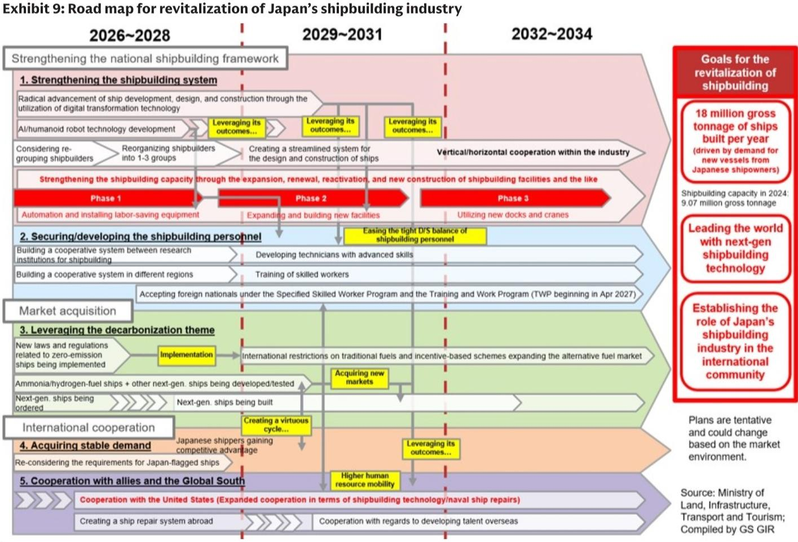
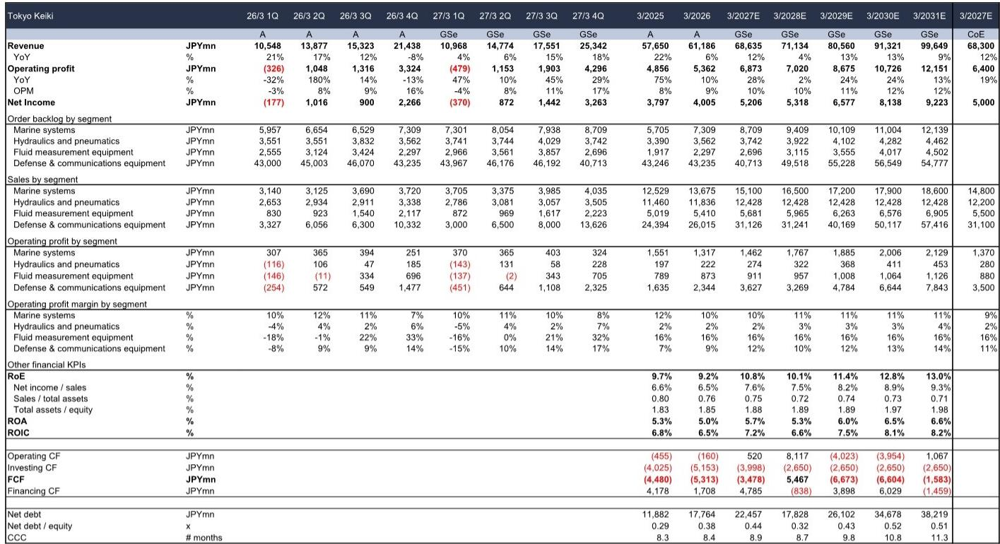
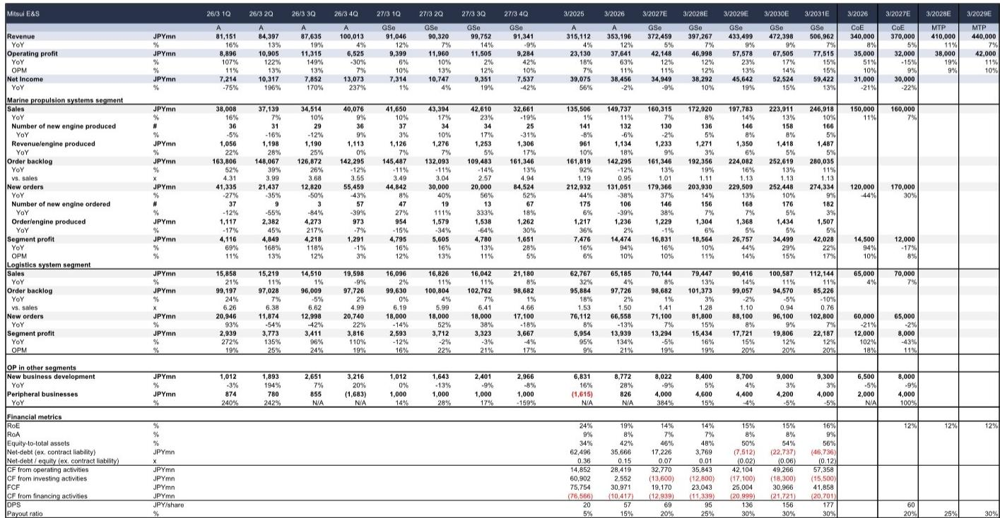

# GS：日本造船业被低估的三个催化剂，不只是AI的替代品

当全球资金疯狂涌入AI主题时，一个传统行业正在东京湾和长崎的船坞里悄然积累着未来三年的利润。GS在最新发布的日本造船业深度报告中，给出了一个与市场主流情绪截然相反的判断：日本造船股的盈利前景实际上正在向上移动，而市场对AI相关资产的追逐，反而制造了估值洼地。

这份报告覆盖了名村造船、三井E&S和东京计器三家GS覆盖标的，同时追踪了日本发动机、古野电气、中国涂料等多家非覆盖公司。核心结论是：日本造船业已经锁定了未来三年半的订单，而即将到来的政策催化剂——产能扩张与防务需求——可能将这一景气周期从“周期性修复”升级为“结构性重估”。

市场目前对日本造船股的谨慎态度，主要源于资金流向AI主题的挤出效应。但GS认为，这种谨慎恰恰忽略了基本面正在发生的实质性改善。截至2026年5月底，日本造船业的订单积压量达到2927万总吨，相当于未来三年半的产能已被填满。2026年前五个月的累计订单量同比仅微降2%，仍处于历史高位。

> **KC评论：** 市场习惯把造船看作周期性行业，但GS这份报告的核心逻辑是，日本造船业正在经历从“周期”到“结构”的转变。订单积压不是问题，问题是产能不够——而这恰好是接下来政策要解决的事情。完整报告里对产能扩张的具体路线图、各公司受益程度的量化拆解，才是真正值得细读的部分。

## 1. 产能扩张政策正在改写日本造船业的增长天花板

日本国土交通省海事局在2026年2月底宣布修订造船相关政策，启动产能扩张框架。关键条款是：企业必须制定从2024年水平扩张50%以上产能的计划，才有资格获得造船产业复兴基金的支持——该基金总额3500亿日元，为期10年。日本内阁预计在2026年夏季前后批准包含造船在内的17个战略产业增长战略。

这意味着什么？目前日本造船厂已经满负荷运转。如果产能扩张计划落地，订单量和订单积压将不仅反映当前产能，而是包含未来可扩张的产能空间。这种预期一旦形成，将成为提升盈利增长前景和估值的催化剂。

GS特别指出，市场关注的焦点将在于名村造船等主要船厂是否会利用复兴基金。这不仅是产能问题，更是行业信心的试金石。

## 2. 防务需求正在形成第二个增长引擎，东京计器是直接受益者

日本防务需求的催化剂密集排列在2026年下半年：6月的经济财政运营基本方针、7月的防卫白皮书、年底前修订三项战略安保文件、以及美国2027财年国防预算。

其中最具想象空间的是美国国防预算。媒体报道称，美国可能拨出约18.5亿美元用于利用日本或韩国船厂采购海军舰艇。如果订单落在日本，GS覆盖标的东京计器作为舰艇部件供应商将直接受益。同时，名村造船的船舶维修业务也将从日美海军舰艇维修需求增长中获益。

> **KC评论：** 防务需求对日本造船业来说不是“锦上添花”，而是“第二曲线”。名村造船的维修业务、东京计器的部件供应，这些都不是一次性订单，而是伴随海军舰队寿命周期的持续收入流。完整报告里对防务需求在各公司收入中的占比、以及对利润率的影响有更细致的拆解，这部分数据对于判断估值弹性至关重要。

## 3. 伊朗局势推高运费，原油油轮成为短期最强需求驱动力

全球造船业订单趋势方面，GS注意到伊朗局势导致运输距离拉长、替代采购增加，运费飙升，原油油轮需求尤其强劲。新船价格仍处于历史高位。

这是一个典型的“地缘政治→运费→新船订单”传导链条。运费上涨意味着船东现金流改善，进而有能力接受更高的新船价格。而日本造船厂目前订单积压已满，议价能力处于强势地位。

但GS也提醒，这种短期需求驱动因素需要与产能扩张、防务需求等中长期催化剂配合，才能支撑持续的盈利增长。

## 4. 非覆盖公司释放的信号：产业链各环节都在受益

GS追踪了多家非覆盖公司的最新动向，这些信息对于判断整个产业链的景气度至关重要：

日本发动机预计在3/27财年实现稳定的销售和利润增长，驱动力是中国发动机制造商从2026年第三季度开始的产能扩张带来的授权费收入增长。古野电气向欧洲航运公司和中国船厂的销售强劲，防务业务也确认了利润率改善的潜力。中国涂料则面临成本压力——年初以来氧化亚铜和环氧树脂价格上涨，主要影响尚未引入附加费制度的韩国船厂订单。

大畠Infinearth受益于集装箱船产量增加和新工厂投产，预计3/27财年销售和利润增长。但值得注意的是，该公司明确表示数据中心用内燃机短期内不会产生盈利影响——它供应的是空间效率高的燃气轮机，而非目前需求扩张预期较强的高输出柴油发动机。

> **KC评论：** 非覆盖公司的信息往往是产业链景气度的“温度计”。日本发动机的授权费收入增长说明中国造船业也在扩张，这对日本设备商是间接利好；中国涂料的成本压力则提示，不是所有环节都能同步受益。完整报告里对各公司业务结构和利润率驱动因素的对比分析，能帮助读者判断哪些环节的议价能力更强。

## 5. 报告尚未完全回答的关键问题：产能扩张的节奏和利润率弹性

GS这份报告虽然给出了明确的看多判断，但有几个关键问题仍需进一步验证。

第一，产能扩张的具体节奏。日本造船厂目前满负荷运转，扩张产能需要时间、资本和劳动力。政策框架虽已推出，但企业实际扩产计划何时落地、产能爬坡速度如何，报告没有给出明确时间表。

第二，利润率弹性在不同公司之间的差异。名村造船受益于大型船舶的利润率改善，三井E&S的发动机业务受益于国内供应紧张，东京计器受益于防务需求。但各公司的利润率改善幅度、可持续性、以及产能扩张对资本开支和折旧的影响，需要更细致的量化分析。

第三，中国造船厂的竞争动态。GS报告中提到中国造船厂产能扩张对日本发动机厂商的授权费收入是利好，但中国造船厂本身也在全球订单竞争中占据份额。日本造船厂能否在产能扩张的同时维持价格纪律，是一个需要持续观察的问题。

## 6. 对投资者的观察框架：三个维度判断日本造船股的估值拐点

基于GS报告的逻辑，投资者可以从以下三个维度建立观察框架：

第一，政策落地进度。日本内阁夏季批准增长战略后，名村造船等主要船厂是否会宣布利用复兴基金进行产能扩张。如果宣布，将是第一个估值催化剂。

第二，美国防务订单的确认。美国2027财年国防预算中是否包含利用日本船厂采购舰艇的具体条款，以及订单金额和分配方案。这是东京计器和名村造船最直接的催化剂。

第三，新船价格走势。如果新船价格在当前历史高位基础上继续上行，将验证供给紧张格局的持续性，支持利润率改善预期。

GS对三家覆盖标的均维持买入评级，目标价分别为名村造船5600日元、三井E&S 7000日元、东京计器8800日元。但投资者需要注意，三井E&S的3/27财年营业利润指引被GS视为过于保守，市场对公司盈利超预期的信心可能需要等到3/27财年下半年才会增强。

---

这份GS报告的价值不仅在于给出了明确的买入建议，更在于它提供了一个完整的分析框架：从订单积压到政策催化剂，从防务需求到产业链传导，从覆盖公司到非覆盖公司。但报告中有大量未在本文展开的细节——比如各公司季度利润趋势的对比、不同船型的利润率差异、以及产能扩张对估值的量化影响——这些才是判断投资时机的关键。

我们每天由AI agent和人工review生成国际投行中文摘要与KC评论，daily更新约10-40页，并整理当天最新数据图表合集，方便喂给AI，也方便人工快速把握市场dynamics。欢迎来星球微信群里继续讨论这些未解问题，包括日本造船业的产能扩张节奏、防务订单的落地概率、以及各公司利润率弹性的量化拆解。

Personal reading notes and learning share only. Not investment advice.

