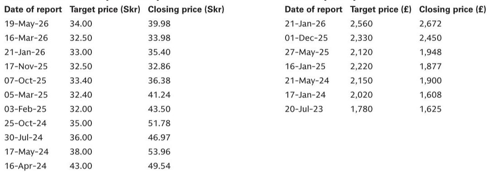
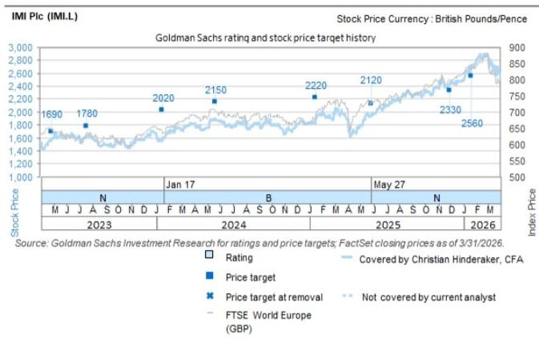
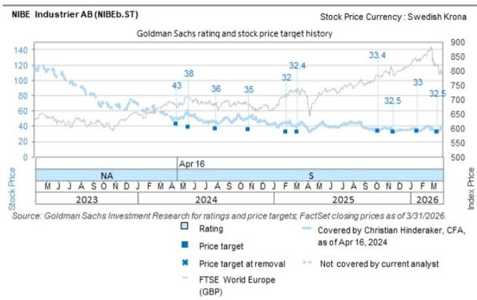

# The UK Heat Pump Market Is Reaching an Inflection Point, But the Winners Will Be Determined by Distribution, Not Technology

The conventional narrative around heat pumps has focused on technology adoption curves, subsidy mechanisms, and environmental imperatives. That framing is increasingly incomplete. After attending the InstallerSHOW in Birmingham and conducting meetings with five HVAC equipment suppliers alongside the Director General of the European Heat Pump Association, a different picture emerges. The UK heat pump market is not simply growing—it is restructuring. And the most important competitive dynamics have less to do with which company builds the most efficient compressor and more to do with who controls the channel, who manages the installer relationship, and who can navigate the tension between direct-to-consumer models and the entrenched trade merchant ecosystem.

This matters now because the policy environment is shifting decisively. The UK government's Warm Homes Plan targets approximately 450,000 annual heat pump installations by 2030, up from roughly 125,000 units sold in 2025. The Boiler Upgrade Scheme has been expanded to include exhaust air heat pumps and will soon offer grants for air-to-air systems. A £1,500 uplift for off-gas grid properties converting from oil or LPG takes effect in July 2026. These are not marginal adjustments. They represent a structural reorientation of how heating systems are purchased, installed, and financed in the United Kingdom.

Yet the market remains deeply fragmented, with heat pump penetration at less than 1% of all households against more than 1.8 million gas boilers sold annually. The gap between policy ambition and market reality is vast. Closing it will require more than better products. It will require a fundamental rethinking of how the value chain works—and who captures the margin.

## The Air-to-Air Segment Is the Hidden Battleground That Will Reshape the Competitive Landscape

The dominant framing in the UK heating market has been built around "wet" systems—hydronic circuits that circulate hot water through radiators and underfloor pipes. Air-to-water heat pumps fit naturally into this architecture. Air-to-air heat pumps, which function more like reversible air conditioning units, have historically represented less than 10% of UK heat pump sales, with only about 2,500 units sold annually.

This is changing, and the change is accelerating for reasons that go beyond technology. Global warming is making cooling capability a relevant consideration for UK households, not merely a luxury. The European air-to-air market is already approximately six times larger than the air-to-water market. The dual-function capability—heating in winter, cooling in increasingly hot summers—creates a value proposition that pure heating systems cannot match.

The strategic implications are significant. NIBE, which has historically shunned the air-to-air segment, recently announced its entry. Viessmann plans to launch air-to-air products in the UK next year. These moves are not incremental product extensions. They represent a recognition that the addressable market is expanding beyond the traditional wet-system install base. The air-to-air segment allows manufacturers to target households that may never convert their existing radiator circuits, as well as new-build properties where the installation economics are fundamentally different.

The question that remains unanswered is whether air-to-air systems can overcome the installer preference for wet systems, which dominate UK heating infrastructure. The answer will depend less on technical performance and more on whether manufacturers can train and incentivize installers to recommend a technology they may not fully understand. This is a distribution problem, not an engineering one.

## The Trade Merchant Channel Remains the Critical Moat, But It Is Under Assault From Multiple Directions

European HVAC OEMs have long viewed their relationships with trade merchants as a competitive advantage against Asian entrants. The logic is straightforward: small and medium-sized installers, who dominate the UK market, prefer to procure through merchants that offer credit lines, after-sales support, and the convenience of one-stop shopping for pipes, fittings, and accessories. Selling directly to consumers or installers bypasses this ecosystem and is inherently more difficult.

Viessmann's distribution model illustrates the strength of this approach. Its UK partners include large wholesalers, three national trade merchants—City Plumbing, UKPS, and Wolseley—and numerous smaller buying groups. The company explicitly views this distribution network as an advantage relative to Asian suppliers that are predominantly pursuing direct-to-consumer strategies.

Yet the moat is showing signs of erosion. NIBE UK launched a direct-to-customer offering in the last five weeks, citing homeowner demand for fast online quoting. IMI's residential climate control business now generates 4-5% of its sales through its own website. Partnerships between manufacturers and utility suppliers—such as the British Gas and NIBE arrangement—create alternative channels that bypass traditional merchants.

The deeper threat comes from Chinese OEMs and other new entrants that are attempting to "buy their way" into the market through aggressive pricing and direct sales models. This has already contributed to a period of overstocking in the UK heat pump market. The EHPA's Director General noted that economies of scale require annual production volumes exceeding 500,000 units to remain competitive. European manufacturers, particularly those with narrower product ranges, face a structural cost disadvantage that distribution relationships alone may not fully offset.

The unresolved strategic question is whether the trade merchant channel is a durable competitive advantage or a legacy structure that will gradually be bypassed. The answer likely varies by product category and customer segment. For complex installations requiring significant aftermarket support, the merchant model retains clear advantages. For simpler retrofits where the homeowner is making the purchase decision, direct-to-consumer models may gain share.

## Policy Design Determines Market Outcomes More Than Subsidy Levels

The instinctive reaction to slow heat pump adoption is to call for higher subsidies. The evidence from the InstallerSHOW discussions suggests this is an oversimplification. The EHPA framework for assessing national policies identifies four drivers, of which subsidy levels are only one: electricity-to-gas price ratios, new build construction growth, and installer competence and competitiveness are equally important.

The German experience is instructive. Installation costs in Germany remain high relative to other European countries, not primarily because of higher equipment prices, but because of four structural factors: higher installer margins, stricter planning rules requiring more technology content, stringent installer qualification requirements for subsidy eligibility, and subsidies structured as a percentage of installed cost rather than as fixed values. This creates perverse incentives. When subsidies are proportional to cost, there is limited motivation for installers to reduce prices or improve efficiency.

The UK's Boiler Upgrade Scheme, which provides a fixed £7,500 grant for air-source or ground-source heat pumps, avoids this particular distortion. But the scheme's effectiveness is constrained by its scale. At the current grant level, the £295 million earmarked for 2025/26 could support approximately 39,333 installations—roughly one-third of the government's annual target. The gap between policy ambition and funding allocation remains substantial.

The expansion of the BUS to include exhaust air heat pumps and the introduction of £2,500 grants for air-to-air systems represent meaningful steps. But the most consequential policy variable may be the electricity-to-gas price ratio. Recent changes to energy taxes in Belgium have shown early success in driving behavioral change. In the UK, where gas heating remains significantly cheaper than heat pump operation on a per-unit-of-heat basis, the economic case for conversion is weaker than the environmental case. Policy measures that address this ratio directly—through carbon taxes, electricity price rebalancing, or gas price increases—would have a more profound impact than incremental subsidy increases.

## The Consolidation Wave Has Not Fully Arrived, But the Logic Is Inexorable

The EHPA expects further market consolidation in the coming years. The reasoning is structural. Heat pump OEMs significantly outnumber the companies manufacturing key components. There are only four main global suppliers for compressors, which account for 20-25% of the total value in a heat pump. This asymmetry creates inherent margin pressure for OEMs, who face concentrated supplier power while competing in a fragmented end-market.

The consolidation logic extends beyond component supply. NIBE's entry into the air-to-air segment, Viessmann's integration with Carrier and Toshiba's R&D capabilities, and the broader trend of OEMs broadening product ranges in response to installer feedback all point toward a market where scale and scope determine survival. The EHPA's threshold of 500,000 units annually for competitive production is a useful benchmark. Most European heat pump OEMs are significantly below this level.

Yet the consolidation wave has not fully materialized, and the reasons are instructive. The UK market remains dominated by small and medium-sized installers who value choice and local relationships. Trade merchants benefit from stocking multiple brands. Homeowners are not yet making purchase decisions based on manufacturer scale. The consolidation logic is compelling at the industry level but slow to manifest at the customer level.

The question that the report does not fully answer is which consolidation path will dominate. Will European OEMs acquire each other to achieve scale? Will Asian manufacturers acquire European distribution networks? Will private equity-backed platforms emerge that aggregate installer networks rather than manufacturing capacity? Each path has different implications for margins, pricing, and technology development.

## A Decision Framework for Investors Evaluating the UK Heat Pump Opportunity

The complexity of this market requires a structured approach to investment analysis. The following framework synthesizes the key variables that will determine which companies succeed in the UK heat pump transition.

First, evaluate distribution model resilience. Companies that rely primarily on trade merchant channels have structural advantages in the current market but face gradual erosion from direct-to-consumer models. The key metric is not current market share but the rate at which the merchant channel is being bypassed. Companies with strong merchant relationships and the ability to selectively develop direct channels are better positioned than those committed exclusively to one model.

Second, assess product range breadth and air-to-air exposure. The UK market is transitioning from a single-technology to a multi-technology environment. Companies that can offer air-to-water, air-to-air, and exhaust air solutions across both heating and cooling applications have a structural advantage in capturing installer wallet share. The shift toward air-to-air is still early, but the direction of travel is clear.

Third, analyze installer training and relationship depth. The bottleneck in heat pump adoption is not manufacturing capacity or consumer demand—it is installer competence and willingness to recommend heat pumps. Companies that invest in training programs, certification pathways, and installer support systems are building durable competitive advantages. NIBE's partnership with GTEC, which has trained 5,000 installers, is a concrete example of this strategy in action.

Fourth, monitor policy dependency and subsidy exposure. Companies that benefit from specific policy mechanisms—such as NIBE's exposure to the exhaust air heat pump grant expansion—face concentration risk if policies change. Companies with diversified geographic exposure and technology-agnostic business models are less vulnerable to UK-specific policy shifts.

Fifth, track pricing power and cost pass-through. Viessmann's ability to implement two price increases of over 3% each in a single year, achieving 6% growth from pricing alone, indicates that pricing power exists in this market. But this pricing power is not uniform across segments. Companies with strong brand equity and installer relationships have greater pricing flexibility than new entrants competing primarily on cost.

## The Full Picture Requires Going Beyond the Event Floor

The insights from the InstallerSHOW meetings provide a valuable snapshot of where the UK heat pump market stands in mid-2026. But a single event, however well-attended, cannot capture the full complexity of a market that spans policy dynamics in multiple countries, competitive developments across Asia and Europe, and technology trajectories that extend years into the future.

Several critical questions remain unresolved. How quickly will Chinese OEMs build credible distribution networks in the UK? Will the air-to-air segment grow fast enough to compensate for the slow conversion of the wet-system install base? Can European OEMs achieve the production scale needed to compete on cost without sacrificing margin? Will the UK government maintain its policy trajectory through political transitions and fiscal constraints? These questions require deeper analysis than any single report can provide.

Join the community to read the full report and review the original charts.

*This article is for learning and discussion only and does not constitute investment advice.*

Personal reading notes and learning share only. Not investment advice.

