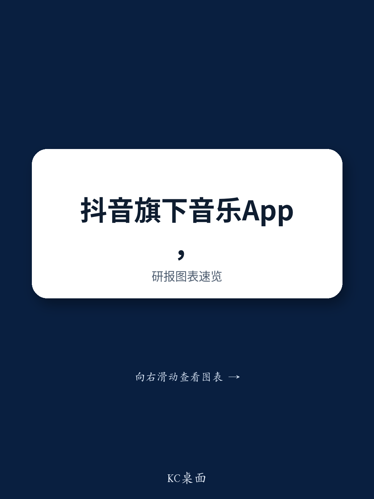
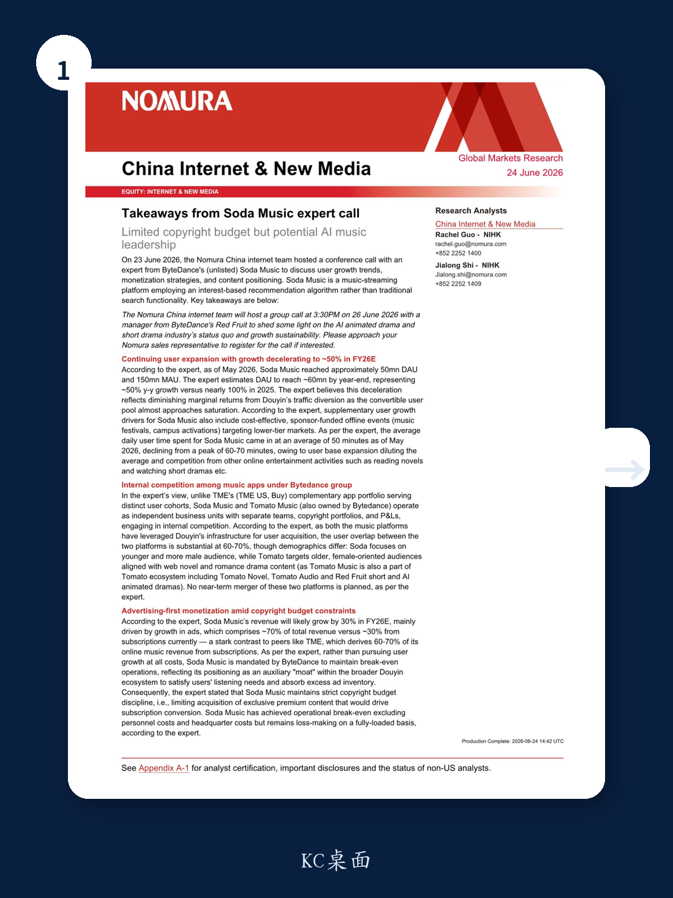
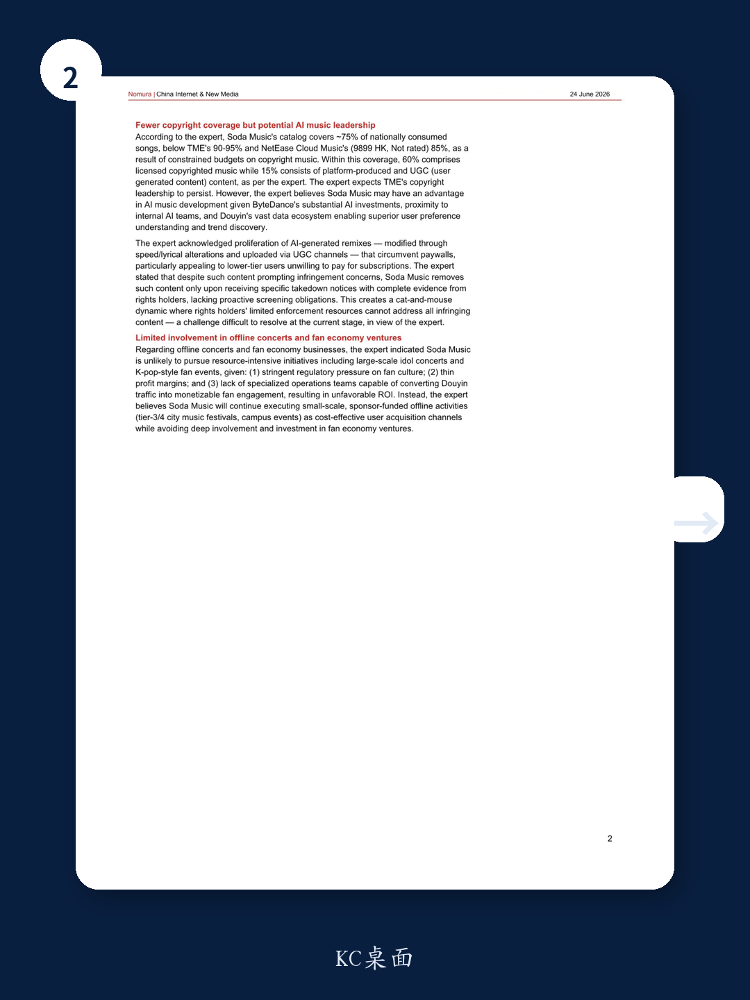

# NOM：字节跳动的音乐App，正在用AI绕过版权战争

字节跳动旗下音乐平台Soda Music的DAU已逼近5000万，年增长仍高达50%，但它走的是一条与腾讯音乐截然不同的路：不烧钱买独家版权，靠广告变现，甚至默许AI翻唱绕过付费墙。NOM最新专家调研揭示，这家公司真正的野心不在音乐本身，而在成为AI音乐时代的规则制定者。

这份报告最值得关注的判断，并非Soda Music的用户增长数字，而是其背后字节跳动对“音乐”这一品类的战略定位：一个用来消耗过剩广告库存、补齐内容生态短板的辅助型护城河，而非独立盈利中心。这与市场普遍将其视为“腾讯音乐挑战者”的叙事形成了根本差异。

**NOM分析师在报告中提出一个关键问题：当版权预算受限时，AI音乐能否成为Soda Music的弯道超车点？** 答案或许比表面看起来更复杂。

> **KC评论：** 这份报告的价值不在于告诉你Soda Music有多少用户，而在于揭示了字节跳动内部两个音乐App（Soda和番茄音乐）在相互竞争，且用户重叠度高达60-70%。这意味着字节跳动在音乐赛道的真实投入，可能远小于外界想象。完整报告中还有关于两个App用户画像的详细拆解，以及字节跳动对合并计划的明确表态。

## 1. 用户增长正在从“流量输血”转向“活动拉新”，边际效益递减已是定局

截至2026年5月，Soda Music的DAU约为5000万，MAU为1.5亿。专家预计年底DAU将达到约6000万，同比增长约50%。这看似亮眼，但与2025年近100%的增速相比，减速信号已十分明显。

**核心原因在于：抖音的流量转化池正在接近饱和。** 那些可以被抖音自然导流的“可转化用户”基本已被洗过一遍。剩余的用户要么缺乏使用音乐App的刚性需求，要么已经被其他娱乐形式（如小说、短剧）截胡。

Soda Music的应对策略是转向线下：赞助音乐节、校园活动，瞄准低线市场。这些活动由赞助商买单，成本可控，但拉新效率显然无法与抖音的免费流量相比。

用户日均使用时长也从高峰期的60-70分钟下降至约50分钟。NOM专家指出，这既是用户基数扩大带来的稀释效应，也反映了来自其他在线娱乐活动的竞争压力。

**这一趋势对字节跳动的含义是：音乐App的用户增长天花板已经清晰可见，未来增长必须依靠产品本身而非渠道红利。**

## 2. 广告收入占比70%，Soda Music本质上是一个“广告播放器”而非音乐订阅服务

这是NOM报告中最反常识的发现之一。Soda Music的收入结构中，广告占比约70%，订阅收入仅约30%。这与腾讯音乐形成鲜明对比——后者在线音乐收入的60-70%来自订阅。

**这种结构并非偶然，而是字节跳动有意为之。** 专家明确表示，字节跳动对Soda Music的核心要求是“维持盈亏平衡”，而非不惜代价追求增长。Soda Music的角色被定义为抖音生态系统中的“辅助护城河”——满足用户的听歌需求，同时消化抖音剩余的广告库存。

目前，Soda Music在剔除人员成本和总部成本后已达到运营盈亏平衡，但全口径计算仍处于亏损状态。

> **KC评论：** 这意味着任何关于Soda Music“颠覆腾讯音乐”的叙事都需要重新审视。它根本就不是奔着取代QQ音乐去的。它的存在逻辑更像是字节跳动版的“用户留存工具”——就像微信的“看一看”功能，不是为了打败今日头条，而是为了不让用户离开微信。完整报告中还有Soda Music与腾讯音乐在版权覆盖率上的具体对比数据，以及专家对版权格局未来走势的判断。

## 3. 版权覆盖率仅75%，但AI音乐可能成为其真正的武器

Soda Music的曲库覆盖了全国消费歌曲的约75%，低于腾讯音乐的90-95%和网易云音乐的85%。在这75%中，60%是授权版权音乐，15%是平台自制和UGC内容。

**版权预算的严格约束，决定了Soda Music不可能在“独家版权战争”中与腾讯正面交锋。** 但NOM专家指出，Soda Music可能在AI音乐领域拥有结构性优势。

这一优势来自三个层面：
- 字节跳动在AI领域的巨额投资
- 与内部AI团队的近距离协作
- 抖音庞大的数据生态，使其能够更精准地理解用户偏好和发现趋势

**更值得关注的是AI翻唱内容的灰色地带。** 专家指出，Soda Music上已出现大量通过变速、改词等方式规避付费墙的AI翻唱内容，尤其受低线城市不愿付费的用户欢迎。对于这些侵权内容，Soda Music仅在收到权利方完整证据的删除通知后才进行处理，没有主动审查义务。

这形成了一种“猫鼠游戏”：权利方的执法资源有限，无法处理所有侵权内容。**这种模糊策略，实际上降低了Soda Music的内容获取成本，同时保持了对低端用户的吸引力。**

## 4. 粉丝经济与线下演唱会：Soda Music明确选择“不参与”

NOM专家给出了一个清晰的战略取舍：Soda Music不会涉足大型偶像演唱会、K-pop粉丝活动等资源密集型业务。

原因有三：
- 监管层面对粉丝文化的压力持续收紧
- 利润率极薄
- 缺乏能将抖音流量转化为可货币化粉丝互动的专业运营团队

取而代之的是，Soda Music将继续执行小规模、由赞助商资助的线下活动，如三四线城市的音乐节和校园活动。这些活动的定位是“成本可控的用户获取渠道”，而非深度参与粉丝经济。

**这一选择进一步强化了Soda Music的“辅助工具”定位：它不愿意为一个低利润、高风险的业务投入核心资源。**

## 5. 报告尚未完全回答的关键问题：AI音乐的“合规成本”何时到来？

NOM报告揭示了Soda Music在AI音乐领域的潜在优势，但有一个关键问题悬而未决：**当AI翻唱内容引发大规模版权诉讼或监管干预时，Soda Music的“灰色地带”策略还能持续多久？**

报告提到，Soda Music目前仅在被要求时才移除侵权内容，这一做法在法律上虽有依据，但随着AI音乐创作门槛的急剧降低，侵权内容的数量可能呈指数级增长。届时，权利方可能不再满足于“逐条举报”，而是寻求系统性解决方案。

另一个未解问题是：**字节跳动是否会最终合并Soda Music和番茄音乐？** 专家明确表示短期内没有合并计划，但两个App高达60-70%的用户重叠率，以及字节跳动一贯的“赛马机制”文化，使得这一可能性始终存在。

> **KC评论：** 这两个问题恰恰是完整报告中最值得深挖的部分。NOM专家在调研中还涉及了Soda Music与腾讯音乐在版权采购策略上的具体差异、字节跳动内部AI团队与音乐业务的协作机制，以及未来12个月可能出现的监管变化。这些细节在本文中无法一一展开，但正是理解字节跳动音乐战略完整图景的关键。

## 6. 投资者应该建立的观察框架：不要用“腾讯音乐对标”来理解Soda Music

基于NOM这份报告，我们建议读者建立以下观察框架：

第一，**放弃“Soda Music vs 腾讯音乐”的二元叙事。** 两者的商业模式、战略定位和资源禀赋完全不同。腾讯音乐追求的是“音乐订阅收入最大化”，而Soda Music追求的是“在可控成本内为抖音生态提供音乐服务”。

第二，**关注AI音乐的合规进展，而非用户增长曲线。** 如果AI音乐能够在不引发重大监管风险的前提下，显著降低内容获取成本，Soda Music的长期价值将远超其DAU数字所暗示的水平。

第三，**跟踪字节跳动对音乐业务的资源分配。** 如果Soda Music和番茄音乐开始共享版权库或技术团队，那将是战略升级的重要信号；如果维持现状，则说明音乐仍只是字节跳动庞大生态中的一个“插件”。

第四，**警惕“版权覆盖率差距”的缩小速度。** 如果Soda Music能够在不增加版权预算的情况下，通过AI和UGC内容将覆盖率提升至85%以上，将从根本上改变音乐流媒体行业的竞争格局。

**这份NOM报告的价值，不在于它给出了一个明确的投资建议，而在于它提供了一个重新理解字节跳动音乐战略的坐标系。** 在这个坐标系中，Soda Music既不是失败者，也不是挑战者，而是一个正在用AI重新定义“音乐平台”边界的前沿实验品。

至于这个实验最终会走向何方，答案或许藏在完整报告的图表和专家问答中。

---

**如果你想继续深入这个话题：**

以上分析仅覆盖了NOM这份报告的约60%内容。完整报告中还包括：
- Soda Music与番茄音乐的用户画像详细对比（年龄、性别、地域分布）
- 字节跳动内部AI团队与音乐业务的协作机制和资源分配逻辑
- 专家对2026年下半年版权市场格局变化的预判
- 以及更多关于AI翻唱内容合规风险的细节问答

每天，我们会由AI agent加上人工审核，整理国际投行最新中文摘要与KC评论，daily更新约10-40页，同时包含当天最新数据图表合集。这些内容既方便喂给AI进行深度分析，也方便人工快速把握市场动态。欢迎来我们的星球微信群里继续讨论这些未解问题。

Personal reading notes and learning share only. Not investment advice.

